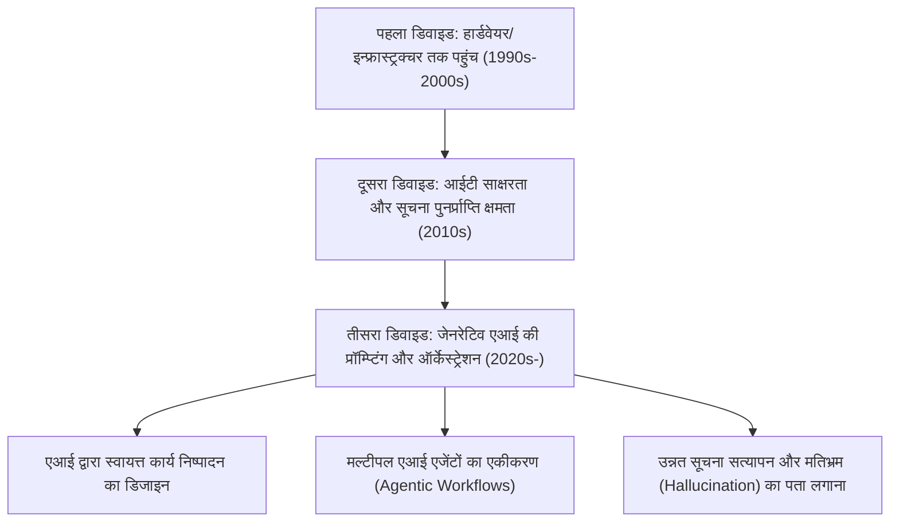
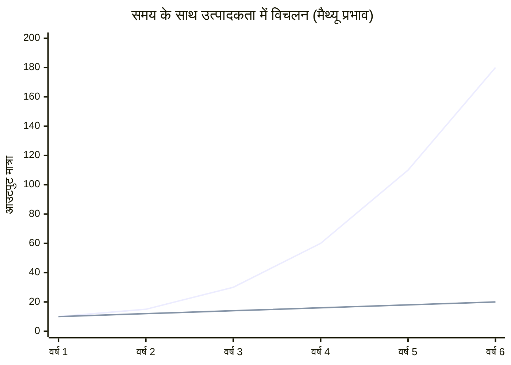
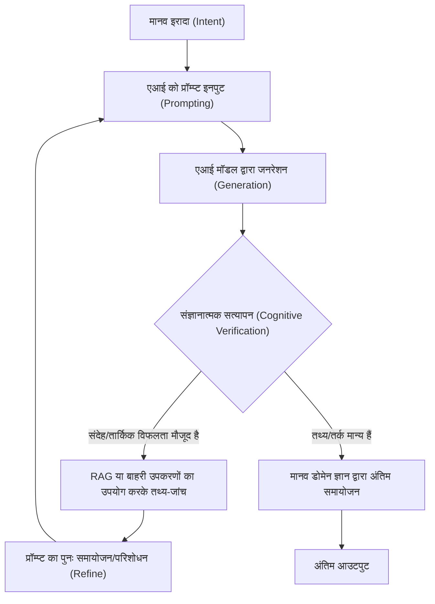

## 1. प्रस्तावना: डिजिटल डिवाइड का ऐतिहासिक विकास और नया प्रतिमान

इंटरनेट के प्रसार के बाद से, हमने "डिजिटल डिवाइड (सूचना अंतराल)" शब्द कई बार सुना है। शुरुआती डिजिटल डिवाइड मुख्य रूप से "भौतिक पहुंच" के बारे में था। अर्थात्, यह एक सरल ढांचा था जहाँ कंप्यूटर और हाई-स्पीड इंटरनेट कनेक्शन होने या न होने से सूचना तक पहुंच और आर्थिक अवसर तय होते थे। बाद में, जैसे-जैसे स्मार्टफोन और ब्रॉडबैंड कनेक्शन सामान्य होते गए, इस डिवाइड का ध्यान "आईटी साक्षरता (सूचना उपयोग क्षमता)" की ओर स्थानांतरित हो गया। क्या आप सर्च इंजन का उपयोग करके उचित रूप से जानकारी खोज सकते हैं, या क्या आप सॉफ़्टवेयर का कुशलतापूर्वक उपयोग कर सकते हैं? ये सॉफ़्टवेयर और संज्ञानात्मक पहलू थे।

हालाँकि, 2020 के दशक में अचानक उभरे जेनरेटिव एआई (Generative AI) और बड़े भाषा मॉडल (LLM: Large Language Models) के विकास ने इस डिजिटल डिवाइड की अवधारणा को मूल रूप से बदल दिया है। आज हम जिस चीज का सामना कर रहे हैं, वह केवल "सूचना तक पहुंच का अंतराल" या "सॉफ़्टवेयर संचालन कौशल का अंतराल" नहीं है। यह "एआई को ऑर्केस्ट्रेट (निर्देशित और एकीकृत) करने की क्षमता का अंतराल" है, जो व्यक्तिगत उत्पादकता को तेजी से बढ़ाता है, या एआई के विकास में पीछे छूट जाने और सापेक्ष मूल्य खोने का एक अत्यंत गंभीर और अपरिवर्तनीय "तीसरा डिजिटल डिवाइड" है।

इस लेख में, हम उत्पादकता के गणितीय मॉडल, हार्डवेयर आर्किटेक्चर और लागत, और मानव संज्ञानात्मक पहलुओं की तीन परतों से जेनरेटिव एआई द्वारा लाए गए इस नए डिजिटल डिवाइड के वास्तविक स्वरूप को विस्तार से समझाएंगे।

## 2. "पहुंच" से "ऑर्केस्ट्रेशन" तक: तीसरे डिजिटल डिवाइड का आगमन

अतीत के सॉफ़्टवेयर टूल मूल रूप से "निष्क्रिय उपकरण" थे। उपयोगकर्ता के स्पष्ट इनपुट के लिए निश्चित परिणाम वापस करना पारंपरिक सॉफ़्टवेयर की सीमा थी (जैसे: स्प्रेडशीट सॉफ़्टवेयर में सूत्र दर्ज करके गणना परिणाम प्राप्त करना)। हालाँकि, वर्तमान जेनरेटिव एआई, विशेष रूप से ट्रांसफॉर्मर (Transformer) आर्किटेक्चर पर आधारित एलएलएम (GPT-4, Claude 3.5, Llama 3, आदि), "सक्रिय बुद्धि के अंश" के रूप में कार्य करते हैं।

इस प्रतिमान बदलाव (Paradigm Shift) के कारण, मनुष्यों के लिए आवश्यक कौशल "उपकरणों को संचालित करने की क्षमता" से बदलकर "एकाधिक एआई एजेंटों और उपकरणों को मिलाकर स्वायत्त वर्कफ़्लो को डिजाइन और निर्देशित करने की क्षमता (AI Orchestration)" में नाटकीय रूप से बदल गया है। इसे "एआई ऑर्केस्ट्रेशन साक्षरता" कहा जा सकता है।

नीचे अतीत से वर्तमान तक डिजिटल डिवाइड का विकास दिया गया है।

प्रॉम्प्ट इंजीनियरिंग की सीमाओं से परे, अब हम LangChain, AutoGen और CrewAI जैसे मल्टी-एजेंट फ्रेमवर्क का उपयोग करके सिस्टम को स्वायत्त रूप से समस्याओं को हल करने देने के चरण में प्रवेश कर चुके हैं। इस "खाका (Blueprint) खींचने और एआई को निष्पादित करने वाले स्तर" और "अभी भी अपने हाथों से नियमित कार्य करने वाले स्तर" के बीच उत्पादकता का ऐसा अलगाव हो रहा है, जिसकी गति का अनुभव मानव जाति ने पहले कभी नहीं किया है।

## 3. उत्पादकता का मैथ्यू प्रभाव (Matthew Effect): गणितीय दृष्टिकोण से असमानता का दृश्यीकरण

"जिसके पास है, उसे और दिया जाएगा, और जिसके पास नहीं है, उससे वह भी ले लिया जाएगा जो उसके पास है," न्यू टेस्टामेंट के इस कथन से उत्पन्न "मैथ्यू प्रभाव (Matthew Effect)", समाजशास्त्र और अर्थशास्त्र में उस घटना को संदर्भित करता है जहां प्रारंभिक लाभ संचयी लाभ लाते हैं। जेनरेटिव एआई के लागू होने के साथ, यह मैथ्यू प्रभाव श्रम बाजार और बौद्धिक उत्पादन में तीव्रता से प्रकट हो रहा है।

एआई का प्रभावी ढंग से उपयोग करने वाले व्यक्तियों की उत्पादकता समय के साथ रैखिक रूप से नहीं, बल्कि घातांकीय (exponentially) रूप से बढ़ती है। ऐसा इसलिए है क्योंकि एआई द्वारा बचाए गए समय को अधिक उन्नत एआई सिस्टम बनाने, प्रॉम्प्ट को अनुकूलित करने और स्व-शिक्षण में निवेश किया जा सकता है। आइए इसे गणितीय मॉडल के साथ व्यक्त करें।

किसी भी समय $t$ पर एक गैर-एआई उपयोगकर्ता की उत्पादकता $P_{human}(t)$ और एआई ऑर्केस्ट्रेटर की उत्पादकता $P_{AI}(t)$ को निम्नलिखित मॉडल द्वारा दर्शाया जा सकता है।

$$
P_{human}(t) = P_0 (1 + r_{human})^t
$$
जहाँ $P_0$ प्रारंभिक उत्पादकता है और $r_{human}$ मनुष्य की प्राकृतिक सीखने की दर (अनुभव वक्र के आधार पर वृद्धि दर) है। आमतौर पर, $r_{human}$ बहुत छोटा होता है, और विकास अंकगणितीय (arithmetic) होता है।

दूसरी ओर, एआई का पूरा लाभ उठाने वाले उपयोगकर्ता की उत्पादकता प्रयुक्त एआई मॉडल की क्षमता में वृद्धि दर $r_{model}$ और एआई वर्कफ़्लो स्वचालन द्वारा उत्पन्न चक्रवृद्धि प्रभाव $\alpha$ के संयोजन से निर्धारित होती है।

$$
P_{AI}(t) = P_0 \cdot \exp\left( \int_0^t (r_{human} + \alpha \cdot r_{model}(\tau)) d\tau \right)
$$

चूंकि एआई मॉडल स्वयं घातांकीय रूप से विकसित हो रहे हैं (स्केलिंग कानूनों के आधार पर मापदंडों और गणनाओं में वृद्धि), $r_{model}(t)$ स्वयं समय के साथ बढ़ता है। परिणामस्वरूप, दोनों की उत्पादकता के बीच का अंतर $\Delta P(t)$ तेजी से बढ़ता है।

$$
\Delta P(t) = P_{AI}(t) - P_{human}(t)
$$

नीचे दिया गया ग्राफ इस विचलन (Divergence) को दृश्य रूप से दर्शाता है।

*(नोट: नीली रेखा एआई ऑर्केस्ट्रेटर की उत्पादकता का प्रतिनिधित्व करती है, और निचली रेखा गैर-एआई उपयोगकर्ता की उत्पादकता का प्रतिनिधित्व करती है)*

पहले वर्ष में यह अंतर मामूली लग सकता है, लेकिन जैसे-जैसे एआई मॉडल GPT-3 से GPT-4 और फिर अगली पीढ़ी में विकसित होते हैं, एआई उपयोगकर्ता अपनी मौजूदा स्वचालित पाइपलाइन में नए मॉडल प्लग इन करके उत्पादकता में भारी छलांग का आनंद लेते हैं। गैर-एआई उपयोगकर्ताओं के लिए इस अंतर को पाटना समय बीतने के साथ गणितीय रूप से असंभव के करीब होता जाता है।

## 4. हार्डवेयर डिवाइड: स्थानीय अनुमान (Local Inference) की बाधा और क्लाउड API का जाल

तीसरा डिजिटल डिवाइड न केवल सॉफ़्टवेयर कौशल में, बल्कि नवीनतम एआई मॉडल चलाने के लिए "कंप्यूट (कम्प्यूटेशनल संसाधन) तक पहुंच" नामक एक नई हार्डवेयर असमानता भी पैदा कर रहा है।

बड़े भाषा मॉडल का उपयोग करने के मुख्य रूप से दो तरीके हैं: "क्लाउड API का उपयोग करना" या "स्थानीय रूप से मॉडल का अनुमान (Inference) लगाना"। दोनों के अपने फायदे और नुकसान हैं, और यह एक नई आर्थिक और भौतिक बाधा बन गया है।

### क्लाउड API की सीमाएं और रनिंग लागत
OpenAI, Anthropic, और Google द्वारा प्रदान किए गए अत्याधुनिक फ्रंटियर मॉडल (जैसे GPT-4o, Claude 3.5 Sonnet) तक आमतौर पर API के माध्यम से पहुंचा जाता है। हालाँकि, यदि आप एक उन्नत स्वायत्त एजेंट (Agentic Workflow) बनाते हैं जो एक दिन में हजारों API कॉल उत्पन्न करता है, तो लागत विस्फोटक रूप से बढ़ जाएगी।

कुल API लागत $C_{cloud}$ इनपुट टोकन और आउटपुट टोकन की मात्रा पर निर्भर करती है।

$$
C_{cloud} = \sum_{i=1}^{N} \left( c_{in} \cdot T_{in}^{(i)} + c_{out} \cdot T_{out}^{(i)} \right)
$$
($N$ अनुरोधों की संख्या है, $T$ टोकन की संख्या है, और $c$ प्रति टोकन मूल्य है)

यदि आप बड़े पैमाने पर डेटा प्रोसेसिंग या RAG (Retrieval-Augmented Generation) का वेक्टरकरण लगातार करते हैं, तो यह परिवर्तनीय लागत व्यक्तिगत डेवलपर्स और छोटे व्यवसायों के लिए एक घातक बोझ बन सकती है।

### स्थानीय एलएलएम (Local LLMs) और VRAM की बाधा
क्लाउड लागत से बचने और डेटा गोपनीयता के दृष्टिकोण से, Meta के Llama 3 और Mistral जैसे ओपन-वेट मॉडल को स्थानीय रूप से चलाने की मांग बढ़ रही है। लेकिन यहाँ "VRAM (वीडियो रैम) की बाधा" नामक एक भौतिक डिवाइड खड़ा होता है।

एलएलएम की अनुमान गति (Inference Speed) GPU के प्रदर्शन (FLOPS) की तुलना में मेमोरी बैंडविड्थ (Memory Bandwidth) पर बहुत अधिक निर्भर करती है (मेमोरी-बाउंड प्रकृति)। यदि मॉडल के मापदंडों (Parameters) की संख्या $P$ है और सटीकता 16-बिट (2 बाइट्स) है, तो मॉडल को मेमोरी में लोड करने के लिए ही कम से कम $2P$ बाइट्स VRAM की आवश्यकता होती है। उदाहरण के लिए, 70 बिलियन (70B) पैरामीटर वाले मॉडल के लिए 140GB से अधिक VRAM की आवश्यकता होगी।

$$
VRAM_{required} \approx \left( \frac{P \times bits\_per\_weight}{8} \right) + Context\_Memory
$$

यहां तक ​​कि हाई-एंड GPU (NVIDIA RTX 4090) जिसे सामान्य उपभोक्ता खरीद सकते हैं, उसमें VRAM केवल 24GB तक सीमित है, और 70B क्लास के मॉडल को वैसे ही चलाना असंभव है। यहां, "क्वांटाइजेशन (Quantization)" जैसे AWQ और GGUF जैसी तकनीकें सामने आती हैं, जो वेट्स (Weights) को 4-बिट या 8-बिट में संपीड़ित करके एक समझौता खोजने का प्रयास करती हैं, लेकिन क्वांटाइजेशन के कारण प्रदर्शन में गिरावट (Perplexity का बिगड़ना) अपरिहार्य है।

इसके अलावा, हाल के वर्षों में NPU (न्यूरल प्रोसेसिंग यूनिट) से लैस "एआई पीसी (AI PCs)" सामने आए हैं, लेकिन वर्तमान NPU का TOPS (टेरा ऑपरेशन्स प्रति सेकंड) हल्के छोटे मॉडल (SLM: Small Language Models) चलाने तक सीमित है। स्थानीय रूप से वास्तव में उन्नत अनुमान लगाने के लिए, आपको लाखों रुपये के मल्टी-GPU वातावरण बनाने की पूंजी की आवश्यकता होती है। एआई में "पूंजी-गहन डिजिटल डिवाइड (Capital-intensive Digital Divide)" का यही असली चेहरा है।

## 5. संज्ञानात्मक डिवाइड: मतिभ्रम (Hallucination) और सत्यापन का लूप

हार्डवेयर और कौशल की असमानता से भी अधिक भयानक है "संज्ञानात्मक डिवाइड (Cognitive Divide)"। एआई बहुत धाराप्रवाह और प्रेरक पाठ उत्पन्न करता है, लेकिन साथ ही यह "मतिभ्रम (Hallucination)" भी पैदा करता है, जहां यह झूठी और निराधार जानकारी को विश्वसनीय रूप में आउटपुट करता है।

यहाँ उत्पन्न होने वाला डिवाइड उन लोगों के बीच है जो "एआई आउटपुट का आलोचनात्मक रूप से परीक्षण और सत्यापन (तथ्य-जांच) कर सकते हैं" और वे लोग जो "एआई आउटपुट को आधिकारिक सत्य के रूप में अंधविश्वास के साथ स्वीकार करते हैं"। पूर्व समूह एआई का उपयोग एक शक्तिशाली विचार-मंथन (Brainstorming) और मसौदा तैयार करने वाले उपकरण के रूप में करता है, और अंतिम आउटपुट का गुणवत्ता नियंत्रण (QA) अपनी विशेषज्ञता के साथ करता है। बाद वाला समूह न केवल गलत जानकारी को दुनिया में भेजता है और अपनी साख खो देता है, बल्कि इंटरनेट पर सूचना स्थान को स्पैम जैसी सामग्री से प्रदूषित करने में भी योगदान देता है।

इसे रोकने के लिए संज्ञानात्मक सत्यापन लूप (Cognitive Verification Loop) की प्रक्रिया नीचे दी गई है।

इस लूप को निष्पादित करने के लिए, न केवल यह जानना आवश्यक है कि एआई का उपयोग कैसे किया जाए, बल्कि इसके आउटपुट क्षेत्र के बारे में गहरा "डोमेन ज्ञान" और "आलोचनात्मक सोच (Critical Thinking)" भी आवश्यक है। विडंबना यह है कि एआई जितना अधिक विकसित होता है, मनुष्य के लिए आवश्यक बुनियादी परिचालन कौशल के बजाय अत्यंत उच्च संज्ञानात्मक क्षमताओं (जैसे दार्शनिक और तार्किक सोच, और सत्य को झूठ से अलग करने की शिक्षा) की आवश्यकता होती है।

## 6. एक नया वर्ग समाज: एआई ऑर्केस्ट्रेटर और मैनुअल वर्कर

ऐसे भविष्य में जहां ये असमानताएं अपनी चरम सीमा तक पहुंच गई हैं (या जो वर्तमान में एक वास्तविकता बन रही है), श्रम बाजार अभूतपूर्व रूप से ध्रुवीकृत (Polarized) हो जाएगा।

**1. एआई ऑर्केस्ट्रेटर (शीर्ष 1-5%)**
उन्होंने अपने विशेषज्ञता के क्षेत्र में एक वर्कफ़्लो बनाया है जो कई एआई एजेंटों को स्वायत्त रूप से संचालित करता है। वे शोध, कोडिंग, डेटा विश्लेषण और रिपोर्टिंग जैसी अधिकांश प्रक्रियाओं को एआई को सौंपते हैं, और खुद "प्रक्रिया डिजाइन", "अपवाद हैंडलिंग (Exception Handling)", और "अंतिम निर्णय लेने" में विशेषज्ञता प्राप्त करते हैं। उनकी उत्पादकता पारंपरिक श्रमिकों की तुलना में दसियों से लेकर सैकड़ों गुना तक पहुंच जाती है, जिससे भारी आर्थिक मूल्य पैदा होता है।

**2. पारंपरिक ज्ञान कार्यकर्ता (Knowledge Workers) और मैनुअल वर्कर**
ये वे लोग हैं जो अपने हाथों से कोड लिखते हैं, अपने हाथों से Excel चलाते हैं, और अपने हाथों से वाक्य लिखते हैं। उनकी नौकरियां धीरे-धीरे एआई द्वारा प्रतिस्थापित कर दी जाएंगी, या उन्हें एआई ऑर्केस्ट्रेटर्स द्वारा बनाए गए सिस्टम की "निगरानी और रखरखाव" या "भौतिक स्थानों में श्रम" तक सीमित कर दिया जाएगा। बौद्धिक श्रम जो एआई का उपयोग नहीं करता है, बाजार की प्रतिस्पर्धात्मकता को पूरी तरह से खोने के जोखिम का सामना कर रहा है।

## 7. असमानता के समाज में जीवित रहने की रणनीतियाँ और सामाजिक नुस्खे

इस भारी डिवाइड के बीच व्यक्तियों, कंपनियों और समाज को कैसे अनुकूलन करना चाहिए?

### व्यक्तिगत रणनीति: प्रतिमान बदलाव (Paradigm Shift) के अनुकूल होना
सबसे महत्वपूर्ण बात यह है कि "एआई सिर्फ एक चैटबॉट है" के कम आंकने वाले विचार को त्याग दिया जाए। एआई को एक "उन्नत इंटर्न" या "विशेषज्ञों की टीम" के रूप में मानने की आदत डालना और हमेशा यह सोचना आवश्यक है कि आप अपनी व्यावसायिक प्रक्रियाओं को कैसे तोड़ सकते हैं और उन्हें एआई को कैसे सौंप सकते हैं (Task Decomposition)। इसके अलावा, यदि आप प्रोग्राम नहीं कर सकते हैं, तो भी API की अवधारणाओं और डेटा संरचनाओं (जैसे JSON) के बारे में सीखकर नो-कोड/लो-कोड टूल (जैसे Zapier, Make) और एआई को मिलाकर शक्तिशाली स्वचालन संभव है।

### कॉर्पोरेट रणनीति: एआई-नेटिव संगठनात्मक डिजाइन
कंपनियों के लिए केवल "ChatGPT अकाउंट बांटना" पर्याप्त नहीं है। पूरे वर्कफ़्लो को एआई को ध्यान में रखकर फिर से डिजाइन करने (BPR: Business Process Re-engineering) और एक सुरक्षित RAG वातावरण बनाने या स्थानीय मॉडल में कंपनी-विशिष्ट ज्ञान को फाइन-ट्यून करने जैसे बुनियादी ढांचे में निवेश करने की आवश्यकता है। कर्मचारियों की एआई ऑर्केस्ट्रेशन क्षमताओं का मूल्यांकन करने वाले नए KPI की शुरूआत भी आवश्यक है।

### सामाजिक नुस्खे: सार्वजनिक वस्तु के रूप में एआई इन्फ्रास्ट्रक्चर
राष्ट्रीय और सामाजिक स्तर पर, ऐसे सुरक्षा जाल (Safety Nets) और शिक्षा की आवश्यकता है जो यह सुनिश्चित करे कि तीसरा डिजिटल डिवाइड गंभीर आर्थिक असमानता और सामाजिक अशांति का कारण न बने। उदाहरण के लिए, ओपन-सोर्स एआई मॉडल के अनुसंधान और विकास के लिए सार्वजनिक समर्थन, और शैक्षणिक संस्थानों में "आलोचनात्मक एआई साक्षरता" को अनिवार्य शिक्षा बनाना। इसके अलावा, दिग्गज तकनीकी कंपनियों द्वारा "एआई मॉडल और कंप्यूटिंग संसाधनों के एकाधिकार" को रोकने के लिए उपयुक्त कानूनी नियमों और अविश्वास (Antitrust) कानूनों को अपडेट करने पर भी चर्चा की जानी चाहिए।

## 8. निष्कर्ष: विकास की लहर पर सवार हों, या उसमें डूब जाएं

जेनरेटिव एआई द्वारा उत्पन्न "नया डिजिटल डिवाइड" हमारे समाज को अतीत के किसी भी तकनीकी नवाचार की तुलना में अधिक तेजी से और व्यापक रूप से पुनर्गठित कर रहा है। यह डिवाइड हार्डवेयर कंप्यूटिंग संसाधनों, क्लाउड API में निवेश करने की क्षमता, और सबसे महत्वपूर्ण रूप से, "एआई को ऑर्केस्ट्रेट करने के लिए संज्ञानात्मक और तार्किक कौशल" में अंतर के रूप में सामने आ रहा है।

जैसा कि उत्पादकता का मैथ्यू प्रभाव दर्शाता है, समय के साथ यह असमानता अपूरणीय (Insurmountable) रूप से बढ़ती जाएगी। अब हमें एआई के विकास से डरने या उस पर आंख मूंदकर विश्वास करने की आवश्यकता কমপক্ষে नहीं है। इसके बजाय, हमें एआई, जो मानव इतिहास का सबसे बड़ा "बुद्धि प्रवर्धक (Intelligence Amplifier)" है, की विशेषताओं को गहराई से समझने और अपनी सोच और वर्कफ़्लो को अपडेट करने के लिए एक "बौद्धिक आत्म-परिवर्तन" करने की आवश्यकता है।

क्या हम नए डिजिटल डिवाइड के इस पार खड़े रहेंगे, या उस पार छूट जाएंगे? यह चुनाव इसी क्षण हमारे दैनिक शिक्षण और कार्यों पर निर्भर करता है।

---
*इस लेख के बारे में अपनी राय या एआई ऑर्केस्ट्रेशन के विशिष्ट उपयोग के मामलों (Use Cases) के लिए, कृपया टिप्पणी अनुभाग या लेखक के सोशल मीडिया पर संपर्क करें*
