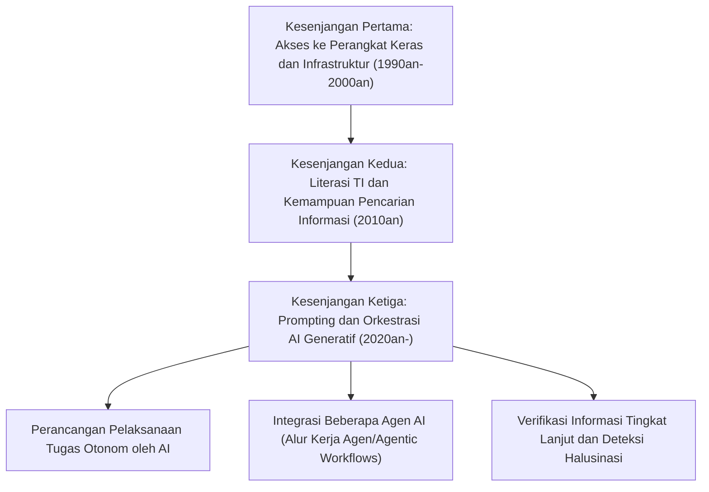
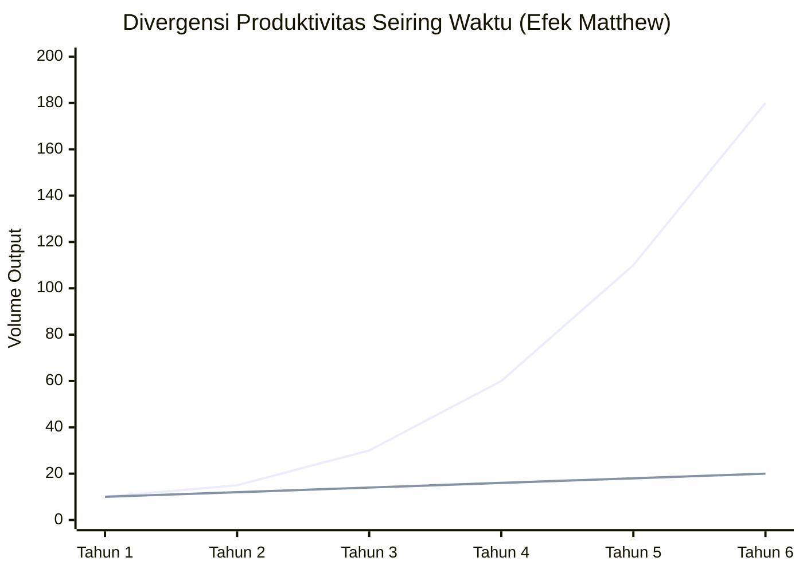
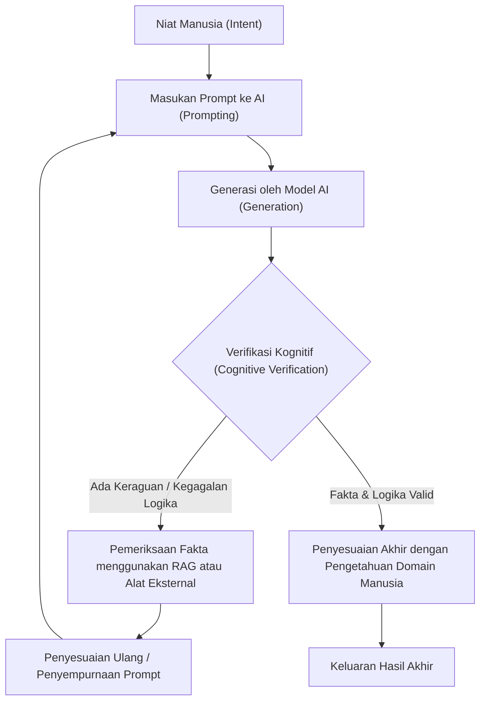

## 1. Pendahuluan: Transisi Historis Kesenjangan Digital dan Paradigma Baru

Sejak meluasnya penggunaan internet, kita sering mendengar istilah "kesenjangan digital (digital divide)". Kesenjangan digital pada awalnya terutama berkaitan dengan "hak akses fisik". Ini adalah skema sederhana di mana memiliki atau tidak memiliki komputer dan koneksi internet berkecepatan tinggi menentukan akses ke informasi dan peluang ekonomi. Kemudian, seiring dengan komoditisasi ponsel pintar dan koneksi pita lebar (broadband), fokus kesenjangan bergeser ke "literasi TI (kemampuan memanfaatkan informasi)". Ini menyangkut aspek kognitif dan perangkat lunak, seperti apakah seseorang dapat menemukan informasi dengan tepat menggunakan mesin pencari atau menggunakan perangkat lunak dengan baik.

Namun, evolusi AI Generatif (Generative AI) dan Large Language Models (LLM) yang tiba-tiba muncul pada tahun 2020-an mulai meruntuhkan konsep kesenjangan digital ini dari akar-akarnya. Apa yang kita hadapi saat ini bukanlah sekadar "kesenjangan akses informasi" atau "kesenjangan keterampilan mengoperasikan perangkat lunak". Ini adalah "kesenjangan kemampuan untuk mengorkestrasi (mengarahkan dan mengintegrasikan) AI", sebuah "kesenjangan digital ketiga" yang sangat serius dan tidak dapat diubah, yang menentukan apakah produktivitas seseorang akan berlipat ganda secara eksponensial atau apakah ia akan tertinggal oleh evolusi AI dan kehilangan nilai relatifnya.

Dalam artikel ini, kita akan mengungkap secara sangat rinci sifat dari kesenjangan digital baru yang dibawa oleh AI generatif ini, melalui tiga lapisan: model matematis produktivitas, arsitektur dan biaya perangkat keras, serta aspek kognitif manusia.

## 2. Dari "Akses" ke "Orkestrasi": Kedatangan Kesenjangan Digital Ketiga

Perangkat lunak dan alat di masa lalu pada dasarnya adalah "alat pasif". Keterbatasan perangkat lunak konvensional adalah bahwa ia memberikan hasil deterministik terhadap input eksplisit dari pengguna (contoh: memasukkan rumus di perangkat lunak spreadsheet untuk mendapatkan hasil perhitungan). Namun, AI generatif saat ini, terutama LLM berbasis arsitektur Transformer (seperti GPT-4, Claude 3.5, Llama 3, dll.), bertindak sebagai "fragmen kecerdasan aktif".

Pergeseran paradigma ini secara dramatis telah mengubah serangkaian keterampilan yang dituntut dari manusia, dari "kemampuan untuk mengoperasikan alat" menjadi "kemampuan untuk merancang dan mengarahkan alur kerja otonom dengan menggabungkan berbagai agen AI dan alat (AI Orchestration)". Ini dapat disebut sebagai "Literasi Orkestrasi AI".

Berikut adalah transisi kesenjangan digital dari masa lalu hingga saat ini.

Melampaui batas rekayasa prompt (prompt engineering), kita kini telah memasuki tahap di mana sistem dapat memecahkan masalah secara otonom menggunakan kerangka kerja multi-agen (multi-agent frameworks) seperti LangChain, AutoGen, dan CrewAI. Antara "kelompok yang merancang cetak biru dan membiarkan AI mengeksekusinya" dan "kelompok yang masih melakukan pekerjaan rutin dengan tangan mereka sendiri", terjadi divergensi produktivitas dengan kecepatan yang belum pernah dialami umat manusia sebelumnya.

## 3. Efek Matthew (Matthew Effect) dalam Produktivitas: Visualisasi Kesenjangan melalui Pendekatan Matematis

Berasal dari kata-kata di Perjanjian Baru bahwa "Karena setiap orang yang mempunyai, kepadanya akan diberi, sehingga ia berkelimpahan. Tetapi siapa yang tidak mempunyai, apa pun juga yang ada padanya akan diambil dari padanya", "Efek Matthew (Matthew Effect)" dalam sosiologi dan ekonomi merujuk pada fenomena di mana keuntungan awal membawa manfaat kumulatif. Dengan diperkenalkannya AI generatif, efek Matthew ini terwujud dengan kuat di pasar tenaga kerja dan produksi intelektual.

Produktivitas individu yang menggunakan AI secara efektif tidak tumbuh secara linear terhadap waktu, melainkan secara eksponensial. Ini karena waktu yang dihemat oleh AI dapat diinvestasikan kembali untuk membangun sistem AI yang lebih canggih, mengoptimalkan prompt, dan untuk pembelajaran mandiri. Mari kita nyatakan ini dengan model matematis.

Produktivitas pengguna non-AI $P_{human}(t)$ dan produktivitas orkestrator AI $P_{AI}(t)$ pada titik waktu tertentu $t$ masing-masing dapat dinyatakan dengan model berikut.

$$
P_{human}(t) = P_0 (1 + r_{human})^t
$$
Di sini, $P_0$ adalah produktivitas awal, dan $r_{human}$ adalah tingkat pembelajaran alami manusia (tingkat pertumbuhan berdasarkan kurva pengalaman). Umumnya $r_{human}$ sangat kecil, dan pertumbuhannya cenderung bersifat aritmatika.

Di sisi lain, produktivitas pengguna yang memanfaatkan AI sepenuhnya adalah kombinasi dari tingkat peningkatan kemampuan model AI yang digunakan $r_{model}$ dan efek majemuk $\alpha$ dari otomatisasi alur kerja AI.

$$
P_{AI}(t) = P_0 \cdot \exp\left( \int_0^t (r_{human} + \alpha \cdot r_{model}(\tau)) d\tau \right)
$$

Karena model AI itu sendiri berevolusi secara eksponensial (peningkatan jumlah parameter dan jumlah komputasi berdasarkan hukum penskalaan / scaling law), $r_{model}(t)$ itu sendiri meningkat seiring waktu. Akibatnya, selisih produktivitas di antara keduanya $\Delta P(t)$ melebar dengan cepat.

$$
\Delta P(t) = P_{AI}(t) - P_{human}(t)
$$

Grafik berikut ini menunjukkan perbedaan tersebut secara visual.

*(Catatan: Garis biru mewakili produktivitas orkestrator AI, garis bawah mewakili produktivitas pengguna non-AI)*

Meskipun perbedaannya terlihat sepele pada tahun pertama, setiap kali model AI berevolusi dari GPT-3 ke GPT-4, dan kemudian ke generasi berikutnya, pengguna AI menikmati peningkatan produktivitas yang eksponensial hanya dengan mencolokkan model baru ke dalam jalur pipa (pipeline) otomatisasi yang ada. Semakin berjalannya waktu, secara matematis semakin mustahil bagi pengguna non-AI untuk menjembatani kesenjangan ini.

## 4. Kesenjangan Perangkat Keras: Hambatan Inferensi Lokal dan Jebakan API Cloud

Kesenjangan digital ketiga tidak hanya menciptakan kesenjangan keterampilan perangkat lunak, tetapi juga kesenjangan perangkat keras baru dalam bentuk "akses ke komputasi (sumber daya komputasi)" untuk menjalankan model AI paling mutakhir.

Ada dua pendekatan utama untuk menggunakan model bahasa besar: "Menggunakan API cloud" atau "Melakukan inferensi (Inference) model secara lokal". Keduanya memiliki kelebihan dan kekurangan, dan hal ini menjadi dinding fisik dan ekonomi baru.

### Keterbatasan API Cloud dan Biaya Operasional
Model perintis (frontier models) paling mutakhir (seperti GPT-4o, Claude 3.5 Sonnet, dll.) yang disediakan oleh OpenAI, Anthropic, dan Google umumnya diakses melalui API. Namun, jika Anda membangun agen otonom tingkat lanjut (Agentic Workflow) yang menghasilkan puluhan ribu panggilan API sehari, biayanya akan meledak.

Total biaya API $C_{cloud}$ bergantung pada jumlah token masukan dan token keluaran.

$$
C_{cloud} = \sum_{i=1}^{N} \left( c_{in} \cdot T_{in}^{(i)} + c_{out} \cdot T_{out}^{(i)} \right)
$$
($N$ adalah jumlah permintaan, $T$ adalah jumlah token, $c$ adalah harga per token)

Dalam kasus pemrosesan data skala besar atau vektorisasi RAG (Retrieval-Augmented Generation) yang berkelanjutan, biaya variabel ini dapat menjadi beban fatal bagi pengembang perorangan dan usaha kecil dan menengah (UKM).

### Hambatan LLM Lokal dan VRAM
Permintaan untuk menjalankan model berbobot terbuka (open-weight models) seperti Llama 3 dari Meta atau Mistral secara lokal semakin meningkat dari sudut pandang menghindari biaya cloud dan menjaga privasi data. Namun di sini, kesenjangan fisik yang disebut "dinding VRAM (Video RAM)" menghalangi.

Kecepatan inferensi LLM lebih bergantung pada lebar pita memori (Memory Bandwidth) daripada kinerja komputasi (FLOPS) GPU (sifat Memory-bound). Jika jumlah parameter model adalah $P$ dan presisinya adalah 16-bit (2 byte), memuat model ke memori saja membutuhkan setidaknya $2P$ byte VRAM. Misalnya, model dengan 70 miliar (70B) parameter membutuhkan VRAM 140GB atau lebih.

$$
VRAM_{required} \approx \left( \frac{P \times bits\_per\_weight}{8} \right) + Context\_Memory
$$

Bahkan GPU kelas atas (NVIDIA RTX 4090) yang dapat dibeli konsumen umum hanya memiliki 24GB VRAM, sehingga mustahil untuk menjalankan model kelas 70B apa adanya. Di sinilah "teknologi kuantisasi (Quantization)" seperti AWQ dan GGUF muncul, dan pergulatan teknis terjadi untuk menemukan jalan tengah dengan mengompresi bobot menjadi 4-bit atau 8-bit, tetapi degradasi kinerja (memburuknya Perplexity) akibat kuantisasi tidak dapat dihindari.

Selain itu, "AI PC" yang dilengkapi dengan NPU (Neural Processing Unit) baru-baru ini telah muncul, tetapi TOPS (Tera Operations Per Second) NPU saat ini berada pada batas menjalankan model skala kecil yang ringan (SLM: Small Language Models). Untuk melakukan inferensi yang benar-benar canggih secara lokal, diperlukan kekuatan modal yang dapat membangun lingkungan multi-GPU skala jutaan yen. Inilah sifat sebenarnya dari "kesenjangan digital padat modal" dalam AI.

## 5. Kesenjangan Kognitif: Halusinasi dan Siklus Verifikasi

Lebih menakutkan daripada kesenjangan perangkat keras atau keterampilan adalah "kesenjangan kognitif". AI menghasilkan teks yang sangat lancar dan meyakinkan, tetapi pada saat yang sama menyebabkan "halusinasi", di mana ia dengan masuk akal mengeluarkan konten yang tidak berdasar fakta.

Kesenjangan yang terjadi di sini adalah pembagian antara "kelompok yang dapat menguji secara kritis dan memverifikasi (memeriksa fakta) keluaran AI" dan "kelompok yang secara membabi buta mempercayai keluaran AI sebagai kebenaran yang otoritatif". Kelompok pertama menggunakan AI sebagai alat curah pendapat dan penyusunan draf yang kuat, serta melakukan kontrol kualitas (QA) atas keluaran akhir menggunakan keahlian mereka sendiri. Kelompok kedua tidak hanya akan menyebarkan informasi yang salah ke dunia dan menghancurkan kredibilitas mereka sendiri, tetapi juga berkontribusi pada pencemaran ruang informasi internet dengan konten mirip spam.

Proses siklus verifikasi kognitif (Cognitive Verification Loop) untuk mencegah hal ini ditunjukkan di bawah ini.

Untuk menjalankan siklus ini, tidak cukup hanya mengetahui cara menggunakan AI, tetapi "pengetahuan domain" yang mendalam dan "pemikiran kritis (critical thinking)" mengenai area keluaran sangat diperlukan. Ironisnya, seiring dengan semakin berkembangnya AI, apa yang dituntut dari manusia bukanlah keterampilan pengoperasian dasar, melainkan kemampuan kognitif yang sangat tingkat tinggi, seperti kemampuan berpikir filosofis dan logis, serta pendidikan untuk membedakan kebenaran dari kebohongan.

## 6. Masyarakat Kelas Baru: Orkestrator AI dan Pekerja Manual

Di masa depan (atau kenyataan yang sedang berlangsung saat ini) di mana kesenjangan ini berlanjut ke ekstrem, pasar tenaga kerja akan terpolarisasi dengan cara yang belum pernah terjadi sebelumnya.

**1. Orkestrator AI (1-5% Teratas)**
Di bidang keahlian mereka sendiri, mereka membangun alur kerja yang mengoperasikan beberapa agen AI secara otonom. Mereka mendelegasikan sebagian besar proses seperti riset, pengkodean, analisis data, dan penulisan laporan kepada AI, sementara mereka sendiri mengkhususkan diri pada "perancangan proses", "penanganan pengecualian", dan "pengambilan keputusan akhir". Produktivitas mereka mencapai puluhan hingga ratusan kali lipat dari pekerja tradisional, dan menciptakan nilai ekonomi yang sangat besar.

**2. Pekerja Pengetahuan Tradisional dan Pekerja Manual**
Orang-orang yang menulis kode dengan tangan mereka sendiri, mengoperasikan Excel dengan tangan mereka sendiri, dan menulis teks dengan tangan mereka sendiri. Pekerjaan mereka secara bertahap akan digantikan oleh AI, atau mereka akan diturunkan ke "pemantauan dan pemeliharaan tingkat akhir" dari sistem yang dibuat oleh orkestrator AI, atau "pekerjaan di ruang fisik". Pekerja intelektual yang tidak memanfaatkan AI menghadapi risiko kehilangan daya saing pasar mereka sepenuhnya.

## 7. Strategi dan Resep Sosial untuk Bertahan di Masyarakat yang Penuh Kesenjangan

Dalam kesenjangan yang luar biasa ini, bagaimana individu, perusahaan, dan masyarakat harus beradaptasi?

### Strategi Individu: Beradaptasi dengan Pergeseran Paradigma
Hal terpenting adalah membuang meremehkan bahwa "AI hanyalah sebuah chatbot". Kita perlu memiliki kebiasaan untuk menganggap AI sebagai "anak magang tingkat lanjut" atau "tim ahli", dan selalu berpikir tentang bagaimana memecah proses bisnis kita sendiri dan mendelegasikannya ke AI (Task Decomposition). Selain itu, bahkan tanpa bisa memprogram, mempelajari konsep API dan penataan data (seperti JSON) memungkinkan otomatisasi yang kuat dengan menggabungkan alat tanpa-kode/rendah-kode (seperti Zapier, Make) dan AI.

### Strategi Perusahaan: Desain Organisasi yang AI-Native
Bagi perusahaan, hanya "mendistribusikan akun ChatGPT" tidaklah cukup. Penting untuk mendesain ulang seluruh alur kerja dengan premis AI (BPR: Business Process Re-engineering) dan melakukan investasi infrastruktur seperti membangun lingkungan RAG yang aman dan menyempurnakan (fine-tuning) pengetahuan khusus internal perusahaan pada model lokal. Pengenalan KPI baru yang mengevaluasi kemampuan orkestrasi AI karyawan juga diperlukan.

### Resep Sosial: Infrastruktur AI sebagai Barang Publik
Di tingkat negara dan masyarakat, jaring pengaman dan pendidikan diperlukan agar kesenjangan digital ketiga tidak berujung pada kesenjangan ekonomi dan kerusuhan sosial yang parah. Misalnya, dukungan publik untuk penelitian dan pengembangan model AI sumber terbuka (open-source), dan mewajibkan pendidikan "literasi AI kritis" di institusi pendidikan. Selain itu, pembaruan undang-undang antimonopoli dan peraturan hukum yang tepat untuk mencegah "monopoli model AI dan sumber daya komputasi" oleh perusahaan teknologi raksasa juga harus dibahas.

## 8. Kesimpulan: Menunggangi Gelombang Evolusi atau Tenggelam di Dalamnya

"Kesenjangan digital baru" yang disebabkan oleh AI generatif merestrukturisasi masyarakat kita lebih cepat dan lebih luas daripada inovasi teknologi apa pun di masa lalu. Kesenjangan ini terwujud sebagai perbedaan dalam sumber daya komputasi perangkat keras, kemampuan berinvestasi dalam API cloud, dan di atas segalanya, "keterampilan kognitif dan logis untuk mengorkestrasi AI".

Seperti yang ditunjukkan oleh efek Matthew dalam produktivitas, kesenjangan ini akan melebar seiring waktu hingga menjadi tidak dapat dijembatani. Apa yang harus kita lakukan sekarang bukanlah menakuti evolusi AI, maupun mempercayainya secara membabi buta. Yang harus kita lakukan adalah sangat memahami karakteristik AI, perangkat penguat kecerdasan (Intelligence Amplifier) terbesar dalam sejarah manusia, dan secara tegas melakukan "transformasi diri secara intelektual" yang memperbarui pemikiran dan alur kerja kita sendiri.

Apakah kita akan berdiri di sisi sini dari kesenjangan digital yang baru, atau tertinggal di sisi sana. Pilihan tersebut, saat ini juga, diserahkan pada pembelajaran dan tindakan harian kita.

---
*Silakan tinggalkan pendapat Anda tentang artikel ini atau studi kasus spesifik tentang penerapan orkestrasi AI di bagian komentar atau media sosial penulis.*
