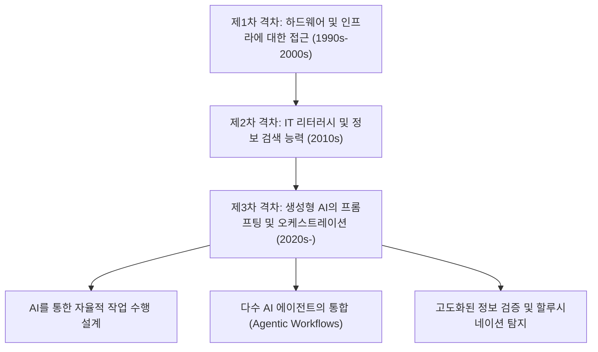
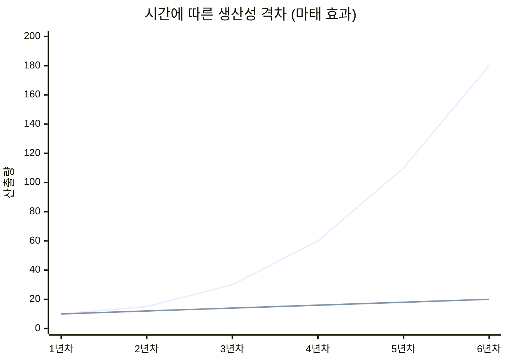
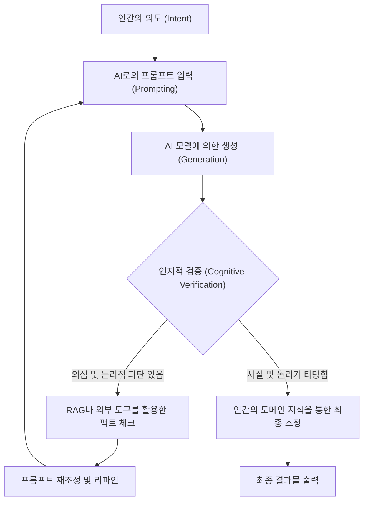

## 1. 시작하며: 디지털 격차의 역사적 변천과 새로운 패러다임

인터넷의 보급 이후, 우리는 '디지털 격차(디지털 디바이드, 정보 격차)'라는 단어를 여러 번 들어왔습니다. 초기의 디지털 격차는 주로 '물리적인 접근 권한'에 관한 것이었습니다. 즉, 컴퓨터나 고속 인터넷 회선을 가지고 있는지 여부가 정보에 대한 접근과 경제적 기회를 좌우한다는 단순한 구도입니다. 그 후 스마트폰과 브로드밴드 회선이 보편화됨에 따라, 격차의 초점은 'IT 리터러시(정보 활용 능력)'로 이동했습니다. 검색 엔진을 사용하여 적절하게 정보를 찾아낼 수 있는지, 소프트웨어를 능숙하게 다룰 수 있는지와 같은 소프트웨어적, 인지적인 측면입니다.

하지만 2020년대에 돌연히 일어난 생성형 AI(Generative AI)와 대규모 언어 모델(LLM: Large Language Models)의 진화는 이 디지털 격차의 개념을 근본부터 뒤엎고 있습니다. 지금 우리가 직면하고 있는 것은 단순한 '정보에 대한 접근 격차'나 '소프트웨어 조작 기술의 격차'가 아닙니다. 그것은 'AI를 오케스트레이션(지휘 및 통합)하는 능력의 격차'이며, 개인의 생산성을 지수함수적으로 증폭시킬 것인가, 아니면 AI의 진화에 뒤처져 상대적 가치를 잃을 것인가 하는 매우 심각하고 비가역적인 '제3차 디지털 격차'인 것입니다.

본고에서는 생성형 AI가 가져오는 이 새로운 디지털 격차의 정체를 생산성의 수리 모델, 하드웨어의 아키텍처와 비용, 그리고 인간의 인지적 측면이라는 세 가지 레이어에서 매우 상세하게 밝혀낼 것입니다.

## 2. "접근"에서 "오케스트레이션"으로: 제3차 디지털 격차의 도래

과거의 소프트웨어 도구는 본질적으로 '수동적인 도구'였습니다. 사용자의 명시적인 입력에 대해 결정론적인 결과를 반환하는 것이 기존 소프트웨어의 한계였습니다(예: 스프레드시트 소프트웨어에서 수식을 입력하여 계산 결과를 얻는 것). 그러나 현재의 생성형 AI, 특히 Transformer 아키텍처를 기반으로 하는 LLM(GPT-4, Claude 3.5, Llama 3 등)은 '능동적인 지능의 파편'으로 기능합니다.

이 패러다임 전환으로 인해 인간에게 요구되는 스킬 세트는 '도구를 조작하는 능력'에서 '여러 AI 에이전트나 도구를 결합하여 자율적인 워크플로우를 설계하고 지휘하는 능력(AI Orchestration)'으로 극적으로 변화했습니다. 이를 'AI 오케스트레이션 리터러시'라고 부를 수 있습니다.

아래에 과거부터 현재까지의 디지털 격차의 변천을 보여줍니다.

프롬프트 엔지니어링의 틀을 넘어, 현재는 LangChain이나 AutoGen, CrewAI와 같은 멀티 에이전트 프레임워크를 사용하여 시스템이 자율적으로 문제를 해결하게 하는 단계에 돌입하고 있습니다. 이 '설계도를 그리고 AI가 실행하게 하는 계층'과 '여전히 자신의 손으로 루틴한 작업을 처리하는 계층' 사이에는 지금까지 인류가 경험한 적 없는 속도로 생산성의 괴리가 발생하고 있는 것입니다.

## 3. 생산성의 마태 효과(Matthew Effect): 수리적 접근을 통한 격차의 시각화

"무릇 있는 자는 받아 풍족하게 되고 없는 자는 그 있는 것까지 빼앗기리라"라는 신약성경의 말씀에서 유래한 '마태 효과(Matthew Effect)'는 사회학이나 경제학에서 초기의 우위가 누적적인 이익을 가져오는 현상을 가리킵니다. 생성형 AI의 도입으로 인해 이 마태 효과가 노동 시장과 지적 생산에서 강렬하게 나타나고 있습니다.

AI를 효과적으로 이용하는 개인의 생산성은 시간에 대해 선형이 아니라 지수함수적으로 성장합니다. 왜냐하면 AI를 통해 절약된 시간을 더욱 고도화된 AI 시스템의 구축이나 프롬프트 최적화, 자기 주도 학습에 투자할 수 있기 때문입니다. 이를 수리 모델로 표현해 보겠습니다.

특정 시점 $t$ 에서 비AI 사용자의 생산성 $P_{human}(t)$ 와 AI 오케스트레이터의 생산성 $P_{AI}(t)$ 는 각각 다음과 같은 모델로 나타낼 수 있습니다.

$$
P_{human}(t) = P_0 (1 + r_{human})^t
$$

여기서 $P_0$ 는 초기의 생산성, $r_{human}$ 은 인간의 자연스러운 학습률(경험 곡선에 기반한 성장률)입니다. 일반적으로 $r_{human}$ 은 매우 작아서 성장은 산술급수적이 되기 쉽습니다.

반면, AI를 최대한 활용하는 사용자의 생산성은 사용하는 AI 모델의 능력 향상률 $r_{model}$ 과 AI 워크플로우 자동화로 인한 복리 효과 $\alpha$ 가 결합됩니다.

$$
P_{AI}(t) = P_0 \cdot \exp\left( \int_0^t (r_{human} + \alpha \cdot r_{model}(\tau)) d\tau \right)
$$

AI 모델 자체가 지수함수적으로 진화하고 있기(스케일링 법칙에 기반한 매개변수 수와 계산량의 증대) 때문에, $r_{model}(t)$ 자체가 시간과 함께 증대됩니다. 그 결과로 양쪽 생산성의 차이 $\Delta P(t)$ 는 급속하게 벌어지게 됩니다.

$$
\Delta P(t) = P_{AI}(t) - P_{human}(t)
$$

이 괴리를 시각적으로 보여준 것이 아래의 그래프입니다.

*(참고: 파란색 선은 AI 오케스트레이터의 생산성, 아래 선은 비AI 사용자의 생산성을 나타냅니다)*

처음 1년 동안은 미미한 차이로 보이지만, AI 모델이 GPT-3에서 GPT-4, 나아가 그 차세대로 진화할 때마다 AI 사용자는 기존의 자동화 파이프라인에 새로운 모델을 플러그인하는 것만으로도 비약적인 생산성 향상을 누립니다. 비AI 사용자가 이 차이를 메우는 것은 시간이 지남에 따라 수학적으로 불가능에 가까워집니다.

## 4. 하드웨어 격차: 로컬 추론의 장벽과 클라우드 API의 함정

제3차 디지털 격차는 소프트웨어 스킬뿐만 아니라 최첨단 AI 모델을 가동하기 위한 '컴퓨팅(계산 자원)에 대한 접근'이라는 새로운 하드웨어 격차도 만들어내고 있습니다.

대규모 언어 모델을 이용하려면 주로 2가지 접근 방식이 있습니다. '클라우드 API를 이용하는 것'과 '로컬에서 모델을 추론(Inference)하는 것'입니다. 둘 다 일장일단이 있으며, 이것이 새로운 경제적·물리적인 장벽이 되고 있습니다.

### 클라우드 API의 한계와 유지 비용
OpenAI나 Anthropic, Google이 제공하는 최첨단 프론티어 모델(GPT-4o, Claude 3.5 Sonnet 등)은 API를 통해 접근하는 것이 일반적입니다. 하지만 고도화된 자율형 에이전트(Agentic Workflow)를 구축하고 하루에 수만 번의 API 호출을 발생시키면 비용은 폭발적으로 증가하게 됩니다.

API의 총비용 $C_{cloud}$ 는 입력 토큰과 출력 토큰의 양에 따라 달라집니다.

$$
C_{cloud} = \sum_{i=1}^{N} \left( c_{in} \cdot T_{in}^{(i)} + c_{out} \cdot T_{out}^{(i)} \right)
$$
($N$은 요청 수, $T$는 토큰 수, $c$는 토큰 단가)

대규모 데이터 처리나 RAG(Retrieval-Augmented Generation)의 벡터화를 지속적으로 수행할 경우, 이 변동비는 개인 개발자나 중소기업에게 치명적인 부담이 될 수 있습니다.

### 로컬 LLM과 VRAM의 장벽
클라우드 비용 회피와 데이터 프라이버시 관점에서 Meta의 Llama 3나 Mistral과 같은 오픈 웨이트 모델을 로컬에서 구동하려는 수요가 높아지고 있습니다. 하지만 여기서 'VRAM(Video RAM)의 장벽'이라는 물리적인 격차가 가로막습니다.

LLM의 추론 속도는 GPU의 연산 성능(FLOPS)보다 메모리 대역폭(Memory Bandwidth)에 강하게 의존합니다(Memory-bound 한 특성). 모델의 매개변수 수를 $P$, 정밀도를 16bit(2바이트)라고 했을 때, 모델을 메모리에 로드하는 것만으로도 최소 $2P$ 바이트의 VRAM이 필요합니다. 예를 들어 700억(70B) 매개변수의 모델은 140GB 이상의 VRAM을 요구합니다.

$$
VRAM_{required} \approx \left( \frac{P \times bits\_per\_weight}{8} \right) + Context\_Memory
$$

일반 소비자가 구매할 수 있는 하이엔드 GPU(NVIDIA RTX 4090)에서도 VRAM은 24GB에 머물러 있어, 70B 수준의 모델을 그대로 구동하는 것은 불가능합니다. 여기서 AWQ나 GGUF와 같은 '양자화 기술(Quantization)'이 등장하여 가중치를 4bit나 8bit로 압축해 타협점을 찾는 기술적 분투가 이루어지고 있지만, 양자화로 인한 성능 저하(Perplexity의 악화)는 피할 수 없습니다.

또한, 최근에는 NPU(Neural Processing Unit)를 탑재한 'AI PC'가 등장하고 있지만, 현재 NPU의 TOPS(Tera Operations Per Second)는 경량의 소규모 모델(SLM: Small Language Models)을 구동하는 것이 한계이며, 진정으로 고도화된 추론을 로컬에서 수행하려면 수백만 엔 규모의 멀티 GPU 환경을 구축할 수 있는 자본력이 필요합니다. 이것이 AI에 있어 '자본 집약적인 디지털 격차'의 정체입니다.

## 5. 인지적 격차: 할루시네이션과 검증의 루프

하드웨어나 스킬의 격차 이상으로 무서운 것이 '인지적 격차'입니다. AI는 매우 유창하고 설득력 있는 문장을 생성하지만, 동시에 사실무근인 내용을 그럴듯하게 출력하는 '할루시네이션(환각)'을 일으킵니다.

여기서 발생하는 격차는 'AI의 출력을 비판적으로 검토하고 검증(팩트 체크)할 수 있는 계층'과 'AI의 출력을 권위 있는 진실로 맹신해버리는 계층'의 분단입니다. 전자는 AI를 강력한 브레인스토밍이나 초안 작성 도구로 활용하고, 최종 출력의 품질 관리(QA)를 자신의 전문 지식으로 수행합니다. 후자는 잘못된 정보를 그대로 세상에 내보내어 자신의 신용을 실추시킬 뿐만 아니라, 인터넷상의 정보 공간을 스팸성 콘텐츠로 오염시키는 원인이 됩니다.

이를 방지하기 위한 인지적 검증 루프(Cognitive Verification Loop)의 프로세스를 아래에 보여줍니다.

이 루프를 순환시키기 위해서는 단순히 AI 사용법을 아는 것뿐만 아니라, 그 출력 영역에 관한 깊은 '도메인 지식'과 '비판적 사고'가 필수적입니다. 아이러니하게도 AI가 진화하면 할수록 인간에게 요구되는 것은 기본적인 조작 스킬이 아니라 철학적이고 논리적인 사고력이나 진위를 가려내는 교양과 같은 매우 고도화된 인지 능력으로 옮겨가고 있는 것입니다.

## 6. 새로운 계급 사회: AI 오케스트레이터와 매뉴얼 워커

이러한 격차가 극한까지 진행된 미래(또는 현재 진행형의 현실)에서는 노동 시장이 유례없는 형태로 양극화됩니다.

**1. AI 오케스트레이터 (상위 1〜5%)**
이들은 자신의 전문 영역에서 여러 AI 에이전트를 자율적으로 움직이는 워크플로우를 구축하고 있습니다. 조사, 코딩, 데이터 분석, 리포트 작성 등의 프로세스 대부분을 AI에 위임하고, 자신은 '프로세스 설계', '예외 처리', '최종적인 의사결정'에 특화합니다. 이들의 생산성은 기존 노동자의 수십 배에서 수백 배에 달하며, 막대한 경제적 가치를 창출합니다.

**2. 기존 형태의 지식 노동자 및 매뉴얼 워커**
자신의 손으로 코드를 작성하고, 자신의 손으로 Excel을 조작하며, 자신의 손으로 글을 쓰는 사람들입니다. 이들의 일은 점차 AI로 대체되거나, 혹은 AI 오케스트레이터가 만든 시스템의 '말단 감시 및 유지 보수'나 '물리적 공간에서의 노동'으로 내몰리게 됩니다. AI를 활용하지 않는 지적 노동은 시장 경쟁력을 완전히 상실할 위험에 직면해 있습니다.

## 7. 격차 사회를 살아남기 위한 전략과 사회적 처방전

이 압도적인 격차 속에서 개인이나 기업, 그리고 사회는 어떻게 적응해 나가야 할까요?

### 개인의 전략: 패러다임 전환에 대한 적응
가장 중요한 것은 'AI는 단순한 챗봇이다'라는 과소평가를 버리는 것입니다. AI를 '고급 인턴'이나 '전문가 팀'으로 간주하고, 자신의 업무 프로세스를 어떻게 분해하여 AI에게 위임할 수 있을지(Task Decomposition)를 항상 생각하는 습관을 들일 필요가 있습니다. 또한, 프로그래밍을 할 줄 몰라도 API의 개념이나 데이터의 구조화(JSON 등)에 대해 배움으로써 노코드/로우코드 도구(Zapier, Make 등)와 AI를 결합한 강력한 자동화가 가능해집니다.

### 기업의 전략: AI 네이티브한 조직 설계
기업에 있어서는 단순히 'ChatGPT 계정을 배포하는' 것만으로는 충분하지 않습니다. 업무 흐름 전체를 AI 전제로 재설계(BPR: Business Process Re-engineering)하고, 안전한 RAG 환경 구축이나 사내 고유의 지식을 로컬 모델에 파인 튜닝하는 등의 인프라 투자가 필요합니다. 또한, 직원의 AI 오케스트레이션 능력을 평가하는 새로운 KPI 도입도 요구됩니다.

### 사회적 처방전: 공공재로서의 AI 인프라
국가나 사회 수준에서는 제3차 디지털 격차가 심각한 경제 격차 및 사회 불안으로 이어지지 않도록 하는 안전망과 교육이 필요합니다. 예를 들어, 오픈소스 AI 모델의 연구 개발에 대한 공적 지원이나 교육 기관에서의 '비판적 AI 리터러시'의 의무 교육화 등을 들 수 있습니다. 또한 거대 기술 기업에 의한 'AI 모델과 계산 자원의 독점'을 방지하기 위한 적절한 법 규제 및 독점금지법의 업데이트도 논의의 장에 올려야 합니다.

## 8. 결론: 진화의 파도에 탈 것인가, 휩쓸릴 것인가

생성형 AI가 일으키는 '새로운 디지털 격차'는 과거의 그 어떤 기술 혁신보다도 급속하고 광범위하게 우리 사회를 재구축하고 있습니다. 이 격차는 하드웨어의 계산 자원, 클라우드 API에 대한 투자 능력, 그리고 무엇보다 'AI를 오케스트레이션하는 인지적·논리적 스킬'의 차이로 나타나고 있습니다.

생산성의 마태 효과가 보여주듯, 이 격차는 시간이 지남에 따라 메우기 힘들 정도로 확대되어 갑니다. 우리가 지금 해야 할 일은 AI의 진화를 두려워하는 것도, 맹신하는 것도 아닙니다. AI라는 인류 역사상 최대의 지능 증폭 장치(Intelligence Amplifier)의 특성을 깊이 이해하고, 스스로의 사고와 워크플로우를 업데이트하는 '지적인 자기 변혁'을 단행하는 것입니다.

새로운 디지털 격차의 이쪽에 설 것인가, 저쪽에 남을 것인가. 그 선택은 지금 이 순간에도 우리의 매일의 학습과 행동에 달려 있습니다.

---
*본 기사에 대한 의견이나 AI 오케스트레이션의 구체적인 도입 사례에 대해서는 댓글란 또는 저자의 SNS로 보내주시기 바랍니다.*
