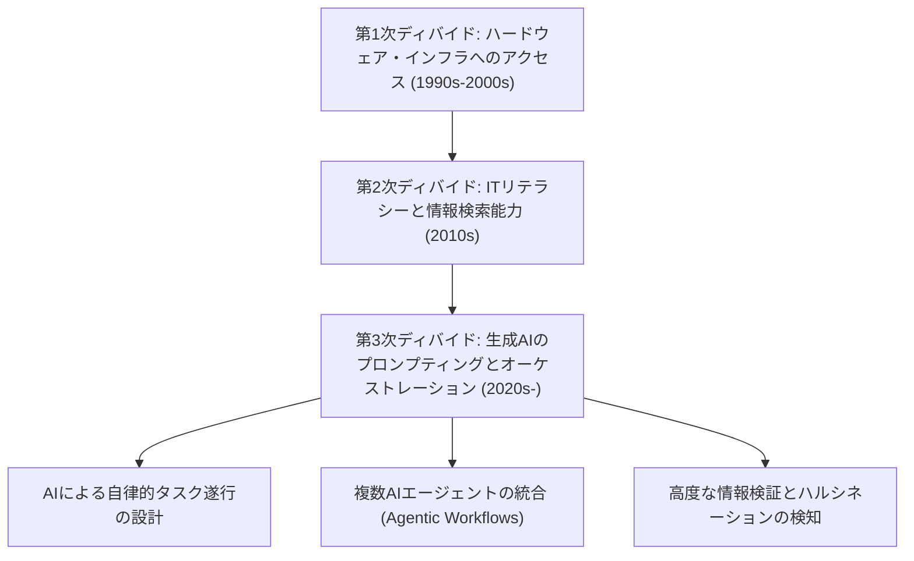
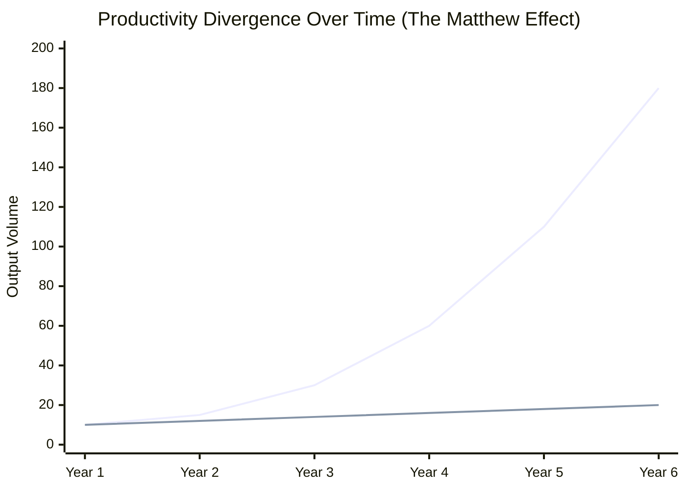
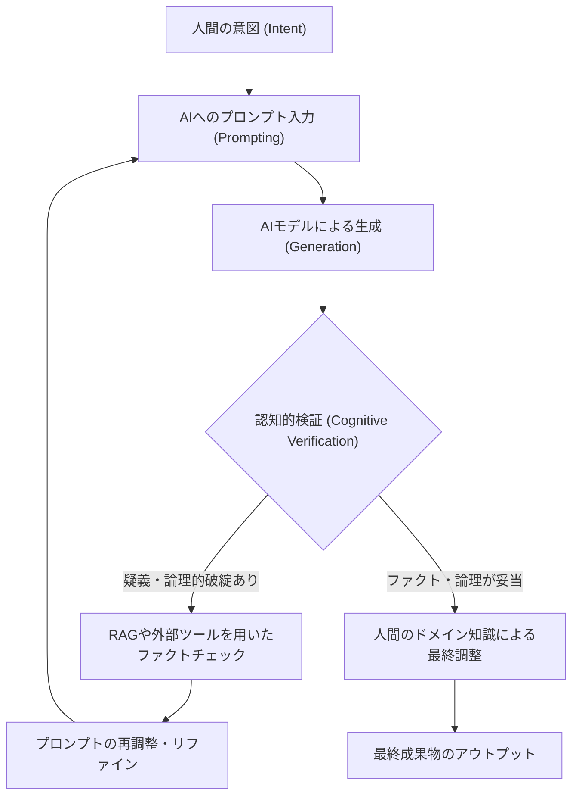

## 1. はじめに：デジタルディバイドの歴史的変遷と新たなパラダイム

インターネットの普及以降、私たちは「デジタルディバイド（情報格差）」という言葉を何度も耳にしてきました。初期のデジタルディバイドは、主に「物理的なアクセス権」に関するものでした。つまり、コンピューターや高速インターネット回線を持っているか否かが、情報へのアクセスと経済的機会を左右するという単純な構図です。その後、スマートフォンやブロードバンド回線がコモディティ化するにつれて、ディバイドの焦点は「ITリテラシー（情報活用能力）」へと移行しました。検索エンジンを使って適切に情報を探し出せるか、ソフトウェアを使いこなせるか、といったソフトウェア的・認知的な側面です。

しかし、2020年代に突如として勃興した生成AI（Generative AI）と大規模言語モデル（LLM: Large Language Models）の進化は、このデジタルディバイドの概念を根本から覆しつつあります。いま私たちが直面しているのは、単なる「情報へのアクセス格差」や「ソフトウェアの操作スキルの格差」ではありません。それは、「AIをオーケストレーション（指揮・統合）する能力の格差」であり、個人の生産性を指数関数的に増幅させるか、それともAIの進化に取り残されて相対的価値を失うかという、極めて深刻で不可逆的な「第3次デジタルディバイド」なのです。

本稿では、生成AIがもたらすこの新たなデジタルディバイドの正体を、生産性の数理モデル、ハードウェアのアーキテクチャとコスト、そして人間の認知的側面の3つのレイヤーから極めて詳細に解き明かしていきます。

## 2. 「アクセス」から「オーケストレーション」へ：第3次デジタルディバイドの到来

過去のソフトウェア・ツールは、本質的に「受動的な道具」でした。ユーザーの明示的な入力に対して、決定論的な結果を返すのが従来のソフトウェアの限界でした（例：表計算ソフトで数式を入力して計算結果を得る）。しかし、現在の生成AI、特にTransformerアーキテクチャをベースとするLLM（GPT-4、Claude 3.5、Llama 3など）は、「能動的な知能の断片」として振る舞います。

このパラダイムシフトにより、人間に求められるスキルセットは「ツールを操作する能力」から「複数のAIエージェントやツールを組み合わせ、自律的なワークフローを設計・指揮する能力（AI Orchestration）」へと劇的に変化しました。これを「AIオーケストレーション・リテラシー」と呼ぶことができます。

以下に、過去から現在に至るまでのデジタルディバイドの変遷を示します。

プロンプトエンジニアリングの枠を超えて、現在ではLangChainやAutoGen、CrewAIのようなマルチエージェント・フレームワークを用いて、システムに自律的な問題解決をさせる段階に突入しています。この「設計図を描き、AIに実行させる層」と、「いまだに自らの手でルーチンワークをこなしている層」の間には、これまで人類が経験したことのないスピードで生産性の乖離が生じているのです。

## 3. 生産性のマタイ効果（Matthew Effect）：数理的アプローチによる格差の可視化

「持てる者はさらに与えられ、持たざる者は持っているものまでも奪われる」という新約聖書の言葉に由来する「マタイ効果（Matthew Effect）」は、社会学や経済学において、初期の優位性が累積的な利益をもたらす現象を指します。生成AIの導入によって、このマタイ効果が労働市場と知的生産において強烈に発現しています。

AIを効果的に利用する個人の生産性は、時間に対して線形ではなく、指数関数的に成長します。なぜなら、AIによって節約された時間を、さらに高度なAIシステムの構築やプロンプトの最適化、自己学習に投資できるからです。これを数理モデルで表現してみましょう。

ある時点 $t$ における非AIユーザーの生産性 $P_{human}(t)$ と、AIオーケストレーターの生産性 $P_{AI}(t)$ は、それぞれ次のようなモデルで表すことができます。

$$
P_{human}(t) = P_0 (1 + r_{human})^t
$$
ここで、 $P_0$ は初期の生産性、$r_{human}$ は人間の自然な学習率（経験曲線に基づく成長率）です。一般に $r_{human}$ は非常に小さく、成長は算術級数的になりがちです。

一方で、AIをフル活用するユーザーの生産性は、使用するAIモデルの能力向上率 $r_{model}$ と、AIのワークフロー自動化による複利効果 $\alpha$ が組み合わさります。

$$
P_{AI}(t) = P_0 \cdot \exp\left( \int_0^t (r_{human} + \alpha \cdot r_{model}(\tau)) d\tau \right)
$$

AIモデル自体が指数関数的に進化している（スケーリング則に基づくパラメーター数と計算量の増大）ため、$r_{model}(t)$ 自体が時間とともに増大します。この結果として、両者の生産性の差 $\Delta P(t)$ は急速に開いていきます。

$$
\Delta P(t) = P_{AI}(t) - P_{human}(t)
$$

この乖離を視覚的に示したのが以下のグラフです。

*(注：青い線はAIオーケストレーターの生産性、下の線は非AIユーザーの生産性を表す)*

最初の1年では微々たる差に見えますが、AIモデルがGPT-3からGPT-4、さらにはその次世代へと進化するごとに、AIユーザーは既存の自動化パイプラインに新しいモデルをプラグインするだけで飛躍的な生産性向上を享受します。非AIユーザーがこの差を埋めることは、時間の経過とともに数学的に不可能に近づいていきます。

## 4. ハードウェアディバイド：ローカル推論の壁とクラウドAPIの罠

第3次デジタルディバイドは、ソフトウェアスキルだけでなく、最先端のAIモデルを稼働させるための「コンピュート（計算資源）へのアクセス」という新たなハードウェアの格差も生み出しています。

大規模言語モデルを利用するには、主に2つのアプローチがあります。「クラウドAPIを利用する」か、「ローカルでモデルを推論（Inference）する」かです。どちらも一長一短があり、これが新たな経済的・物理的な壁となっています。

### クラウドAPIの限界とランニングコスト
OpenAIやAnthropic、Googleが提供する最先端のフロンティアモデル（GPT-4o, Claude 3.5 Sonnetなど）は、API経由でアクセスするのが一般的です。しかし、高度な自律型エージェント（Agentic Workflow）を構築し、1日何万回ものAPIコールを発生させると、コストは爆発的に増加します。

APIの総コスト $C_{cloud}$ は、入力トークンと出力トークンの量に依存します。

$$
C_{cloud} = \sum_{i=1}^{N} \left( c_{in} \cdot T_{in}^{(i)} + c_{out} \cdot T_{out}^{(i)} \right)
$$
($N$はリクエスト数、$T$はトークン数、$c$はトークン単価)

大規模なデータ処理やRAG（Retrieval-Augmented Generation）のベクトル化を継続的に行う場合、この変動費は個人開発者や中小企業にとって致命的な負担になり得ます。

### ローカルLLMとVRAMの壁
クラウドコストの回避とデータプライバシーの観点から、MetaのLlama 3やMistralなどのオープンウェイトモデルをローカルで動かす需要が高まっています。しかしここで「VRAM（Video RAM）の壁」という物理的なディバイドが立ちはだかります。

LLMの推論速度は、GPUの演算性能（FLOPS）よりも、メモリ帯域幅（Memory Bandwidth）に強く依存します（Memory-boundな性質）。モデルのパラメータ数を $P$、精度を16bit（2バイト）とした場合、モデルをメモリにロードするだけでも最低 $2P$ バイトのVRAMが必要です。例えば700億（70B）パラメータのモデルは、140GB以上のVRAMを要求します。

$$
VRAM_{required} \approx \left( \frac{P \times bits\_per\_weight}{8} \right) + Context\_Memory
$$

一般消費者が購入できるハイエンドGPU（NVIDIA RTX 4090）でもVRAMは24GBにとどまり、70Bクラスのモデルをそのまま動かすことは不可能です。ここで、AWQやGGUFといった「量子化技術（Quantization）」が登場し、ウェイトを4bitや8bitに圧縮して妥協点を探る技術的格闘が行われていますが、量子化による性能劣化（Perplexityの悪化）は避けられません。

さらに、近年ではNPU（Neural Processing Unit）を搭載した「AI PC」が登場していますが、現在のNPUのTOPS（Tera Operations Per Second）は軽量な小規模モデル（SLM: Small Language Models）を動かすのが限界であり、真に高度な推論をローカルで行うには、数百万円規模のマルチGPU環境を構築できる資本力が必要です。これが、AIにおける「資本集約的なデジタルディバイド」の正体です。

## 5. 認知的ディバイド：ハルシネーションと検証のループ

ハードウェアやスキルの格差以上に恐ろしいのが、「認知的ディバイド」です。AIは非常に流暢で説得力のある文章を生成しますが、同時に事実無根の内容をもっともらしく出力する「ハルシネーション（幻覚）」を引き起こします。

ここで生じるディバイドは、「AIの出力を批判的に吟味し、検証（ファクトチェック）できる層」と、「AIの出力を権威ある真実として盲信してしまう層」の分断です。前者はAIを強力なブレインストーミングやドラフト作成のツールとして活用し、最終的な出力の品質管理（QA）を自らの専門知識で行います。後者は、誤った情報をそのまま世に送り出し、自身の信用を失墜させるだけでなく、インターネット上の情報空間をスパム的コンテンツで汚染する一因となります。

これを防ぐための認知的検証ループ（Cognitive Verification Loop）のプロセスを以下に示します。

このループを回すためには、単にAIの使い方がわかるだけでなく、その出力領域に関する深い「ドメイン知識」と「クリティカル・シンキング」が不可欠です。皮肉なことに、AIが進化すればするほど、人間に求められるのは基本的な操作スキルではなく、哲学的・論理的な思考力や、真偽を見極める教養といった、極めて高度な認知能力へとシフトしているのです。

## 6. 新たな階級社会：AIオーケストレーターとマニュアルワーカー

これらの格差が極限まで進んだ未来（あるいは現在進行形の現実）では、労働市場はこれまでにない形で二極化します。

**1. AIオーケストレーター（上位1〜5%）**
彼らは自身の専門領域において、複数のAIエージェントを自律的に動かすワークフローを構築しています。調査、コーディング、データ分析、レポート作成といったプロセスの大半をAIに委譲し、自身は「プロセスの設計」「例外処理」「最終的な意思決定」に特化します。彼らの生産性は旧来の労働者の数十倍から数百倍に達し、莫大な経済的価値を創出します。

**2. 従来型の知識労働者・マニュアルワーカー**
自らの手でコードを書き、自らの手でExcelを操作し、自らの手で文章を書く人々です。彼らの仕事は徐々にAIに置き換えられるか、あるいはAIオーケストレーターが作成したシステムの「末端の監視・保守」や「物理空間での労働」に追いやられることになります。AIを活用しない知的労働は、市場競争力を完全に失うリスクに直面しています。

## 7. 格差社会を生き抜くための戦略と社会的処方箋

この圧倒的なディバイドの中で、個人や企業、そして社会はどのように適応していくべきでしょうか。

### 個人の戦略：パラダイムシフトへの適応
最も重要なのは、「AIは単なるチャットボットである」という過小評価を捨てることです。AIを「高度なインターン」や「専門家のチーム」として捉え、自らの業務プロセスをどのように分解し、AIに委譲できるか（Task Decomposition）を常に考える癖をつける必要があります。また、プログラミングができなくても、APIの概念やデータの構造化（JSONなど）について学ぶことで、ノーコード/ローコードツール（Zapier, Makeなど）とAIを組み合わせた強力な自動化が可能になります。

### 企業の戦略：AIネイティブな組織設計
企業においては、単に「ChatGPTのアカウントを配布する」だけでは不十分です。業務フロー全体をAI前提で再設計（BPR: Business Process Re-engineering）し、セキュアなRAG環境の構築や、社内固有の知識をローカルモデルにファインチューニングするなどのインフラ投資が必要です。また、従業員のAIオーケストレーション能力を評価する新しいKPIの導入も求められます。

### 社会的処方箋：公共財としてのAIインフラ
国家や社会レベルでは、第3次デジタルディバイドが深刻な経済格差・社会不安につながらないようなセーフティネットと教育が必要です。例えば、オープンソースAIモデルの研究開発への公的支援や、教育機関における「批判的AIリテラシー」の義務教育化などが挙げられます。また、巨大テック企業による「AIモデルと計算資源の独占」を防ぐための、適切な法規制や独占禁止法のアップデートも議論の俎上に載せるべきです。

## 8. 結論：進化の波に乗るか、飲まれるか

生成AIが引き起こす「新たなデジタルディバイド」は、過去のいかなる技術革新よりも急速かつ広範に私たちの社会を再構築しています。このディバイドは、ハードウェアの計算資源、クラウドAPIへの投資能力、そして何よりも「AIをオーケストレーションする認知的・論理的スキル」の差として現れています。

生産性のマタイ効果が示す通り、この格差は時間が経つにつれて埋めがたいほどに拡大していきます。私たちが今すべきことは、AIの進化を恐れることでも、盲信することでもありません。AIという人類史上最大の知能増幅装置（Intelligence Amplifier）の特性を深く理解し、自らの思考とワークフローをアップデートする「知的な自己変革」を断行することです。

新たなデジタルディバイドのこちら側に立つか、あちら側に残るか。その選択は、今この瞬間も、私たちの毎日の学習と行動に委ねられています。

---
*本記事に関するご意見や、AIオーケストレーションの具体的な導入事例については、コメント欄または著者のSNSまでお寄せください。*
