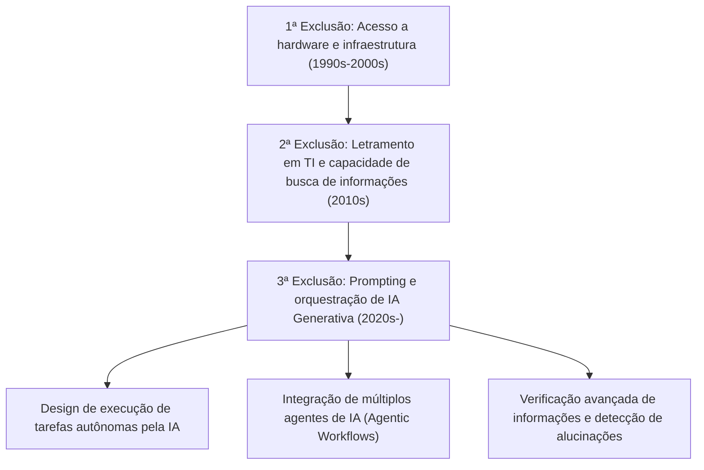
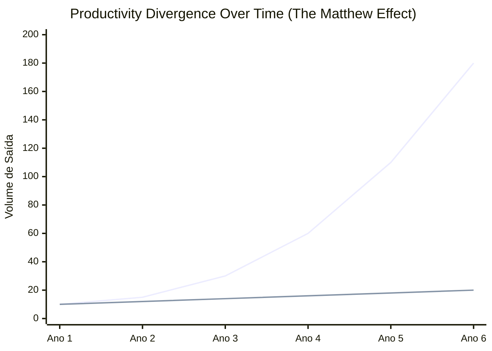
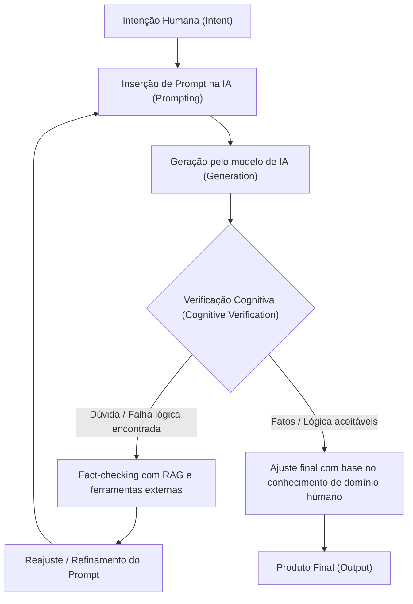

## 1. Introdução: A Transição Histórica da Exclusão Digital e o Novo Paradigma

Desde a popularização da internet, ouvimos repetidamente o termo "exclusão digital" (infoexclusão). A exclusão digital inicial estava relacionada principalmente aos "direitos de acesso físico". Em outras palavras, era o cenário simples de que possuir ou não computadores e conexões de internet de alta velocidade determinava o acesso à informação e às oportunidades econômicas. Mais tarde, à medida que os smartphones e as conexões de banda larga se tornaram commodities, o foco da exclusão mudou para o "letramento em TI" (capacidade de utilização da informação). Tratava-se dos aspectos cognitivos e de software, como a capacidade de pesquisar informações adequadamente usando motores de busca ou a habilidade de usar softwares.

No entanto, a rápida ascensão da IA Generativa (Generative AI) e a evolução dos Grandes Modelos de Linguagem (LLM: Large Language Models) na década de 2020 estão subvertendo o conceito dessa exclusão digital pela raiz. O que enfrentamos agora não é uma mera "exclusão de acesso à informação" ou "exclusão de habilidades operacionais de software". É uma "exclusão na capacidade de orquestrar (comandar e integrar) a IA", sendo uma "3ª exclusão digital" extremamente profunda e irreversível, que determina se a produtividade individual será ampliada exponencialmente ou se a pessoa será deixada para trás pela evolução da IA e perderá seu valor relativo.

Neste artigo, desvendaremos a verdadeira natureza desta nova exclusão digital trazida pela IA generativa de forma extremamente detalhada, a partir de três camadas: o modelo matemático de produtividade, a arquitetura e os custos de hardware e, finalmente, os aspectos cognitivos humanos.

## 2. De "Acesso" para "Orquestração": A Chegada da 3ª Exclusão Digital

As ferramentas de software do passado eram essencialmente "instrumentos passivos". O limite do software tradicional era retornar resultados determinísticos em resposta às entradas explícitas do usuário (ex: inserir fórmulas em um software de planilha para obter resultados de cálculos). No entanto, a IA generativa atual, especialmente os LLMs baseados na arquitetura Transformer (GPT-4, Claude 3.5, Llama 3, etc.), atua como "fragmentos de inteligência ativa".

Com essa mudança de paradigma, o conjunto de habilidades exigido dos humanos mudou drasticamente da "capacidade de operar ferramentas" para a "capacidade de projetar e comandar fluxos de trabalho autônomos, combinando vários agentes e ferramentas de IA (AI Orchestration)". Isso pode ser chamado de "Letramento em Orquestração de IA".

Abaixo, mostramos a transição da exclusão digital do passado até o presente.

Ultrapassando os limites da engenharia de prompt, entramos agora em uma fase em que os sistemas são instruídos a resolver problemas de forma autônoma usando frameworks multi-agentes como LangChain, AutoGen e CrewAI. Entre a "camada que desenha o projeto e faz a IA executá-lo" e a "camada que ainda realiza trabalhos rotineiros com as próprias mãos", está ocorrendo uma divergência de produtividade a uma velocidade que a humanidade nunca experimentou antes.

## 3. O Efeito Mateus (Matthew Effect) da Produtividade: Visualizando a Disparidade Através da Abordagem Matemática

O "Efeito Mateus" (Matthew Effect), derivado das palavras do Novo Testamento de que "a quem tem, mais será dado, e a quem não tem, até o que tem lhe será tirado", refere-se ao fenômeno em sociologia e economia onde vantagens iniciais trazem benefícios cumulativos. Com a introdução da IA generativa, esse Efeito Mateus está se manifestando intensamente no mercado de trabalho e na produção intelectual.

A produtividade de um indivíduo que utiliza a IA de forma eficaz não cresce linearmente em relação ao tempo, mas sim exponencialmente. Isso porque o tempo economizado pela IA pode ser investido na construção de sistemas de IA ainda mais avançados, na otimização de prompts e no autoaprendizado. Vamos expressar isso por meio de um modelo matemático.

A produtividade de um usuário não-IA $P_{human}(t)$ e a produtividade de um orquestrador de IA $P_{AI}(t)$ em um determinado momento $t$ podem ser representadas pelos seguintes modelos, respectivamente.

$$
P_{human}(t) = P_0 (1 + r_{human})^t
$$
Aqui, $P_0$ é a produtividade inicial e $r_{human}$ é a taxa natural de aprendizado humano (taxa de crescimento baseada na curva de experiência). Geralmente, $r_{human}$ é muito pequena e o crescimento tende a ser em progressão aritmética.

Por outro lado, a produtividade do usuário que utiliza plenamente a IA combina a taxa de melhoria da capacidade do modelo de IA utilizado $r_{model}$ e o efeito de juros compostos da automação do fluxo de trabalho da IA $\alpha$.

$$
P_{AI}(t) = P_0 \cdot \exp\left( \int_0^t (r_{human} + \alpha \cdot r_{model}(\tau)) d\tau \right)
$$

Como o próprio modelo de IA está evoluindo exponencialmente (aumento do número de parâmetros e poder computacional com base nas leis de escala), o próprio $r_{model}(t)$ aumenta com o tempo. Como resultado, a diferença de produtividade entre os dois $\Delta P(t)$ se alarga rapidamente.

$$
\Delta P(t) = P_{AI}(t) - P_{human}(t)
$$

O gráfico abaixo ilustra visualmente essa divergência.

*(Nota: A linha azul representa a produtividade do orquestrador de IA, e a linha inferior representa a produtividade do usuário não-IA)*

No primeiro ano pode parecer uma diferença trivial, mas à medida que os modelos de IA evoluem do GPT-3 para o GPT-4 e depois para a próxima geração, os usuários de IA desfrutam de melhorias drásticas de produtividade simplesmente conectando novos modelos aos seus pipelines de automação existentes. Preencher essa lacuna torna-se matematicamente quase impossível para os usuários não-IA com o passar do tempo.

## 4. A Exclusão de Hardware: A Barreira da Inferência Local e a Armadilha da API em Nuvem

A 3ª exclusão digital está criando não apenas uma lacuna em habilidades de software, mas também uma nova disparidade de hardware, que é o "acesso à computação (recursos computacionais)" necessários para executar modelos de IA de ponta.

Existem principalmente duas abordagens para usar Grandes Modelos de Linguagem: "usar APIs em nuvem" ou "fazer a inferência do modelo localmente". Ambas têm prós e contras, e isso se tornou uma nova barreira econômica e física.

### Os Limites e os Custos Contínuos da API em Nuvem
O acesso aos modelos de fronteira mais avançados (GPT-4o, Claude 3.5 Sonnet, etc.) fornecidos pela OpenAI, Anthropic e Google geralmente é feito via API. No entanto, se você construir um fluxo de trabalho avançado com agentes autônomos (Agentic Workflow) que gera dezenas de milhares de chamadas de API por dia, o custo aumentará de forma explosiva.

O custo total da API $C_{cloud}$ depende da quantidade de tokens de entrada e de tokens de saída.

$$
C_{cloud} = \sum_{i=1}^{N} \left( c_{in} \cdot T_{in}^{(i)} + c_{out} \cdot T_{out}^{(i)} \right)
$$
(Onde $N$ é o número de solicitações, $T$ é o número de tokens e $c$ é o preço unitário do token)

Ao realizar o processamento de dados em grande escala ou a vetorização RAG (Retrieval-Augmented Generation) continuamente, este custo variável pode se tornar um fardo fatal para desenvolvedores independentes e pequenas e médias empresas.

### A Barreira dos LLMs Locais e VRAM
Com o objetivo de evitar custos de nuvem e manter a privacidade dos dados, a demanda por execução local de modelos de pesos abertos (open-weight), como Llama 3 da Meta ou Mistral, está aumentando. No entanto, é aqui que nos deparamos com a barreira física chamada "exclusão de VRAM (Video RAM)".

A velocidade de inferência dos LLMs depende muito mais da largura de banda de memória (Memory Bandwidth) do que do desempenho computacional da GPU (FLOPS) (natureza dependente da memória - Memory-bound). Se o número de parâmetros do modelo for $P$ e a precisão for de 16 bits (2 bytes), o carregamento do modelo na memória requer pelo menos $2P$ bytes de VRAM. Por exemplo, um modelo de 70 bilhões (70B) de parâmetros requer mais de 140GB de VRAM.

$$
VRAM_{required} \approx \left( \frac{P \times bits\_per\_weight}{8} \right) + Context\_Memory
$$

Até mesmo GPUs de ponta disponíveis para consumidores (como a NVIDIA RTX 4090) têm apenas 24GB de VRAM, impossibilitando a execução direta de modelos da classe de 70B. Aqui entram as "Técnicas de Quantização (Quantization)" como AWQ e GGUF, que representam uma luta técnica para comprimir pesos para 4 bits ou 8 bits em busca de um meio-termo, mas a degradação de desempenho (piora na perplexidade - Perplexity) devido à quantização é inevitável.

Além disso, os "AI PCs" equipados com NPU (Neural Processing Unit) têm surgido recentemente, mas os TOPS (Tera Operations Per Second) dos NPUs atuais têm limite na execução de modelos leves de pequena escala (SLM: Small Language Models). Realizar uma inferência verdadeiramente avançada localmente requer poder financeiro para construir um ambiente multi-GPU avaliado em milhares de dólares. Esta é a verdadeira natureza da "exclusão digital intensiva em capital" na IA.

## 5. Exclusão Cognitiva: Alucinações e o Ciclo de Verificação

Ainda mais assustadora do que as disparidades em hardware e habilidades é a "exclusão cognitiva". A IA gera textos extremamente fluentes e persuasivos, mas ao mesmo tempo causa "alucinações" ao produzir conteúdos falsos e infundados que parecem plausíveis.

A exclusão que ocorre aqui é a divisão entre a "camada que pode examinar criticamente os resultados da IA e verificá-los (fact-checking)" e a "camada que acredita cegamente nos resultados da IA como verdades absolutas". A primeira usa a IA como uma poderosa ferramenta de brainstorming ou rascunho, e gerencia a qualidade (QA) do resultado final através de sua própria expertise. A segunda apenas publica informações incorretas para o mundo, o que não só arruína sua própria credibilidade, mas também contribui para poluir o espaço informacional da internet com conteúdos no estilo spam.

O processo do Ciclo de Verificação Cognitiva (Cognitive Verification Loop) para evitar isso é mostrado abaixo.

Para manter este ciclo funcionando, não basta saber apenas como usar a IA, mas ter um profundo "conhecimento de domínio" e um "pensamento crítico" sobre a área das saídas geradas é essencial. Ironicamente, quanto mais a IA evolui, mais o que se exige dos humanos não são habilidades operacionais básicas, mas sim um desvio para capacidades cognitivas extremamente avançadas, como o pensamento filosófico e lógico e o intelecto necessário para discernir a verdade da falsidade.

## 6. A Nova Sociedade de Classes: Orquestradores de IA e Trabalhadores Manuais

Em um futuro onde essas disparidades cheguem ao limite (ou, talvez, na nossa realidade em andamento), o mercado de trabalho se polarizará de uma maneira sem precedentes.

**1. Orquestradores de IA (O Topo de 1 a 5%)**
Eles constroem fluxos de trabalho que executam vários agentes de IA de forma autônoma em suas áreas de especialização. A maior parte de processos como pesquisa, programação, análise de dados e criação de relatórios é delegada à IA, e eles se especializam em "design de processos", "tratamento de exceções" e "tomada de decisão final". A produtividade deles chega a ser de dezenas a centenas de vezes maior do que a dos trabalhadores tradicionais, criando um enorme valor econômico.

**2. Trabalhadores do Conhecimento Tradicionais / Trabalhadores Manuais**
São as pessoas que ainda escrevem código com as próprias mãos, operam o Excel por si mesmos e elaboram textos manualmente. Suas funções serão gradualmente substituídas pela IA, ou eles serão empurrados para a "supervisão e manutenção na ponta final" dos sistemas criados pelos orquestradores de IA, ou para o "trabalho no espaço físico". O trabalho intelectual que não faz uso de IA enfrenta o risco de perder completamente a competitividade no mercado.

## 7. Estratégias e Prescrições Sociais para Sobreviver na Sociedade Desigual

Em meio a essa exclusão esmagadora, como indivíduos, empresas e a sociedade devem se adaptar?

### Estratégia Pessoal: Adaptação à Mudança de Paradigma
O mais importante é abandonar a subestimação de que "a IA é apenas um chatbot". É necessário desenvolver o hábito de sempre pensar na IA como um "estagiário de alto nível" ou "uma equipe de especialistas", imaginando como você pode decompor seus processos de negócios e delegá-los à IA (Task Decomposition). Além disso, mesmo se você não souber programar, ao aprender os conceitos de APIs e estruturação de dados (como JSON), torna-se possível fazer uma poderosa automação ao combinar ferramentas de no-code/low-code (Zapier, Make, etc.) com a IA.

### Estratégia Corporativa: Design de Organização Nativa em IA
Para as empresas, simplesmente "distribuir contas do ChatGPT" não é suficiente. É necessário reprojetar os fluxos de trabalho inteiros assumindo o uso da IA (BPR: Business Process Re-engineering), bem como investimentos em infraestrutura, como construir um ambiente RAG seguro e fazer o ajuste fino (fine-tuning) do conhecimento específico da empresa em modelos locais. Também há uma necessidade de introduzir novos KPIs para avaliar as habilidades de orquestração de IA dos funcionários.

### Prescrição Social: Infraestrutura de IA como um Bem Público
Em níveis nacionais e sociais, são necessárias redes de segurança e educação para garantir que a 3ª exclusão digital não resulte em sérias disparidades econômicas ou agitação social. Exemplos incluem apoio público à pesquisa e desenvolvimento em modelos de IA de código aberto e a implementação obrigatória da "literacia crítica de IA" em instituições educacionais. Além disso, as atualizações na legislação apropriada e nas leis antitruste para prevenir o "monopólio de modelos de IA e recursos computacionais" pelas empresas de tecnologia gigantescas também devem ser colocadas em discussão.

## 8. Conclusão: Surfar a Onda da Evolução ou Ser Engolido por Ela

A "nova exclusão digital" causada pela IA generativa está reestruturando nossa sociedade mais rapidamente e mais amplamente do que qualquer outra inovação tecnológica do passado. Essa exclusão se manifesta como uma diferença nos recursos computacionais de hardware, na capacidade de investimento nas APIs em nuvem e, mais do que tudo, nas "habilidades cognitivas e lógicas de orquestrar a IA".

Como demonstra o Efeito Mateus da produtividade, essa lacuna vai se alargar até o ponto de se tornar intransponível com o passar do tempo. O que devemos fazer agora não é temer a evolução da IA, nem acreditar cegamente nela. É compreender profundamente as características deste maior dispositivo de amplificação de inteligência (Intelligence Amplifier) da história da humanidade e realizar de forma decisiva uma "autotransformação intelectual", atualizando nossos próprios processos de pensamento e fluxos de trabalho.

Ficar do lado de cá ou permanecer do outro lado desta nova exclusão digital. Essa escolha é deixada, neste exato momento, aos nossos estudos e ações de cada dia.

---
*Para opiniões sobre este artigo ou exemplos específicos da introdução da orquestração de IA, sinta-se à vontade para utilizar a seção de comentários ou as redes sociais do autor.*
