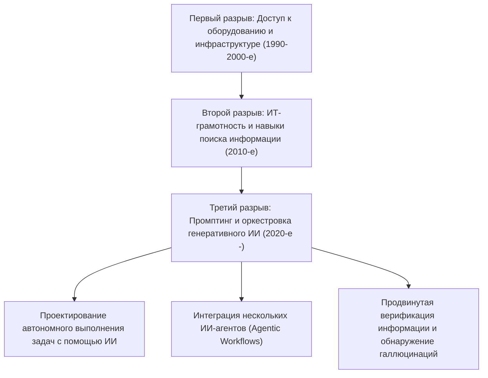
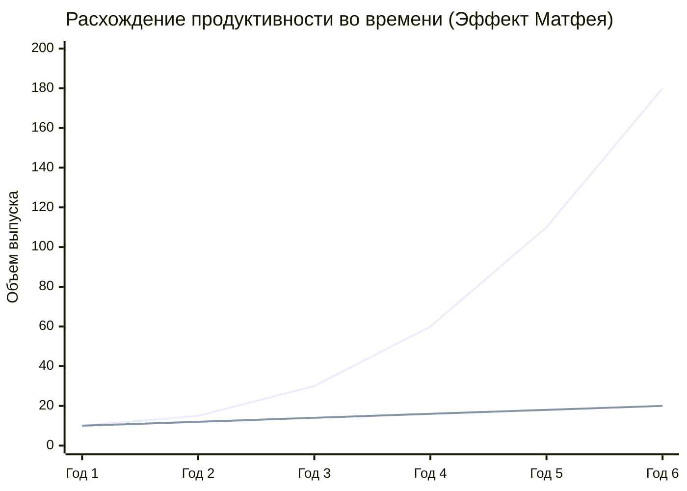
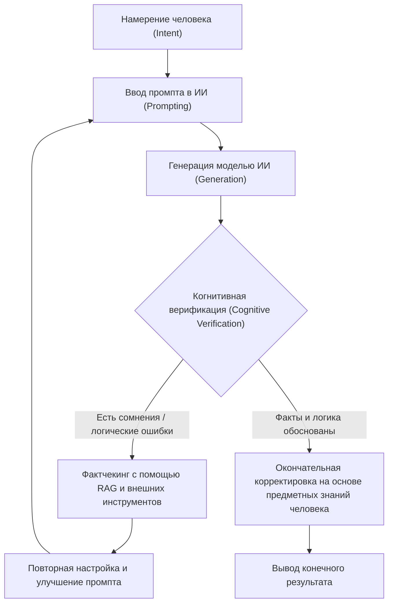

## 1. Введение: Историческая эволюция цифрового разрыва и новая парадигма

С момента распространения интернета мы часто слышали термин «цифровой разрыв» (информационное неравенство). Ранний цифровой разрыв касался в первую очередь «физического доступа». То есть это была простая концепция, где наличие компьютера или высокоскоростного доступа в интернет определяло доступ к информации и экономическим возможностям. Впоследствии, по мере того как смартфоны и широкополосный интернет стали общедоступными (коммодитизировались), фокус разрыва сместился на «ИТ-грамотность» (навыки использования информации). Это программные и когнитивные аспекты, такие как умение правильно искать информацию с помощью поисковых систем или владение программным обеспечением.

Однако стремительное развитие генеративного ИИ (Generative AI) и больших языковых моделей (LLM: Large Language Models), внезапно возникшее в 2020-х годах, фундаментально меняет эту концепцию цифрового разрыва. То, с чем мы сталкиваемся сейчас, — это не просто «разрыв в доступе к информации» или «разрыв в навыках работы с программным обеспечением». Это «разрыв в способности оркестровки (управления и интеграции) ИИ» — крайне серьезный и необратимый «третий цифровой разрыв», который либо экспоненциально увеличит личную продуктивность, либо оставит человека позади эволюции ИИ, лишив его относительной ценности.

В этой статье мы максимально подробно раскроем истинную природу этого нового цифрового разрыва, вызванного генеративным ИИ, с точки зрения трех уровней: математической модели продуктивности, архитектуры и стоимости оборудования, а также когнитивных аспектов человека.

## 2. От «доступа» к «оркестровке»: Наступление третьего цифрового разрыва

Программные инструменты прошлого были по сути «пассивными орудиями». Ограничение традиционного ПО заключалось в том, что оно возвращало детерминированный результат на явный ввод пользователя (например, ввод формулы в электронную таблицу для получения результата вычислений). Однако современный генеративный ИИ, в частности LLM на базе архитектуры Transformer (GPT-4, Claude 3.5, Llama 3 и т.д.), ведет себя как «фрагмент активного интеллекта».

Из-за этого сдвига парадигмы требуемый от человека набор навыков радикально изменился: от «умения управлять инструментами» к «способности комбинировать несколько ИИ-агентов и инструментов, проектировать и управлять автономными рабочими процессами (AI Orchestration)». Это можно назвать «грамотностью в области оркестровки ИИ».

Ниже показана эволюция цифрового разрыва от прошлого к настоящему.

Выходя за рамки простого промпт-инжиниринга (prompt engineering), сегодня мы вступили в стадию, когда мультиагентные фреймворки, такие как LangChain, AutoGen и CrewAI, используются для того, чтобы системы могли автономно решать проблемы. Между теми, кто «создает чертежи и заставляет ИИ их выполнять», и теми, кто «все еще выполняет рутинную работу своими руками», возникает беспрецедентный в истории человечества разрыв в продуктивности.

## 3. Эффект Матфея (Matthew Effect) в продуктивности: Визуализация неравенства с помощью математического подхода

«Эффект Матфея» (Matthew Effect), происходящий от слов Нового Завета «ибо всякому имеющему дастся и приумножится, а у неимеющего отнимется и то, что имеет», в социологии и экономике означает феномен, при котором первоначальное преимущество приносит кумулятивную выгоду. С внедрением генеративного ИИ этот эффект Матфея интенсивно проявляется на рынке труда и в интеллектуальном производстве.

Продуктивность людей, эффективно использующих ИИ, растет не линейно по отношению к времени, а экспоненциально. Это происходит потому, что время, сэкономленное благодаря ИИ, может быть инвестировано в создание еще более продвинутых ИИ-систем, оптимизацию промптов и самообучение. Давайте выразим это с помощью математической модели.

Продуктивность пользователя, не использующего ИИ $P_{human}(t)$, и продуктивность оркестратора ИИ $P_{AI}(t)$ в момент времени $t$ можно представить следующими моделями:

$$
P_{human}(t) = P_0 (1 + r_{human})^t
$$
Где $P_0$ — начальная продуктивность, а $r_{human}$ — естественная скорость обучения человека (скорость роста на основе кривой опыта). Как правило, $r_{human}$ очень мала, и рост имеет тенденцию быть арифметическим.

С другой стороны, продуктивность пользователя, в полной мере использующего ИИ, объединяет в себе скорость улучшения возможностей используемой модели ИИ $r_{model}$ и эффект сложных процентов $\alpha$ от автоматизации рабочих процессов ИИ.

$$
P_{AI}(t) = P_0 \cdot \exp\left( \int_0^t (r_{human} + \alpha \cdot r_{model}(\tau)) d\tau \right)
$$

Поскольку сами модели ИИ развиваются экспоненциально (увеличение количества параметров и объема вычислений на основе законов масштабирования), $r_{model}(t)$ сама по себе увеличивается со временем. В результате разница в продуктивности между ними $\Delta P(t)$ стремительно растет.

$$
\Delta P(t) = P_{AI}(t) - P_{human}(t)
$$

Этот разрыв визуально показан на графике ниже.

*(Примечание: Синяя линия обозначает продуктивность оркестратора ИИ, а нижняя линия — продуктивность пользователя, не использующего ИИ)*

В первый год разница кажется незначительной, но по мере того, как модели ИИ эволюционируют от GPT-3 к GPT-4 и далее к следующим поколениям, пользователи ИИ получают огромный прирост продуктивности просто за счет подключения новых моделей к своим существующим конвейерам автоматизации. Для пользователей без ИИ преодолеть этот разрыв со временем становится математически почти невозможным.

## 4. Аппаратный разрыв: Барьер локального вывода и ловушка облачных API

Третий цифровой разрыв порождает не только неравенство в навыках работы с программным обеспечением, но и новое аппаратное неравенство — «доступ к вычислениям (вычислительным ресурсам)» для запуска самых передовых моделей ИИ.

Существуют два основных подхода к использованию больших языковых моделей: «использование облачного API» или «локальный вывод (Inference) модели». У каждого есть свои плюсы и минусы, и они становятся новым экономическим и физическим барьером.

### Ограничения облачных API и текущие расходы
К передовым фронтирным моделям, предоставляемым OpenAI, Anthropic и Google (GPT-4o, Claude 3.5 Sonnet и т.д.), обычно получают доступ через API. Однако, если создать продвинутого автономного агента (Agentic Workflow), генерирующего десятки тысяч вызовов API в день, расходы будут стремительно расти.

Общая стоимость API $C_{cloud}$ зависит от количества входных и выходных токенов.

$$
C_{cloud} = \sum_{i=1}^{N} \left( c_{in} \cdot T_{in}^{(i)} + c_{out} \cdot T_{out}^{(i)} \right)
$$
(Где $N$ — количество запросов, $T$ — количество токенов, $c$ — цена за токен)

В случае масштабной обработки данных или непрерывной векторизации для RAG (Retrieval-Augmented Generation) эти переменные расходы могут стать фатальным бременем для индивидуальных разработчиков и малого бизнеса.

### Локальные LLM и барьер VRAM
С точки зрения избежания облачных затрат и обеспечения конфиденциальности данных растет спрос на локальный запуск моделей с открытыми весами (open-weight), таких как Meta Llama 3 и Mistral. Но здесь возникает физический разрыв в виде «барьера VRAM (видеопамяти)».

Скорость вывода LLM сильнее зависит от пропускной способности памяти (Memory Bandwidth), чем от вычислительной мощности GPU (FLOPS) (свойство Memory-bound). Если количество параметров модели равно $P$, а точность — 16 бит (2 байта), то для загрузки модели в память требуется как минимум $2P$ байт VRAM. Например, модель с 70 миллиардами (70B) параметров потребует более 140 ГБ VRAM.

$$
VRAM_{required} \approx \left( \frac{P \times bits\_per\_weight}{8} \right) + Context\_Memory
$$

Даже высокопроизводительные графические процессоры, доступные обычным потребителям (NVIDIA RTX 4090), имеют только 24 ГБ VRAM, поэтому запустить модель класса 70B в исходном виде на них невозможно. Здесь на сцену выходят технологии «квантования (Quantization)», такие как AWQ и GGUF, которые сжимают веса до 4 или 8 бит для поиска компромисса, но ухудшение производительности (ухудшение Perplexity) из-за квантования неизбежно.

Кроме того, в последние годы появились «AI PC» с NPU (нейронными процессорами), но текущие показатели TOPS (тера-операций в секунду) у NPU способны потянуть разве что легкие малые модели (SLM: Small Language Models). Для выполнения действительно сложных выводов локально требуются капиталовложения для создания систем с несколькими GPU стоимостью в миллионы иен (десятки тысяч долларов). Это и есть истинная природа «капиталоемкого цифрового разрыва» в сфере ИИ.

## 5. Когнитивный разрыв: Галлюцинации и цикл верификации

Что еще страшнее, чем неравенство в оборудовании или навыках, так это «когнитивный разрыв». ИИ генерирует очень беглые и убедительные тексты, но в то же время может правдоподобно выдавать фактологически неверную информацию — так называемые «галлюцинации».

Возникающий здесь разрыв — это разделение на тех, «кто способен критически анализировать и проверять (фактчекинг) вывод ИИ», и тех, «кто слепо верит выводу ИИ как авторитетной истине». Первые используют ИИ как мощный инструмент для мозгового штурма или создания черновиков, применяя свои собственные экспертные знания для контроля качества (QA) финального результата. Вторые же выпускают в мир ложную информацию, не только теряя доверие к себе, но и способствуя загрязнению информационного пространства в интернете спамовым контентом.

Процесс цикла когнитивной верификации (Cognitive Verification Loop), направленный на предотвращение этого, показан ниже.

Чтобы этот цикл работал, необходимо не просто знать, как использовать ИИ, но и обладать глубокими «предметными знаниями (доменными знаниями)» в области генерируемого контента, а также «критическим мышлением». По иронии судьбы, чем больше развивается ИИ, тем больше от людей требуются не базовые навыки управления, а крайне высокие когнитивные способности, такие как философское и логическое мышление и эрудиция для различения истины и лжи.

## 6. Новое классовое общество: Оркестраторы ИИ и работники ручного труда

В будущем (или в текущей реальности), когда это неравенство достигнет своего предела, рынок труда будет поляризован беспрецедентным образом.

**1. Оркестраторы ИИ (топ 1-5%)**
В своей профессиональной области они создают рабочие процессы, в которых автономно действуют несколько ИИ-агентов. Большую часть таких процессов, как исследования, кодирование, анализ данных и создание отчетов, они делегируют ИИ, специализируясь на «проектировании процессов», «обработке исключений» и «принятии окончательных решений». Их продуктивность будет в десятки и сотни раз выше, чем у традиционных работников, создавая колоссальную экономическую ценность.

**2. Традиционные работники умственного и ручного труда**
Это люди, которые пишут код своими руками, работают в Excel своими руками и пишут тексты своими руками. Их работа будет постепенно вытесняться ИИ, или же их оттеснят на позиции «мониторинга и обслуживания на периферии» систем, созданных оркестраторами ИИ, либо на «работу в физическом пространстве». Интеллектуальный труд без использования ИИ столкнется с риском полной потери конкурентоспособности на рынке.

## 7. Стратегии выживания в условиях разрыва и социальные рецепты

Как люди, компании и общество в целом должны адаптироваться к этому подавляющему разрыву?

### Стратегия для людей: Адаптация к смене парадигмы
Самое важное — отбросить недооценку того, что «ИИ — это просто чат-бот». Необходимо рассматривать ИИ как «высококвалифицированного стажера» или «команду экспертов» и постоянно развивать в себе привычку думать о том, как декомпозировать свои бизнес-процессы (Task Decomposition) и делегировать их ИИ. Кроме того, даже если вы не умеете программировать, изучение концепций API и структурирования данных (например, JSON) позволит вам создавать мощную автоматизацию, комбинируя инструменты No-Code/Low-Code (Zapier, Make и т.д.) с ИИ.

### Стратегия для компаний: Организационный дизайн, нативный для ИИ
Для компаний недостаточно просто «раздать аккаунты ChatGPT». Необходимы инвестиции в инфраструктуру, такие как реинжиниринг всех бизнес-процессов с учетом ИИ (BPR: Business Process Re-engineering), создание безопасной среды RAG и тонкая настройка (fine-tuning) локальных моделей с использованием уникальных корпоративных знаний. Также требуется внедрение новых KPI для оценки способностей сотрудников к оркестровке ИИ.

### Социальные рецепты: ИИ-инфраструктура как общественное благо
На государственном и общественном уровне необходимы системы социальной защиты и образования, чтобы третий цифровой разрыв не привел к серьезному экономическому неравенству и социальной нестабильности. Примерами могут служить государственная поддержка исследований и разработок ИИ-моделей с открытым исходным кодом (Open Source) и введение обязательного обучения «критической ИИ-грамотности» в образовательных учреждениях. Кроме того, на повестку дня должно быть вынесено надлежащее правовое регулирование и обновление антимонопольного законодательства для предотвращения «монополизации моделей ИИ и вычислительных ресурсов» со стороны технологических гигантов.

## 8. Заключение: Оседлать волну эволюции или быть поглощенным ею

«Новый цифровой разрыв», вызванный генеративным ИИ, перестраивает наше общество быстрее и масштабнее, чем любые технологические инновации в прошлом. Этот разрыв проявляется в виде разницы в аппаратных вычислительных ресурсах, инвестиционных возможностях в облачные API и, что самое главное, в «когнитивных и логических навыках оркестровки ИИ».

Как показывает эффект Матфея в продуктивности, этот разрыв со временем будет увеличиваться до такой степени, что преодолеть его станет невозможно. То, что мы должны сделать сейчас, — это не бояться эволюции ИИ и не верить в него слепо. Мы должны глубоко понять характеристики ИИ как величайшего в истории человечества усилителя интеллекта (Intelligence Amplifier) и осуществить «интеллектуальную самотрансформацию», обновляя свое мышление и рабочие процессы.

Остаться на этой стороне нового цифрового разрыва или оказаться на той? Этот выбор зависит от нашего ежедневного обучения и действий прямо сейчас.

---
*Пожалуйста, оставляйте свои комментарии к этой статье и конкретные примеры внедрения оркестровки ИИ в разделе комментариев или в социальных сетях автора.*
