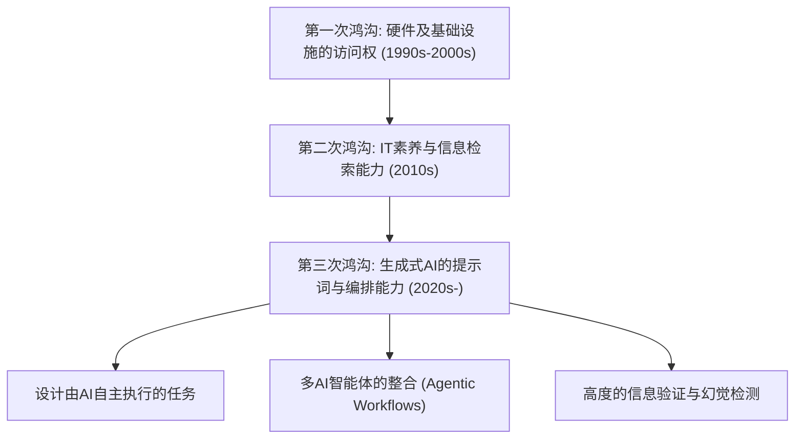
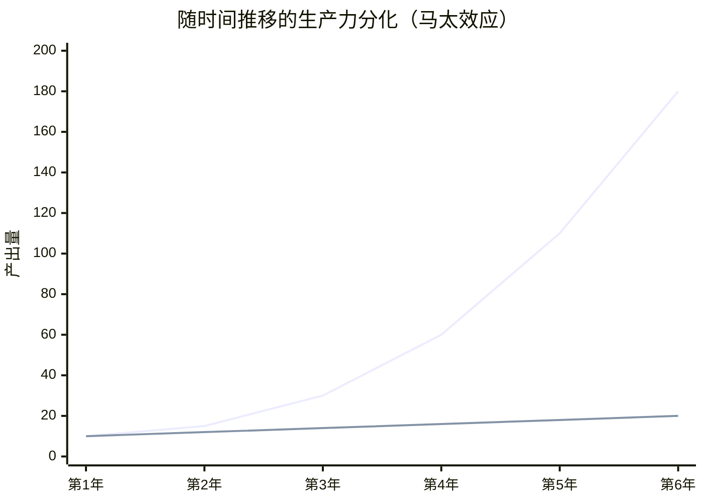
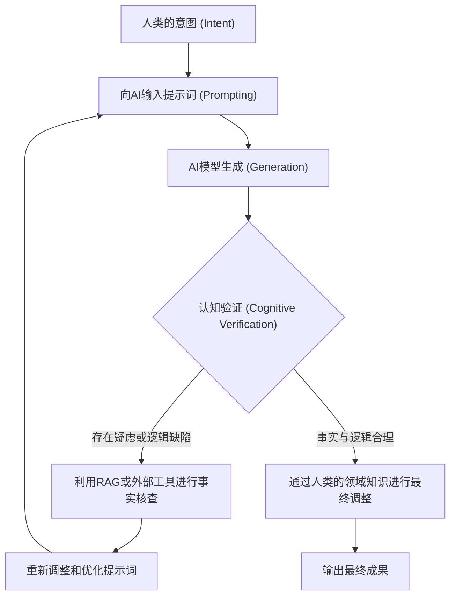

## 1. 引言：数字鸿沟的历史演变与新范式

自从互联网普及以来，我们经常听到“数字鸿沟（信息鸿沟）”这个词。早期的数字鸿沟主要涉及“物理访问权”。也就是说，是否拥有计算机或高速互联网连接，决定了获取信息和经济机会的能力，这是一个简单的格局。随后，随着智能手机和宽带连接的商品化，鸿沟的焦点转移到了“IT素养（信息应用能力）”。这涉及能否使用搜索引擎恰当地找到信息，或者能否熟练使用软件等软件和认知层面的问题。

然而，2020年代突然兴起的生成式AI（Generative AI）和大型语言模型（LLM: Large Language Models）的进化，正在从根本上颠覆这种数字鸿沟的概念。我们现在面临的不再仅仅是“信息访问鸿沟”或“软件操作技能鸿沟”。这是一种“AI编排（指挥与整合）能力的鸿沟”，是一个极其严重且不可逆转的“第三次数字鸿沟”：要么使个人的生产力呈指数级倍增，要么被AI的进化抛在后面，从而失去相对价值。

本文将从生产力的数学模型、硬件架构与成本、以及人类的认知层面这三个维度，极其详细地揭开生成式AI带来的这一新数字鸿沟的真面目。

## 2. 从“访问”到“编排”：第三次数字鸿沟的到来

过去的软件工具本质上是“被动的工具”。传统软件的局限性在于，只能对用户的显式输入返回决定论的结果（例如：在电子表格软件中输入公式以获得计算结果）。然而，当前的生成式AI，尤其是基于Transformer架构的LLM（如GPT-4、Claude 3.5、Llama 3等），表现为“主动智能的片段”。

由于这种范式转换，人类所需的技能集已经发生了巨大的变化，从“操作工具的能力”转变为“组合多个AI智能体和工具，设计并指挥自主工作流的能力（AI Orchestration）”。这可以被称为“AI编排素养”。

下面展示了从过去到现在的数字鸿沟的演变过程。

超越了提示词工程（Prompt Engineering）的范畴，目前已经进入了使用诸如LangChain、AutoGen和CrewAI等多智能体框架，让系统进行自主解决问题的阶段。在“绘制蓝图并让AI执行的群体”和“依然亲自动手处理日常重复性工作的群体”之间，正在以人类前所未见的速度产生生产力上的巨大分化。

## 3. 生产力的马太效应（Matthew Effect）：通过数学模型可视化鸿沟

“凡有的，还要加给他，叫他有余；没有的，连他所有的也要夺过来。”这一源自《新约圣经》的“马太效应（Matthew Effect）”，在社会学和经济学中是指早期的优势带来累积优势的现象。随着生成式AI的引入，这种马太效应在劳动力市场和知识生产中正强烈地显现出来。

有效利用AI的个人，其生产力相对于时间并非呈线性增长，而是指数级增长。因为通过AI节省下来的时间，可以进一步投资于构建更高级的AI系统、优化提示词以及自我学习。让我们用数学模型来表达这一点。

在某个时间点 $t$，非AI用户的生产力 $P_{human}(t)$ 和AI编排者的生产力 $P_{AI}(t)$，可以分别用以下模型表示：

$$
P_{human}(t) = P_0 (1 + r_{human})^t
$$
在这里，$P_0$ 是初始生产力，$r_{human}$ 是人类自然的学习率（基于经验曲线的增长率）。通常 $r_{human}$ 非常小，增长往往呈算术级数。

另一方面，充分利用AI的用户的生产力，则结合了所用AI模型的能力提升率 $r_{model}$，以及由AI工作流自动化带来的复利效应 $\alpha$。

$$
P_{AI}(t) = P_0 \cdot \exp\left( \int_0^t (r_{human} + \alpha \cdot r_{model}(\tau)) d\tau \right)
$$

由于AI模型本身在呈指数级进化（基于缩放定律的参数数量和计算量的增加），因此 $r_{model}(t)$ 本身也会随时间而增大。其结果是，两者的生产力差距 $\Delta P(t)$ 会迅速拉大。

$$
\Delta P(t) = P_{AI}(t) - P_{human}(t)
$$

下面用图表直观地展示了这种分化：

*(注：蓝线代表AI编排者的生产力，下方的线代表非AI用户的生产力)*

## 4. 硬件鸿沟：本地推理的壁垒与云API的陷阱

第三次数字鸿沟不仅产生了软件技能上的鸿沟，还带来了运行最前沿AI模型所需的“计算资源（Compute）访问权”这一新的硬件鸿沟。

使用大型语言模型主要有两种途径：一是“使用云API”，二是“在本地进行模型推理（Inference）”。两者各有利弊，这也成为了新的经济和物理壁垒。

### 云API的局限性与运行成本
OpenAI、Anthropic和Google等提供的前沿模型（如GPT-4o、Claude 3.5 Sonnet等），通常通过API进行访问。然而，一旦构建了高度自主的智能体（Agentic Workflow）并产生每天数万次的API调用，成本就会爆炸性增长。

API的总成本 $C_{cloud}$ 取决于输入和输出的Token数量。

$$
C_{cloud} = \sum_{i=1}^{N} \left( c_{in} \cdot T_{in}^{(i)} + c_{out} \cdot T_{out}^{(i)} \right)
$$
($N$为请求数，$T$为Token数，$c$为Token单价)

当持续进行大规模的数据处理或RAG（Retrieval-Augmented Generation，检索增强生成）向量化时，这种可变成本可能成为个人开发者和中小企业的致命负担。

### 本地LLM与VRAM的壁垒
出于规避云端成本和数据隐私的考量，在本地运行Meta的Llama 3或Mistral等开源权重模型的需求日益增长。但在这里，存在一个名为“VRAM（显存）壁垒”的物理鸿沟。

LLM的推理速度相比GPU的算力（FLOPS），更强烈地依赖于显存带宽（Memory Bandwidth）（即受内存限制的特性）。假设模型参数量为 $P$，精度为16bit（2字节），仅仅是将模型加载到内存中，最低就需要 $2P$ 字节的VRAM。例如，700亿（70B）参数的模型，需要140GB以上的VRAM。

$$
VRAM_{required} \approx \left( \frac{P \times bits\_per\_weight}{8} \right) + Context\_Memory
$$

即使是普通消费者能够买到的高端GPU（NVIDIA RTX 4090），VRAM也只有24GB，根本无法直接运行70B级别的模型。因此，出现了AWQ和GGUF等“量化技术（Quantization）”，试图将权重压缩至4bit或8bit以寻找妥协点，但这种量化不可避免地会带来性能损失（困惑度恶化）。

此外，近年来虽然出现了搭载NPU（神经网络处理单元）的“AI PC”，但目前NPU的TOPS（每秒万亿次运算）算力最多只能运行轻量级的小型模型（SLM: Small Language Models），要在本地进行真正高级的推理，必须具备构建价值数百万日元级别的多GPU环境的资本实力。这就是AI领域中“资本密集型数字鸿沟”的真面目。

## 5. 认知鸿沟：幻觉与验证循环

比硬件和技能鸿沟更可怕的，是“认知鸿沟”。AI能够生成非常流畅且具有说服力的文章，但同时也会产生看似合理实则毫无根据的“幻觉（Hallucination）”。

这里产生的鸿沟，是“能够批判性地审视AI的输出并进行验证（事实核查）的群体”与“将AI的输出视为权威真理而盲目相信的群体”之间的分化。前者将AI作为强大的头脑风暴或起草工具来利用，并运用自身的专业知识对最终输出进行质量把控（QA）。后者则会将错误信息原封不动地发布于世，不仅丧失自身信誉，也成为用垃圾内容污染互联网信息空间的原因之一。

防止这种情况发生的认知验证循环（Cognitive Verification Loop）流程如下所示：

要让这个循环运转起来，不仅需要懂得如何使用AI，更需要对该输出领域有深刻的“领域知识”和“批判性思维”。讽刺的是，AI越进化，对人类的要求就越不是基本的操作技能，而是转向了哲学及逻辑思考能力，以及辨别真伪的素养等极为高度的认知能力。

## 6. 新的阶级社会：AI编排者与常规劳动者

在这些鸿沟发展到极致的未来（或是正在进行的现实中），劳动力市场将出现前所未有的两极分化。

**1. AI编排者（前1〜5%）**
在他们自己的专业领域中，他们构建了让多个AI智能体自主运行的工作流。他们将调查、编码、数据分析、报告撰写等大部分流程委托给AI，而自己则专注于“流程设计”、“异常处理”和“最终决策”。他们的生产力是传统劳动者的数十倍甚至数百倍，能够创造巨大的经济价值。

**2. 传统知识工作者与常规劳动者**
这些人依然亲自动手编写代码，亲自动手操作Excel，亲自动手撰写文章。他们的工作将逐渐被AI所取代，或者被边缘化到AI编排者所创建的系统的“末端监控与维护”或“物理空间的劳动”中。不利用AI的知识劳动，正面临着完全丧失市场竞争力的风险。

## 7. 在鸿沟社会中生存的战略与社会处方

在如此巨大的鸿沟之中，个人、企业以及社会应该如何适应？

### 个人的战略：适应范式转换
最重要的是，要抛弃“AI只是一个聊天机器人”这种低估的想法。必须将AI视为“高级实习生”或“专家团队”，并养成经常思考如何将自己的业务流程分解并委托给AI（Task Decomposition，任务分解）的习惯。此外，即使不懂编程，只要学习API的概念和数据结构（如JSON等），就能通过无代码/低代码工具（Zapier, Make等）与AI结合，实现强大的自动化。

### 企业的战略：AI原生组织设计
对于企业而言，仅仅“分发ChatGPT账号”是远远不够的。必须在以AI为前提的基础上重新设计整个业务流程（BPR: Business Process Re-engineering），并进行基础设施投资，如构建安全的RAG环境、将企业特有知识微调到本地模型中等。此外，还需要引入评估员工AI编排能力的新KPI。

### 社会处方：作为公共产品的AI基础设施
在国家和社会层面，必须建立安全网和教育体系，以防止第三次数字鸿沟导致严重的经济差距和社会动荡。例如，对开源AI模型研发提供公共支持，以及在教育机构中将“批判性AI素养”列为义务教育内容等。此外，为了防止科技巨头“垄断AI模型和计算资源”，也应将适当的法律法规和反垄断法的更新提上议程。

## 8. 结论：乘上进化的浪潮，还是被其吞噬

生成式AI引发的“新数字鸿沟”，正以比过去任何技术革新都更迅速、更广泛的方式重塑着我们的社会。这种鸿沟体现为硬件计算资源、对云API的投资能力，最重要的是“编排AI的认知与逻辑技能”的差距。

正如生产力的马太效应所表明的那样，随着时间的推移，这种差距将扩大到难以弥合的地步。我们现在该做的，既不是恐惧AI的进化，也不是盲信它。而是要深刻理解AI这个人类历史上最大的智力放大器（Intelligence Amplifier）的特性，坚决地进行“知性的自我变革”，以升级自己的思考方式和工作流。

是站在新数字鸿沟的这一边，还是留在另一边。这个选择，即使在此时此刻，也取决于我们每天的学习和行动。

---
*关于本文的意见，或AI编排的具体导入案例，欢迎在评论区或作者的SNS留言分享。*
