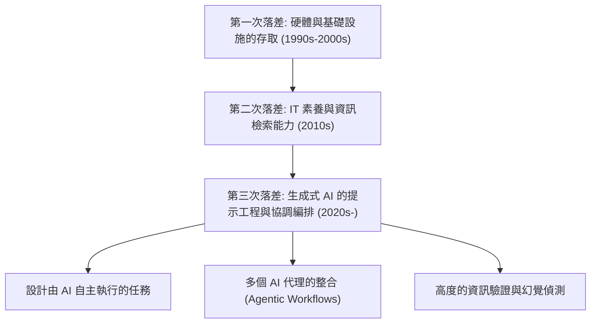
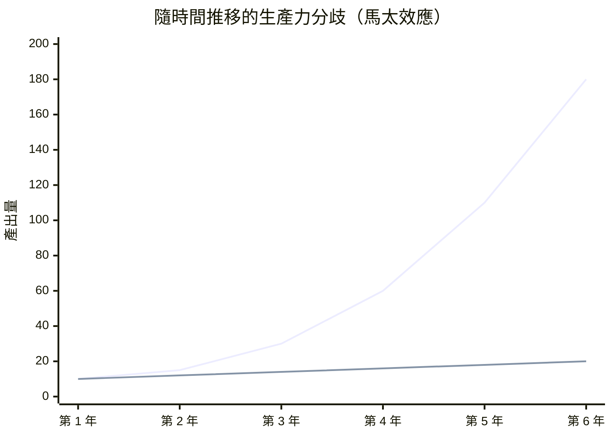
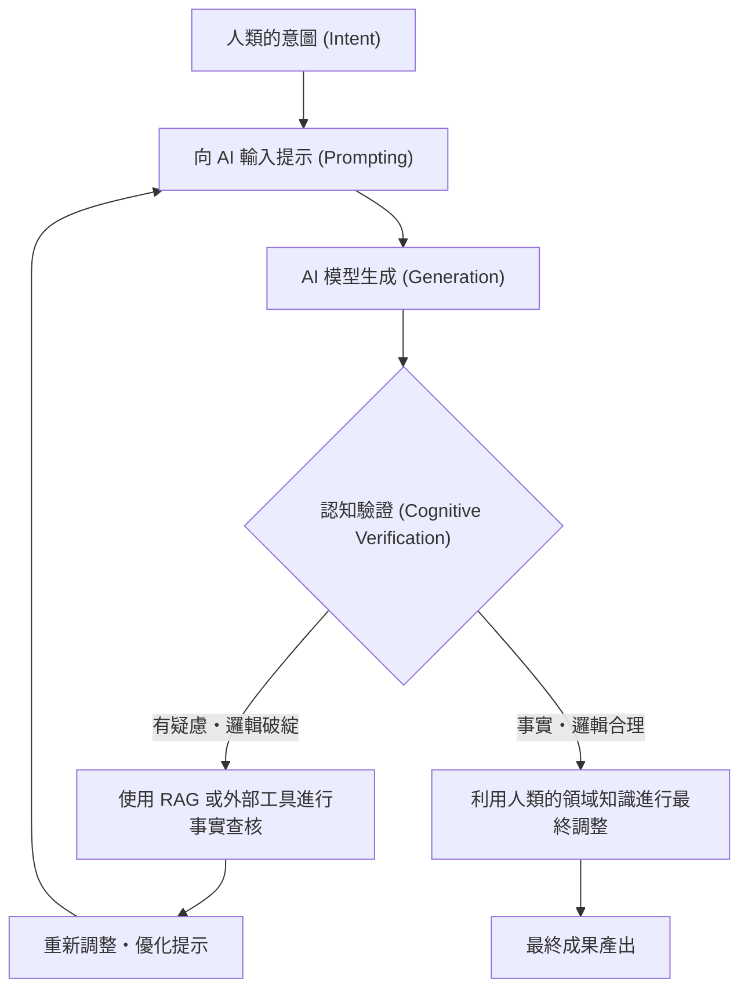

## 1. 前言：數位落差的歷史變遷與新典範

自網際網路普及以來，我們經常聽到「數位落差（資訊格差）」這個詞。早期的數位落差主要與「實體的存取權」有關。也就是說，是否擁有電腦或高速網路連線，左右了人們獲取資訊和經濟機會，這是一個簡單的結構。隨後，隨著智慧型手機和寬頻網路的普及與大眾化，數位落差的焦點轉移到了「IT 資訊素養（資訊活用能力）」。例如是否能使用搜尋引擎準確找出資訊、是否能熟練操作軟體等，這屬於軟體及認知層面。

然而，2020 年代突然崛起的生成式 AI（Generative AI）與大型語言模型（LLM: Large Language Models）的進化，正從根本上顛覆這個數位落差的概念。我們現在所面臨的，不僅僅是單純的「資訊存取落差」或「軟體操作技能落差」。而是「協調編排（指揮與整合）AI 能力的落差」，它將指數級地放大個人的生產力，又或者讓人被 AI 的進化拋在後頭而失去相對價值，這是一個極度嚴重且不可逆的「第三次數位落差」。

本文將從生產力的數學模型、硬體架構與成本，以及人類的認知層面等三個維度，極其詳細地剖析生成式 AI 所帶來的這場新數位落差的真面目。

## 2. 從「存取」到「協調編排」：第三次數位落差的到來

過去的軟體工具本質上是「被動的工具」。對於使用者的明確輸入，回傳決定性的結果，這是傳統軟體的極限（例如：在試算表軟體中輸入公式以獲得計算結果）。但是，現在的生成式 AI，特別是基於 Transformer 架構的 LLM（如 GPT-4、Claude 3.5、Llama 3 等），表現得就像是「主動智慧的片段」。

由於這種典範轉移，人類被要求的技能組合，已從「操作工具的能力」急劇轉變為「組合多個 AI 代理或工具，並設計與指揮自主工作流程的能力（AI Orchestration）」。這可以稱為「AI 協調編排素養」。

以下展示了從過去到現在數位落差的變遷。

超越了提示工程的範疇，現在已經進入了使用如 LangChain、AutoGen、CrewAI 等多代理框架，讓系統自主解決問題的階段。在這個「描繪藍圖並讓 AI 執行的群體」與「仍然靠自己雙手處理例行公事的群體」之間，正以人類前所未見的速度產生生產力的巨大分歧。

## 3. 生產力的馬太效應（Matthew Effect）：透過數學模型將落差視覺化

「凡有的，還要加給他；沒有的，連他所有的也要奪過來」，源自新約聖經的這句話被稱為「馬太效應（Matthew Effect）」，在社會學和經濟學中，指的是早期的優勢會帶來累積性利益的現象。隨著生成式 AI 的引入，這種馬太效應在勞動市場和知識生產中正強烈地展現出來。

有效利用 AI 的個人，其生產力相對於時間並非線性增長，而是呈指數級增長。這是因為，由 AI 節省下來的時間，可以進一步投資於建構更進階的 AI 系統、最佳化提示詞，以及自我學習。讓我們用數學模型來表達這一點。

在某個時間點 $t$ ，非 AI 使用者的生產力 $P_{human}(t)$ 與 AI 協調編排者的生產力 $P_{AI}(t)$ ，可以分別用以下模型表示：

$$
P_{human}(t) = P_0 (1 + r_{human})^t
$$
其中， $P_0$ 是初始生產力，$r_{human}$ 是人類自然的學習率（基於經驗曲線的成長率）。一般來說 $r_{human}$ 非常小，成長往往呈現算術級數。

另一方面，充分利用 AI 的使用者，其生產力結合了所使用 AI 模型的效能提升率 $r_{model}$ ，以及 AI 工作流程自動化帶來的複利效應 $\alpha$ 。

$$
P_{AI}(t) = P_0 \cdot \exp\left( \int_0^t (r_{human} + \alpha \cdot r_{model}(\tau)) d\tau \right)
$$

由於 AI 模型本身呈指數級進化（基於縮放定律的參數數量和計算量的增加），因此 $r_{model}(t)$ 本身也會隨著時間而增大。結果是，兩者的生產力差距 $\Delta P(t)$ 將會迅速擴大。

$$
\Delta P(t) = P_{AI}(t) - P_{human}(t)
$$

以下圖表將這種分歧視覺化。

*(註：藍線代表 AI 協調編排者的生產力，下方的線代表非 AI 使用者的生產力)*

在第一年，差距看起來微乎其微，但隨著 AI 模型從 GPT-3 進化到 GPT-4，甚至更下一代，AI 使用者只需將新模型插入現有的自動化管線中，就能享受生產力的飛躍性提升。隨著時間的推移，非 AI 使用者要彌補這個差距，在數學上將變得越來越不可能。

## 4. 硬體落差：本機推論的障礙與雲端 API 的陷阱

第三次數位落差不僅是軟體技能，還產生了為了運行最先進 AI 模型所需的「運算（計算資源）存取」這項新的硬體落差。

要使用大型語言模型，主要有兩種途徑：使用「雲端 API」或「在本機推論（Inference）模型」。兩者皆有優缺點，這也成為了新的經濟與實體障礙。

### 雲端 API 的極限與營運成本
OpenAI、Anthropic、Google 等提供的最先進前沿模型（GPT-4o、Claude 3.5 Sonnet 等），通常透過 API 來存取。然而，如果建構高度自主的代理（Agentic Workflow）並每天產生數萬次 API 呼叫，成本將會爆炸性地增加。

API 的總成本 $C_{cloud}$ 取決於輸入和輸出 Token 的數量。

$$
C_{cloud} = \sum_{i=1}^{N} \left( c_{in} \cdot T_{in}^{(i)} + c_{out} \cdot T_{out}^{(i)} \right)
$$
($N$為請求數，$T$為 Token 數，$c$為 Token 單價)

在持續進行大規模資料處理或 RAG（Retrieval-Augmented Generation）向量化時，這種變動成本對個人開發者或中小企業來說，可能成為致命的負擔。

### 本機 LLM 與 VRAM 的障礙
基於規避雲端成本與資料隱私的考量，在本機運行 Meta 的 Llama 3 或 Mistral 等開放權重模型的需求日益增加。但在此面臨了「VRAM（視訊記憶體）障礙」的實體落差。

LLM 的推論速度比起 GPU 的運算效能（FLOPS），更強烈依賴於記憶體頻寬（Memory Bandwidth）（受限於記憶體的特性）。如果將模型的參數數量設為 $P$，精確度設為 16bit（2 個位元組），那麼光是將模型載入記憶體就至少需要 $2P$ 位元組的 VRAM。例如 700 億（70B）參數的模型，就需要 140GB 以上的 VRAM。

$$
VRAM_{required} \approx \left( \frac{P \times bits\_per\_weight}{8} \right) + Context\_Memory
$$

即使是一般消費者能買到的高階 GPU（NVIDIA RTX 4090），VRAM 也僅有 24GB，根本無法直接運行 70B 等級的模型。於是，AWQ、GGUF 等「量化技術（Quantization）」應運而生，人們透過將權重壓縮至 4bit 或 8bit 來尋找妥協點，進行技術上的掙扎，但量化所帶來的效能下降（困惑度惡化）是無法避免的。

此外，近年來搭載 NPU（神經處理單元）的「AI PC」開始出現，但目前 NPU 的 TOPS（每秒兆次操作）頂多只能運行輕量級的小型模型（SLM: Small Language Models），若要真正在本機進行高度的推論，就需要擁有能建構數百萬日圓規模多 GPU 環境的資本實力。這就是 AI 領域中「資本密集型數位落差」的真面目。

## 5. 認知落差：幻覺與驗證的迴圈

比硬體或技能落差更可怕的，是「認知落差」。AI 能生成非常流暢且具說服力的文章，但同時也會引發看似煞有其事卻毫無根據的「幻覺（Hallucination）」。

這裡產生的落差在於「能夠批判性審視並驗證（事實查核）AI 輸出的群體」與「將 AI 輸出當作權威真理盲信的群體」之間的分裂。前者將 AI 作為強大的腦力激盪或草稿撰寫工具，並利用自身的專業知識對最終輸出進行品質管控（QA）。後者則將錯誤資訊直接發布於世，這不僅會失去自身的信用，還會成為用垃圾內容污染網路資訊空間的元兇。

為了防止這種情況發生，認知驗證迴圈（Cognitive Verification Loop）的流程如下所示。

為了讓這個迴圈運轉，不僅需要知道如何使用 AI，對其輸出領域的深入「領域知識」與「批判性思考」更是不可或缺。諷刺的是，AI 越進化，對人類的要求就越不是基本的操作技能，而是轉向哲學與邏輯思考能力、辨別真偽的素養等極其高度的認知能力。

## 6. 新階級社會：AI 協調編排者與體力勞動者

當這些落差發展到極限的未來（或者現在進行式的現實中），勞動市場將會以前所未有的形式呈現兩極化。

**1. AI 協調編排者（前 1〜5%）**
他們在自己的專業領域中，建構了讓多個 AI 代理自主運作的工作流程。將調查、程式設計、資料分析、報告撰寫等大部分流程委託給 AI，自己則專注於「流程設計」、「例外處理」與「最終決策」。他們的生產力是傳統勞動者的數十倍到數百倍，能創造出巨大的經濟價值。

**2. 傳統知識工作者與體力勞動者**
這些人靠自己的雙手寫程式碼、操作 Excel、撰寫文章。他們的工作將逐漸被 AI 取代，或者被迫去進行 AI 協調編排者所建立之系統的「末端監控與維護」或「實體空間的勞動」。不利用 AI 的知識勞動，正面臨完全失去市場競爭力的風險。

## 7. 在落差社會中生存的策略與社會處方箋

在這個壓倒性的落差中，個人、企業乃至社會應該如何適應呢？

### 個人的策略：適應典範轉移
最重要的是，拋棄「AI 只是個聊天機器人」的低估心態。我們必須將 AI 視為「高階實習生」或「專家團隊」，養成經常思考如何將自己的業務流程拆解並委託給 AI（Task Decomposition）的習慣。此外，即使不會寫程式，只要了解 API 的概念與資料的結構化（如 JSON），就能將無程式碼/低程式碼工具（Zapier, Make 等）與 AI 結合，實現強大的自動化。

### 企業的策略：原生 AI 組織設計
對企業而言，單純「發放 ChatGPT 帳號」是遠遠不夠的。必須以 AI 為前提重新設計整體業務流程（BPR: Business Process Re-engineering），並進行基礎設施的投資，例如建構安全的 RAG 環境、將公司特有的知識微調至本機模型等。同時，也需要導入評估員工 AI 協調編排能力的新 KPI。

### 社會的處方箋：作為公共財的 AI 基礎設施
在國家與社會層面，需要建立安全網與教育體系，以防止第三次數位落差演變成嚴重的經濟不平等與社會動盪。例如，提供對開源 AI 模型研發的公共支持，以及在教育機構中將「批判性 AI 素養」列為義務教育。此外，為了防止科技巨頭「壟斷 AI 模型與運算資源」，也應該將制定適當的法規及反壟斷法的更新納入討論。

## 8. 結論：是乘上進化之浪，還是被浪潮吞噬

生成式 AI 所引發的「新數位落差」，正以比過去任何技術革新都更迅速、更廣泛的方式重塑我們的社會。這種落差體現在硬體運算資源、對雲端 API 的投資能力，以及最重要的「協調編排 AI 的認知與邏輯技能」的差距上。

正如生產力的馬太效應所示，隨著時間的推移，這種差距將擴大到難以彌補的地步。我們現在該做的，既不是恐懼 AI 的進化，也不是盲目相信。而是深入理解 AI 這個人類史上最偉大的智力放大器（Intelligence Amplifier）的特性，並堅決進行更新自身思考與工作流程的「知性自我變革」。

要站在新數位落差的這一邊，還是被留在另一邊？這個選擇，在現在這一瞬間，正取決於我們每天的學習與行動。

---
*關於本文的意見，或是 AI 協調編排的具體導入案例，請在評論區或作者的社群媒體上留言分享。*
