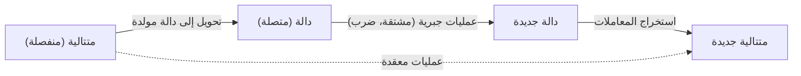

في عالم الرياضيات، توجد مفاهيم تعمل كـ "جسور سحرية"، تربط بين مجالات تبدو غير مرتبطة. أحد هذه المفاهيم هو **الدالة المولدة** (Generating Function). من خلال تحويل "متتالية" منفصلة إلى "دالة" متصلة، يمكن تقليل المشكلات التوافيقية المعقدة إلى حسابات جبرية.

تبدأ هذه المقالة بالفكرة الأساسية للدوال المولدة، وتشرح بالتفصيل قوتها المذهلة - من حساب مجموعات دفع العملات المعدنية إلى اشتقاق الحد العام لمتتالية فيبوناتشي. وعلاوة على ذلك، سنتطرق إلى تطبيقها على متسلسلات القوى الشكلية (FPS) في الخوارزميات والبرمجة التنافسية.

## 1. ما هي الدالة المولدة؟

بإعطاء متتالية $a_0, a_1, a_2, \dots$، نعتبر الدالة $A(x)$ التي يكون فيها كل حد من المتتالية عبارة عن معامل لقوة المتغير $x$.

$$
A(x) = a_0 + a_1 x + a_2 x^2 + a_3 x^3 + \dots = \sum_{n=0}^{\infty} a_n x^n
$$

تسمى هذه الدالة $A(x)$ بـ **الدالة المولدة العادية** (Ordinary Generating Function) للمتتالية $\{a_n\}$.

لماذا نقوم بمثل هذا التحويل؟ لأن **العمليات على المتتاليات يمكن استبدالها بعمليات جبرية على الدوال**. العمليات مثل إزاحة المتتالية، أو الجمع، أو الالتفاف يتم تحويلها إلى عمليات مألوفة مثل الجمع، والضرب، والاشتقاق، والتكامل للدوال.



## 2. مجموعات العملات المعدنية و[الدوال المولدة](https://kenji.blog/ar/p/generating-functions/)

لكي نفهم بشكل بديهي قوة [الدوال المولدة](https://kenji.blog/ar/p/generating-functions/)، دعونا ننظر في مسألة "دفع العملات".

**المسألة:**
أوجد عدد المجموعات الممكنة $a_n$ لدفع $n$ ين بالضبط باستخدام عملات معدنية من فئة 1 ين، و 2 ين، و 5 ين.

نقوم بحل هذه المسألة باستخدام [الدوال المولدة](https://kenji.blog/ar/p/generating-functions/).
لكل فئة عملة معدنية، ننشئ كثيرة حدود تقابل عدد العملات المستخدمة.

*   اختيار عملات 1 ين: $1 + x + x^2 + x^3 + \dots$ (0 عملة، 1 عملة، 2 عملة، ...)
*   اختيار عملات 2 ين: $1 + x^2 + x^4 + x^6 + \dots$
*   اختيار عملات 5 ين: $1 + x^5 + x^{10} + x^{15} + \dots$

نعتبر الدالة $f(x)$ التي نحصل عليها بضرب هذه المقادير معًا.

$$
f(x) = (1 + x + x^2 + \dots)(1 + x^2 + x^4 + \dots)(1 + x^5 + x^{10} + \dots)
$$

معامل $x^n$ عند نشر هذه المعادلة هو بالضبط عدد المجموعات $a_n$ لدفع $n$ ين. باستخدام صيغة مجموع المتسلسلة الهندسية اللانهائية $1 + r + r^2 + \dots = \frac{1}{1-r}$، يمكن التعبير عن $f(x)$ بشكل موجز كدالة كسرية:

$$
f(x) = \frac{1}{1-x} \cdot \frac{1}{1-x^2} \cdot \frac{1}{1-x^5}
$$

بعبارة أخرى، دون استخدام علاقات تكرارية معقدة أو حسابات حلقية، يمكنك إيجاد عدد المجموعات لأي $n$ ببساطة عن طريق إيجاد معاملات مفكوك تايلور لهذه الدالة. في مجال البرمجة، يعد هذا المفهوم أساسًا مهمًا للبرمجة الديناميكية ([DP](https://kenji.blog/ar/p/dynamic-programming-dp-introduction-knapsack-fibonacci/)).

### الالتفاف وضرب كثيرات الحدود

لماذا يتوافق ضرب الدوال مع حساب التوافيق؟ دعونا نرى ما يحدث عندما نضرب الدالتين المولدتين $A(x), B(x)$ لمتتاليتين $a_n$ و $b_n$.

$$
A(x)B(x) = (a_0 + a_1 x + a_2 x^2 + \dots)(b_0 + b_1 x + b_2 x^2 + \dots)
$$

معامل $x^n$ عند النشر هو $\sum_{k=0}^{n} a_k b_{n-k}$. هذا يسمى **الالتفاف** (Convolution). في مثال العملات، فإن إضافة المجموعات مثل "تكوين $k$ ين من عملات 1 ين و $n-k$ ين من عملات 2 ين" يتم حسابها تلقائيًا بواسطة عملية ضرب الدوال هذه.

## 3. التطبيق على متتالية فيبوناتشي

بعد ذلك، كتطبيق أكثر تقدمًا، دعونا نوجد الحد العام لمتتالية فيبوناتشي. تُعرّف متتالية فيبوناتشي $F_n$ على النحو التالي:

*   $F_0 = 0$
*   $F_1 = 1$
*   $F_n = F_{n-1} + F_{n-2} \quad (n \ge 2)$

لتكن الدالة المولدة لهذه المتتالية هي $F(x) = \sum_{n=0}^{\infty} F_n x^n$.

$$
\begin{aligned}
F(x) &= F_0 + F_1 x + \sum_{n=2}^{\infty} F_n x^n \\
&= 0 + x + \sum_{n=2}^{\infty} (F_{n-1} + F_{n-2}) x^n \\
&= x + x \sum_{n=2}^{\infty} F_{n-1} x^{n-1} + x^2 \sum_{n=2}^{\infty} F_{n-2} x^{n-2} \\
&= x + x \sum_{m=1}^{\infty} F_m x^m + x^2 \sum_{k=0}^{\infty} F_k x^k
\end{aligned}
$$

هنا، بما أن $F_0 = 0$، فإن $\sum_{m=1}^{\infty} F_m x^m = F(x)$. لذلك،

$$
F(x) = x + x F(x) + x^2 F(x)
$$

بحل هذه المعادلة لـ $F(x)$ نحصل على الدالة المولدة لمتتالية فيبوناتشي.

$$
F(x) = \frac{x}{1 - x - x^2}
$$

المثير للدهشة أن المعلومات الخاصة بمتتالية فيبوناتشي التي تستمر إلى ما لا نهاية قد تم تكثيفها في دالة كسرية بسيطة واحدة.

### تحلل الكسور الجزئية والحد العام

لاستخراج الحد العام للمتتالية من هنا، نقوم بتحليل المقام إلى عوامل وإجراء تحلل الكسور الجزئية.
باعتبار حلول المعادلة $1 - x - x^2 = 0$، لتكن $\alpha = \frac{1 + \sqrt{5}}{2}$ (النسبة الذهبية) و $\beta = \frac{1 - \sqrt{5}}{2}$. يمكن تحليل المقام إلى عوامل كالتالي $(1 - \alpha x)(1 - \beta x)$.

$$
F(x) = \frac{1}{\sqrt{5}} \left( \frac{1}{1 - \alpha x} - \frac{1}{1 - \beta x} \right)
$$

وبتطبيق عكس صيغة المتسلسلة الهندسية مرة أخرى، نقوم بنشر كل حد إلى متسلسلة قوى.

$$
\frac{1}{1 - \alpha x} = \sum_{n=0}^{\infty} \alpha^n x^n, \quad \frac{1}{1 - \beta x} = \sum_{n=0}^{\infty} \beta^n x^n
$$

التعويض بهذا ومقارنة معاملات $x^n$ يقودنا إلى صيغة بينيه (Binet's formula) الشهيرة.

$$
F_n = \frac{1}{\sqrt{5}} \left( \left( \frac{1 + \sqrt{5}}{2} \right)^n - \left( \frac{1 - \sqrt{5}}{2} \right)^n \right)
$$

```mermaid
graph TD
    S["علاقة التكرار لفيبوناتشي"] -->|"تعريف الدالة المولدة F("x")"| EQ["صياغة معادلة الدالة"]
    EQ -->|"الحل جبريًا"| GF["F("x") = x / (1 - x - x^2)"]
    GF -->|"تحلل الكسور الجزئية"| PF["(A / (1 - αx)) + (B / (1 - βx))"]
    PF -->|"مفكوك متسلسلة القوى ومقارنة المعاملات"| AN["الحد العام (صيغة بينيه)"]
```

## 4. [الدوال المولدة](https://kenji.blog/ar/p/generating-functions/) الأسية والتباديل

عند التعامل مع المشكلات التوافيقية التي تأخذ الترتيب في الاعتبار، أي "التباديل"، يأتي دور **الدالة المولدة الأسية** (Exponential Generating Function).

بالنسبة لمتتالية $a_n$، تُعرّف الدالة المولدة الأسية $E(x)$ على النحو التالي:

$$
E(x) = \sum_{n=0}^{\infty} \frac{a_n}{n!} x^n = a_0 + a_1 x + \frac{a_2}{2!} x^2 + \frac{a_3}{3!} x^3 + \dots
$$

بالقسمة على $n!$، تتخذ الحسابات التي تراعي الترتيب (مثل الاشتقاق) شكلاً مرتبًا جدًا. على سبيل المثال، الدالة المولدة الأسية للمتتالية $1, 1, 1, \dots$ حيث جميع العناصر هي $1$ هي $e^x$.

$$
e^x = 1 + x + \frac{x^2}{2!} + \frac{x^3}{3!} + \dots
$$

باستخدام هذه الخاصية، يمكن التعبير عن عدد طرق ترتيب العناصر أو عدد التباديل التي تلبي شروطًا متعددة كحاصل ضرب دوال أسية.

## 5. التطور إلى متسلسلات القوى الشكلية (FPS)

في علوم الكمبيوتر الحديثة والبرمجة التنافسية، يتم تنفيذ [الدوال المولدة](https://kenji.blog/ar/p/generating-functions/) كـ **متسلسلات قوى شكلية** (Formal Power Series, FPS).
في FPS، لا نهتم بما إذا كان التعويض بقيمة عددية معينة في $x$ يتقارب (الخصائص التحليلية)؛ ينصب التركيز ببساطة على معالجة "متتالية المعاملات" جبريًا ككثيرات حدود.

باستخدام تحويل فورييه السريع (FFT) أو التحويل النظري للأعداد (NTT)، يمكن إيجاد حاصل ضرب كثيرتي حدود من الدرجة $N$ (أي التفاف متتاليات بطول $N$) بتعقيد حسابي قدره $\mathcal{O}(N \log N)$. هذا يسمح للحسابات التي كانت ستستغرق $\mathcal{O}(N^2)$ مع البرمجة الديناميكية أن تتسارع بشكل كبير.

## 6. خاتمة

الدالة المولدة ليست مجرد "صندوق لوضع المتتالية فيه". إنها "مترجم" يحول الانتظامات والخصائص الخاصة بمتتالية إلى شكل دالي، مما يسمح بتطبيق أدوات رياضية قوية مثل التفاضل والتكامل والجبر.

*   يتم استبدال **حساب التوافيق** بضرب الدوال.
*   يتم استبدال **حل علاقة التكرار** بحل معادلة وإجراء مفكوك تايلور.

تلعب هذه الفكرة دورًا نشطًا في مجموعة واسعة من المجالات، من تصميم الخوارزميات إلى المشكلات الصعبة في الرياضيات البحتة. تأكد من إضافة هذا المنظور الجديد المتمثل في رؤية المتتاليات كـ "دوال" إلى مجموعة أدوات التفكير الخاصة بك.
