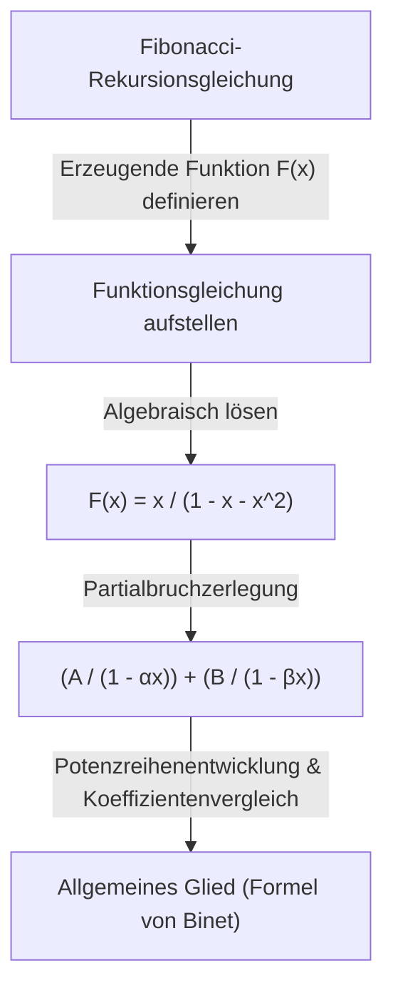

In der Welt der Mathematik gibt es Konzepte, die wie „magische Brücken“ wirken und scheinbar unzusammenhängende Felder miteinander verbinden. Eines davon ist die **erzeugende Funktion** (Generating Function). Durch die Umwandlung einer diskreten „Folge“ in eine kontinuierliche „Funktion“ können komplexe kombinatorische Probleme auf algebraische Berechnungen reduziert werden.

Dieser Artikel beginnt mit der Grundidee der erzeugenden Funktionen und erklärt ausführlich ihre erstaunliche Kraft – von der Berechnung von Münzzahlungskombinationen bis hin zur Herleitung des allgemeinen Glieds der [Fibonacci](https://kenji.blog/de/p/fibonacci/)-Folge. Darüber hinaus werden wir die Anwendung auf formale Potenzreihen (FPS) in Algorithmen und der wettbewerbsorientierten Programmierung (Competitive Programming) ansprechen.

## 1. Was ist eine erzeugende Funktion?

Gegeben sei eine Folge $a_0, a_1, a_2, \dots$. Wir betrachten eine Funktion $A(x)$, die jedes Glied der Folge als Koeffizienten einer Potenz von $x$ hat.

$$
A(x) = a_0 + a_1 x + a_2 x^2 + a_3 x^3 + \dots = \sum_{n=0}^{\infty} a_n x^n
$$

Diese Funktion $A(x)$ wird als **gewöhnliche erzeugende Funktion** (Ordinary Generating Function) der Folge $\{a_n\}$ bezeichnet.

Warum führt man eine solche Transformation durch? Weil **Operationen an Folgen durch algebraische Operationen an Funktionen ersetzt werden können**. Operationen wie Verschiebung, Addition oder Faltung von Folgen werden in bekannte Operationen wie Addition, Multiplikation, Ableitung und Integration von Funktionen umgewandelt.

## 2. Münzkombinationen und erzeugende Funktionen

Um die Kraft erzeugender Funktionen intuitiv zu verstehen, betrachten wir das Problem der „Münzzahlung“.

**Problem:**
Finden Sie die Anzahl der Kombinationen $a_n$, um genau $n$ Yen mit 1-Yen-, 2-Yen- und 5-Yen-Münzen zu bezahlen.

Wir lösen dieses Problem mithilfe erzeugender Funktionen.
Für jede Münze erstellen wir ein Polynom, das der Anzahl der verwendeten Münzen entspricht.

*   Auswahl der 1-Yen-Münzen: $1 + x + x^2 + x^3 + \dots$ (0 Münzen, 1 Münze, 2 Münzen, ...)
*   Auswahl der 2-Yen-Münzen: $1 + x^2 + x^4 + x^6 + \dots$
*   Auswahl der 5-Yen-Münzen: $1 + x^5 + x^{10} + x^{15} + \dots$

Betrachten wir die Funktion $f(x)$, die wir durch Multiplikation dieser Polynome erhalten.

$$
f(x) = (1 + x + x^2 + \dots)(1 + x^2 + x^4 + \dots)(1 + x^5 + x^{10} + \dots)
$$

Der Koeffizient von $x^n$ beim Ausmultiplizieren dieser Gleichung ist genau die Anzahl der Kombinationen $a_n$, um $n$ Yen zu bezahlen. Mit der Summenformel für unendliche geometrische Reihen $1 + r + r^2 + \dots = \frac{1}{1-r}$ kann $f(x)$ prägnant als rationale Funktion ausgedrückt werden:

$$
f(x) = \frac{1}{1-x} \cdot \frac{1}{1-x^2} \cdot \frac{1}{1-x^5}
$$

Mit anderen Worten, ohne komplexe Rekursionsgleichungen oder Schleifenberechnungen zu verwenden, können Sie die Anzahl der Kombinationen für jedes $n$ ermitteln, indem Sie einfach die Koeffizienten der Taylor-Entwicklung dieser Funktion finden. In der Programmierung ist dieses Konzept eine wichtige Grundlage für die [dynamische Programmierung](/de/p/dp-algorithm-master-guide/) ([DP](https://kenji.blog/de/p/dynamic-programming-dp-introduction-knapsack-fibonacci/)).

### Faltung und Polynommultiplikation

Warum entspricht das Produkt von Funktionen dem Zählen von Kombinationen? Sehen wir uns an, was passiert, wenn wir die erzeugenden Funktionen $A(x), B(x)$ von zwei Folgen $a_n$ und $b_n$ multiplizieren.

$$
A(x)B(x) = (a_0 + a_1 x + a_2 x^2 + \dots)(b_0 + b_1 x + b_2 x^2 + \dots)
$$

Der Koeffizient von $x^n$ beim Ausmultiplizieren lautet $\sum_{k=0}^{n} a_k b_{n-k}$. Dies wird als **Faltung** (Convolution) bezeichnet. Im Münzbeispiel wird die Addition von Kombinationen wie „bilde $k$ Yen mit 1-Yen-Münzen und $n-k$ Yen mit 2-Yen-Münzen“ automatisch durch dieses Produkt von Funktionen berechnet.

## 3. Anwendung auf die [Fibonacci](https://kenji.blog/de/p/fibonacci/)-Folge

Als nächstes wollen wir als etwas fortgeschrittenere Anwendung das allgemeine Glied der [Fibonacci](https://kenji.blog/de/p/fibonacci/)-Folge bestimmen. Die [Fibonacci](https://kenji.blog/de/p/fibonacci/)-Folge $F_n$ ist wie folgt definiert:

*   $F_0 = 0$
*   $F_1 = 1$
*   $F_n = F_{n-1} + F_{n-2} \quad (n \ge 2)$

Sei die erzeugende Funktion dieser Folge $F(x) = \sum_{n=0}^{\infty} F_n x^n$.

$$
\begin{aligned}
F(x) &= F_0 + F_1 x + \sum_{n=2}^{\infty} F_n x^n \\
&= 0 + x + \sum_{n=2}^{\infty} (F_{n-1} + F_{n-2}) x^n \\
&= x + x \sum_{n=2}^{\infty} F_{n-1} x^{n-1} + x^2 \sum_{n=2}^{\infty} F_{n-2} x^{n-2} \\
&= x + x \sum_{m=1}^{\infty} F_m x^m + x^2 \sum_{k=0}^{\infty} F_k x^k
\end{aligned}
$$

Da hier $F_0 = 0$ ist, gilt $\sum_{m=1}^{\infty} F_m x^m = F(x)$. Daher gilt:

$$
F(x) = x + x F(x) + x^2 F(x)
$$

Löst man diese Gleichung nach $F(x)$ auf, erhält man die erzeugende Funktion der [Fibonacci](https://kenji.blog/de/p/fibonacci/)-Folge.

$$
F(x) = \frac{x}{1 - x - x^2}
$$

Erstaunlicherweise wurden die Informationen der unendlich weitergehenden [Fibonacci](https://kenji.blog/de/p/fibonacci/)-Folge in einer einzigen einfachen gebrochenrationalen Funktion verdichtet.

### Partialbruchzerlegung und das allgemeine Glied

Um das allgemeine Glied der Folge hieraus zu extrahieren, faktorisieren wir den Nenner und führen eine Partialbruchzerlegung durch.
Wir betrachten die Lösungen für $1 - x - x^2 = 0$. Sei $\alpha = \frac{1 + \sqrt{5}}{2}$ (der Goldene Schnitt) und $\beta = \frac{1 - \sqrt{5}}{2}$. Der Nenner kann faktorisiert werden als $(1 - \alpha x)(1 - \beta x)$.

$$
F(x) = \frac{1}{\sqrt{5}} \left( \frac{1}{1 - \alpha x} - \frac{1}{1 - \beta x} \right)
$$

Indem wir erneut die Umkehrung der geometrischen Reihenformel anwenden, entwickeln wir jeden Term in eine Potenzreihe.

$$
\frac{1}{1 - \alpha x} = \sum_{n=0}^{\infty} \alpha^n x^n, \quad \frac{1}{1 - \beta x} = \sum_{n=0}^{\infty} \beta^n x^n
$$

Wenn wir dies einsetzen und die Koeffizienten von $x^n$ vergleichen, führt dies zur berühmten Formel von Binet.

$$
F_n = \frac{1}{\sqrt{5}} \left( \left( \frac{1 + \sqrt{5}}{2} \right)^n - \left( \frac{1 - \sqrt{5}}{2} \right)^n \right)
$$

## 4. Exponentielle erzeugende Funktionen und Permutationen

Bei der Behandlung kombinatorischer Probleme, die die Reihenfolge berücksichtigen, also "Permutationen", kommt die **exponentielle erzeugende Funktion** (Exponential Generating Function) ins Spiel.

Für eine Folge $a_n$ ist die exponentielle erzeugende Funktion $E(x)$ wie folgt definiert:

$$
E(x) = \sum_{n=0}^{\infty} \frac{a_n}{n!} x^n = a_0 + a_1 x + \frac{a_2}{2!} x^2 + \frac{a_3}{3!} x^3 + \dots
$$

Durch die Division durch $n!$ nehmen Berechnungen, die die Reihenfolge berücksichtigen (wie z.B. Ableitung), eine sehr saubere Form an. Zum Beispiel ist die exponentielle erzeugende Funktion der Folge $1, 1, 1, \dots$, bei der alle Elemente $1$ sind, gleich $e^x$.

$$
e^x = 1 + x + \frac{x^2}{2!} + \frac{x^3}{3!} + \dots
$$

Unter Verwendung dieser Eigenschaft kann die Anzahl der Möglichkeiten, Elemente anzuordnen, oder die Anzahl der Permutationen, die mehrere Bedingungen erfüllen, als Produkt von Exponentialfunktionen ausgedrückt werden.

## 5. Weiterentwicklung zu formalen Potenzreihen (FPS)

In der modernen Informatik und der wettbewerbsorientierten Programmierung werden erzeugende Funktionen als **formale Potenzreihen** (Formal Power Series, FPS) implementiert.
Bei FPS ist es uns egal, ob das Einsetzen eines bestimmten numerischen Wertes für $x$ konvergiert (analytische Eigenschaften); der Fokus liegt einfach darauf, die „Folge von Koeffizienten“ algebraisch wie Polynome zu manipulieren.

Unter Verwendung der schnellen Fourier-Transformation ([FFT](/de/p/fast-fourier-transform-algorithm/)) oder der zahlentheoretischen Transformation (NTT) kann das Produkt zweier Polynome vom Grad $N$ (d. h. die Faltung von Folgen der Länge $N$) mit einer Rechenkomplexität von $\mathcal{O}(N \log N)$ gefunden werden. Dies ermöglicht es, Berechnungen, die mit dynamischer Programmierung $\mathcal{O}(N^2)$ benötigen würden, drastisch zu beschleunigen.

## 6. Fazit

Eine erzeugende Funktion ist nicht nur eine „Box, um eine Folge hineinzulegen“. Es ist ein „Übersetzer“, der die Gesetzmäßigkeiten und Eigenschaften einer Folge in eine funktionale Form umwandelt und so die Anwendung mächtiger mathematischer Werkzeuge wie Analysis und Algebra ermöglicht.

*   **Das Zählen von Kombinationen** wird durch das Produkt von Funktionen ersetzt.
*   **Das Lösen einer Rekursionsgleichung** wird durch das Lösen einer Gleichung und die Durchführung einer Taylor-Entwicklung ersetzt.

Diese Idee spielt in einer Vielzahl von Bereichen eine aktive Rolle, vom Algorithmusdesign bis hin zu schwierigen Problemen der reinen Mathematik. Fügen Sie Ihrer gedanklichen Werkzeugkiste unbedingt diese neue Perspektive hinzu, Folgen als „Funktionen“ zu betrachten.
