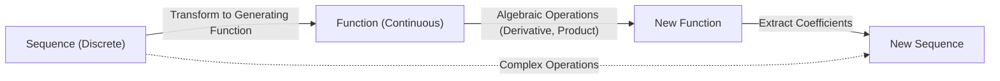
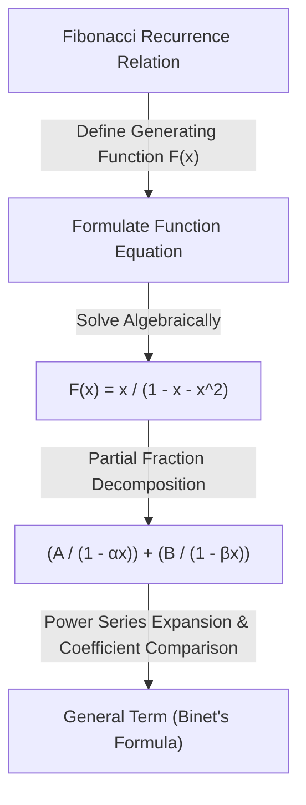

In the world of mathematics, there are concepts that act like "magic bridges," connecting seemingly unrelated fields. One of these is the **Generating Function**. By transforming a discrete "sequence" into a continuous "function," complex combinatorial problems can be reduced to algebraic calculations.

This article starts with the basic idea of generating functions, and explains in detail their amazing power—from calculating coin payment combinations to deriving the general term of the [Fibonacci](https://kenji.blog/en/p/fibonacci/) sequence. Furthermore, we will touch on applications to Formal Power Series (FPS) in algorithms and competitive programming.

## 1. What is a Generating Function?

Given a sequence $a_0, a_1, a_2, \dots$, consider a function $A(x)$ that has each term as the coefficient of a power of $x$.

$$
A(x) = a_0 + a_1 x + a_2 x^2 + a_3 x^3 + \dots = \sum_{n=0}^{\infty} a_n x^n
$$

This function $A(x)$ is called the **Ordinary Generating Function** of the sequence $\{a_n\}$.

Why perform such a transformation? Because **operations on sequences can be replaced by algebraic operations on functions**. Operations such as sequence shifts, additions, or convolutions are converted into familiar operations like addition, multiplication, differentiation, and integration of functions.

## 2. Coin Payment Combinations and [Generating Functions](https://kenji.blog/en/p/generating-functions/)

To intuitively understand the power of generating functions, let's consider the "coin payment" problem.

**Problem:**
Find the number of combinations $a_n$ to pay exactly $n$ yen using 1-yen, 2-yen, and 5-yen coins.

We solve this problem using generating functions.
For each coin, we create a polynomial corresponding to the number of coins used.

*   Choosing 1-yen coins: $1 + x + x^2 + x^3 + \dots$ (0 coins, 1 coin, 2 coins, ...)
*   Choosing 2-yen coins: $1 + x^2 + x^4 + x^6 + \dots$
*   Choosing 5-yen coins: $1 + x^5 + x^{10} + x^{15} + \dots$

Consider the function $f(x)$ obtained by multiplying these together.

$$
f(x) = (1 + x + x^2 + \dots)(1 + x^2 + x^4 + \dots)(1 + x^5 + x^{10} + \dots)
$$

The coefficient of $x^n$ when expanding this equation is exactly the number of combinations $a_n$ to pay $n$ yen. Using the infinite series sum formula $1 + r + r^2 + \dots = \frac{1}{1-r}$, $f(x)$ can be concisely expressed as a rational function:

$$
f(x) = \frac{1}{1-x} \cdot \frac{1}{1-x^2} \cdot \frac{1}{1-x^5}
$$

In other words, without using complex recurrence relations or loop calculations, you can find the number of combinations for any $n$ simply by finding the coefficients of the Taylor expansion of this function. In programming, this concept is an important foundation for [Dynamic Programming](https://kenji.blog/en/p/dynamic-programming-dp-introduction-knapsack-fibonacci/) ([DP](https://kenji.blog/en/p/dynamic-programming-dp-introduction-knapsack-fibonacci/)).

### Convolution and Polynomial Multiplication

Why does the product of functions correspond to counting combinations? Let's see what happens when we multiply the generating functions $A(x), B(x)$ of two sequences $a_n$ and $b_n$.

$$
A(x)B(x) = (a_0 + a_1 x + a_2 x^2 + \dots)(b_0 + b_1 x + b_2 x^2 + \dots)
$$

The coefficient of $x^n$ upon expansion is $\sum_{k=0}^{n} a_k b_{n-k}$. This is called **Convolution**. In the coin example, the addition of combinations like "make $k$ yen with 1-yen coins and $n-k$ yen with 2-yen coins" is automatically calculated by this product of functions.

## 3. Application to the [Fibonacci](https://kenji.blog/en/p/fibonacci/) Sequence

Next, as a more advanced application, let's find the general term of the [Fibonacci](https://kenji.blog/en/p/fibonacci/) sequence. The [Fibonacci](https://kenji.blog/en/p/fibonacci/) sequence $F_n$ is defined as follows:

*   $F_0 = 0$
*   $F_1 = 1$
*   $F_n = F_{n-1} + F_{n-2} \quad (n \ge 2)$

Let the generating function of this sequence be $F(x) = \sum_{n=0}^{\infty} F_n x^n$.

$$
\begin{aligned}
F(x) &= F_0 + F_1 x + \sum_{n=2}^{\infty} F_n x^n \\
&= 0 + x + \sum_{n=2}^{\infty} (F_{n-1} + F_{n-2}) x^n \\
&= x + x \sum_{n=2}^{\infty} F_{n-1} x^{n-1} + x^2 \sum_{n=2}^{\infty} F_{n-2} x^{n-2} \\
&= x + x \sum_{m=1}^{\infty} F_m x^m + x^2 \sum_{k=0}^{\infty} F_k x^k
\end{aligned}
$$

Here, since $F_0 = 0$, $\sum_{m=1}^{\infty} F_m x^m = F(x)$. Therefore,

$$
F(x) = x + x F(x) + x^2 F(x)
$$

Solving this equation for $F(x)$ gives the generating function for the [Fibonacci](https://kenji.blog/en/p/fibonacci/) sequence.

$$
F(x) = \frac{x}{1 - x - x^2}
$$

Amazingly, the information of the infinitely continuing [Fibonacci](https://kenji.blog/en/p/fibonacci/) sequence has been condensed into a single simple fractional function.

### Partial Fraction Decomposition and the General Term

To extract the general term of the sequence from here, we factor the denominator and perform partial fraction decomposition.
Considering the solutions to $1 - x - x^2 = 0$, let $\alpha = \frac{1 + \sqrt{5}}{2}$ (the golden ratio) and $\beta = \frac{1 - \sqrt{5}}{2}$. The denominator can be factored as $(1 - \alpha x)(1 - \beta x)$.

$$
F(x) = \frac{1}{\sqrt{5}} \left( \frac{1}{1 - \alpha x} - \frac{1}{1 - \beta x} \right)
$$

Applying the inverse of the geometric series formula again, we expand each term into a power series.

$$
\frac{1}{1 - \alpha x} = \sum_{n=0}^{\infty} \alpha^n x^n, \quad \frac{1}{1 - \beta x} = \sum_{n=0}^{\infty} \beta^n x^n
$$

Substituting this and comparing the coefficients of $x^n$ leads to the famous Binet's formula.

$$
F_n = \frac{1}{\sqrt{5}} \left( \left( \frac{1 + \sqrt{5}}{2} \right)^n - \left( \frac{1 - \sqrt{5}}{2} \right)^n \right)
$$

## 4. Exponential [Generating Functions](https://kenji.blog/en/p/generating-functions/) and Permutations

When dealing with combinatorial problems that consider order, meaning "permutations," the **Exponential Generating Function** comes into play.

For a sequence $a_n$, the exponential generating function $E(x)$ is defined as follows:

$$
E(x) = \sum_{n=0}^{\infty} \frac{a_n}{n!} x^n = a_0 + a_1 x + \frac{a_2}{2!} x^2 + \frac{a_3}{3!} x^3 + \dots
$$

By dividing by $n!$, calculations considering order (such as differentiation) take on a very neat form. For example, the exponential generating function of the sequence $1, 1, 1, \dots$ where all elements are $1$ is $e^x$.

$$
e^x = 1 + x + \frac{x^2}{2!} + \frac{x^3}{3!} + \dots
$$

Using this property, the number of ways to arrange elements or the number of permutations satisfying multiple conditions can be expressed as a product of exponential functions.

## 5. Evolution to Formal Power Series (FPS)

In modern computer science and competitive programming, generating functions are implemented as **Formal Power Series (FPS)**.
In FPS, we don't care whether substituting a specific numerical value into $x$ converges (analytical properties); the focus is simply on manipulating the "sequence of coefficients" algebraically as polynomials.

By using the Fast Fourier Transform (FFT) or Number Theoretic Transform (NTT), the product of two polynomials of degree $N$ (i.e., the convolution of sequences of length $N$) can be found with a computational complexity of $\mathcal{O}(N \log N)$. This allows calculations that would take $\mathcal{O}(N^2)$ with dynamic programming to be dramatically accelerated.

## 6. Conclusion

A generating function is not just a "box to put a sequence in." It is a "translator" that transforms the regularities and properties of a sequence into a functional form, allowing the application of powerful mathematical tools like calculus and algebra.

*   **Counting combinations** is replaced by the product of functions.
*   **Solving a recurrence relation** is replaced by solving an equation and performing Taylor expansion.

This idea plays an active role in a wide range of fields, from algorithm design to difficult problems in pure mathematics. Be sure to add this new perspective of viewing sequences as "functions" to your toolkit of thought.
