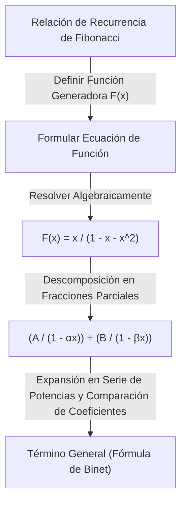

En el mundo de las matemáticas, existen conceptos que actúan como "puentes mágicos", conectando campos aparentemente no relacionados. Uno de ellos es la **función generadora** (Generating Function). Al transformar una "sucesión" discreta en una "función" continua, problemas combinatorios complejos pueden reducirse a cálculos algebraicos.

Este artículo comienza con la idea básica de las funciones generadoras y explica en detalle su asombroso poder: desde calcular combinaciones de pagos con monedas hasta derivar el término general de la sucesión de Fibonacci. Además, mencionaremos su aplicación a las series de potencias formales (FPS) en algoritmos y programación competitiva.

## 1. ¿Qué es una función generadora?

Dada una sucesión $a_0, a_1, a_2, \dots$, consideramos una función $A(x)$ que tiene cada término como coeficiente de una potencia de $x$.

$$
A(x) = a_0 + a_1 x + a_2 x^2 + a_3 x^3 + \dots = \sum_{n=0}^{\infty} a_n x^n
$$

A esta función $A(x)$ se le llama **función generadora ordinaria** (Ordinary Generating Function) de la sucesión $\{a_n\}$.

¿Por qué realizar tal transformación? Porque **las operaciones sobre sucesiones pueden ser reemplazadas por operaciones algebraicas sobre funciones**. Operaciones como el desplazamiento, la suma o la convolución de sucesiones se convierten en operaciones familiares como la suma, multiplicación, derivación e integración de funciones.

## 2. Combinaciones de pago con monedas y funciones generadoras

Para entender intuitivamente el poder de las funciones generadoras, consideremos el problema del "pago con monedas".

**Problema:**
Encuentre el número de combinaciones $a_n$ para pagar exactamente $n$ yenes utilizando monedas de 1 yen, 2 yenes y 5 yenes.

Resolvemos este problema utilizando funciones generadoras.
Para cada moneda, creamos un polinomio correspondiente al número de monedas utilizadas.

*   Elegir monedas de 1 yen: $1 + x + x^2 + x^3 + \dots$ (0 monedas, 1 moneda, 2 monedas, ...)
*   Elegir monedas de 2 yenes: $1 + x^2 + x^4 + x^6 + \dots$
*   Elegir monedas de 5 yenes: $1 + x^5 + x^{10} + x^{15} + \dots$

Consideremos la función $f(x)$ obtenida al multiplicar estas.

$$
f(x) = (1 + x + x^2 + \dots)(1 + x^2 + x^4 + \dots)(1 + x^5 + x^{10} + \dots)
$$

El coeficiente de $x^n$ al expandir esta ecuación es exactamente el número de combinaciones $a_n$ para pagar $n$ yenes. Utilizando la fórmula de la suma de la serie infinita $1 + r + r^2 + \dots = \frac{1}{1-r}$, $f(x)$ se puede expresar de forma concisa como una función racional:

$$
f(x) = \frac{1}{1-x} \cdot \frac{1}{1-x^2} \cdot \frac{1}{1-x^5}
$$

En otras palabras, sin utilizar relaciones de recurrencia complejas o cálculos de bucle, se puede encontrar el número de combinaciones para cualquier $n$ simplemente encontrando los coeficientes de la expansión de Taylor de esta función. En programación, este concepto es un fundamento importante para la Programación Dinámica (DP).

### Convolución y multiplicación de polinomios

¿Por qué el producto de funciones corresponde a contar combinaciones? Veamos qué sucede cuando multiplicamos las funciones generadoras $A(x), B(x)$ de dos sucesiones $a_n$ y $b_n$.

$$
A(x)B(x) = (a_0 + a_1 x + a_2 x^2 + \dots)(b_0 + b_1 x + b_2 x^2 + \dots)
$$

El coeficiente de $x^n$ al expandir es $\sum_{k=0}^{n} a_k b_{n-k}$. Esto se llama **convolución** (Convolution). En el ejemplo de las monedas, la adición de combinaciones como "hacer $k$ yenes con monedas de 1 yen y $n-k$ yenes con monedas de 2 yenes" se calcula automáticamente mediante este producto de funciones.

## 3. Aplicación a la sucesión de Fibonacci

A continuación, como una aplicación más avanzada, busquemos el término general de la sucesión de Fibonacci. La sucesión de Fibonacci $F_n$ se define de la siguiente manera:

*   $F_0 = 0$
*   $F_1 = 1$
*   $F_n = F_{n-1} + F_{n-2} \quad (n \ge 2)$

Sea la función generadora de esta sucesión $F(x) = \sum_{n=0}^{\infty} F_n x^n$.

$$
\begin{aligned}
F(x) &= F_0 + F_1 x + \sum_{n=2}^{\infty} F_n x^n \\
&= 0 + x + \sum_{n=2}^{\infty} (F_{n-1} + F_{n-2}) x^n \\
&= x + x \sum_{n=2}^{\infty} F_{n-1} x^{n-1} + x^2 \sum_{n=2}^{\infty} F_{n-2} x^{n-2} \\
&= x + x \sum_{m=1}^{\infty} F_m x^m + x^2 \sum_{k=0}^{\infty} F_k x^k
\end{aligned}
$$

Aquí, dado que $F_0 = 0$, $\sum_{m=1}^{\infty} F_m x^m = F(x)$. Por lo tanto,

$$
F(x) = x + x F(x) + x^2 F(x)
$$

Resolver esta ecuación para $F(x)$ da la función generadora de la sucesión de Fibonacci.

$$
F(x) = \frac{x}{1 - x - x^2}
$$

Sorprendentemente, la información de la sucesión de Fibonacci que continúa infinitamente se ha condensado en una sola y simple función fraccional.

### Descomposición en fracciones parciales y término general

Para extraer el término general de la sucesión de aquí, factorizamos el denominador y realizamos la descomposición en fracciones parciales.
Considerando las soluciones para $1 - x - x^2 = 0$, sea $\alpha = \frac{1 + \sqrt{5}}{2}$ (la proporción áurea) y $\beta = \frac{1 - \sqrt{5}}{2}$. El denominador se puede factorizar como $(1 - \alpha x)(1 - \beta x)$.

$$
F(x) = \frac{1}{\sqrt{5}} \left( \frac{1}{1 - \alpha x} - \frac{1}{1 - \beta x} \right)
$$

Aplicando el inverso de la fórmula de la serie geométrica nuevamente, expandimos cada término en una serie de potencias.

$$
\frac{1}{1 - \alpha x} = \sum_{n=0}^{\infty} \alpha^n x^n, \quad \frac{1}{1 - \beta x} = \sum_{n=0}^{\infty} \beta^n x^n
$$

Sustituyendo esto y comparando los coeficientes de $x^n$ nos lleva a la famosa fórmula de Binet.

$$
F_n = \frac{1}{\sqrt{5}} \left( \left( \frac{1 + \sqrt{5}}{2} \right)^n - \left( \frac{1 - \sqrt{5}}{2} \right)^n \right)
$$

## 4. [Funciones generadoras](https://kenji.blog/es/p/generating-functions/) exponenciales y permutaciones

Al tratar con problemas combinatorios que consideran el orden, es decir, "permutaciones", entra en juego la **función generadora exponencial** (Exponential Generating Function).

Para una sucesión $a_n$, la función generadora exponencial $E(x)$ se define de la siguiente manera:

$$
E(x) = \sum_{n=0}^{\infty} \frac{a_n}{n!} x^n = a_0 + a_1 x + \frac{a_2}{2!} x^2 + \frac{a_3}{3!} x^3 + \dots
$$

Al dividir por $n!$, los cálculos que consideran el orden (como la derivación) adoptan una forma muy ordenada. Por ejemplo, la función generadora exponencial de la sucesión $1, 1, 1, \dots$ donde todos los elementos son $1$ es $e^x$.

$$
e^x = 1 + x + \frac{x^2}{2!} + \frac{x^3}{3!} + \dots
$$

Utilizando esta propiedad, el número de formas de organizar elementos o el número de permutaciones que satisfacen múltiples condiciones se puede expresar como un producto de funciones exponenciales.

## 5. Evolución a las series de potencias formales (FPS)

En la informática moderna y la programación competitiva, las funciones generadoras se implementan como **series de potencias formales** (Formal Power Series, FPS).
En FPS, no nos importa si sustituir un valor numérico específico en $x$ converge (propiedades analíticas); el enfoque se centra simplemente en manipular la "sucesión de coeficientes" algebraicamente como polinomios.

Al usar la Transformada Rápida de Fourier (FFT) o la Transformada Teórica de Números (NTT), el producto de dos polinomios de grado $N$ (es decir, la convolución de sucesiones de longitud $N$) se puede encontrar con una complejidad computacional de $\mathcal{O}(N \log N)$. Esto permite que los cálculos que tomarían $\mathcal{O}(N^2)$ con programación dinámica se aceleren drásticamente.

## 6. Conclusión

Una función generadora no es sólo una "caja para poner una sucesión". Es un "traductor" que transforma las regularidades y propiedades de una sucesión en una forma funcional, lo que permite la aplicación de poderosas herramientas matemáticas como el cálculo y el álgebra.

*   **El conteo de combinaciones** es reemplazado por el producto de funciones.
*   **Resolver una relación de recurrencia** es reemplazado por resolver una ecuación y realizar la expansión de Taylor.

Esta idea juega un papel activo en una amplia gama de campos, desde el diseño de algoritmos hasta problemas difíciles de matemáticas puras. Asegúrese de añadir a su conjunto de herramientas de pensamiento esta nueva perspectiva de ver las sucesiones como "funciones".
