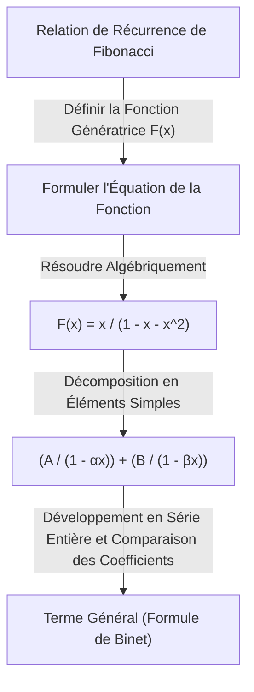

Dans le monde des mathématiques, il existe des concepts qui agissent comme des « ponts magiques », reliant des domaines apparemment sans rapport. L'un d'eux est la **fonction génératrice** (Generating Function). En transformant une « suite » discrète en une « fonction » continue, des problèmes combinatoires complexes peuvent être réduits à des calculs algébriques.

Cet article part de l'idée de base des fonctions génératrices et explique en détail leur incroyable pouvoir : du calcul des combinaisons de paiements avec des pièces à la dérivation du terme général de la suite de Fibonacci. De plus, nous aborderons leur application aux séries entières formelles (FPS) dans les algorithmes et la programmation compétitive.

## 1. Qu'est-ce qu'une fonction génératrice ?

Étant donné une suite $a_0, a_1, a_2, \dots$, considérons une fonction $A(x)$ dont chaque terme a pour coefficient la valeur correspondante de la suite associée à une puissance de $x$.

$$
A(x) = a_0 + a_1 x + a_2 x^2 + a_3 x^3 + \dots = \sum_{n=0}^{\infty} a_n x^n
$$

Cette fonction $A(x)$ est appelée la **fonction génératrice ordinaire** (Ordinary Generating Function) de la suite $\{a_n\}$.

Pourquoi effectuer une telle transformation ? Parce que **les opérations sur les suites peuvent être remplacées par des opérations algébriques sur les fonctions**. Des opérations telles que le décalage, l'addition ou la convolution de suites se transforment en opérations familières comme l'addition, la multiplication, la dérivation et l'intégration de fonctions.

## 2. Combinaisons de pièces et fonctions génératrices

Pour comprendre intuitivement le pouvoir des fonctions génératrices, considérons le problème du « paiement avec des pièces ».

**Problème :**
Trouver le nombre de combinaisons $a_n$ pour payer exactement $n$ yens en utilisant des pièces de 1 yen, 2 yens et 5 yens.

Nous résolvons ce problème en utilisant des fonctions génératrices.
Pour chaque pièce, nous créons un polynôme correspondant au nombre de pièces utilisées.

*   Choisir des pièces de 1 yen : $1 + x + x^2 + x^3 + \dots$ (0 pièce, 1 pièce, 2 pièces, ...)
*   Choisir des pièces de 2 yens : $1 + x^2 + x^4 + x^6 + \dots$
*   Choisir des pièces de 5 yens : $1 + x^5 + x^{10} + x^{15} + \dots$

Considérons la fonction $f(x)$ obtenue en les multipliant.

$$
f(x) = (1 + x + x^2 + \dots)(1 + x^2 + x^4 + \dots)(1 + x^5 + x^{10} + \dots)
$$

Le coefficient de $x^n$ lors du développement de cette équation est exactement le nombre de combinaisons $a_n$ pour payer $n$ yens. En utilisant la formule de la somme de la série infinie $1 + r + r^2 + \dots = \frac{1}{1-r}$, $f(x)$ peut être exprimée de manière concise sous forme de fonction rationnelle :

$$
f(x) = \frac{1}{1-x} \cdot \frac{1}{1-x^2} \cdot \frac{1}{1-x^5}
$$

En d'autres termes, sans utiliser de relations de récurrence complexes ou de calculs en boucle, vous pouvez trouver le nombre de combinaisons pour tout $n$ simplement en trouvant les coefficients du développement de Taylor de cette fonction. En programmation, ce concept est une base importante de la programmation dynamique (DP).

### Convolution et multiplication de polynômes

Pourquoi le produit de fonctions correspond-il au comptage des combinaisons ? Voyons ce qui se passe lorsque nous multiplions les fonctions génératrices $A(x), B(x)$ de deux suites $a_n$ et $b_n$.

$$
A(x)B(x) = (a_0 + a_1 x + a_2 x^2 + \dots)(b_0 + b_1 x + b_2 x^2 + \dots)
$$

Le coefficient de $x^n$ lors du développement est $\sum_{k=0}^{n} a_k b_{n-k}$. C'est ce qu'on appelle la **convolution** (Convolution). Dans l'exemple des pièces, l'addition de combinaisons comme « faire $k$ yens avec des pièces de 1 yen et $n-k$ yens avec des pièces de 2 yens » est calculée automatiquement par ce produit de fonctions.

## 3. Application à la suite de Fibonacci

Ensuite, comme application plus avancée, trouvons le terme général de la suite de Fibonacci. La suite de Fibonacci $F_n$ est définie comme suit :

*   $F_0 = 0$
*   $F_1 = 1$
*   $F_n = F_{n-1} + F_{n-2} \quad (n \ge 2)$

Soit la fonction génératrice de cette suite $F(x) = \sum_{n=0}^{\infty} F_n x^n$.

$$
\begin{aligned}
F(x) &= F_0 + F_1 x + \sum_{n=2}^{\infty} F_n x^n \\
&= 0 + x + \sum_{n=2}^{\infty} (F_{n-1} + F_{n-2}) x^n \\
&= x + x \sum_{n=2}^{\infty} F_{n-1} x^{n-1} + x^2 \sum_{n=2}^{\infty} F_{n-2} x^{n-2} \\
&= x + x \sum_{m=1}^{\infty} F_m x^m + x^2 \sum_{k=0}^{\infty} F_k x^k
\end{aligned}
$$

Ici, comme $F_0 = 0$, $\sum_{m=1}^{\infty} F_m x^m = F(x)$. Par conséquent,

$$
F(x) = x + x F(x) + x^2 F(x)
$$

Résoudre cette équation pour $F(x)$ donne la fonction génératrice de la suite de Fibonacci.

$$
F(x) = \frac{x}{1 - x - x^2}
$$

Étonnamment, les informations de la suite de Fibonacci qui se poursuit à l'infini ont été condensées en une seule fonction fractionnaire simple.

### Décomposition en éléments simples et terme général

Pour extraire le terme général de la suite à partir d'ici, nous factorisons le dénominateur et effectuons une décomposition en éléments simples.
En considérant les solutions de $1 - x - x^2 = 0$, soit $\alpha = \frac{1 + \sqrt{5}}{2}$ (le nombre d'or) et $\beta = \frac{1 - \sqrt{5}}{2}$. Le dénominateur peut être factorisé comme $(1 - \alpha x)(1 - \beta x)$.

$$
F(x) = \frac{1}{\sqrt{5}} \left( \frac{1}{1 - \alpha x} - \frac{1}{1 - \beta x} \right)
$$

En appliquant à nouveau l'inverse de la formule de la série géométrique, nous développons chaque terme en une série entière.

$$
\frac{1}{1 - \alpha x} = \sum_{n=0}^{\infty} \alpha^n x^n, \quad \frac{1}{1 - \beta x} = \sum_{n=0}^{\infty} \beta^n x^n
$$

En substituant cela et en comparant les coefficients de $x^n$, on obtient la célèbre formule de Binet.

$$
F_n = \frac{1}{\sqrt{5}} \left( \left( \frac{1 + \sqrt{5}}{2} \right)^n - \left( \frac{1 - \sqrt{5}}{2} \right)^n \right)
$$

## 4. Fonctions génératrices exponentielles et permutations

Lorsqu'on traite des problèmes combinatoires qui tiennent compte de l'ordre, c'est-à-dire des « permutations », la **fonction génératrice exponentielle** (Exponential Generating Function) entre en jeu.

Pour une suite $a_n$, la fonction génératrice exponentielle $E(x)$ est définie comme suit :

$$
E(x) = \sum_{n=0}^{\infty} \frac{a_n}{n!} x^n = a_0 + a_1 x + \frac{a_2}{2!} x^2 + \frac{a_3}{3!} x^3 + \dots
$$

En divisant par $n!$, les calculs tenant compte de l'ordre (comme la dérivation) prennent une forme très soignée. Par exemple, la fonction génératrice exponentielle de la suite $1, 1, 1, \dots$ où tous les éléments sont $1$ est $e^x$.

$$
e^x = 1 + x + \frac{x^2}{2!} + \frac{x^3}{3!} + \dots
$$

En utilisant cette propriété, le nombre de façons de disposer des éléments ou le nombre de permutations satisfaisant à de multiples conditions peut être exprimé comme un produit de fonctions exponentielles.

## 5. Évolution vers les séries entières formelles (FPS)

Dans l'informatique moderne et la programmation compétitive, les fonctions génératrices sont implémentées sous forme de **séries entières formelles** (Formal Power Series, FPS).
En FPS, on ne se soucie pas de savoir si la substitution d'une valeur numérique spécifique dans $x$ converge (propriétés analytiques) ; l'accent est simplement mis sur la manipulation de la « suite de coefficients » de manière algébrique comme des polynômes.

En utilisant la transformée de Fourier rapide (FFT) ou la transformée de nombres théoriques (NTT), le produit de deux polynômes de degré $N$ (c'est-à-dire la convolution de suites de longueur $N$) peut être trouvé avec une complexité temporelle de $\mathcal{O}(N \log N)$. Cela permet d'accélérer considérablement les calculs qui prendraient $\mathcal{O}(N^2)$ avec la programmation dynamique.

## 6. Conclusion

Une fonction génératrice n'est pas seulement une « boîte pour mettre une suite ». C'est un « traducteur » qui transforme les régularités et les propriétés d'une suite en une forme fonctionnelle, permettant l'application de puissants outils mathématiques comme le calcul et l'algèbre.

*   **Le comptage des combinaisons** est remplacé par le produit des fonctions.
*   **La résolution d'une relation de récurrence** est remplacée par la résolution d'une équation et l'exécution d'un développement de Taylor.

Cette idée joue un rôle actif dans un large éventail de domaines, de la conception d'algorithmes aux problèmes difficiles en mathématiques pures. Assurez-vous d'ajouter cette nouvelle perspective de considérer les suites comme des « fonctions » à votre boîte à outils de réflexion.
