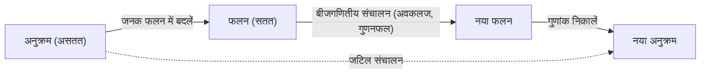

गणित की दुनिया में, कुछ ऐसी अवधारणाएं हैं जो "जादुई पुलों" के रूप में कार्य करती हैं, जो प्रतीत होने वाले असंबंधित क्षेत्रों को जोड़ती हैं। इनमें से एक **[जनक फलन](https://kenji.blog/hi/p/generating-functions/)** (Generating Function) है। एक असतत "अनुक्रम" को एक सतत "फलन" में बदलकर, जटिल संयोजन समस्याओं को बीजगणितीय गणनाओं तक कम किया जा सकता है।

यह लेख [जनक फलन](https://kenji.blog/hi/p/generating-functions/)ों के मूल विचार से शुरू होता है, और विस्तार से उनकी अद्भुत शक्ति की व्याख्या करता है - सिक्के के भुगतान के संयोजनों की गणना से लेकर फिबोनाची अनुक्रम के सामान्य पद को प्राप्त करने तक। इसके अलावा, हम एल्गोरिदम और प्रतिस्पर्धी प्रोग्रामिंग में फॉर्मल पावर सीरीज (FPS) के अनुप्रयोग का भी उल्लेख करेंगे।

## 1. [जनक फलन](https://kenji.blog/hi/p/generating-functions/) क्या है?

दिए गए एक अनुक्रम $a_0, a_1, a_2, \dots$ के लिए, एक फलन $A(x)$ पर विचार करें जिसका प्रत्येक पद $x$ की घात के गुणांक के रूप में है।

$$
A(x) = a_0 + a_1 x + a_2 x^2 + a_3 x^3 + \dots = \sum_{n=0}^{\infty} a_n x^n
$$

इस फलन $A(x)$ को अनुक्रम $\{a_n\}$ का **सामान्य [जनक फलन](https://kenji.blog/hi/p/generating-functions/)** (Ordinary Generating Function) कहा जाता है।

ऐसा परिवर्तन क्यों करें? क्योंकि **अनुक्रमों पर होने वाले संचालन (ऑपरेशन) को फलनों पर बीजगणितीय संचालन द्वारा प्रतिस्थापित किया जा सकता है**। अनुक्रम में स्थानांतरण (शिफ्ट), जोड़, या कनवोल्यूशन जैसे संचालन को कार्यों के जोड़, गुणा, अवकलन और समाकलन जैसे परिचित ऑपरेशनों में बदल दिया जाता है।



## 2. सिक्का भुगतान संयोजन और [जनक फलन](https://kenji.blog/hi/p/generating-functions/)

[जनक फलन](https://kenji.blog/hi/p/generating-functions/)ों की शक्ति को सहजता से समझने के लिए, आइए "सिक्का भुगतान" समस्या पर विचार करें।

**समस्या:**
1 येन, 2 येन और 5 येन के सिक्कों का उपयोग करके ठीक $n$ येन का भुगतान करने के लिए संयोजनों की संख्या $a_n$ ज्ञात करें।

हम इस समस्या को [जनक फलन](https://kenji.blog/hi/p/generating-functions/)ों का उपयोग करके हल करते हैं।
प्रत्येक सिक्के के लिए, हम उपयोग किए गए सिक्कों की संख्या के अनुरूप एक बहुपद बनाते हैं।

*   1 येन के सिक्के चुनना: $1 + x + x^2 + x^3 + \dots$ (0 सिक्के, 1 सिक्का, 2 सिक्के, ...)
*   2 येन के सिक्के चुनना: $1 + x^2 + x^4 + x^6 + \dots$
*   5 येन के सिक्के चुनना: $1 + x^5 + x^{10} + x^{15} + \dots$

इन बहुपदों को गुणा करके प्राप्त फलन $f(x)$ पर विचार करें।

$$
f(x) = (1 + x + x^2 + \dots)(1 + x^2 + x^4 + \dots)(1 + x^5 + x^{10} + \dots)
$$

इस समीकरण का विस्तार करने पर $x^n$ का गुणांक ठीक $n$ येन का भुगतान करने के लिए संयोजनों की संख्या $a_n$ है। अनंत गुणोत्तर श्रेणी के योग सूत्र $1 + r + r^2 + \dots = \frac{1}{1-r}$ का उपयोग करके, $f(x)$ को एक परिमेय फलन के रूप में संक्षेप में व्यक्त किया जा सकता है:

$$
f(x) = \frac{1}{1-x} \cdot \frac{1}{1-x^2} \cdot \frac{1}{1-x^5}
$$

दूसरे शब्दों में, जटिल पुनरावर्ती संबंधों (recurrence relations) या लूप गणनाओं का उपयोग किए बिना, आप इस फलन के टेलर विस्तार के गुणांकों को ज्ञात करके किसी भी $n$ के लिए संयोजनों की संख्या पा सकते हैं। प्रोग्रामिंग के क्षेत्र में, यह अवधारणा डायनेमिक प्रोग्रामिंग ([DP](https://kenji.blog/hi/p/dynamic-programming-dp-introduction-knapsack-fibonacci/)) का एक महत्वपूर्ण आधार है।

### कनवोल्यूशन और बहुपद गुणन

फलनों का गुणनफल संयोजनों की गिनती के अनुरूप क्यों है? आइए देखें कि क्या होता है जब हम दो अनुक्रमों $a_n$ और $b_n$ के [जनक फलन](https://kenji.blog/hi/p/generating-functions/)ों $A(x), B(x)$ को गुणा करते हैं।

$$
A(x)B(x) = (a_0 + a_1 x + a_2 x^2 + \dots)(b_0 + b_1 x + b_2 x^2 + \dots)
$$

विस्तार करने पर $x^n$ का गुणांक $\sum_{k=0}^{n} a_k b_{n-k}$ होता है। इसे **कनवोल्यूशन** (Convolution) कहा जाता है। सिक्कों के उदाहरण में, "1 येन के सिक्कों से $k$ येन बनाएं और 2 येन के सिक्कों से $n-k$ येन बनाएं" जैसे संयोजनों का जोड़ स्वचालित रूप से फलनों के इस गुणनफल द्वारा गणना की जाती है।

## 3. फिबोनाची अनुक्रम में अनुप्रयोग

आगे, एक अधिक उन्नत अनुप्रयोग के रूप में, आइए फिबोनाची अनुक्रम का सामान्य पद खोजें। फिबोनाची अनुक्रम $F_n$ को इस प्रकार परिभाषित किया गया है:

*   $F_0 = 0$
*   $F_1 = 1$
*   $F_n = F_{n-1} + F_{n-2} \quad (n \ge 2)$

मान लीजिए कि इस अनुक्रम का [जनक फलन](https://kenji.blog/hi/p/generating-functions/) $F(x) = \sum_{n=0}^{\infty} F_n x^n$ है।

$$
\begin{aligned}
F(x) &= F_0 + F_1 x + \sum_{n=2}^{\infty} F_n x^n \\
&= 0 + x + \sum_{n=2}^{\infty} (F_{n-1} + F_{n-2}) x^n \\
&= x + x \sum_{n=2}^{\infty} F_{n-1} x^{n-1} + x^2 \sum_{n=2}^{\infty} F_{n-2} x^{n-2} \\
&= x + x \sum_{m=1}^{\infty} F_m x^m + x^2 \sum_{k=0}^{\infty} F_k x^k
\end{aligned}
$$

यहाँ, चूँकि $F_0 = 0$ है, इसलिए $\sum_{m=1}^{\infty} F_m x^m = F(x)$ होगा। इसलिए,

$$
F(x) = x + x F(x) + x^2 F(x)
$$

इस समीकरण को $F(x)$ के लिए हल करने पर फिबोनाची अनुक्रम के लिए [जनक फलन](https://kenji.blog/hi/p/generating-functions/) प्राप्त होता है।

$$
F(x) = \frac{x}{1 - x - x^2}
$$

आश्चर्यजनक रूप से, असीम रूप से जारी फिबोनाची अनुक्रम की जानकारी को एक एकल सरल भिन्नात्मक फलन (fractional function) में संघनित कर दिया गया है।

### आंशिक भिन्न अपघटन (Partial Fraction Decomposition) और सामान्य पद

यहाँ से अनुक्रम के सामान्य पद को निकालने के लिए, हम हर (denominator) का गुणनखंड करते हैं और आंशिक भिन्न अपघटन (partial fraction decomposition) करते हैं।
$1 - x - x^2 = 0$ के समाधानों पर विचार करते हुए, मान लें कि $\alpha = \frac{1 + \sqrt{5}}{2}$ (स्वर्णिम अनुपात) और $\beta = \frac{1 - \sqrt{5}}{2}$। हर को $(1 - \alpha x)(1 - \beta x)$ के रूप में गुणनखंडित किया जा सकता है।

$$
F(x) = \frac{1}{\sqrt{5}} \left( \frac{1}{1 - \alpha x} - \frac{1}{1 - \beta x} \right)
$$

गुणोत्तर श्रेणी के सूत्र के व्युत्क्रम को फिर से लागू करते हुए, हम प्रत्येक पद को पावर सीरीज में विस्तारित करते हैं।

$$
\frac{1}{1 - \alpha x} = \sum_{n=0}^{\infty} \alpha^n x^n, \quad \frac{1}{1 - \beta x} = \sum_{n=0}^{\infty} \beta^n x^n
$$

इसे प्रतिस्थापित करने और $x^n$ के गुणांकों की तुलना करने पर प्रसिद्ध बिनेट का सूत्र (Binet's formula) प्राप्त होता है।

$$
F_n = \frac{1}{\sqrt{5}} \left( \left( \frac{1 + \sqrt{5}}{2} \right)^n - \left( \frac{1 - \sqrt{5}}{2} \right)^n \right)
$$

```mermaid
graph TD
    S["फिबोनाची पुनरावर्ती संबंध"] -->|"जनक फलन F("x") को परिभाषित करें"| EQ["फलन समीकरण तैयार करें"]
    EQ -->|"बीजगणितीय रूप से हल करें"| GF["F("x") = x / (1 - x - x^2)"]
    GF -->|"आंशिक भिन्न अपघटन"| PF["(A / (1 - αx)) + (B / (1 - βx))"]
    PF -->|"पावर सीरीज विस्तार और गुणांकों की तुलना"| AN["सामान्य पद (बिनेट का सूत्र)"]
```

## 4. घातांकी [जनक फलन](https://kenji.blog/hi/p/generating-functions/) और क्रमचय

जब क्रमचय (permutations) जैसे संयोजनीय समस्याओं से निपटा जाता है जो क्रम (order) पर विचार करते हैं, तो **घातांकी [जनक फलन](https://kenji.blog/hi/p/generating-functions/)** (Exponential Generating Function) खेल में आता है।

एक अनुक्रम $a_n$ के लिए, घातांकी [जनक फलन](https://kenji.blog/hi/p/generating-functions/) $E(x)$ इस प्रकार परिभाषित किया गया है:

$$
E(x) = \sum_{n=0}^{\infty} \frac{a_n}{n!} x^n = a_0 + a_1 x + \frac{a_2}{2!} x^2 + \frac{a_3}{3!} x^3 + \dots
$$

$n!$ से विभाजित करने पर, क्रम पर विचार करने वाली गणनाएँ (जैसे अवकलन) बहुत ही साफ रूप ले लेती हैं। उदाहरण के लिए, अनुक्रम $1, 1, 1, \dots$ जहाँ सभी तत्व $1$ हैं, का घातांकी [जनक फलन](https://kenji.blog/hi/p/generating-functions/) $e^x$ है।

$$
e^x = 1 + x + \frac{x^2}{2!} + \frac{x^3}{3!} + \dots
$$

इस गुण का उपयोग करते हुए, तत्वों को व्यवस्थित करने के तरीकों की संख्या या कई शर्तों को पूरा करने वाले क्रमचयों की संख्या को घातांकी फलनों के गुणनफल के रूप में व्यक्त किया जा सकता है।

## 5. फॉर्मल पावर सीरीज (FPS) में विकास

आधुनिक कंप्यूटर विज्ञान और प्रतिस्पर्धी प्रोग्रामिंग में, [जनक फलन](https://kenji.blog/hi/p/generating-functions/)ों को **फॉर्मल पावर सीरीज** (Formal Power Series, FPS) के रूप में लागू किया जाता है।
FPS में, हम इस बात की परवाह नहीं करते हैं कि $x$ में कोई विशिष्ट संख्यात्मक मान प्रतिस्थापित करने पर अभिसरण (कन्वर्जेंस) होता है या नहीं (विश्लेषणात्मक गुण); ध्यान केवल बीजगणितीय रूप से बहुपदों के रूप में "गुणांकों के अनुक्रम" में हेरफेर करने पर है।

फास्ट फूरियर ट्रांसफॉर्म (FFT) या नंबर थिओरेटिक ट्रांसफॉर्म (NTT) का उपयोग करके, दो घात $N$ वाले बहुपदों का गुणनफल (यानी, लंबाई $N$ के अनुक्रमों का कनवोल्यूशन) $\mathcal{O}(N \log N)$ की कम्प्यूटेशनल जटिलता के साथ पाया जा सकता है। यह उन गणनाओं को जो डायनेमिक प्रोग्रामिंग के साथ $\mathcal{O}(N^2)$ लेतीं, नाटकीय रूप से तेज करने की अनुमति देता है।

## 6. निष्कर्ष

एक [जनक फलन](https://kenji.blog/hi/p/generating-functions/) केवल "अनुक्रम को रखने के लिए एक बॉक्स" नहीं है। यह एक "अनुवादक" है जो एक अनुक्रम की नियमितताओं और गुणों को एक कार्यात्मक (functional) रूप में बदल देता है, जिससे कलन (calculus) और बीजगणित जैसे शक्तिशाली गणितीय उपकरणों का अनुप्रयोग संभव हो जाता है।

*   **संयोजनों की गिनती** को फलनों के गुणनफल द्वारा प्रतिस्थापित किया जाता है।
*   **पुनरावर्ती संबंध को हल करने** को समीकरण हल करने और टेलर विस्तार करने से बदल दिया जाता है।

यह विचार एल्गोरिदम डिजाइन से लेकर शुद्ध गणित में कठिन समस्याओं तक, क्षेत्रों की एक विस्तृत श्रृंखला में एक सक्रिय भूमिका निभाता है। अनुक्रमों को "फलनों" के रूप में देखने के इस नए परिप्रेक्ष्य को अपने सोचने के उपकरणों में शामिल करना सुनिश्चित करें।
