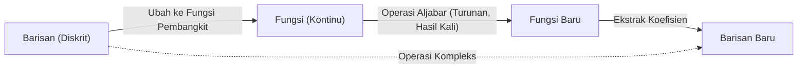

Di dunia matematika, terdapat konsep-konsep yang bertindak seperti "jembatan ajaib", menghubungkan bidang-bidang yang tampaknya tidak berkaitan. Salah satunya adalah **[Fungsi Pembangkit](https://kenji.blog/id/p/generating-functions/)** (Generating Function). Dengan mengubah "barisan" diskrit menjadi "fungsi" kontinu, masalah kombinatorik yang kompleks dapat disederhanakan menjadi perhitungan aljabar.

Artikel ini dimulai dengan ide dasar fungsi pembangkit, dan menjelaskan secara rinci kehebatannya yang luar biasa—dari menghitung kombinasi pembayaran koin hingga menurunkan suku umum dari barisan [Fibonacci](https://kenji.blog/id/p/fibonacci/). Selain itu, kita juga akan menyinggung penerapannya pada Deret Pangkat Formal (Formal Power Series/FPS) dalam algoritma dan pemrograman kompetitif.

## 1. Apa itu [Fungsi Pembangkit](https://kenji.blog/id/p/generating-functions/)?

Diberikan sebuah barisan $a_0, a_1, a_2, \dots$, kita tinjau sebuah fungsi $A(x)$ yang memiliki setiap suku sebagai koefisien dari pangkat $x$.

$$
A(x) = a_0 + a_1 x + a_2 x^2 + a_3 x^3 + \dots = \sum_{n=0}^{\infty} a_n x^n
$$

Fungsi $A(x)$ ini disebut **[Fungsi Pembangkit](https://kenji.blog/id/p/generating-functions/) Biasa** (Ordinary Generating Function) dari barisan $\{a_n\}$.

Mengapa kita melakukan transformasi semacam itu? Karena **operasi pada barisan dapat digantikan oleh operasi aljabar pada fungsi**. Operasi seperti pergeseran barisan, penjumlahan, atau konvolusi diubah menjadi operasi yang sudah lazim seperti penjumlahan, perkalian, diferensiasi, dan integrasi fungsi.



## 2. Kombinasi Pembayaran Koin dan [Fungsi Pembangkit](https://kenji.blog/id/p/generating-functions/)

Untuk memahami kehebatan fungsi pembangkit secara intuitif, mari kita pertimbangkan masalah "pembayaran koin".

**Masalah:**
Temukan banyak kombinasi $a_n$ untuk membayar tepat $n$ yen menggunakan koin 1 yen, 2 yen, dan 5 yen.

Kita memecahkan masalah ini menggunakan fungsi pembangkit.
Untuk setiap koin, kita membuat polinomial yang sesuai dengan jumlah koin yang digunakan.

*   Memilih koin 1 yen: $1 + x + x^2 + x^3 + \dots$ (0 koin, 1 koin, 2 koin, ...)
*   Memilih koin 2 yen: $1 + x^2 + x^4 + x^6 + \dots$
*   Memilih koin 5 yen: $1 + x^5 + x^{10} + x^{15} + \dots$

Tinjau fungsi $f(x)$ yang diperoleh dengan mengalikan polinomial-polinomial ini.

$$
f(x) = (1 + x + x^2 + \dots)(1 + x^2 + x^4 + \dots)(1 + x^5 + x^{10} + \dots)
$$

Koefisien $x^n$ ketika menjabarkan persamaan ini adalah tepat banyaknya kombinasi $a_n$ untuk membayar $n$ yen. Menggunakan rumus jumlah deret geometri tak hingga $1 + r + r^2 + \dots = \frac{1}{1-r}$, $f(x)$ dapat diekspresikan secara ringkas sebagai fungsi rasional:

$$
f(x) = \frac{1}{1-x} \cdot \frac{1}{1-x^2} \cdot \frac{1}{1-x^5}
$$

Dengan kata lain, tanpa menggunakan relasi rekurensi yang kompleks atau perhitungan perulangan (loop), Anda dapat menemukan jumlah kombinasi untuk $n$ berapapun hanya dengan mencari koefisien ekspansi Taylor dari fungsi ini. Dalam pemrograman, konsep ini adalah dasar penting untuk Pemrograman Dinamis ([Dynamic Programming](https://kenji.blog/id/p/dynamic-programming-dp-introduction-knapsack-fibonacci/)/[DP](https://kenji.blog/id/p/dynamic-programming-dp-introduction-knapsack-fibonacci/)).

### Konvolusi dan Perkalian Polinomial

Mengapa hasil kali fungsi sesuai dengan perhitungan kombinasi? Mari kita lihat apa yang terjadi ketika kita mengalikan fungsi pembangkit $A(x), B(x)$ dari dua barisan $a_n$ dan $b_n$.

$$
A(x)B(x) = (a_0 + a_1 x + a_2 x^2 + \dots)(b_0 + b_1 x + b_2 x^2 + \dots)
$$

Koefisien dari $x^n$ saat dijabarkan adalah $\sum_{k=0}^{n} a_k b_{n-k}$. Ini disebut **Konvolusi** (Convolution). Dalam contoh koin, penambahan kombinasi seperti "buat $k$ yen dengan koin 1 yen dan $n-k$ yen dengan koin 2 yen" secara otomatis dihitung oleh perkalian fungsi-fungsi ini.

## 3. Penerapan pada Barisan [Fibonacci](https://kenji.blog/id/p/fibonacci/)

Selanjutnya, sebagai penerapan yang lebih tingkat lanjut, mari kita cari suku umum dari barisan [Fibonacci](https://kenji.blog/id/p/fibonacci/). Barisan [Fibonacci](https://kenji.blog/id/p/fibonacci/) $F_n$ didefinisikan sebagai berikut:

*   $F_0 = 0$
*   $F_1 = 1$
*   $F_n = F_{n-1} + F_{n-2} \quad (n \ge 2)$

Misalkan fungsi pembangkit dari barisan ini adalah $F(x) = \sum_{n=0}^{\infty} F_n x^n$.

$$
\begin{aligned}
F(x) &= F_0 + F_1 x + \sum_{n=2}^{\infty} F_n x^n \\
&= 0 + x + \sum_{n=2}^{\infty} (F_{n-1} + F_{n-2}) x^n \\
&= x + x \sum_{n=2}^{\infty} F_{n-1} x^{n-1} + x^2 \sum_{n=2}^{\infty} F_{n-2} x^{n-2} \\
&= x + x \sum_{m=1}^{\infty} F_m x^m + x^2 \sum_{k=0}^{\infty} F_k x^k
\end{aligned}
$$

Di sini, karena $F_0 = 0$, maka $\sum_{m=1}^{\infty} F_m x^m = F(x)$. Oleh karena itu,

$$
F(x) = x + x F(x) + x^2 F(x)
$$

Menyelesaikan persamaan ini untuk $F(x)$ memberikan fungsi pembangkit untuk barisan [Fibonacci](https://kenji.blog/id/p/fibonacci/).

$$
F(x) = \frac{x}{1 - x - x^2}
$$

Hebatnya, informasi dari barisan [Fibonacci](https://kenji.blog/id/p/fibonacci/) yang terus berlanjut tanpa henti telah diringkas menjadi sebuah fungsi pecahan sederhana.

### Dekomposisi Pecahan Parsial dan Suku Umum

Untuk mengekstrak suku umum dari barisan di sini, kita faktorkan penyebutnya dan melakukan dekomposisi pecahan parsial.
Mempertimbangkan solusi untuk $1 - x - x^2 = 0$, misalkan $\alpha = \frac{1 + \sqrt{5}}{2}$ (rasio emas) dan $\beta = \frac{1 - \sqrt{5}}{2}$. Penyebutnya dapat difaktorkan menjadi $(1 - \alpha x)(1 - \beta x)$.

$$
F(x) = \frac{1}{\sqrt{5}} \left( \frac{1}{1 - \alpha x} - \frac{1}{1 - \beta x} \right)
$$

Menerapkan kebalikan dari rumus deret geometri lagi, kita ekspansikan setiap suku menjadi deret pangkat.

$$
\frac{1}{1 - \alpha x} = \sum_{n=0}^{\infty} \alpha^n x^n, \quad \frac{1}{1 - \beta x} = \sum_{n=0}^{\infty} \beta^n x^n
$$

Mensubstitusikan ini dan membandingkan koefisien $x^n$ mengarah pada rumus Binet (Binet's formula) yang terkenal.

$$
F_n = \frac{1}{\sqrt{5}} \left( \left( \frac{1 + \sqrt{5}}{2} \right)^n - \left( \frac{1 - \sqrt{5}}{2} \right)^n \right)
$$

```mermaid
graph TD
    S["Relasi Rekurensi Fibonacci"] -->|"Definisikan Fungsi Pembangkit F("x")"| EQ["Rumuskan Persamaan Fungsi"]
    EQ -->|"Selesaikan Secara Aljabar"| GF["F(x) = x / (1 - x - x^2)"]
    GF -->|"Dekomposisi Pecahan Parsial"| PF["(A / (1 - αx)) + (B / (1 - βx))"]
    PF -->|"Ekspansi Deret Pangkat & Perbandingan Koefisien"| AN["Suku Umum (Rumus Binet)"]
```

## 4. [Fungsi Pembangkit](https://kenji.blog/id/p/generating-functions/) Eksponensial dan Permutasi

Ketika berhadapan dengan masalah kombinatorik yang memperhatikan urutan, yang berarti "permutasi", **[Fungsi Pembangkit](https://kenji.blog/id/p/generating-functions/) Eksponensial** (Exponential Generating Function) mulai berperan.

Untuk sebuah barisan $a_n$, fungsi pembangkit eksponensial $E(x)$ didefinisikan sebagai berikut:

$$
E(x) = \sum_{n=0}^{\infty} \frac{a_n}{n!} x^n = a_0 + a_1 x + \frac{a_2}{2!} x^2 + \frac{a_3}{3!} x^3 + \dots
$$

Dengan membagi dengan $n!$, perhitungan yang mempertimbangkan urutan (seperti diferensiasi) memiliki bentuk yang sangat rapi. Sebagai contoh, fungsi pembangkit eksponensial dari barisan $1, 1, 1, \dots$ di mana semua elemennya adalah $1$ yaitu $e^x$.

$$
e^x = 1 + x + \frac{x^2}{2!} + \frac{x^3}{3!} + \dots
$$

Menggunakan sifat ini, banyaknya cara menyusun elemen atau jumlah permutasi yang memenuhi beberapa kondisi dapat dinyatakan sebagai perkalian fungsi eksponensial.

## 5. Evolusi ke Deret Pangkat Formal (FPS)

Dalam ilmu komputer modern dan pemrograman kompetitif, fungsi pembangkit diimplementasikan sebagai **Deret Pangkat Formal** (Formal Power Series, FPS).
Dalam FPS, kita tidak peduli apakah mensubstitusikan nilai numerik tertentu ke dalam $x$ akan konvergen (sifat analitik); fokusnya hanyalah pada memanipulasi "barisan koefisien" secara aljabar sebagai polinomial.

Dengan menggunakan [Transformasi Fourier Cepat](/id/p/fast-fourier-transform-algorithm/) (Fast Fourier Transform/[FFT](/id/p/fast-fourier-transform-algorithm/)) atau Transformasi Teori Bilangan (Number Theoretic Transform/NTT), hasil kali dua polinomial berderajat $N$ (yaitu, konvolusi barisan dengan panjang $N$) dapat ditemukan dengan kompleksitas komputasi $\mathcal{O}(N \log N)$. Hal ini memungkinkan perhitungan yang tadinya memakan waktu $\mathcal{O}(N^2)$ dengan pemrograman dinamis dapat dipercepat secara drastis.

## 6. Kesimpulan

Fungsi pembangkit bukan sekadar "kotak untuk menyimpan barisan". Ia adalah "penerjemah" yang mengubah keteraturan dan sifat-sifat barisan ke dalam bentuk fungsi, memungkinkan penerapan alat matematika yang ampuh seperti kalkulus dan aljabar.

*   **Menghitung kombinasi** digantikan oleh perkalian fungsi.
*   **Menyelesaikan relasi rekurensi** digantikan oleh penyelesaian persamaan dan melakukan ekspansi Taylor.

Gagasan ini berperan aktif dalam berbagai bidang, mulai dari desain algoritma hingga masalah-masalah sulit dalam matematika murni. Pastikan Anda menambahkan perspektif baru ini, yaitu memandang barisan sebagai "fungsi", ke dalam perangkat berpikir Anda.
