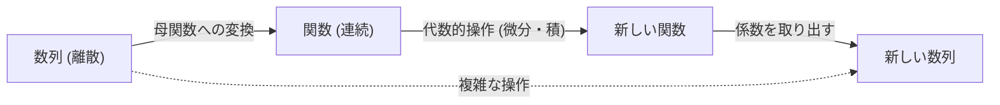

数学の世界には、一見すると無関係に見える異なる分野を繋ぐ「魔法の橋」のような概念が存在します。その一つが **[母関数](https://kenji.blog/p/generating-functions/)** (Generating Function) です。離散的な「数列」を、連続的な「関数」へと変換することで、複雑な組合せ問題を代数的な計算へと帰着させることができます。

本記事では、[母関数](https://kenji.blog/p/generating-functions/)の基本的な考え方から出発し、コインの支払い方の組合せ計算、さらには[フィボナッチ](https://kenji.blog/p/fibonacci/)数列の一般項の導出まで、その驚くべき威力を詳しく解説します。さらに、アルゴリズムや競技プログラミングにおける形式的べき級数 (FPS) への応用についても触れます。

## 1. [母関数](https://kenji.blog/p/generating-functions/)とは何か？

数列 $a_0, a_1, a_2, \dots$ が与えられたとき、それぞれの項を $x$ のべき乗の係数として持つような関数 $A(x)$ を考えます。

$$
A(x) = a_0 + a_1 x + a_2 x^2 + a_3 x^3 + \dots = \sum_{n=0}^{\infty} a_n x^n
$$

この関数 $A(x)$ を数列 $\{a_n\}$ の **通常[母関数](https://kenji.blog/p/generating-functions/)** (Ordinary Generating Function) と呼びます。

なぜこのような変換を行うのでしょうか？それは、 **数列に対する操作を、関数に対する代数的操作に置き換えることができる** からです。数列のシフト、足し合わせ、あるいは畳み込みといった操作は、関数同士の足し算、掛け算、微分・積分といった見慣れた操作へと変換されます。



## 2. コインの支払い方と[母関数](https://kenji.blog/p/generating-functions/)

[母関数](https://kenji.blog/p/generating-functions/)の威力が最も直感的にわかる例として、「コインの支払い方」の問題を考えてみましょう。

**問題：**
1円玉、2円玉、5円玉を使って、ちょうど $n$ 円を支払う組合せの数 $a_n$ を求めよ。

この問題を[母関数](https://kenji.blog/p/generating-functions/)を使って解いてみます。
それぞれの硬貨について、使用する枚数に対応する多項式を作ります。

*   1円玉の選び方: $1 + x + x^2 + x^3 + \dots$ (0枚、1枚、2枚、...)
*   2円玉の選び方: $1 + x^2 + x^4 + x^6 + \dots$
*   5円玉の選び方: $1 + x^5 + x^{10} + x^{15} + \dots$

これらを掛け合わせた関数 $f(x)$ を考えます。

$$
f(x) = (1 + x + x^2 + \dots)(1 + x^2 + x^4 + \dots)(1 + x^5 + x^{10} + \dots)
$$

この式を展開したときの $x^n$ の係数が、まさに $n$ 円を支払う組合せの数 $a_n$ になります。無限級数の和の公式 $1 + r + r^2 + \dots = \frac{1}{1-r}$ を使うと、$f(x)$ は次のような有理関数として簡潔に表せます。

$$
f(x) = \frac{1}{1-x} \cdot \frac{1}{1-x^2} \cdot \frac{1}{1-x^5}
$$

つまり、複雑な漸化式やループ計算を使わずに、この関数のテイラー展開の係数を求めるだけで、任意の $n$ に対する組合せの数がわかるのです。プログラミングの分野でも、この考え方は[動的計画法](https://kenji.blog/p/dynamic-programming-dp-introduction-knapsack-fibonacci/) ([DP](https://kenji.blog/p/dynamic-programming-dp-introduction-knapsack-fibonacci/)) の基礎となる重要な概念です。

### 畳み込みと多項式の積

なぜ関数の積が、組合せの数え上げに対応するのでしょうか？ 2つの数列 $a_n$ と $b_n$ の[母関数](https://kenji.blog/p/generating-functions/) $A(x), B(x)$ を掛け合わせるとどうなるか見てみましょう。

$$
A(x)B(x) = (a_0 + a_1 x + a_2 x^2 + \dots)(b_0 + b_1 x + b_2 x^2 + \dots)
$$

展開したときの $x^n$ の係数は、$\sum_{k=0}^{n} a_k b_{n-k}$ となります。これを **畳み込み** (Convolution) と呼びます。コインの例では、「1円玉で $k$ 円を作り、2円玉で $n-k$ 円を作る」という組合せの足し合わせが、まさにこの関数の積によって自動的に計算されているわけです。

## 3. [フィボナッチ](https://kenji.blog/p/fibonacci/)数列への応用

次に、より高度な応用として[フィボナッチ](https://kenji.blog/p/fibonacci/)数列の一般項を求めてみましょう。[フィボナッチ](https://kenji.blog/p/fibonacci/)数列 $F_n$ は次のように定義されます。

*   $F_0 = 0$
*   $F_1 = 1$
*   $F_n = F_{n-1} + F_{n-2} \quad (n \ge 2)$

この数列の[母関数](https://kenji.blog/p/generating-functions/)を $F(x) = \sum_{n=0}^{\infty} F_n x^n$ とします。

$$
\begin{aligned}
F(x) &= F_0 + F_1 x + \sum_{n=2}^{\infty} F_n x^n \\
&= 0 + x + \sum_{n=2}^{\infty} (F_{n-1} + F_{n-2}) x^n \\
&= x + x \sum_{n=2}^{\infty} F_{n-1} x^{n-1} + x^2 \sum_{n=2}^{\infty} F_{n-2} x^{n-2} \\
&= x + x \sum_{m=1}^{\infty} F_m x^m + x^2 \sum_{k=0}^{\infty} F_k x^k
\end{aligned}
$$

ここで、$F_0 = 0$ なので $\sum_{m=1}^{\infty} F_m x^m = F(x)$ となります。したがって、

$$
F(x) = x + x F(x) + x^2 F(x)
$$

この方程式を $F(x)$ について解くと、[フィボナッチ](https://kenji.blog/p/fibonacci/)数列の[母関数](https://kenji.blog/p/generating-functions/)が得られます。

$$
F(x) = \frac{x}{1 - x - x^2}
$$

驚くべきことに、無限に続く[フィボナッチ](https://kenji.blog/p/fibonacci/)数列の情報が、たった一つのシンプルな分数関数に凝縮されました。

### 部分分数分解と一般項

ここから数列の一般項を取り出すには、分母を因数分解して部分分数分解を行います。
$1 - x - x^2 = 0$ の解を考え、$\alpha = \frac{1 + \sqrt{5}}{2}$ (黄金比), $\beta = \frac{1 - \sqrt{5}}{2}$ とおくと、分母は $(1 - \alpha x)(1 - \beta x)$ と因数分解できます。

$$
F(x) = \frac{1}{\sqrt{5}} \left( \frac{1}{1 - \alpha x} - \frac{1}{1 - \beta x} \right)
$$

再び等比級数の公式の逆を適用して、それぞれの項をべき級数に展開します。

$$
\frac{1}{1 - \alpha x} = \sum_{n=0}^{\infty} \alpha^n x^n, \quad \frac{1}{1 - \beta x} = \sum_{n=0}^{\infty} \beta^n x^n
$$

これを代入し、$x^n$ の係数を比較することで、あの有名なビネの公式 (Binet's formula) が導かれます。

$$
F_n = \frac{1}{\sqrt{5}} \left( \left( \frac{1 + \sqrt{5}}{2} \right)^n - \left( \frac{1 - \sqrt{5}}{2} \right)^n \right)
$$

```mermaid
graph TD
    S["フィボナッチ数列の漸化式"] -->|"母関数 F("x") を定義"| EQ["関数の方程式を立てる"]
    EQ -->|"代数的に解く"| GF["F("x") = x / (1 - x - x^2)"]
    GF -->|"部分分数分解"| PF["(A / (1 - αx)) + (B / (1 - βx))"]
    PF -->|"べき級数展開・係数比較"| AN["一般項 (ビネの公式)"]
```

## 4. 指数型[母関数](https://kenji.blog/p/generating-functions/)と順列

順序を考慮するような組合せ問題、つまり「順列」を扱う場合には、 **指数型[母関数](https://kenji.blog/p/generating-functions/)** (Exponential Generating Function) が活躍します。

数列 $a_n$ に対して、指数型[母関数](https://kenji.blog/p/generating-functions/) $E(x)$ は次のように定義されます。

$$
E(x) = \sum_{n=0}^{\infty} \frac{a_n}{n!} x^n = a_0 + a_1 x + \frac{a_2}{2!} x^2 + \frac{a_3}{3!} x^3 + \dots
$$

$n!$ で割ることで、順序を考慮する計算（微分などの操作）が非常にきれいな形になります。例えば、すべての要素が $1$ である数列 $1, 1, 1, \dots$ の指数型[母関数](https://kenji.blog/p/generating-functions/)は $e^x$ になります。

$$
e^x = 1 + x + \frac{x^2}{2!} + \frac{x^3}{3!} + \dots
$$

この性質を利用すると、要素を並べる場合の数や、複数の条件を満たすような順列の数を、指数関数の掛け算として表現できるようになります。

## 5. 形式的べき級数 (FPS) への発展

現代の計算機科学や競技プログラミングにおいて、[母関数](https://kenji.blog/p/generating-functions/)は **形式的べき級数** (Formal Power Series, FPS) として実装されます。
FPS では、$x$ に具体的な数値を代入して収束するかどうか（解析的な性質）は気にせず、単に「係数の列」を多項式として代数的に操作することに主眼を置きます。

高速フーリエ変換 (FFT) や数論変換 (NTT) を用いることで、2つの $N$ 次の多項式の積（つまり、長さ $N$ の数列の畳み込み）を $\mathcal{O}(N \log N)$ の計算量で求めることができます。これにより、[動的計画法](https://kenji.blog/p/dynamic-programming-dp-introduction-knapsack-fibonacci/)で $\mathcal{O}(N^2)$ かかっていた計算を劇的に高速化することが可能になります。

## 6. まとめ

[母関数](https://kenji.blog/p/generating-functions/)とは、単なる「数列を入れる箱」ではありません。数列のもつ規則性や性質を関数の形に変換し、微分積分や代数計算といった強力な数学的ツールを適用できるようにする「翻訳機」なのです。

*   **組合せの数え上げ** が関数の積に置き換わる。
*   **漸化式を解く** ことが、方程式を解いてテイラー展開することに置き換わる。

アルゴリズムの設計から純粋数学の難問まで、幅広い分野で活躍するこのアイデア。数列を「関数」として見る新しい視点を、ぜひあなたの思考ツールに加えてみてください。
