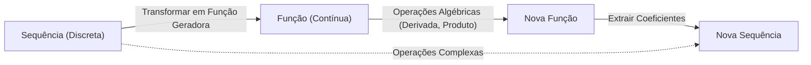
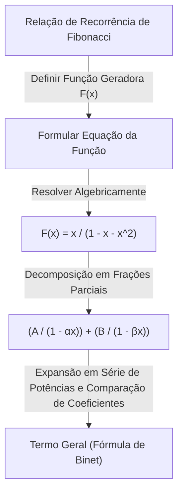

No mundo da matemática, existem conceitos que atuam como "pontes mágicas", conectando campos aparentemente não relacionados. Um deles é a **função geradora** (Generating Function). Ao transformar uma "sequência" discreta em uma "função" contínua, problemas combinatórios complexos podem ser reduzidos a cálculos algébricos.

Este artigo começa com a ideia básica das funções geradoras e explica detalhadamente o seu incrível poder — desde o cálculo de combinações de pagamentos com moedas até a derivação do termo geral da sequência de Fibonacci. Além disso, mencionaremos sua aplicação em séries de potências formais (FPS) em algoritmos e programação competitiva.

## 1. O que é uma função geradora?

Dada uma sequência $a_0, a_1, a_2, \dots$, consideramos uma função $A(x)$ que tem cada termo como coeficiente de uma potência de $x$.

$$
A(x) = a_0 + a_1 x + a_2 x^2 + a_3 x^3 + \dots = \sum_{n=0}^{\infty} a_n x^n
$$

Essa função $A(x)$ é chamada de **função geradora ordinária** (Ordinary Generating Function) da sequência $\{a_n\}$.

Por que realizar tal transformação? Porque **operações em sequências podem ser substituídas por operações algébricas em funções**. Operações como deslocamento, adição ou convolução de sequências são convertidas em operações familiares como adição, multiplicação, diferenciação e integração de funções.

## 2. Combinações de moedas e funções geradoras

Para entender intuitivamente o poder das funções geradoras, vamos considerar o problema do "pagamento com moedas".

**Problema:**
Encontre o número de combinações $a_n$ para pagar exatamente $n$ ienes usando moedas de 1 iene, 2 ienes e 5 ienes.

Nós resolvemos esse problema usando funções geradoras.
Para cada moeda, criamos um polinômio correspondente ao número de moedas utilizadas.

*   Escolhendo moedas de 1 iene: $1 + x + x^2 + x^3 + \dots$ (0 moedas, 1 moeda, 2 moedas, ...)
*   Escolhendo moedas de 2 ienes: $1 + x^2 + x^4 + x^6 + \dots$
*   Escolhendo moedas de 5 ienes: $1 + x^5 + x^{10} + x^{15} + \dots$

Considere a função $f(x)$ obtida multiplicando estas.

$$
f(x) = (1 + x + x^2 + \dots)(1 + x^2 + x^4 + \dots)(1 + x^5 + x^{10} + \dots)
$$

O coeficiente de $x^n$ ao expandir essa equação é exatamente o número de combinações $a_n$ para pagar $n$ ienes. Usando a fórmula da soma da série infinita $1 + r + r^2 + \dots = \frac{1}{1-r}$, $f(x)$ pode ser expressa de forma concisa como uma função racional:

$$
f(x) = \frac{1}{1-x} \cdot \frac{1}{1-x^2} \cdot \frac{1}{1-x^5}
$$

Em outras palavras, sem usar relações de recorrência complexas ou cálculos de loop, você pode encontrar o número de combinações para qualquer $n$ simplesmente encontrando os coeficientes da expansão de Taylor dessa função. Na programação, esse conceito é um fundamento importante para a Programação Dinâmica (DP).

### Convolução e multiplicação de polinômios

Por que o produto de funções corresponde a contar combinações? Vamos ver o que acontece quando multiplicamos as funções geradoras $A(x), B(x)$ de duas sequências $a_n$ e $b_n$.

$$
A(x)B(x) = (a_0 + a_1 x + a_2 x^2 + \dots)(b_0 + b_1 x + b_2 x^2 + \dots)
$$

O coeficiente de $x^n$ na expansão é $\sum_{k=0}^{n} a_k b_{n-k}$. Isso é chamado de **convolução** (Convolution). No exemplo das moedas, a adição de combinações como "fazer $k$ ienes com moedas de 1 iene e $n-k$ ienes com moedas de 2 ienes" é automaticamente calculada por esse produto de funções.

## 3. Aplicação na sequência de Fibonacci

A seguir, como uma aplicação mais avançada, vamos encontrar o termo geral da sequência de Fibonacci. A sequência de Fibonacci $F_n$ é definida da seguinte forma:

*   $F_0 = 0$
*   $F_1 = 1$
*   $F_n = F_{n-1} + F_{n-2} \quad (n \ge 2)$

Seja a função geradora dessa sequência $F(x) = \sum_{n=0}^{\infty} F_n x^n$.

$$
\begin{aligned}
F(x) &= F_0 + F_1 x + \sum_{n=2}^{\infty} F_n x^n \\
&= 0 + x + \sum_{n=2}^{\infty} (F_{n-1} + F_{n-2}) x^n \\
&= x + x \sum_{n=2}^{\infty} F_{n-1} x^{n-1} + x^2 \sum_{n=2}^{\infty} F_{n-2} x^{n-2} \\
&= x + x \sum_{m=1}^{\infty} F_m x^m + x^2 \sum_{k=0}^{\infty} F_k x^k
\end{aligned}
$$

Aqui, como $F_0 = 0$, $\sum_{m=1}^{\infty} F_m x^m = F(x)$. Portanto,

$$
F(x) = x + x F(x) + x^2 F(x)
$$

Resolver essa equação para $F(x)$ nos dá a função geradora para a sequência de Fibonacci.

$$
F(x) = \frac{x}{1 - x - x^2}
$$

De forma surpreendente, as informações da sequência infinitamente contínua de Fibonacci foram condensadas em uma única função fracionária simples.

### Decomposição em frações parciais e o termo geral

Para extrair o termo geral da sequência daqui, fatoramos o denominador e realizamos a decomposição em frações parciais.
Considerando as soluções para $1 - x - x^2 = 0$, seja $\alpha = \frac{1 + \sqrt{5}}{2}$ (a proporção áurea) e $\beta = \frac{1 - \sqrt{5}}{2}$. O denominador pode ser fatorado como $(1 - \alpha x)(1 - \beta x)$.

$$
F(x) = \frac{1}{\sqrt{5}} \left( \frac{1}{1 - \alpha x} - \frac{1}{1 - \beta x} \right)
$$

Aplicando o inverso da fórmula da série geométrica novamente, expandimos cada termo em uma série de potências.

$$
\frac{1}{1 - \alpha x} = \sum_{n=0}^{\infty} \alpha^n x^n, \quad \frac{1}{1 - \beta x} = \sum_{n=0}^{\infty} \beta^n x^n
$$

Substituir isso e comparar os coeficientes de $x^n$ leva à famosa fórmula de Binet.

$$
F_n = \frac{1}{\sqrt{5}} \left( \left( \frac{1 + \sqrt{5}}{2} \right)^n - \left( \frac{1 - \sqrt{5}}{2} \right)^n \right)
$$

## 4. [Funções geradoras](https://kenji.blog/pt/p/generating-functions/) exponenciais e permutações

Ao lidar com problemas combinatórios que consideram a ordem, ou seja, "permutações", a **função geradora exponencial** (Exponential Generating Function) entra em jogo.

Para uma sequência $a_n$, a função geradora exponencial $E(x)$ é definida da seguinte forma:

$$
E(x) = \sum_{n=0}^{\infty} \frac{a_n}{n!} x^n = a_0 + a_1 x + \frac{a_2}{2!} x^2 + \frac{a_3}{3!} x^3 + \dots
$$

Ao dividir por $n!$, cálculos que consideram a ordem (como a derivação) assumem uma forma muito limpa. Por exemplo, a função geradora exponencial da sequência $1, 1, 1, \dots$ onde todos os elementos são $1$ é $e^x$.

$$
e^x = 1 + x + \frac{x^2}{2!} + \frac{x^3}{3!} + \dots
$$

Usando essa propriedade, o número de maneiras de organizar elementos ou o número de permutações satisfazendo várias condições pode ser expresso como um produto de funções exponenciais.

## 5. Evolução para Séries de Potências Formais (FPS)

Na ciência da computação moderna e na programação competitiva, as funções geradoras são implementadas como **Séries de Potências Formais** (Formal Power Series, FPS).
Em FPS, não nos importamos se a substituição de um valor numérico específico em $x$ converge (propriedades analíticas); o foco é simplesmente manipular a "sequência de coeficientes" algebricamente como polinômios.

Usando a Transformada Rápida de Fourier (FFT) ou a Transformada Teórica dos Números (NTT), o produto de dois polinômios de grau $N$ (ou seja, a convolução de sequências de comprimento $N$) pode ser encontrado com uma complexidade computacional de $\mathcal{O}(N \log N)$. Isso permite que cálculos que levariam $\mathcal{O}(N^2)$ com programação dinâmica sejam acelerados drasticamente.

## 6. Conclusão

Uma função geradora não é apenas uma "caixa para colocar uma sequência". É um "tradutor" que transforma as regularidades e propriedades de uma sequência em uma forma funcional, permitindo a aplicação de ferramentas matemáticas poderosas, como cálculo e álgebra.

*   **Contar combinações** é substituído pelo produto de funções.
*   **Resolver uma relação de recorrência** é substituído por resolver uma equação e realizar a expansão de Taylor.

Esta ideia desempenha um papel ativo numa ampla gama de campos, desde o design de algoritmos a problemas difíceis em matemática pura. Certifique-se de adicionar essa nova perspectiva de ver as sequências como "funções" ao seu kit de ferramentas de pensamento.
