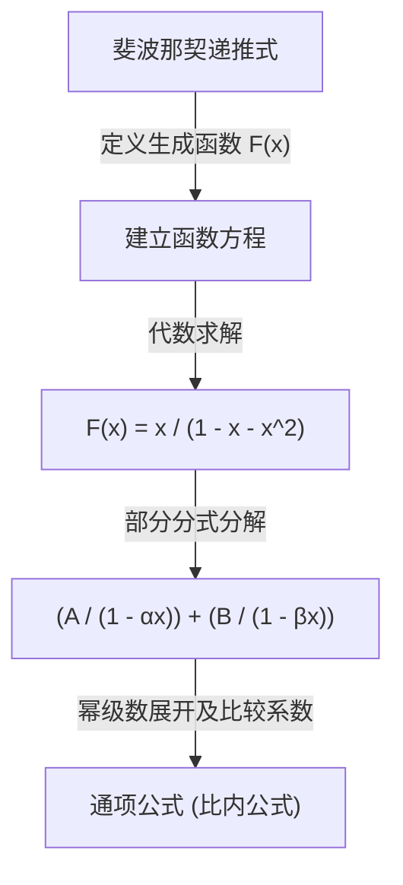

在数学的世界里，存在着一些像“魔法桥梁”一样的概念，能够将看似毫不相干的领域连接起来。其中之一就是 **生成函数** (Generating Function)。通过将离散的“数列”转化为连续的“函数”，可以将复杂的组合问题转化为代数计算。

本文将从生成函数的基本思想出发，详细讲解其惊人的威力——从计算硬币支付方式的组合，到推导斐波那契数列的通项公式。此外，我们还将提及它在算法和竞技编程中的形式幂级数 (FPS) 应用。

## 1. 什么是生成函数？

给定一个数列 $a_0, a_1, a_2, \dots$，我们考虑一个函数 $A(x)$，它的每一项系数正好对应数列中各个项作为 $x$ 的幂的系数。

$$
A(x) = a_0 + a_1 x + a_2 x^2 + a_3 x^3 + \dots = \sum_{n=0}^{\infty} a_n x^n
$$

这个函数 $A(x)$ 就被称为数列 $\{a_n\}$ 的 **普通生成函数** (Ordinary Generating Function)。

为什么要进行这样的转换呢？这是因为 **可以将对数列的操作替换为对函数的代数操作**。数列的平移、求和或卷积等操作，都被转换为函数之间的加法、乘法、微分和积分等我们熟悉的操作。

## 2. 硬币支付方式与生成函数

要直观地理解生成函数的威力，让我们考虑一个“硬币支付方式”的问题。

**问题：**
使用1日元、2日元和5日元硬币，求恰好支付 $n$ 日元的组合数 $a_n$。

我们使用生成函数来解这个问题。
对于每种硬币，我们根据使用的数量构建一个多项式。

*   1日元硬币的选择: $1 + x + x^2 + x^3 + \dots$ (0枚、1枚、2枚...)
*   2日元硬币的选择: $1 + x^2 + x^4 + x^6 + \dots$
*   5日元硬币的选择: $1 + x^5 + x^{10} + x^{15} + \dots$

我们将这些多项式相乘，得到函数 $f(x)$。

$$
f(x) = (1 + x + x^2 + \dots)(1 + x^2 + x^4 + \dots)(1 + x^5 + x^{10} + \dots)
$$

展开这个式子时，$x^n$ 的系数恰好就是支付 $n$ 日元的组合数 $a_n$。利用无穷级数求和公式 $1 + r + r^2 + \dots = \frac{1}{1-r}$，$f(x)$ 可以简洁地表示为如下的有理函数：

$$
f(x) = \frac{1}{1-x} \cdot \frac{1}{1-x^2} \cdot \frac{1}{1-x^5}
$$

也就是说，不需要使用复杂的递推公式或循环计算，只需计算这个函数的泰勒展开系数，就能得到任意 $n$ 对应的组合数。在编程领域，这种思想也是动态规划 (DP) 的重要基础。

### 卷积与多项式乘积

为什么函数的乘积对应于组合的计数呢？让我们看看两个数列 $a_n$ 和 $b_n$ 的生成函数 $A(x), B(x)$ 相乘会发生什么。

$$
A(x)B(x) = (a_0 + a_1 x + a_2 x^2 + \dots)(b_0 + b_1 x + b_2 x^2 + \dots)
$$

展开后 $x^n$ 的系数为 $\sum_{k=0}^{n} a_k b_{n-k}$。这被称为 **卷积** (Convolution)。在硬币的例子中，“用1日元硬币凑出 $k$ 日元，用2日元硬币凑出 $n-k$ 日元”的组合的叠加，正是通过这个函数乘积自动计算出来的。

## 3. 在斐波那契数列中的应用

接下来，作为更高级的应用，我们来求斐波那契数列的通项公式。斐波那契数列 $F_n$ 的定义如下：

*   $F_0 = 0$
*   $F_1 = 1$
*   $F_n = F_{n-1} + F_{n-2} \quad (n \ge 2)$

设这个数列的生成函数为 $F(x) = \sum_{n=0}^{\infty} F_n x^n$。

$$
\begin{aligned}
F(x) &= F_0 + F_1 x + \sum_{n=2}^{\infty} F_n x^n \\
&= 0 + x + \sum_{n=2}^{\infty} (F_{n-1} + F_{n-2}) x^n \\
&= x + x \sum_{n=2}^{\infty} F_{n-1} x^{n-1} + x^2 \sum_{n=2}^{\infty} F_{n-2} x^{n-2} \\
&= x + x \sum_{m=1}^{\infty} F_m x^m + x^2 \sum_{k=0}^{\infty} F_k x^k
\end{aligned}
$$

这里，因为 $F_0 = 0$，所以 $\sum_{m=1}^{\infty} F_m x^m = F(x)$。因此，

$$
F(x) = x + x F(x) + x^2 F(x)
$$

解关于 $F(x)$ 的方程，我们得到了斐波那契数列的生成函数。

$$
F(x) = \frac{x}{1 - x - x^2}
$$

令人惊讶的是，无限延伸的斐波那契数列的信息，被浓缩到了这唯一一个简单的分数函数中。

### 部分分式分解与通项公式

为了从中提取数列的通项公式，我们将分母进行因式分解并进行部分分式分解。
考虑方程 $1 - x - x^2 = 0$ 的解，令 $\alpha = \frac{1 + \sqrt{5}}{2}$ (黄金分割比), $\beta = \frac{1 - \sqrt{5}}{2}$，分母可以因式分解为 $(1 - \alpha x)(1 - \beta x)$。

$$
F(x) = \frac{1}{\sqrt{5}} \left( \frac{1}{1 - \alpha x} - \frac{1}{1 - \beta x} \right)
$$

再次逆向应用等比级数公式，将每一项展开为幂级数。

$$
\frac{1}{1 - \alpha x} = \sum_{n=0}^{\infty} \alpha^n x^n, \quad \frac{1}{1 - \beta x} = \sum_{n=0}^{\infty} \beta^n x^n
$$

代入并比较 $x^n$ 的系数，就能推导出著名的比内公式 (Binet's formula)。

$$
F_n = \frac{1}{\sqrt{5}} \left( \left( \frac{1 + \sqrt{5}}{2} \right)^n - \left( \frac{1 - \sqrt{5}}{2} \right)^n \right)
$$

## 4. 指数型生成函数与排列

在处理考虑顺序的组合问题，即“排列”时，**指数型生成函数** (Exponential Generating Function) 将大显身手。

对于数列 $a_n$，其指数型生成函数 $E(x)$ 定义如下：

$$
E(x) = \sum_{n=0}^{\infty} \frac{a_n}{n!} x^n = a_0 + a_1 x + \frac{a_2}{2!} x^2 + \frac{a_3}{3!} x^3 + \dots
$$

通过除以 $n!$，考虑顺序的计算（如微分操作）会变得非常整洁。例如，所有元素均为 $1$ 的数列 $1, 1, 1, \dots$ 的指数型生成函数是 $e^x$。

$$
e^x = 1 + x + \frac{x^2}{2!} + \frac{x^3}{3!} + \dots
$$

利用这个性质，可以将元素的排列数或满足多个条件的排列数表示为指数函数的乘积。

## 5. 向形式幂级数 (FPS) 的发展

在现代计算机科学和竞技编程中，生成函数常常被作为 **形式幂级数** (Formal Power Series, FPS) 来实现。
在 FPS 中，我们不关心将具体的数值代入 $x$ 后是否收敛（解析性质），而是将重点放在将“系数序列”作为多项式进行代数操作上。

利用快速傅里叶变换 (FFT) 或数论变换 (NTT)，可以在 $\mathcal{O}(N \log N)$ 的时间复杂度内求出两个 $N$ 次多项式的乘积（即长度为 $N$ 的数列的卷积）。这使得原本用动态规划需要 $\mathcal{O}(N^2)$ 的计算得到了极大的加速。

## 6. 总结

生成函数不仅仅是“存放数列的盒子”。它是一个“翻译机”，能将数列的规律和性质转化为函数的形式，从而可以应用微积分和代数计算等强大的数学工具。

*   **组合的计数** 被替换成了函数的乘积。
*   **求解递推式** 被替换成了求解方程和进行泰勒展开。

从算法设计到纯数学难题，这一思想在广泛的领域中大放异彩。请务必将把数列视为“函数”的全新视角，加入到您的思维工具箱中。
