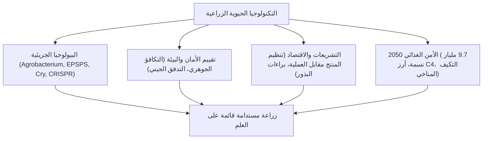

## مقدمة: آفاق التكنولوجيا الحيوية النباتية
تاريخ الزراعة هو تاريخ تعديل جينات النباتات. مكنت تقنية الحمض النووي المؤتلف (rDNA) ثم تقنية تحرير الجينوم كريسبر (CRISPR-Cas9) من إدخال صفات زراعية دقيقة لمواجهة التغير المناخي وضمان الأمن الغذائي العالمي.

## الفصل 1: تاريخ تحسين النباتات وتقنية الحمض النووي المؤتلف
من الانتخاب التقليدي إلى الطفرات الإشعاعية. نقل الـ T-DNA عبر بكتيريا *Agrobacterium tumefaciens* وطريقة القذف بالجسيمات (مدفع الجينات).

## الفصل 2: الكيمياء الحيوية للصفات المعدلة وراثياً
- **تحمل مبيدات الأعشاب**: إنزيم CP4-EPSPS البكتيري الذي يتجاوز تثبيط مسار الشيكيمات بواسطة الغليفوسات.
- **مقاومة الآفات**: بروتينات Cry البلورية من بكتيريا *Bacillus thuringiensis* التي تخرق أمعاء الحشرات القلوية وتعد آمنة تماماً للبشر.
- **الأرز الذهبي**: إعادة هندسة مسار تصنيع البيتا كاروتين (بروفيتامين أ) في حبوب الأرز.

## الفصل 3: الفارق الجوهري: الكائنات المعدلة وراثياً مقابل كريسبر
يستهدف كريسبر مواقع دقيقة في الجينوم. تعديلات SDN-1 لا تحتوي على أي حمض نووي غريب وتعادل الطفرات الطبيعية بيولوجياً.

## الفصل 4: اتجاهات الزراعة العالمية والآثار الاقتصادية
أكثر من 190 مليون هكتار مزروعة عالمياً (أمريكا، البرازيل، الأرجنتين، الهند). خفض استخدام المبيدات الكيميائية، وعزل الكربون في التربة عبر الزراعة بدون حراثة.

## الفصل 5: السلامة الصحية للإنسان والإجماع العلمي
مبدأ "التكافؤ الجوهري" (WHO, FAO). فحوصات الهضم بالببسين وتأكيد الأكاديميات العلمية الكبرى (NAS, EFSA) سلامة الأغذية المعدلة وراثياً المعتمدة.

## الفصل 6: تقييم السلامة البيئية
بروتوكول قرطاجنة، أبحاث الحشرات غير المستهدفة (فراشة الملك)، التحكم في التدفق الجيني، واستراتيجيات الملاذ (Refuge) لمنع مقاومة الآفات.

## الفصل 7: المقارنة بين الأنظمة القانونية الدولية
النهج المعتمد على المنتج (أمريكا) مقابل النهج القائم على العملية ومبدأ الحيطة (الاتحاد الأوروبي).

## الفصل 8: سيكولوجية المستهلك والتواصل العلمي
الانحيازات المعرفية والخوف من "أغذية فرانكشتاين" وضرورة بناء حوار علمي يتسم بالشفافية والتعاطف.

## الفصل 9: التغير المناخي والأمن الغذائي لـ 9.7 مليار إنسان
مشروع أرز C4 لرفع كفاءة التمثيل الضوئي بنسبة 50%، والمحاصيل المقاومة للجفاف وتثبيت النيتروجين حيوياً.

## الفصل 10: البيولوجيا التخليقية والاستئناس الجديد (De Novo Domestication)
استئناس النباتات البرية المقاومة في جيل واحد باستخدام كريسبر والزراعة الجزيئية لإنتاج اللقاحات في النباتات.
