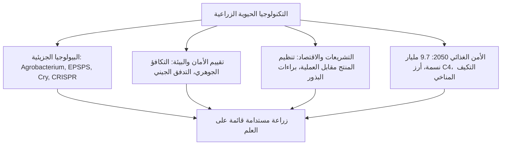
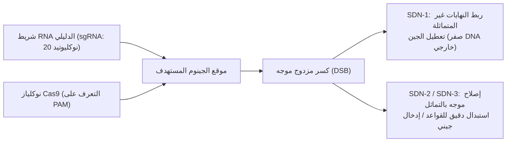

## مقدمة: آفاق التكنولوجيا الحيوية النباتية

يرتبط تاريخ الحضارة الإنسانية ارتباطاً وثيقاً بالتعديل المتعمد لجينومات النباتات. منذ الثورة الزراعية في العصر الحجري الحديث قبل 10,000 عام، مارس الإنسان الانتقاء الاصطناعي على النباتات البرية: مانعاً تناثر البذور التلقائي، ومضخماً الأعضاء القابلة للأكل، وخافضاً للسموم الطبيعية. تطورت الذرة الحديثة من سلفها البري الثيوسينت (*Teosinte*) بفضل الانتخاب المستمر للجينات المنظمة للشكل الخضري.

في أواخر القرن العشرين، أتاحت تقنية الحمض النووي المؤتلف (rDNA) كسر الحواجز الإنجابية بين الأنواع ونقل جينات محددة. ومع حلول القرن الحادي والعشرين، منحت تقنيات كريسبر (CRISPR-Cas9) وتحرير القواعد الدقيقة العلماء القدرة على إعادة كتابة الشفرة الوراثية للنبات بدقة النوكليوتيد الواحد.

ومع ذلك، واجهت التكنولوجيا الحيوية الزراعية جدلاً اجتماعياً حاداً ومخاوف من "أغذية فرانكشتاين" واحتكار شركات البذور، مما خلق فجوة عميقة بين الإجماع العلمي وإدراك الجمهور للمخاطر.



---

## الفصل 1: تاريخ تحسين النباتات وتقنية الحمض النووي المؤتلف

### 1.1 من الاستئناس القديم إلى حدود التطفير
حقق التهجين العلمي في القرن العشرين طفرات إنتاجية بالاعتماد على قوة الهجين (F1). غير أن التهجين التقليدي اصطدم بحدود التوافق الجنسي ومشكلة الارتباط الجيني غير المرغوب فيه (*Linkage Drag*). كما تسبب التطفير الإشعاعي والكيميائي في إحداث تكسيرات عشوائية غير منضبطة في الجينوم.

### 1.2 أدوات تقنية الحمض النووي المؤتلف
- **إنزيمات القطع المحددة**: مقصات جزيئية لقطع تسلسلات محددة من الـ DNA.
- **إنزيم الربط (DNA Ligase)**: غراء جزيئي لإعادة ربط الروابط الفوسفاتية.
- **نواقل الاستنساخ**: البلازميدات القادرة على التضاعف الذاتي ونقل الجينات.

### 1.3 طرق التحويل الوراثي للنبات: الأجروباكتيريوم ومدفع الجينات
1. **طريقة الأجروباكتيريوم (*Agrobacterium tumefaciens*)**: استغلال بلازميد Ti بعد تجريده من جينات الأورام، حيث تنقل بروتينات *vir* شريط T-DNA وتدمجه في كروموسومات النبات.
2. **القذف بالجسيمات (مدفع الجينات)**: إطلاق جسيمات الذهب أو التنجستن المغلفة بالحمض النووي بضغط غاز الهيليوم (1,500 رطل/بوصة²) لاختراق الجدران الخلوية، وهي ضرورية لمحاصيل الحبوب والبلاستيدات الخضراء.

### 1.4 بنية كاسيت التعبير الجيني
- **المحفزات (Promoters)**: محفزات عامة (CaMV 35S, Ubiquitin-1) أو محفزات نسيجية متخصصة.
- **التسلسل المشفر**: جينات معدلة الكودونات للنباتات (*cp4-epsps*, *cry1Ac*).
- **المنهيات (Terminators)**: إشارات إيقاف النسخ وعديد الأدينين (*nos*, *rbcS*).
- **علامات الانتخاب**: جينات مقاومة المضادات الحيوية (*nptII*) أو مبيدات الأعشاب (*bar*).

---

## الفصل 2: الكيمياء الحيوية للصفات المعدلة وراثياً

### 2.1 تحمل مبيدات الأعشاب: الغليفوسات والغلوفوسينات
- **تحمل الغليفوسات (Roundup Ready)**: يثبط الغليفوسات إنزيم **EPSPS** في مسار الشيكيمات، مانعاً تصنيع الأحماض الأمينية العطرية (Phe, Tyr, Trp). الإنزيم البكتيري **CP4-EPSPS** من سلالة *Agrobacterium* CP4 لا يرتبط بالغليفوسات، مما يحافظ على حيوية المحصول.
- **تحمل الغلوفوسينات (LibertyLink)**: يثبط الغلوفوسينات إنزيم تصنيع الغلوتامين، بينما ينزع إنزيم الفوسفينوثريسين أسيتيل ترانسفيراز (*pat*/*bar*) سمية المبيد بواسطة الأستلة.

```mermaid
flowchart TD
    PEP["فوسفوينول بيروفات (PEP)"] + S3P["شيكيمات-3-فوسفات (S3P)"] --> ENZ{"إنزيم EPSPS النباتي"}
    GLY["رش مبيد الغليفوسات"] -. "تثبيط تنافسي" .-> ENZ
    ENZ -- "تعطل الإنزيم" --> ARO["استنزاف الأحماض الأمينية -> موت النبات"]
    
    CP4["إنزيم CP4-EPSPS البكتيري"] -- "عدم الارتباط بالمبيد" --> BYPASS["استمرار مسار الشيكيمات -> بقاء المحصول"]
```

### 2.2 مقاومة الآفات: بروتينات Cry من Bacillus thuringiensis
1. **الذوبان القلوي**: تذوب بلورات السم غير النشط فقط في الأمعاء القلوية الشديدة (pH 9.0–11.0) ليرقات الحشرات.
2. **التنشيط بالإنزيمات**: تقطع إنزيمات الحشرة البروتين إلى سم نشط بوزن 65 كيلو دالتون.
3. **الارتباط وتكوين الثقوب**: يرتبط السم بمستقبلات الكادهيرين مكوناً ثقوباً قطرها 1–2 نانومتر تسبب تحلل الخلايا وموت الحشرة.
4. **أمان الثدييات**: تنعدم مستقبلات الكادهيرين الخاصة بالسم في أمعاء الثدييات، وتتفكك البروتينات فورياً بحمض المعدة وإنزيم الببسين خلال ثوانٍ.

### 2.3 المقاومة الفيروسية والأرز الذهبي
- **بابايا رينبو**: مناعة ضد فيروس التبقع الحلقي (PRSV) عبر تداخل الحمض النووي الريبي (RNAi).
- **الأرز الذهبي (Golden Rice)**: إدخال جينات إنتاج البيتا كاروتين (*psy* و *crtI*) في سويداء حبة الأرز للقضاء على نقص فيتامين أ.

---

## الفصل 3: الفارق الجوهري: الكائنات المعدلة وراثياً مقابل كريسبر

### 3.1 الاستهداف الدقيق مقابل الإدخال العشوائي
تعتمد كريسبر (CRISPR-Cas9) على شريط RNA دليلي (sgRNA) لإحداث كسر مزدوج في موقع جيني دقيق بجوار تسلسل PAM (NGG)، مما يمكن من تعطيل الجينات دون إدخال أي حمض نووي خارجي دائم.



### 3.2 تصنيف فئات SDN
- **SDN-1**: إصلاح عشوائي بسيط يؤدي لتعطيل الجين. **خالٍ تماماً من أي DNA غريب** ولا يمكن تمييزه عن الطفرات الطبيعية؛ معفى من تنظيم الـ GMO في أمريكا واليابان والهند.
- **SDN-2**: استبدال دقيق لعدد من النوكليوتيدات بالاعتماد على قالب متماثل.
- **SDN-3**: إدخال كاسيت جيني خارجي كامل (يخضع لتشريعات الـ GMO التقليدية).

### 3.3 نماذج تجارية
- **طماطم High-GABA (اليابان)**: رفع تركيز حمض الغابا الخافض لضغط الدم إلى خمسة أضعاف.
- **فطر مضاد للاسمرار وقمح قليل التحسس**: تعطيل جينات البوليفينول أوكسيديز والغليادين.

---

## الفصل 4: اتجاهات الزراعة العالمية والآثار الاقتصادية
- **المساحات المزروعة**: أكثر من 190 مليون هكتار في 29 دولة (أمريكا 71.5 مليون هكتار، البرازيل 52.8 مليون هكتار). 78% من فول الصويا و76% من القطن في العالم هي محاصيل بيوتكنولوجية.
- **المكاسب الموثقة**: 261 مليار دولار أرباح إضافية للمزارعين، وخفض استخدام المبيدات الحشرية بمقدار 748 مليون كجم، واحتجاز 23 مليون طن من ثاني أكسيد الكربون سنوياً بفضل الزراعة بدون حراثة.
- **احتكار البذور**: سيطرة أربع شركات عملاقة على براءات الاختراع وأثر ذلك على استقلالية المزارعين.

---

## الفصل 5: السلامة الصحية للإنسان والإجماع العلمي
- **مبدأ التكافؤ الجوهري**: مقارنة الصنف الجديد بالأصناف التقليدية ذات التاريخ الآمن (Codex, WHO, FAO).
- **فحوصات السمية والتحسس**: اختبارات السمية الحادة، مطابقة قواعد بيانات مسببات الحساسية، وسرعة الهضم بالببسين (<دقيقتين).
- **الإجماع العلمي العالمي**: أكدت الأكاديمية الوطنية للعلوم الأمريكية (NAS) والهيئة الأوروبية (EFSA) ومنظمة الصحة العالمية أمان الأغذية المعتمدة رسمياً، وسحب الدراسات المضللة (مثل دراسة سيراليني).

---

## الفصل 6: تقييم السلامة البيئية
- **بروتوكول قرطاجنة**: تنظيم النقل الآمن عبر الحدود للكائنات الحية المحورة (LMO).
- **الكائنات غير المستهدفة**: إثبات عدم سمية غبار طلع ذرة Bt لفراشات الملك في الطبيعة.
- **استراتيجية الملاذ (Refuge)**: إلزام المزارعين بزراعة 5–20% من المساحة بمحاصيل تقليدية لمنع تطور سلالات حشرية مقاومة جينياً.

---

## الفصل 7: المقارنة بين الأنظمة القانونية الدولية
- **الولايات المتحدة (تنظيم مبني على المنتج)**: إعفاء محاصيل SDN-1 من قيود الـ GMO بموجب لائحة SECURE.
- **الاتحاد الأوروبي (تنظيم مبني على العملية)**: التوجيه 2001/18/EC؛ ومشروع قانون 2023 لتخفيف القيود عن نباتات NGT-1.
- **اليابان**: تطبيق نظام الإخطار المسبق الشفاف لمحاصيل SDN-1.

---

## الفصل 8: سيكولوجية المستهلك والتواصل العلمي
- **الانحيازات المعرفية**: النفور الفطري من "غير الطبيعي" والانحياز للمخاطر الصفرية.
- **تسويق الخوف**: وضع ملصقات "خالٍ من التعديل الوراثي" على سلع يستحيل تعديلها وراثياً (الملح، الماء) للتربح التجاري.
- **الحوار التشاركي**: تجاوز نموذج نقص المعرفة نحو حوار قيمي شفاف ومبني على الأدلة.

---

## الفصل 9: التغير المناخي والأمن الغذائي لـ 9.7 مليار إنسان
- **تحدي 2050**: زيادة الإنتاج الغذائي بنسبة 50–70% دون إزالة الغابات (التكثيف المستدام).
- **مشروع أرز C4**: نقل مسار التمثيل الضوئي C4 من الذرة إلى الأرز لرفع المحصول 50% وخفض استهلاك المياه للنصف.
- **تثبيت النيتروجين حيوياً**: بكتيريا مطورة (Pivot Bio) لتزويد جذور الحبوب بالنيتروجين مباشرة واستبدال الأسمدة الكيميائية.

---

## الفصل 10: البيولوجيا التخليقية والاستئناس الجديد
- **الاستئناس الجديد (De Novo Domestication)**: تعديل 6 إلى 10 جينات استئناس دفعة واحدة بكريسبر في طماطم برية (*Solanum pimpinellifolium*) لإنتاج محصول فائق الصلابة والإنتاجية في جيل واحد.
- **الزراعة الجزيئية**: استخدام النباتات كمصانع حيوية لإنتاج اللقاحات والأجسام المضادة وبروتينات اللحوم البديلة.

---

## خاتمة: تكامل العقل العلمي والاستدامة البيئية
ليست التكنولوجيا الحيوية النباتية انتهاكاً للطبيعة، بل هي الامتداد الجزيئي الدقيق لمسيرة الاستئناس الإنسانية عبر التاريخ. في مواجهة أزمات المناخ والغذاء، تظل هذه التقنيات أداتنا الأكثر أماناً وحيوية لضمان مستقبل مستدام للبشرية وكوكب الأرض.
