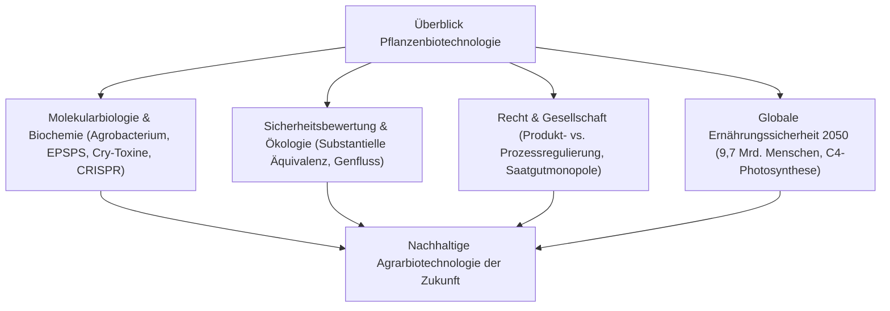

## Einleitung: Die Evolution der Pflanzenbiotechnologie
Die Geschichte der Züchtung ist seit 10.000 Jahren eine gezielte Selektion von Genomveränderungen. Rekombinante DNA-Technologien und moderne Genom-Editierungswerkzeuge wie CRISPR-Cas9 revolutionieren die Agrarwirtschaft durch punktgenaue Eingriffe, während gesellschaftliche Debatten über Biosicherheit und Patente anhalten.

## Kapitel 1: Züchtungsgeschichte und molekulare Grundlagen
Von der Domestikation über Mutationszüchtung (Strahlen- und Chemikalienmutationen) bis zur rDNA-Technik. Bakterielle Transformation via *Agrobacterium tumefaciens* (Ti-Plasmid, T-DNA-Transfer) und biolistische Partikelkanone (Genkanone).

## Kapitel 2: Biochemische Wirkmechanismen transgener Pflanzen
- **Herbizidtoleranz**: EPSPS-Hemmung im Shikimatweg durch Glyphosat; unempfindliches bakterielles CP4-EPSPS-Enzym. Glufosinat-Entgiftung via Phosphinothricin-Acetyltransferase (PAT).
- **Insektenresistenz**: Kristalline Bt-Cry-Proteine aus *Bacillus thuringiensis*, die selektiv im alkalischen Insektendarm Poren bilden. Unschädlich für Menschen durch rasche Magenabbauprozesse.
- **Virusresistenz & Biofortifikation**: Hüllenprotein-vermittelte Resistenz bei Papayas und Golden Rice (β-Carotin-Biosynthese im Reiskorn).

## Kapitel 3: Differenzierung: Klassische GVO vs. Genom-Editierung
CRISPR-Cas9, Basen- und Prime-Editierung ermöglichen sequenzspezifische Modifikationen. SDN-1 erzeugt gezielte Genausfälle ohne jegliche Fremd-DNA, weshalb diese Pflanzen naturidentischen Mutationen entsprechen.

## Kapitel 4: Globale Anbautrends und sozioökonomische Faktoren
190 Millionen Hektar weltweit (USA, Brasilien, Argentinien, Kanada, Indien). Ertragssteigerungen, Reduktion chemischer Insektizide und Ausweitung der CO2-sparenden pfluglosen Bodenbearbeitung (No-Till). Saatgutkonzentration bei Agrarkonzernen.

## Kapitel 5: Lebensmittelsicherheit und wissenschaftlicher Konsens
Das Prinzip der substantiellen Äquivalenz (OECD, WHO, FAO). Toxikologische Prüfungen, Pepsin-Verdauungstests und weltweiter wissenschaftlicher Konsens (NAS, EFSA) über die Unbedenklichkeit zugelassener GVO. Zurückweisung fehlerhafter Studien (Séralini-Affäre).

## Kapitel 6: Biosicherheit und ökologische Risikobewertung
Das Cartagena-Protokoll, Nichtzielorganismen (Monarchfalter-Studien), Genflusskontrolle und Refugienstrategien zur Vermeidung resistenter Schädlinge.

## Kapitel 7: Internationale Regulierungssysteme
US-Produktansatz (USDA, FDA, EPA) versus europäischer Prozessansatz (Richtlinie 2001/18/EG). Die neuen Deregulierungsvorschläge der EU-Kommission für NGT-Pflanzen (2023).

## Kapitel 8: Verbraucherpsychologie und Risikokommunikation
Kognitive Verzerrungen, intuitive Essentialismus-Konzepte ("Frankenfoods") und das Scheitern des Defizitmodells in der Wissenschaftskommunikation.

## Kapitel 9: Klimawandel, 9,7 Milliarden Menschen und Ernährungssicherheit
Steigerung der Agrarproduktion um 50 % bis 2050. C4-Reis-Konsortium zur Steigerung der Photosyntheseleistung, trockenheitstolerante Nutzpflanzen und biologische Stickstofffixierung in Getreide.

## Kapitel 10: Zukunftsausblick: Synthetische Biologie und De-Novo-Domestikation
Kombination von CRISPR zur Sofort-Domestikation widerstandsfähiger Wildarten und Molekulare Landwirtschaft (pflanzliche Impfstoffproduktion).
