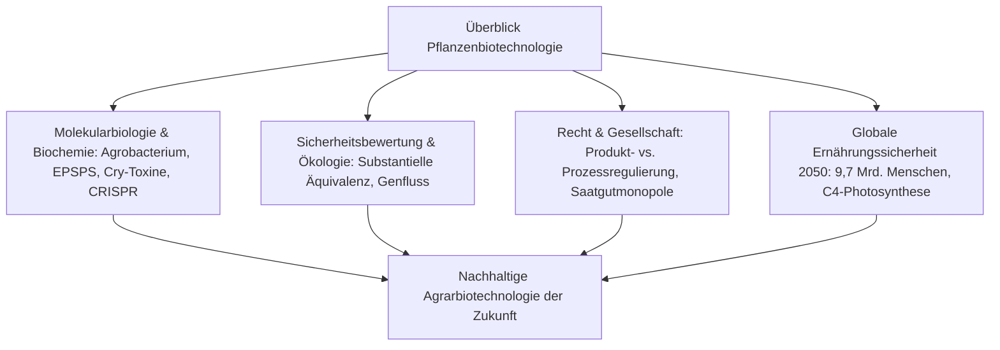
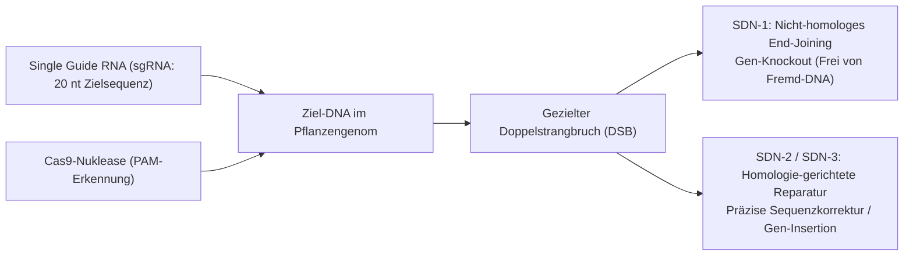

## Einleitung: Die Evolution der Pflanzenbiotechnologie

Die Geschichte der menschlichen Zivilisation ist untrennbar mit der gezielten genetischen Veränderung von Kulturpflanzen verbunden. Vor rund 10.000 Jahren begann der Mensch im Zuge der neolithischen Revolution mit der Selektion wilder Gräser, verhinderte das spontane Ausfallen der Samen (Verlust der Samenausbreitung), vergrößerte die essbaren Speicherorgane und reduzierte natürliche Bitterstoffe.

Mit dem Aufkommen der rekombinanten DNA-Technologie (rDNA) in den 1970er Jahren gelang es erstmals, funktionelle Gene gezielt über Artgrenzen hinweg zu übertragen. Im 21. Jahrhundert eröffnet die Entdeckung ortsspezifischer Nukleasen – allen voran CRISPR-Cas9, Basen- und Prime-Editierung – die Möglichkeit, das pflanzliche Genom mit Einzelnukleotid-Präzision direkt umzuschreiben.

Gleichzeitig stand die Agrarbiotechnologie stets im Zentrum intensiver gesellschaftlicher Kontroversen. Ängste vor „Frankenfoods“, Kritik an Saatgutmonopolen multinationaler Konzerne sowie Debatten über Genfluss und die Entstehung resistenter Unkräuter haben eine tiefe Kluft zwischen wissenschaftlichem Konsens und öffentlicher Risikowahrnehmung geschaffen.

---

## Kapitel 1: Züchtungsgeschichte und molekulare Grundlagen der Gentechnik

### 1.1 Von der Domestikation über Kreuzungs- zur Mutationszüchtung
Die Domestikation von Wildpflanzen war ein Jahrtausende währender Selektionsprozess. Der moderne Mais (*Zea mays*) entwickelte sich aus dem mexikanischen Wildgras Teosinte, das nur wenige harte Körner besaß. Im 20. Jahrhundert ermöglichte die wissenschaftliche Kreuzungszüchtung und die Nutzung des Heterosis-Effekts (F1-Hybriden) enorme Ertragssteigerungen. Jedoch stieß die Kreuzungszüchtung an biologische Grenzen: Gene ließen sich nur zwischen sexuell kompatiblen Arten austauschen, und unerwünschte flankierende Gene („Linkage Drag“) mussten mühsam über Generationen rückgekreuzt werden.

Die Mutationszüchtung mittels ionisierender Strahlung (Gamma-, Röntgenstrahlung) oder Chemikalien (Ethylmethansulfonat, EMS) erzeugte zwar tausende Sorten, blieb jedoch ein ungerichteter, zerstörerischer Prozess mit unkalkulierbaren genomweiten Begleitmutationen.

### 1.2 Die Werkzeuge der rekombinanten DNA-Technologie
In den 1970er Jahren etablierten Cohen, Boyer und Berg die rekombinante DNA-Technik auf Basis dreier molekularer Werkzeuge:
- **Restriktionsendonukleasen**: Bakterielle molekulare Scheren, die spezifische DNA-Erkennungssequenzen schneiden.
- **DNA-Ligase**: Molekularer Klebstoff zur Verknüpfung von Phosphodiesterbindungen.
- **Vektoren**: Plasmide zur autonomen Replikation und Genübertragung.

### 1.3 Transformationsmethoden: Agrobacterium und Partikelkanone
1. **Agrobacterium tumefaciens**: Natürlicher Gentransfer über das Ti-Plasmid. Durch Entwaffnung der Tumorbildungsgene und Einbau der Zielgene in die T-DNA transferiert das Bakterium über *vir*-Proteine fremde DNA stabil in das Pflanzengenom.
2. **Biolistische Partikelkanone (Gene Gun)**: Mit DNA beschichtete Gold- oder Wolframpartikel (0,6–1,0 μm) werden unter hohem Heliumdruck (bis 1.500 psi) direkt in Pflanzenzellen geschossen, unverzichtbar für Getreide und Chloroplastentransformation.

### 1.4 Aufbau von Pflanzen-Expressionskassetten
Eine funktionelle Kassette umfasst:
- **Promotor**: Konstitutive Promotoren (CaMV 35S, Ubiquitin-1) oder gewebespezifische Promotoren.
- **Zielgen (Coding Sequence)**: Für Pflanzen kodon-optimierte Gene (z. B. *cp4-epsps*, *cry1Ac*).
- **Terminator**: 3'-Polyadenylierungssignale (z. B. *nos*-Terminator).
- **Selektionsmarker**: Antibiotika- (*nptII*) oder Herbizidresistenzgene (*bar*).

---

## Kapitel 2: Biochemische Wirkmechanismen transgener Pflanzen

### 2.1 Herbizidtoleranz: Glyphosat und Glufosinat
- **Glyphosat-Toleranz (Roundup Ready)**: Glyphosat hemmt kompetitiv das Enzym EPSPS im Shikimatweg, wodurch die Synthese aromatischer Aminosäuren (Phe, Tyr, Trp) blockiert wird. Das aus *Agrobacterium* sp. CP4 isolierte bakterielle Enzym **CP4-EPSPS** bindet Glyphosat kaum und hält die Aminosäuresynthese intakt.
- **Glufosinat-Toleranz (LibertyLink)**: Glufosinat hemmt die Glutaminsynthetase, was zu toxischen Ammoniak-Anreicherungen führt. Das Enzym Phosphinothricin-Acetyltransferase (PAT, codiert durch *pat*/*bar*) acetyliert Glufosinat und entgiftet es vollständig.

### 2.2 Insektenresistenz: Bt-Cry-Proteine
Kristalline Endotoxine von *Bacillus thuringiensis* (Cry-Proteine) besitzen eine strikte Wirtsspezifität:
1. **Auflösung im alkalischen Darm**: Das inaktive Protoxin löst sich nur im stark alkalischen Mitteldarm (pH 9,0–11,0) von Schadinsekten.
2. **Proteolytische Spaltung**: Insektendarm-Proteasen spalten das Protoxin in das aktive 65-kDa-Toxin.
3. **Rezeptorbindung & Porenbildung**: Das Toxin bindet an Cadherin-Rezeptoren auf den Mikrovilli-Membranen, bildet oligomere Poren (1–2 nm) und führt zur osmotischen Lyse der Darmzellen und zum Tod der Larve.
4. **Sicherheit für Säugetiere**: Säugetiere besitzen keine entsprechenden Cadherin-Rezeptoren, und das saure Milieu des Magens (pH 1–2) baut Cry-Proteine binnen Sekunden vollständig ab.

### 2.3 Virusresistenz und Biofortifikation
- **Regenbogen-Papaya (Rainbow Papaya)**: Schutz vor dem Papaya Ringspot Virus (PRSV) durch RNA-Interferenz (RNAi), vermittelt über das virale Hüllprotein.
- **Goldener Reis (Golden Rice)**: Rekonstruktion des β-Carotin-Stoffwechsels im Reisendosperm durch Expression von Phytoensynthase (*psy*) und bakterieller Phytoendesaturase (*crtI*) zur Bekämpfung des Vitamin-A-Mangels.

---

## Kapitel 3: Differenzierung: Klassische GVO vs. CRISPR-Genom-Editierung

### 3.1 Gezielter Eingriff statt Zufallsinsertion
Klassische GVO enthalten dauerhaft fremde DNA, die zufällig ins Genom integriert wird. Die Genom-Editierung mittels CRISPR-Cas9 setzt gezielte Doppelstrangbrüche (DSBs) an exakt definierten Stellen, wodurch zielgerichtete Knockouts ohne Fremd-DNA realisiert werden.

### 3.2 Die SDN-Klassifikation
- **SDN-1**: Reparatur durch nicht-homologes End-Joining (NHEJ). Kleine Deletionen/Insertionen führen zum Funktionsverlust. **Keine Fremd-DNA enthalten**, biologisch identisch mit natürlichen Mutationen.
- **SDN-2**: Präzise Sequenzänderung durch homologe Reparaturmatrize.
- **SDN-3**: Gezielte Insertion größerer Fremdgen-Kassetten (unterliegt der klassischen GVO-Regulierung).

### 3.3 Kommerzielle Innovationen
- **High-GABA-Tomate (Sanatech Seed)**: Knockout der Autoinhibitionsdomäne der Glutamat-Decarboxylase steigert den blutdrucksenkenden GABA-Gehalt um das Vier- bis Fünffache.
- **Nicht-bräunende Pilze & hypoallergener Weizen**: Inaktivierung von Polyphenoloxidasen (*PPO*) und Zöliakie-auslösenden Gliadinen.

---

## Kapitel 4: Globale Anbautrends und sozioökonomische Faktoren
- **Globale Verbreitung**: Über 190 Millionen Hektar weltweit (USA 71,5 Mio. ha, Brasilien 52,8 Mio. ha, Argentinien 24,0 Mio. ha, Indien 11,9 Mio. ha). 78 % aller Sojabohnen und 76 % aller Baumwolle weltweit sind gentechnisch verändert.
- **Ökologische & ökonomische Dividenden**: 261 Milliarden Dollar zusätzliches Farmeinkommen, 748 Millionen kg weniger chemische Pflanzenschutzmittel und jährliche Sequestrierung von 23 Millionen Tonnen CO2 durch pfluglosen Anbau (No-Till).
- **Monopolproblematik**: Vier Großkonzerne dominieren den Markt für patentiertes Saatgut, was Fragen der bäuerlichen Autonomie aufwirft.

---

## Kapitel 5: Lebensmittelsicherheit und wissenschaftlicher Konsens
- **Substantielle Äquivalenz**: Der OECD/WHO/Codex-Prüfrahmen vergleicht GM-Sorten mit traditionellen isogenen Ausgangslinien.
- **Toxikologische Prüfungen**: Akute Toxizitätstests, Bioinformatik-Abgleiche mit Allergen-Datenbanken, Pepsin-Verdauungstests (<2 Minuten Abbau) und Nährstoffprofilierungen.
- **Wissenschaftlicher Konsens**: Akademien weltweit (US NAS, Royal Society, EFSA, WHO) bestätigen, dass zugelassene GM-Lebensmittel kein höheres Gesundheitsrisiko als konventionelle Produkte bergen. Widerlegung fehlerhafter Studien (Pusztai, Séralini).

---

## Kapitel 6: Biosicherheit und ökologische Risikobewertung
- **Cartagena-Protokoll**: Internationale Vorschriften für den grenzüberschreitenden Verkehr lebender modifizierter Organismen (LMO).
- **Nichtzielorganismen & Genfluss**: Feldforschungen widerlegten die Gefährdung des Monarchfalters unter natürlichen Bedingungen. Pufferzonen verhindern unerwünschte Auskreuzungen.
- **Resistenzmanagement**: Die gesetzliche Verpflichtung zu nicht-Bt-Refugienflächen (5–20 %) verhindert mathematisch die Zunahme resistenter Schädlingspopulationen.

---

## Kapitel 7: Internationale Regulierungssysteme im Vergleich
- **USA (Produktansatz)**: Coordinated Framework (USDA, FDA, EPA) bewertet Eigenschaften des Endprodukts; SDN-1-Pflanzen sind weitgehend von GVO-Auflagen befreit.
- **EU (Prozessansatz)**: Richtlinie 2001/18/EG und Vorsorgeprinzip. Nach dem EuGH-Urteil 2018 legte die EU-Kommission 2023 einen Gesetzentwurf zur Deregulierung von NGT-1-Pflanzen vor.
- **Japan (Transparenzmodell)**: Strenge GVO-Kontrollen nach dem Cartagena-Gesetz bei gleichzeitiger unbürokratischer Vorab-Meldepflicht für SDN-1.

---

## Kapitel 8: Verbraucherpsychologie und Risikokommunikation
- **Kognitive Verzerrungen**: Intuitiver Essentialismus (Ablehnung des „Unnatürlichen“) und Null-Risiko-Verzerrung schüren Skepsis.
- **Kommerzialisierte Angst**: „Ohne Gentechnik“-Labels auf Produkten ohne jegliches GM-Pendant (Salz, Mineralwasser) monetarisieren Verunsicherung.
- **Dialog statt Belehrung**: Abkehr vom wissenschaftlichen Defizitmodell hin zu wertebasiertem, transparentem Risikodialog.

---

## Kapitel 9: Klimawandel, 9,7 Milliarden Menschen und Ernährungssicherheit
- **Herausforderung 2050**: Notwendigkeit einer 50–70 % höheren Nahrungsmittelproduktion bei begrenzten Land- und Wasserressourcen (Nachhaltige Intensivierung).
- **C4-Reis**: Übertragung des hocheffizienten C4-Photosynthesewegs aus Mais in Reis zur Steigerung der Erträge um 50 % und Senkung des Wasserbedarfs.
- **Biologische Stickstofffixierung**: Getreidepflanzen mit diazotrophen Wurzelbakterien reduzieren den Bedarf an energieintensiven Kunstdüngern.

---

## Kapitel 10: Zukunftsperspektiven: Synthetische Biologie und De-Novo-Domestikation
- **De-Novo-Domestikation**: Gleichzeitige CRISPR-Editierung von 6–10 Domestikationsgenen verwandelt widerstandsfähige Wildpflanzen (*Solanum pimpinellifolium*) in nur einer Generation in ertragreiche Kulturpflanzen.
- **Molekulare Landwirtschaft (Molecular Farming)**: Pflanzen als Bioreaktoren zur kostengünstigen Herstellung von Impfstoffen, Antikörpern und tierfreien Milchproteinen.

---

## Fazit: Synthese aus wissenschaftlicher Vernunft und ökologischer Resilienz
Die Pflanzenbiotechnologie ist kein unnatürlicher Eingriff, sondern die logische, molekular präzisierte Fortsetzung der Jahrtausende alten Domestikation. Angesichts von Klimawandel und Bevölkerungswachstum ist sie ein unverzichtbares Werkzeug für globale Nachhaltigkeit und Ernährungssicherheit.
