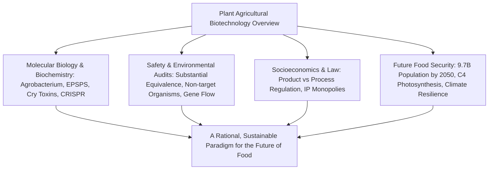
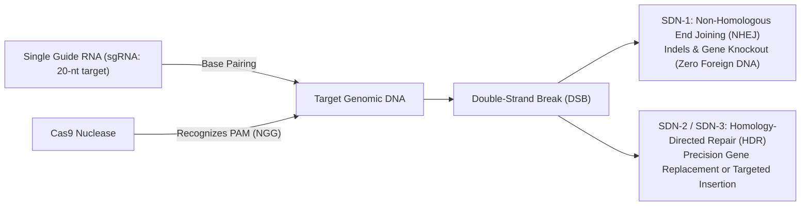

## Introduction: The Intellectual Horizon of Crop Genetics

Human civilization is fundamentally intertwined with the deliberate modification of plant genomes. Over 10,000 years of agricultural history, humanity transformed wild grasses into modern staple crops by selecting against seed shattering, enlarging edible organs, and reducing natural anti-nutrients.

The advent of Recombinant DNA Technology (rDNA) in the late 20th century enabled the precise transfer of functional genes across species barriers. In the 21st century, site-directed nuclease technologies—spearheaded by CRISPR-Cas9, base editing, and prime editing—have unlocked the capability to rewrite an organism's endogenous genetic code with single-nucleotide precision.

Yet, agricultural biotechnology has consistently found itself at the epicenter of fierce societal controversies. Fears of "Frankenfoods," critiques of multinational corporate seed monopolies, concerns regarding gene flow, and the evolution of superweeds have created a stark divide between scientific consensus and public risk perception.



This comprehensive whitepaper moves beyond superficial political rhetoric to analyze the molecular mechanisms, toxicological assessment protocols, biosafety frameworks, consumer cognitive psychology, and cutting-edge bioengineering required to nourish humanity sustainably.

---

## Chapter 1: Plant Breeding History and Molecular Principles of Genetic Modification

### 1.1 From Ancient Domestication to Recombinant DNA
Early domestication relied on artificial selection of rare natural mutations (e.g., transforming *Teosinte* into modern maize *Zea mays*). In the 20th century, scientific cross-breeding leveraged heterosis (hybrid vigor), but remained constrained by sexual compatibility barriers and severe linkage drag. Mutation breeding utilized ionizing radiation and chemical mutagens (EMS) to induce random genome-wide disruptions. Recombinant DNA technology overcame these limitations by utilizing restriction endonucleases, DNA ligases, and plasmid cloning vectors.

### 1.2 Plant Transformation Systems: Agrobacterium and Biolistics
1. **Agrobacterium tumefaciens**: A natural genetic engineer utilizing the Tumor-inducing (Ti) plasmid. By disarming the oncogenic genes within the T-DNA region and inserting agricultural genes of interest, scientists utilize the bacterial Vir protein machinery to transfer single-stranded T-DNA across plant cell walls into the host chromosomal genome.
2. **Particle Bombardment (Gene Gun)**: Heavy metal microprojectiles (gold or tungsten) coated with plasmid DNA accelerated under high-pressure helium gas (900–1,500 psi) physically penetrate plant cell walls, enabling transformation of monocots and plastid genomes.

### 1.3 Expression Cassette Architecture
A functional plant expression cassette integrates:
- **Promoters**: Constitutive drivers (CaMV 35S, Ubiquitin-1) or tissue-specific/inducible promoters.
- **Coding Sequences**: Codon-optimized target genes (e.g., *cp4-epsps*, *cry1Ac*).
- **Terminators**: Polyadenylation signal sequences (e.g., *nos* terminator).
- **Selectable Markers**: Antibiotic (*nptII*, *hpt*) or herbicide (*bar*) resistance genes facilitating in vitro tissue culture screening.

---

## Chapter 2: Biochemistry of Major Transgenic Traits

### 2.1 Herbicide Tolerance: Glyphosate and Glufosinate
- **Glyphosate Resistance (Roundup Ready)**: Glyphosate inhibits EPSPS (5-enolpyruvylshikimate-3-phosphate synthase), shutting down the shikimate pathway responsible for aromatic amino acid synthesis (Phe, Tyr, Trp). Transgenic crops express bacterial **CP4-EPSPS** from *Agrobacterium* sp. strain CP4, which retains high affinity for phosphoenolpyruvate (PEP) while exhibiting near-zero binding affinity for glyphosate.
- **Glufosinate Resistance (LibertyLink)**: Expresses the *pat* or *bar* gene encoding phosphinothricin acetyltransferase, which acetylates and detoxifies glufosinate, preventing toxic ammonium accumulation caused by glutamine synthetase inhibition.

```mermaid
flowchart TD
    PEP["Phosphoenolpyruvate (PEP)"] + S3P["Shikimate-3-Phosphate (S3P)"] --> ENZ{"EPSPS Enzyme"}
    GLY["Glyphosate Application"] -. "Competitive Inhibition" .-> ENZ
    ENZ -- "Inhibited" --> ARO["Aromatic Amino Acid Depletion -> Plant Death"]
    
    CP4["Bacterial CP4-EPSPS Introduced"] -- "Impervious to Glyphosate" --> BYPASS["Normal Shikimate Pathway Maintained -> Crop Thrives"]
```

### 2.2 Insect Resistance: Bt Cry Proteins
*Bacillus thuringiensis* crystal endotoxins (Cry proteins) exhibit extreme target specificity:
1. **Solubilization**: The inactive protoxin (130 kDa) dissolves only in the alkaline midgut (pH 9.0–11.0) of target lepidopteran larvae.
2. **Activation**: Insect-specific proteases cleave the protoxin into an active 65 kDa core toxin.
3. **Pore Formation**: The toxin binds specifically to cadherin-like receptors and aminopeptidase N on midgut microvillar membranes, forming oligomeric cation-permeable pores (1–2 nm) that trigger colloid-osmotic cell lysis, gut destruction, and larval death.
4. **Mammalian Safety**: Humans and other mammals lack midgut cadherin Cry receptors, and their acidic stomach juices (pH 1–2) rapidly degrade Cry proteins into harmless amino acids within seconds.

### 2.3 Viral Resistance and Biofortification
- **Rainbow Papaya**: Utilizes coat protein-mediated RNA interference (RNAi) to destroy invading Papaya Ringspot Virus (PRSV) genomic RNA, rescuing Hawaii's papaya industry.
- **Golden Rice**: Metabolic engineering reconstructing the provitamin A (β-carotene) biosynthetic pathway in rice endosperm via Daffodil/Maize phytoene synthase (*psy*) and bacterial phytoene desaturase (*crtI*).

---

## Chapter 3: Differentiating GMOs from CRISPR Genome Editing

### 3.1 The Paradigm Shift: Random Insertion vs. Site-Directed Editing
Unlike traditional GMOs that integrate foreign DNA randomly into host chromosomes, genome editing utilizes engineered nucleases to introduce targeted double-strand breaks (DSBs) at precise genomic loci.



### 3.2 The SDN Classification System
- **SDN-1**: Repairs DSBs via Non-Homologous End Joining (NHEJ), introducing small insertions/deletions (indels) that knock out target gene functions. **Contains zero foreign DNA** and is physically indistinguishable from spontaneous natural mutations.
- **SDN-2**: Employs a short homologous repair template to introduce precise single-base or small-scale sequence edits via Homology-Directed Repair (HDR).
- **SDN-3**: Inserts large foreign gene expression cassettes into targeted sites. Regulated under traditional GMO statutes.

### 3.3 Commercial Realities
- **Sicilian Rouge High-GABA Tomato**: Knockout of the autoinhibitory domain of glutamate decarboxylase (*GAD*) elevates GABA concentrations 4- to 5-fold, commercialized in Japan.
- **Non-Browning Mushrooms & Low-Acrylamide Potatoes**: Inactivation of polyphenol oxidase (*PPO*) and asparagine synthetase.

---

## Chapter 4: Global Cultivation Trends and Socioeconomic Impacts
- **Global Adoption**: GM crop acreage expanded from 1.7 million hectares in 1996 to approximately 190 million hectares across 29 countries, representing 12% of global arable land.
- **Dominant Adopters**: United States (71.5M ha), Brazil (52.8M ha), Argentina (24.0M ha), Canada (12.5M ha), India (11.9M ha).
- **Environmental & Economic Dividends**: Over 25 years, GM crops generated $261 billion in farm income, slashed chemical pesticide active ingredient applications by 748 million kg, and expanded no-till conservation agriculture, sequestering 23 million metric tons of CO2 annually.
- **Structural Challenges**: Intellectual property concentration among Big Ag conglomerates (Bayer, Corteva, Syngenta, BASF) restricting farmer seed saving and igniting debates over food sovereignty.

---

## Chapter 5: Human Health Safety and Scientific Evidence
- **Substantial Equivalence**: The foundational OECD/WHO/Codex framework assessing compositional, nutritional, and toxicological parity against conventional isolines.
- **Safety Testing**: Acute oral toxicity bioassays, in silico allergen sequence alignments, pepsin gastric fluid digestion tests (<2 min degradation), and comprehensive multi-omics profiling.
- **Global Scientific Consensus**: Endorsements from the National Academy of Sciences (NAS), World Health Organization (WHO), European Food Safety Authority (EFSA), and American Medical Association (AMA) confirming approved GM foods pose no higher risk than conventional foods.
- **Debunked Studies**: Formal journal retractions of the Séralini (2012) rat tumor study and Pusztai lectin potato trials due to fatal methodological flaws and tumor-prone Sprague-Dawley rat models.

---

## Chapter 6: Biosafety and Ecological Risk Assessments
- **The Cartagena Protocol on Biosafety**: Global rules governing transboundary movements of Living Modified Organisms (LMOs).
- **Non-Target Organisms**: Comprehensive field trials disproved the laboratory Monarch butterfly (*Danaus plexippus*) mortality hypothesis under realistic open-pollination conditions.
- **Gene Flow**: Mitigated via physical buffer zones and spatial isolation.
- **Resistance Management**: Mathematical refuge strategies (mandating 5–20% non-Bt crop blocks) preserve susceptible pest alleles (*R*), preventing homozygous resistant (*rr*) insect surges.

---

## Chapter 7: International Regulatory Divergence
- **United States (Product-Based)**: Coordinated Framework (USDA-APHIS, FDA, EPA). SDN-1 genome-edited crops are exempt from GMO oversight under the SECURE rule.
- **European Union (Process-Based)**: Precautionary principle under Directive 2001/18/EC. Following the controversial 2018 ECJ ruling, the European Commission introduced a 2023 proposal to deregulate NGT-1 (SDN-1) plants.
- **Japan (Hybrid Model)**: Rigorous Cartagena Act screening for GMOs, paired with a transparent prior notification and open-data registry system for SDN-1 genome-edited organisms.

---

## Chapter 8: Consumer Psychology and Risk Communication
- **Cognitive Biases**: Affect heuristics, dread risk, intuitive essentialism (ontological boundary violation), and zero-risk bias fuel public GMO aversion.
- **Frankenfood Marketing**: "Non-GMO Project" labeling on products lacking commercial GM equivalents (e.g., salt, water) commercializes consumer anxiety.
- **Overcoming the Deficit Model**: Replacing didactic lectures with empathetic, bi-directional deliberative dialogues regarding shared sustainability values.

---

## Chapter 9: Climate Change, 9.7 Billion Humans, and Food Security
- **The 2050 Imperative**: Food production must increase 50–70% on finite arable land without deforestation.
- **C4 Rice Engineering**: The International C4 Rice Consortium is engineering maize C4 photosynthetic enzymes and Kranz anatomy into C3 rice, targeting 50% yield gains, 50% water savings, and 30% nitrogen efficiency.
- **Synthetic Nitrogen Fixation**: Engineering cereal crops to establish rhizobial symbioses and deploying gene-edited soil bacteria (Pivot Bio) to curb synthetic Haber-Bosch fertilizers and greenhouse N2O emissions.

---

## Chapter 10: Future Horizons and Planetary Stewardship
- **Synthetic Biology & De Novo Domestication**: Using CRISPR to simultaneously edit 6–10 domestication loci in stress-hardy wild relatives (*Solanum pimpinellifolium*) to create climate-resilient commercial crops in a single generation.
- **Molecular Farming**: Utilizing crops as bioreactors for low-cost, scalable edible vaccines, monoclonal antibodies, and animal-free dairy proteins.
- **Conclusion**: Agricultural biotechnology is not a corporate weapon against nature, but humanity's most sophisticated and vital instrument for ecological resilience and planetary survival.
