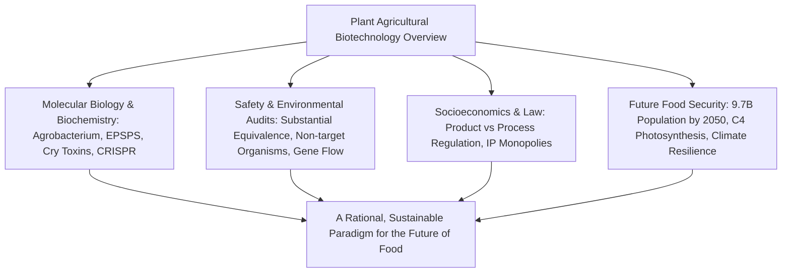
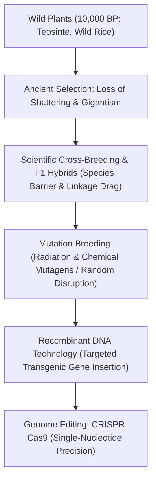
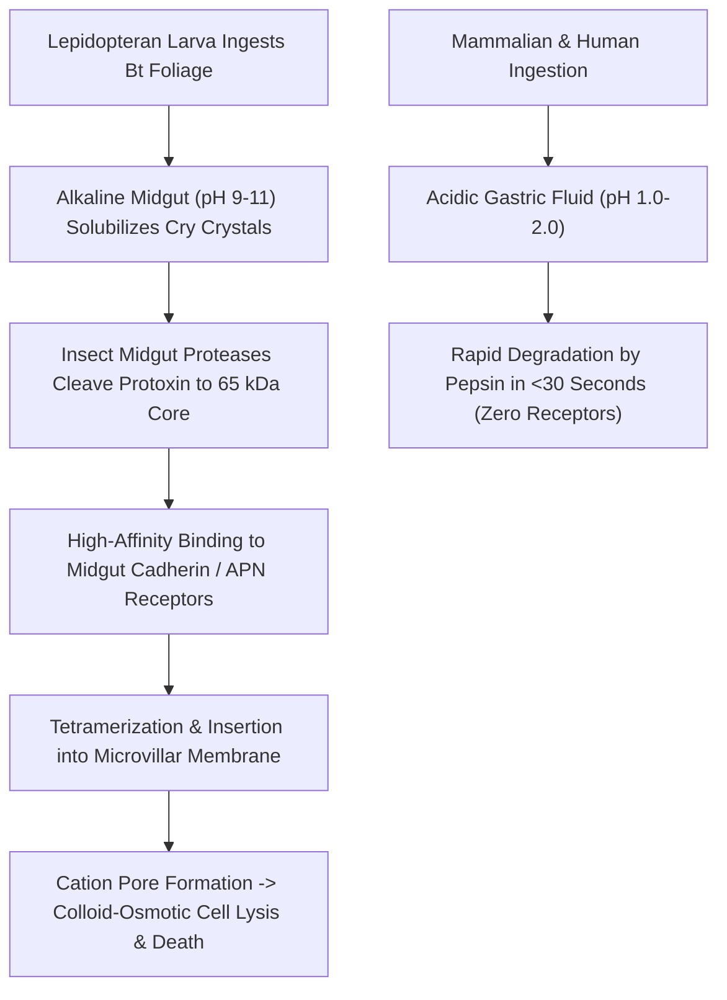
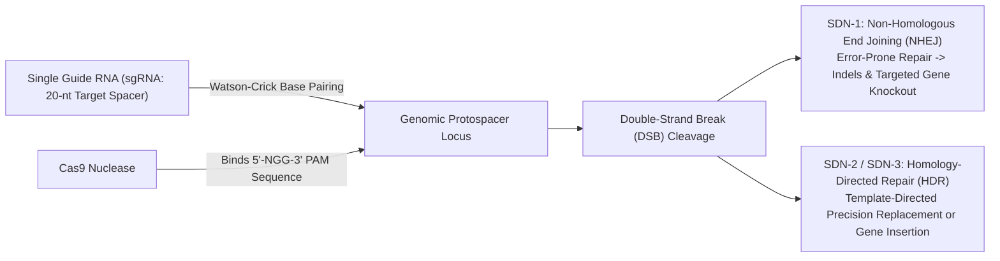

## Introduction: The Intellectual Horizon of Crop Genetics

The history of human civilization is fundamentally intertwined with the deliberate modification of plant genomes. Over 10,000 years of agricultural history, humanity transformed wild grasses into modern staple crops by selecting against seed shattering, enlarging edible organs, and reducing natural anti-nutrients.

The advent of Recombinant DNA Technology (rDNA) in the late 20th century enabled the precise transfer of functional genes across species barriers. In the 21st century, site-directed nuclease technologies—spearheaded by CRISPR-Cas9, base editing, and prime editing—have unlocked the capability to rewrite an organism's endogenous genetic code with single-nucleotide precision.

Yet, agricultural biotechnology has consistently found itself at the epicenter of fierce societal controversies. Fears of "Frankenfoods," critiques of multinational corporate seed monopolies, concerns regarding gene flow, and the evolution of superweeds have created a stark divide between scientific consensus and public risk perception.



This comprehensive whitepaper moves beyond superficial political rhetoric to analyze the molecular mechanisms, toxicological assessment protocols, biosafety frameworks, consumer cognitive psychology, and cutting-edge bioengineering required to nourish humanity sustainably.

## Chapter 1: Plant Breeding History and Molecular Principles of Genetic Modification

### 1.1 From Ancient Domestication to Recombinant DNA
Human civilization began with the Neolithic agricultural revolution approximately 10,000 years ago. Early humans intuitively practiced artificial selection on wild plants, favoring non-shattering seeds (preventing spontaneous dispersal), reduced bitterness, and enlarged edible biomass. Modern maize (*Zea mays*) is a prime testament: its wild ancestor, teosinte (*Zea mays* ssp. *parviglumis*), possessed only 5–12 hard, cupulate fruitcases. Through continuous selection on key morphological regulatory genes (such as *tb1* and *tga1*), ancient farmers radically restructured plant architecture into giant ears containing hundreds of exposed kernels.

In the 20th century, modern scientific breeding emerged through Mendelian genetics:
1. **Cross-Breeding and Heterosis (Hybrid Vigor)**: Crossing inbred parental lines to exploit hybrid vigor revolutionized crop yields. However, conventional hybridization is fundamentally constrained by reproductive barriers—genes can only be transferred between sexually compatible species. Furthermore, "linkage drag" inevitably introduces undesirable chromosomal segments flanking the target gene, requiring decades of laborious backcrossing.
2. **Mutation Breeding**: Mid-20th-century breeders turned to physical mutagens (gamma rays, X-rays, heavy-ion beams) and chemical agents (ethyl methanesulfonate, EMS) to induce random DNA lesions. While this generated thousands of commercial cultivars (such as semi-dwarf rice and malting barley), mutation breeding represents uncontrolled, genome-wide mutagenesis. Inducing millions of random nucleotide breaks in the hope of generating a single beneficial mutation carries the intrinsic risk of accumulating deleterious background mutations.



### 1.2 The Molecular Toolset of Recombinant DNA
Recombinant DNA (rDNA) technology, pioneered in the 1970s by Stanley Cohen, Herbert Boyer, and Paul Berg, bypassed sexual barriers by operating directly at the molecular level. This breakthrough rested upon three fundamental molecular tools:
- **Type II Restriction Endonucleases**: Bacterial enzymes that recognize specific palindromic DNA sequences and introduce precise phosphodiester bond hydrolytic cuts, generating cohesive "sticky" or blunt ends.
- **DNA Ligase**: ATP-dependent molecular glue that repairs the phosphodiester backbone, joining foreign DNA inserts into vector backbones.
- **Cloning & Expression Vectors**: Autonomous replicons (such as bacterial plasmids and phages) engineered with multiple cloning sites (MCS), origins of replication, and selectable markers.

### 1.3 Plant Transformation Systems: Agrobacterium and Biolistics
Introducing foreign DNA into plant cells requires overcoming the rigid cellulose plant cell wall. Two dominant transformation methodologies were established:

#### ① Agrobacterium-Mediated Transformation
The soil-borne phytopathogen *Agrobacterium tumefaciens* is nature's own genetic engineer. In nature, it infects wounded dicotyledonous plants, transferring a specific segment of its Tumor-inducing (Ti) plasmid—the **T-DNA (Transferred DNA)**—into the plant nuclear genome, inducing crown gall tumors that synthesize opines to feed the bacteria.

Molecular biologists disarmed this system:
1. The oncogenic and opine synthesis genes inside the T-DNA were excised ("disarmed Ti plasmid").
2. Target agricultural genes and plant selectable markers were inserted between the 25-base-pair T-DNA Left and Right Border sequences.
3. Virulence proteins (*vir* gene products) cut single-stranded T-DNA, coat it as a VirE2 nucleoprotein complex, and chaperone it through plant nuclear pore complexes for integration into host chromosomes via non-homologous end joining.

Initially restricted to dicots, optimization with phenolic vir-inducers (such as acetosyringone) enabled high-efficiency transformation of major monocot cereals (rice, maize, wheat).


#### ② Biolistic Particle Bombardment (Gene Gun)
Developed by John Sanford and colleagues, biolistics bypasses biological barriers via physical acceleration. Microscopic gold or tungsten microprojectiles (0.6–1.0 μm) coated with plasmid DNA are propelled under high-pressure helium gas (900–1,500 psi) into plant tissues or embryogenic calli. Although biolistics frequently leads to complex, multi-copy integrations and chromosomal rearrangements, it remains essential for species recalcitrant to *Agrobacterium* and for transforming plastid genomes (chloroplast transformation).

### 1.4 Architecture of Plant Expression Cassettes
Stable transgenic expression requires meticulous structural optimization within the expression cassette:
- **Promoters**: Constitutive promoters such as the Cauliflower Mosaic Virus 35S (CaMV 35S), maize *Ubiquitin-1*, or rice *Actin-1* drive high-level expression across all vegetative tissues. Alternatively, tissue-specific (e.g., endosperm-specific glutelin promoters) or abiotic stress-inducible promoters are employed to restrict expression spatially and temporally.
- **Codon Optimization**: Modifying synthetic coding sequences to reflect host plant tRNA abundance and GC content eliminates premature polyadenylation signals and enhances translation efficiency.
- **Terminators**: 3' untranslated regions (such as the *nos* terminator from nopaline synthase or the *rbcS* terminator) ensure proper pre-mRNA cleavage, polyadenylation, and cytoplasmic mRNA stability.
- **Selectable Markers**: Genes imparting resistance to antibiotics (e.g., *nptII* for kanamycin, *hpt* for hygromycin) or herbicides (e.g., *bar* for glufosinate) allow visual or chemical isolation of rare transformed cells. Modern transformation frequently incorporates Cre/*loxP* or FLP/*FRT* recombinase systems to excise marker genes post-selection, yielding marker-free commercial lines.

## Chapter 2: Biochemistry of Major Transgenic Traits

### 2.1 Herbicide Tolerance: Glyphosate and Glufosinate
Herbicide-tolerant (HT) crops constitute over 80% of global commercial transgenic acreage. By permitting over-the-top application of broad-spectrum herbicides, they replaced intensive mechanical tillage and complex multi-chemical weed control regimens.

#### ① Glyphosate Tolerance (Roundup Ready)
Glyphosate (*N*-(phosphonomethyl)glycine) is a systemic, broad-spectrum herbicide that acts as a transition-state competitive inhibitor of the enzyme **EPSPS (5-enolpyruvylshikimate-3-phosphate synthase)**. EPSPS catalyzes the penultimate step of the shikimate pathway—the condensation of shikimate-3-phosphate (S3P) and phosphoenolpyruvate (PEP) into 5-enolpyruvylshikimate-3-phosphate.

Because the shikimate pathway is the sole metabolic route for synthesizing essential aromatic amino acids (phenylalanine, tyrosine, and tryptophan) and downstream phenylpropanoids (lignin, flavonoids), glyphosate binding arrests protein synthesis and causes toxic accumulation of upstream shikimate intermediates, starving and killing the plant within 7–14 days. Notably, animals lack the shikimate pathway entirely, obtaining aromatic amino acids through dietary intake.

Monsanto researchers isolated *Agrobacterium* sp. strain CP4 from glyphosate factory wastewater. The bacterial EPSPS enzyme (**CP4-EPSPS**) features subtle conformational variations in its catalytic cleft: it binds the natural substrate PEP with high affinity but exhibits an exceptionally low affinity for glyphosate. When fused to a chloroplast transit peptide (CTP) and expressed in crops (soybean, maize, cotton, canola), CP4-EPSPS sustains aromatic amino acid synthesis unhindered, rendering crops fully immune to glyphosate applications.

```mermaid
flowchart TD
    PEP["Phosphoenolpyruvate (PEP)"] + S3P["Shikimate-3-Phosphate (S3P)"] --> ENZ{"Plant Class I EPSPS"}
    GLY["Glyphosate Application"] -. "Competitive Inhibition at PEP Site" .-> ENZ
    ENZ -- "Enzyme Inactivation" --> ARO["Aromatic Amino Acid Depletion -> Plant Death"]
    
    CP4["Bacterial CP4-EPSPS Introduced"] -- "Low Affinity for Glyphosate" --> BYPASS["Unimpaired Shikimate Flux -> Crop Thrives"]
```

#### ② Glufosinate Tolerance (LibertyLink)
Glufosinate-ammonium is a synthetic analog of phosphinothricin, a natural microbial toxin from *Streptomyces viridochromogenes*. It irreversibly inhibits glutamine synthetase (GS), the central enzyme in plant nitrogen assimilation. This blocks the conversion of glutamate and ammonia into glutamine, causing toxic intracellular accumulation of free ammonia that rapidly uncouples photosynthetic photophosphorylation.

Tolerance is conferred by introducing the **`pat`** or **`bar`** genes encoding phosphinothricin acetyltransferase (PAT). PAT specifically transfers an acetyl group from acetyl-CoA to the free amino group of glufosinate, converting it into non-toxic *N*-acetyl-glufosinate, thereby protecting the plant.

### 2.2 Insect Resistance: Bt Cry Proteins
Insect-resistant crops express crystalline endotoxins (**Cry proteins**) derived from the ubiquitous soil bacterium *Bacillus thuringiensis* (Bt). Bt sprays have been utilized by organic farmers since the 1930s, but transgenic expression directly within plant tissues provides continuous, weather-independent protection against destructive boring pests (such as the European corn borer, *Ostrinia nubilalis*, and cotton bollworm, *Helicoverpa zea*).

#### The Multi-Step Pore-Forming Cascade:
1. **Solubilization**: The ingested crystalline protoxin (typically 130–140 kDa) is completely insoluble at neutral or acidic pH. It dissolves exclusively within the highly alkaline midgut environment (pH 9.0–11.0) characteristic of lepidopteran and coleopteran larvae.
2. **Proteolytic Activation**: Insect midgut endoproteases cleave N-terminal and C-terminal prosegments, liberating an active core toxin of ~60–65 kDa consisting of three structural domains: Domain I (a seven-helix bundle mediating membrane insertion), Domain II (three antiparallel β-sheets dictating receptor recognition), and Domain III (a β-sandwich involved in receptor binding and ion channel stabilization).
3. **Specific Receptor Binding**: The core toxin binds with high nanomolar affinity to specific cadherin-like transmembrane proteins (CAD) and aminopeptidase N (APN) on the microvillar brush border membrane of midgut epithelial cells.
4. **Oligomerization and Membrane Insertion**: Receptor binding induces proteolytic cleavage of the α-1 helix, driving toxin monomers to assemble into a tetrameric pre-pore oligomer. This oligomer undergoes a conformational shift, inserting its hydrophobic helical hairpins into the lipid bilayer.
5. **Colloid-Osmotic Lysis**: The resulting cation-permeable lytic pores (1–2 nm diameter) disrupt intracellular osmotic equilibrium. Influx of water and cations causes catastrophic swelling and lysis of midgut epithelial cells, gut wall perforation, paralysis, septicemia, and larval death within 48–72 hours.



#### Mammalian Safety Rationale:
Cry proteins pose zero toxicity to humans, livestock, and non-target wildlife due to two fundamental physiological barriers:
- **Acidic Gastric Hydrolysis**: Human gastric fluid is strongly acidic (pH 1.0–2.0). Cry proteins are rapidly denatured and cleaved into harmless peptide fragments and amino acids by pepsin within seconds.
- **Total Absence of Target Receptors**: The specific cadherin extracellular domain loop epitopes required for Cry toxin binding are genetically absent in the mammalian gastrointestinal tract. Without receptor-mediated oligomerization, Cry proteins act as non-toxic dietary proteins.

### 2.3 Viral Resistance: Coat Protein-Mediated RNA Interference
Plant viruses cause devastating agricultural losses because chemical virucides do not exist. In the 1990s, Hawaii's papaya industry faced annihilation from the aphid-transmitted Papaya Ringspot Virus (PRSV).

Dennis Gonsalves and colleagues cloned the PRSV coat protein (*cp*) gene and transformed papaya via biolistics, creating the "Rainbow" and "SunUp" cultivars. The underlying defense mechanism is post-transcriptional gene silencing (**PTGS / RNA interference**):
1. Overexpression of viral coat protein sequences generates double-stranded RNA (dsRNA) hairpins.
2. Host Dicer-like (DCL) endonucleases cleave these dsRNAs into 21–24 nucleotide small interfering RNAs (siRNAs).
3. The RNA-Induced Silencing Complex (RISC) incorporates these siRNAs to target and degrade incoming viral genomic RNA, providing complete viral immunity.

### 2.4 Biofortification: The Metabolic Engineering of Golden Rice
Micronutrient malnutrition ("hidden hunger") affects over two billion people worldwide. Vitamin A deficiency (VAD) is particularly severe in developing nations reliant on polished white rice, causing blindness in 500,000 children annually and elevating childhood mortality from common infections.

While rice leaves synthesize carotenoids, wild-type rice endosperm (the edible milled kernel) accumulates geranylgeranyl diphosphate (GGPP) but silences downstream carotenoid biosynthetic enzymes. Ingo Potrykus and Peter Beyer engineered **Golden Rice** by reconstituting provitamin A synthesis exclusively in the endosperm:
1. **`psy` (Phytoene Synthase)**: Derived from maize (*Zea mays*), this enzyme condenses two molecules of GGPP into the uncolored intermediate phytoene under an endosperm-specific glutelin promoter.
2. **`crtI` (Phytoene Desaturase)**: Derived from the soil bacterium *Pantoea ananatis* (formerly *Erwinia uredovora*). Plants require two distinct desaturases (PDS and ZDS) plus isomerases to convert phytoene to lycopene. The bacterial CrtI enzyme performs all four desaturation steps autonomously.

Endogenous rice endosperm lycopene cyclase enzymes subsequently cyclize lycopene into β-carotene, conferring a distinct golden hue. A single cup of Golden Rice 2 (GR2E) provides over 50% of the Recommended Dietary Allowance (RDA) of vitamin A for children.


### 2.5 Abiotic Stress Tolerance: Cold Shock Protein B and Osmoprotection
Climate change amplifies water scarcity. Commercial drought-tolerant maize (DroughtGard / MON87460) expresses **Cold Shock Protein B (CSPB)** from *Bacillus subtilis*.

Under severe moisture deficit, cellular water potential plummets, causing cellular mRNAs to misfold into stable secondary hairpin structures that stall ribosomes and halt translation. CSPB functions as an RNA chaperone: it binds non-specifically to single-stranded RNA, destabilizing aberrant secondary structures and preserving translation elongation. This enables corn plants to maintain stomatal conductance, photosynthetic efficiency, and kernel development under drought stress.

## Chapter 3: Differentiating GMOs from CRISPR Genome Editing

### 3.1 The Paradigm Shift: Random Insertion vs. Site-Directed Editing
Public discourse frequently conflates traditional genetic modification (transgenesis) with modern genome editing. In reality, they represent fundamentally distinct technological and biological paradigms:

| Criterion | Conventional GMO (Transgenesis) | Genome Editing (CRISPR SDN-1) |
| :--- | :--- | :--- |
| **Origin of DNA Sequence** | **Heterologous foreign DNA** from bacteria, viruses, or distant species. | **Endogenous plant genome sequence** modified in situ. |
| **Locus Specificity** | **Random integration** across the host genome; position cannot be controlled. | **Site-directed precision** targeting exact nucleotide coordinates. |
| **Presence of Foreign DNA** | Expression cassettes (promoters, antibiotic markers) **permanently integrated**. | Transient nuclease delivery or segregated out; **zero foreign DNA** remains. |
| **Biological Nature of Mutation** | Novel combinations not found in sexual breeding pools. | **Indistinguishable from spontaneous natural mutations**. |
| **Analytical Detectability** | Readily detected via PCR targeting transgenic junction fragments. | Cannot be distinguished from natural point mutations or chemical mutagenesis. |

Conventional GMO generation was inherently stochastic: transgenes inserted unpredictably, potentially causing insertional mutagenesis (disrupting vital host genes) or landing within transcriptionally inactive heterochromatin. Generating an elite commercial line required screening tens of thousands of transformants over years.

Genome editing, conversely, acts as a precision molecular scalpel, introducing targeted modifications at designated genomic coordinates without disturbing the remainder of the genome.

### 3.2 Evolution of Engineered Nucleases: ZFNs, TALENs, and CRISPR-Cas9
The development of targeted double-strand break (DSB) technologies evolved through three distinct generations:
1. **Zinc Finger Nucleases (ZFNs)**: Custom protein arrays recognizing 3-bp DNA triplets fused to the non-specific cleavage domain of *FokI* endonuclease. ZFN design was cumbersome, plagued by context-dependent binding failures and high off-target cleavage.
2. **Transcription Activator-Like Effector Nucleases (TALENs)**: Bacterial effector repeat domains from *Xanthomonas*, where individual 34-amino-acid modules recognize specific single nucleotides dictated by repeat-variable di-residues (RVDs). While more modular than ZFNs, cloning large repeat arrays remained technically challenging.
3. **CRISPR-Cas9**: Discovered as an adaptive immune mechanism in bacteria (*Streptococcus pyogenes*), CRISPR-Cas9 revolutionized biotechnology through RNA-guided targeting.

The CRISPR-Cas9 architecture requires only two components:
- **Cas9 Endonuclease**: A multi-domain enzyme possessing RuvC and HNH nuclease domains that cleave opposite DNA strands.
- **Single Guide RNA (sgRNA)**: A synthetic fusion of crRNA and tracrRNA. The 5' 20 nucleotides base-pair with the target genomic protospacer sequence adjacent to a 5'-NGG-3' **Protospacer Adjacent Motif (PAM)**.

Researchers can retarget Cas9 to virtually any genomic locus simply by altering the 20-nucleotide sgRNA sequence, reducing engineering timelines from months to days.



### 3.3 The SDN Classification Framework
Regulatory bodies globally classify site-directed nuclease applications into three distinct tiers:

| Category | Repair Mechanism | Donor Template | Resulting Genomic Alteration | Global Regulatory Status |
| :--- | :--- | :--- | :--- | :--- |
| **SDN-1** | **Non-Homologous End Joining (NHEJ)** | None | Imprecise repair creates 1–10 bp insertions or deletions (indels), causing frameshift mutations that **knock out gene function**. | **Zero foreign DNA**. Exempt from GMO regulations in USA, Japan, Brazil, Argentina, India, etc. |
| **SDN-2** | **Homology-Directed Repair (HDR)** | Short homologous oligonucleotide | Precision nucleotide substitutions or minor sequence corrections templated by a donor repair fragment. | Exempt in many jurisdictions if no foreign sequence is introduced. |
| **SDN-3** | **Homology-Directed Repair (HDR)** | Full-length donor plasmid | Targeted site-specific integration of an entire functional gene expression cassette. | **Regulated as a GMO** due to the presence of large exogenous gene inserts. |

### 3.4 Beyond Double-Strand Breaks: Base Editing and Prime Editing
Standard Cas9 cleaves both DNA strands, which can occasionally provoke large chromosomal deletions or translocations. Cutting-edge synthetic biology has engineered nuclease-free editing:
- **Base Editors (CBE & ABE)**: Catalytically impaired Cas9 nickases (nCas9) fused to deaminase enzymes (cytidine or adenosine deaminases). Base editors achieve direct C-to-T or A-to-G transitions without generating DSBs or requiring donor templates.
- **Prime Editing**: nCas9 fused to an engineered reverse transcriptase. Directed by a prime editing guide RNA (pegRNA) encoding both the target site and the desired genetic edit, prime editing can install all 12 possible base-to-base transitions, transversions, insertions, and deletions with surgical fidelity.

### 3.5 Commercial Case Studies
- **Sanatech Seed Sicilian Rouge High-GABA Tomato**: Japan became the first nation to commercialize an SDN-1 crop. Researchers targeted the autoinhibitory domain of glutamate decarboxylase (*GAD*), truncating the C-terminus. This unlocked constitutive GAD enzyme activity, elevating GABA (gamma-aminobutyric acid) concentrations 4- to 5-fold to support cardiovascular health.
- **Non-Browning Button Mushrooms**: Inactivation of polyphenol oxidase (*PPO*) genes prevents enzymatic browning upon bruising, reducing retail food waste.
- **Hypoallergenic Wheat and Soybean**: Targeted knockout of immunoreactive ω-5 gliadin and Gly m Bd 30K storage proteins prevents celiac and severe allergic reactions.

## Chapter 4: Global Cultivation Trends and Socioeconomic Impacts

### 4.1 ISAAA Adoption Metrics
According to the International Service for the Acquisition of Agri-biotech Applications (ISAAA), biotech crops represent the most rapidly adopted agricultural technology in modern history:
- **Acreage Expansion**: Cultivation surged from 1.7 million hectares in 1996 to over 190.4 million hectares across 29 nations by 2019—a **112-fold increase**.
- **Market Penetration**: Globally, **78% of all soybeans, 76% of all cotton, 30% of all maize, and 29% of all canola** are genetically modified. In primary export breadbaskets, adoption exceeds 90–95%.

### 4.2 Leading Adopter Nations
Biotech cultivation is heavily concentrated in the Western Hemisphere and select Asian economies:
1. **United States (71.5M ha)**: Global pioneer; 95% of soybeans and 93% of corn are biotech varieties.
2. **Brazil (52.8M ha)**: Extensive double-cropping (*safrinha*) systems rely entirely on insect-resistant, herbicide-tolerant stacked varieties.
3. **Argentina (24.0M ha)**: Transgenic soybeans underpin agricultural exports and no-till conservation systems across the Pampas.
4. **Canada (12.5M ha)**: Dominant producer of transgenic canola and soybean.
5. **India (11.9M ha)**: Adoption of Bt cotton exceeds 95%, transforming India into the world's leading cotton producer.

### 4.3 Quantifiable Economic and Environmental Dividends
A 25-year comprehensive meta-analysis by PG Economics (Brookes & Barfoot) documents profound socio-economic and ecological benefits:
- **Farm Income Gains**: Accumulated global farm income benefits reached **$261.3 billion**, with 55% resulting from reduced production costs and 45% from direct yield gains.
- **Pesticide Reductions**: Biotech crops reduced global pesticide active ingredient applications by **748.6 million kilograms (-7.2%)**, reducing the environmental impact quotient (EIQ) by 17.3%.
- **Soil Conservation & Carbon Sequestration**: Herbicide tolerance facilitated the widespread adoption of conservation zero-tillage (no-till) agriculture. Eliminating mechanical plowing reduces soil erosion, conserves moisture, slashes tractor diesel fuel consumption, and sequesters **23 million metric tons of CO2 annually** within soil organic matter—equivalent to removing 15 million automobiles from the road.

### 4.4 Structural Agribusiness Monopolies and Seed Sovereignty
The commercial success of GM crops has simultaneously exacerbated socioeconomic tensions:
- **Big Ag Consolidation**: Four multinational conglomerates (Bayer, Corteva, Syngenta, and BASF) control over 60% of the proprietary commercial seed and agrochemical markets.
- **Intellectual Property and Farm-Saved Seed**: Restrictive technology licensing agreements prohibit farmers from saving seed for replanting. Farmers must purchase new seed annually, raising input costs and sparking resistance regarding farmer autonomy and food sovereignty in the Global South.

---

## Chapter 5: Human Health Safety Assessments and Scientific Consensus

### 5.1 The Principle of Substantial Equivalence
Safety evaluations for GM foods are grounded in the concept of **Substantial Equivalence**, formulated by the OECD and codified by the Codex Alimentarius Commission (FAO/WHO):
- Rather than demanding absolute proof of zero risk (a scientific impossibility for any complex biological food), substantial equivalence compares the novel GM crop to its conventional non-transgenic near-isogenic counterpart that has an established **History of Safe Use**.
- If thorough molecular, compositional, and toxicological profiling reveals that the GM variety differs only in the intended intentional trait and poses no unexpected hazardous alterations, it is deemed as safe and nutritious as conventional food.

### 5.2 Multi-Tiered Safety Testing Protocols
Regulatory approval requires a rigorous suite of empirical bioassays:
1. **Molecular Integrity**: NGS mapping confirms insertion site stability, verifies flanking genomic sequences, and proves the absence of chimeric open reading frames (ORFs).
2. **Acute Oral Toxicity**: High-dose purified target protein is administered to rodent models at concentrations thousands of times higher than anticipated human dietary exposure, confirming the absence of lethality or organ pathology.
3. **Allergenicity Risk Assessment**:
   - Bioinformatic alignment against the WHO/FAO AllergenOnline database confirms no sequence identity matches (>35% identity across 80 amino acids or identical 8-amino-acid contiguous matches).
   - In vitro pepsin gastric fluid digestion tests demonstrate complete degradation into non-immunogenic fragments within 30 to 120 seconds at pH 1.2.
   - Thermal stability tests verify protein denaturation during standard culinary cooking.
4. **Comprehensive Compositional Profiling**: Measuring proximates, amino acids, fatty acids, micronutrients, and endogenous anti-nutrients (e.g., phytic acid, lectins, trypsin inhibitors) confirms equivalence within natural biological variation ranges.

### 5.3 Global Scientific Consensus
Every major independent scientific and medical academy across the globe has affirmed the safety of approved GM foods:
- **US National Academy of Sciences (NAS, 2016)**: Found no substantiated evidence of differences in risks to human health between commercially available GM and conventional crops.
- **European Commission (25 Years of Research)**: Reviewing over 130 public research projects encompassing 500 independent research groups concluded that biotechnology is not per se more risky than conventional plant breeding.
- **World Health Organization (WHO) & American Medical Association (AMA)**: Consistently state that commercial GM foods present no unique hazards to human consumers.

### 5.4 Debunking Flawed Studies: Pusztai and Séralini
Anti-biotechnology campaigns frequently cite discredited publications that were formally rejected by the scientific community:
- **The Pusztai Lectin Potato Affair (1998)**: Claims of rat intestinal atrophy were repudiated by the Royal Society due to catastrophic nutritional imbalances (feeding rats an exclusive raw potato diet deficient in protein).
- **The Séralini Affair (2012)**: Gilles-Éric Séralini published images of Sprague-Dawley rats with massive tumors allegedly induced by NK603 maize and Roundup. The paper was formally **retracted** by *Food and Chemical Toxicology* after EFSA and international regulatory bodies demonstrated that Sprague-Dawley rats develop tumors spontaneously at rates of 70–80% in old age, the sample sizes were statistically invalid, and no dose-response relationship existed.

---

## Chapter 6: Biosafety and Ecological Risk Assessments

### 6.1 The Cartagena Protocol on Biosafety
Governed under the Convention on Biological Diversity, the **Cartagena Protocol on Biosafety** establishes international rules governing transboundary movements of Living Modified Organisms (LMOs). It mandates Advance Informed Agreement (AIA) procedures and comprehensive environmental risk assessments (ERAs) to prevent adverse impacts on biological diversity.

### 6.2 Non-Target Organism Impacts: The Monarch Butterfly Controversy
In 1999, laboratory trials suggested Bt corn pollen caused mortality in Monarch butterfly (*Danaus plexippus*) larvae feeding on milkweed (*Asclepias*). Extensive two-year field studies orchestrated by the USDA and EPA disproved this threat in nature:
- Corn pollen is dense and settles within 3–5 meters of field edges.
- Pollen shedding periods rarely synchronize with peak monarch larval emergence.
- Modern commercial Bt events (such as MON810) express negligible Cry protein levels in pollen.
- Landscape-scale analyses demonstrated that eliminating broad-spectrum chemical insecticide sprays significantly enhanced overall beneficial insect biodiversity (predatory beetles, lacewings, parasitoid wasps).

### 6.3 Gene Flow and Introgression
Gene flow via pollen dispersal is a natural biological process governed by sexual compatibility:
- **Low-Risk Crops**: Crops lacking wild sexually compatible relatives in their cultivation regions (e.g., maize and soybean in Europe and Japan) present zero hybridization risk.
- **High-Risk Crops**: Crops with wild congeners (e.g., canola, *Brassica napus*, crossing with wild mustard, *Brassica rapa*) require spatial isolation buffers and physical separation distances mandated by law.

### 6.4 Herbicide-Resistant Superweeds and Insect Refuge Math
1. **Superweeds**: Continuous, exclusive over-application of glyphosate without chemical rotation exerted intense selective pressure, driving the emergence of glyphosate-resistant weeds (e.g., *Palmer amaranth*, *Conyza canadensis*). *Palmer amaranth* evolved resistance by amplifying the *EPSPS* gene locus dozens of times. This underscores the necessity of Integrated Weed Management (IWM), multi-herbicide stacked traits (glufosinate, dicamba, 2,4-D), and cover cropping.
2. **Refuge Strategy Mathematics**: To prevent target pests from evolving resistance to Bt crops, farmers are legally required to plant a structured "refuge" block of non-Bt crops (5–20% of acreage). Because Bt resistance alleles ($r$) are recessive, rare homozygous resistant moths ($rr$) emerging from Bt fields mate with the overwhelming majority of homozygous susceptible moths ($RR$) from refuge areas, producing heterozygous ($Rr$) progeny that remain fully susceptible to Bt toxin, thereby neutralizing resistance evolution.

```mermaid
flowchart TD
    REF["Mandatory Non-Bt Refuge Area (5-20% Acreage)"] --> RR["Abundant Homozygous Susceptible Moths (RR)"]
    BT["Bt Crop Acreage"] --> RES["Rare Emergent Resistant Moths (rr)"]
    RR + RES -- "Random Interbreeding" --> HET["Heterozygous Progeny (Rr)"]
    HET -- "Feed on Bt Crop" --> DIE["100% Mortality (Recessive Resistance Overcome)"]
```

---

## Chapter 7: Comparative International Regulations

### 7.1 The US Product-Based Coordinated Framework
The United States regulates biotechnology through the 1986 Coordinated Framework:
- **USDA-APHIS**: Evaluates potential agricultural plant pest risks.
- **FDA**: Ensures food and nutritional safety.
- **EPA**: Regulates Plant-Incorporated Protectants (PIPs) under pesticide statutes.
The US operates on a **product-based philosophy**: regulation evaluates the biological properties of the final organism rather than the process used to create it. Under the revised SECURE Rule, SDN-1 genome-edited crops that could have been achieved via conventional breeding are exempt from burdensome GMO oversight.

### 7.2 The European Union's Precautionary Process-Based Model
The EU enforces **Directive 2001/18/EC**, reflecting a **process-based philosophy** where any artificial genetic intervention triggers sweeping GMO mandates regardless of final composition. In 2018, the European Court of Justice (ECJ) ruled that genome-edited organisms are legally GMOs. However, facing climate instability and food inflation, the European Commission proposed a landmark legislative deregulation in July 2023 to exempt NGT-1 (SDN-1) plants from traditional GMO strictures.

### 7.3 The Japanese Regulatory Pathway
Japan utilizes a balanced regulatory approach:
- Transgenic GMOs require rigorous environmental approvals under the domestic Cartagena Act and food safety certification under the Food Sanitation Act.
- For genome-edited organisms (SDN-1), Japan implemented a forward-looking notification framework: developers submit pre-market scientific dossiers demonstrating target specificity and the complete absence of foreign vector sequences, maintaining transparency via a public registry.

---

## Chapter 8: Consumer Psychology, Ethics, and Risk Communication

### 8.1 Cognitive Biases Driving Public Fear
Consumer aversion to GM food stems from deep-rooted cognitive psychology:
- **Intuitive Essentialism**: Human cognition naturally attributes an unalterable "essence" to living species; cross-species gene transfer is perceived as an ontological violation of natural order.
- **Affect Heuristic and Dread Risk**: People accept familiar, voluntary risks (e.g., driving or alcohol) but react with intense dread to invisible, involuntary technological risks.
- **Zero-Risk Bias**: Demanding impossible absolute guarantees ("100% zero risk") prevents rational risk-benefit evaluations.

### 8.2 The "Frankenfood" Propaganda and Fear-Based Marketing
Tabloid media and advocacy campaigns commercialized fear. Food corporations capitalized on this anxiety through "Non-GMO Project" butterfly labels on products that never possessed a GM counterpart (e.g., salt, water, and blueberries), institutionalizing scientific distrust for commercial gain.

### 8.3 Overcoming the Information Deficit Model
Early scientific communication failed by adopting the **Deficit Model**—assuming public skepticism arose merely from a lack of scientific literacy. Psychological research demonstrates that bombarding anxious citizens with technical data triggers a defensive "backfire effect." Modern risk communication emphasizes empathetic, values-based deliberation that acknowledges legitimate ethical and societal concerns while demystifying molecular facts.

---

## Chapter 9: Climate Change and Food Security for 9.7 Billion People

### 9.1 The 2050 Agricultural Crisis
Global population will expand to **9.7 billion by 2050**, necessitating a **50–70% increase in food production**. Because arable land and freshwater reserves are already stretched to their environmental limits, humanity cannot expand clearing without triggering catastrophic Amazonian deforestation and runaway climate change. The only viable path forward is **Sustainable Intensification**—producing significantly more biomass per hectare while reducing synthetic inputs.

### 9.2 The C4 Rice Breakthrough
Most staple crops (rice, wheat, soybean) utilize **C3 photosynthesis**. C3 plants rely on the inefficient enzyme Rubisco, which erroneously binds atmospheric oxygen instead of carbon dioxide, initiating **photorespiration** that wastes up to 40% of photosynthetic energy under warm conditions.

In contrast, C4 crops (maize, sorghum, sugarcane) utilize Kranz leaf anatomy and phosphoenolpyruvate carboxylase (PEPC) to concentrate CO2 around Rubisco, virtually eliminating photorespiration. The International C4 Rice Consortium is engineering C4 metabolic enzymes and bundle-sheath anatomy directly into C3 rice. When completed, C4 rice will yield **50% more grain, double water-use efficiency, and improve nitrogen efficiency by 30%**.

### 9.3 Biological Nitrogen Fixation in Cereals
Chemical nitrogen fertilizer production via the Haber-Bosch process consumes 1–2% of global industrial energy and generates vast greenhouse gas emissions, alongside nitrous oxide (N2O) off-gassing and marine dead zones. Researchers are pursuing two transformative avenues:
1. **Engineering Rhizobial Symbiosis**: Rewiring cereal genomes with legume nodulation receptor kinases (NFR1/NFR5) to enable cereal-rhizobia symbiosis.
2. **Engineered Diazotrophic Endophytes**: Synthetic biology companies (such as Pivot Bio) have re-engineered the regulatory circuits of corn root-colonizing bacteria, derepressing nitrogenase enzymes to deliver nitrogen directly to crop roots, cutting chemical fertilizer needs by 20–40%.

### 9.4 Extreme Climate Adaptation
- **Stomatal Engineering**: Optimizing abscisic acid (ABA) receptors and tuning stomatal density via CRISPR produces drought-proof crops that conserve cellular water while maintaining biomass growth.
- **Halophytes and Saline Agriculture**: Inserting vacuolar Na+/H+ antiporters (*NHX1*) and high-affinity potassium transporters (*HKT1*) enables crops to thrive under seawater irrigation, transforming barren desert coastlines into productive farmland.

---

## Chapter 10: Future Horizons and Planetary Stewardship

### 10.1 Synthetic Biology and De Novo Domestication
Agricultural biotechnology is advancing from editing single genes to de novo genome synthesis:
- **De Novo Domestication**: Over millennia of domestication, cultivated crops sacrificed ancestral hardiness for yield. Using multiplexed CRISPR-Cas9, scientists edited 6 to 10 key domestication loci (*fruit size, day-length sensitivity, seed retention*) simultaneously in wild tomato (*Solanum pimpinellifolium*) within **a single generation**. This creates instant crops possessing the extreme resilience of wild ancestors alongside the high productivity of commercial cultivars.

### 10.2 Molecular Farming: Plants as Living Bioreactors
Plants are increasingly deployed as scalable, low-cost bio-factories:
- **Plant-Made Pharmaceuticals (PMPs)**: Utilizing *Nicotiana benthamiana* to produce monoclonal antibodies (e.g., ZMapp for Ebola), viral-like particle (VLP) vaccines, and human therapeutic enzymes in weeks rather than months.
- **Animal-Free Dairy and Meat Proteins**: Engineering soybeans and peas to express bovine casein and myoglobin, delivering authentic meat and cheese textures without livestock emissions or land footprint.

---

## Conclusion: Harmonizing Scientific Intellect with Ecological Resilience

The historical debate surrounding genetic engineering has been trapped within a false dichotomy pitting "unnatural corporate technology" against "pure traditional agriculture."

Molecular biology reveals that agricultural biotechnology is not an unnatural violation of nature; it is the direct, refined continuation of humanity's 10,000-year dialogue with the plant genome, elevated to atomic precision.

In an era defined by 9.7 billion humans, planetary boundaries, and accelerating climate destabilization, rejecting biotechnology in favor of nostalgic, low-efficiency farming practices would inevitably necessitate clearing the world's remaining tropical forests.

By grounding safety assessments in rigorous empirical science, enforcing biosafety stewardship, and establishing equitable international governance, plant biotechnology becomes our most powerful and ethical instrument to conquer hunger, heal planetary ecosystems, and secure a sustainable future for all generations.
