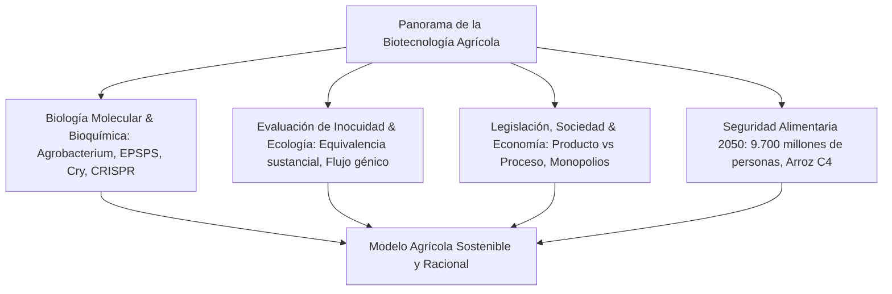
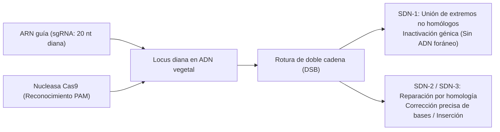

## Introducción: El horizonte de la biotecnología vegetal

La historia de la civilización humana es la historia de la modificación deliberada de los genomas vegetales. Desde la revolución neolítica hace 10.000 años, la humanidad seleccionó gramíneas silvestres suprimiendo la dispersión natural de granos, aumentando el tamaño de los órganos comestibles y eliminando toxinas endógenas.

La tecnología del ADN recombinante (ADNr) en los años 1970 permitió cruzar barreras de especie para transferir genes funcionales. En el siglo XXI, las herramientas de edición genómica con nucleasas dirigidas (CRISPR-Cas9, edición de bases y prime editing) permiten reescribir secuencias nativas con precisión quirúrgica de nucleótido único.

Sin embargo, la biotecnología agrícola ha enfrentado persistentes controversias sociales: campañas contra los «Frankenfoods», monopolios corporativos de patentes de semillas y temores sobre el flujo génico han polarizado el debate público frente al consenso científico.

---

## Capítulo 1: Historia del fitomejoramiento y principios del ADN recombinante

### 1.1 De la domesticación a la mutagénesis inducida
El teocintle silvestre fue transformado en maíz moderno mediante selección de genes maestros (*tb1*, *tga1*). El mejoramiento científico del siglo XX explotó el vigor híbrido (heterosis), pero chocó con la incompatibilidad sexual y el arrastre por ligamiento («linkage drag»). La mutagénesis por radiación o químicos (EMS) introdujo millones de roturas cromosómicas aleatorias sin control sobre mutaciones perjudiciales.

### 1.2 Herramientas moleculares del ADNr
La tecnología recombinante se basa en:
- **Endonucleasas de restricción**: Enzimas bacterianas que reconocen y cortan secuencias palindrómicas.
- **ADN ligasa**: Unión covalente de enlaces fosfodiéster.
- **Vectores de clonación**: Plásmidos para propagación y expresión génica.

### 1.3 Sistemas de transformación: Agrobacterium y biobalística
1. **Agrobacterium tumefaciens**: Transferencia biológica del T-DNA desde plásmidos Ti desarmados; las proteínas *vir* transportan el complejo de ADN monocatenario al núcleo vegetal para su integración cromosómica.
2. **Biobalística (Pistola de genes)**: Microproyectiles de oro o tungsteno acelerados con helio a alta presión (1.500 psi) atraviesan paredes celulares, técnica clave para monocotiledóneas y genomas de cloroplastos.

### 1.4 Estructura del casete de expresión
Elementos esenciales:
- **Promotores**: Constitutivos (CaMV 35S, Ubiquitina-1) o tejido-específicos.
- **Gen diana**: Secuencia codificante con codones optimizados.
- **Terminador**: Señales de poliadenilación (*nos*, *rbcS*).
- **Marcadores de selección**: Genes de resistencia a antibióticos (*nptII*) o herbicidas (*bar*).

---

## Capítulo 2: Mecanismos bioquímicos de los rasgos transgénicos

### 2.1 Tolerancia a herbicidas: Glifosato y Glufosinato
- **Tolerancia a glifosato (Roundup Ready)**: El glifosato inhibe la enzima EPSPS en la ruta del shikimato, frenando la síntesis de aminoácidos aromáticos (Phe, Tyr, Trp). La enzima bacteriana **CP4-EPSPS** de *Agrobacterium* sp. CP4 posee bajísima afinidad por el glifosato y mantiene intacta la ruta metabólica.
- **Tolerancia a glufosinato (LibertyLink)**: El glufosinato inhibe la glutamina sintetasa. La enzima fosfinotricina acetiltransferasa (PAT, genes *pat*/*bar*) acetila y desintoxica el compuesto.

### 2.2 Resistencia a insectos: Proteínas Cry de Bacillus thuringiensis
1. **Solubilización alcalina**: Las protoxinas cristalinas (130 kDa) se solubilizan únicamente en el intestino alcalino (pH 9,0–11,0) de las orugas diana.
2. **Activación proteolítica**: Proteasas del insecto cortan la protoxina rindiendo la toxina activa de 65 kDa.
3. **Unión a receptores y poros líticos**: La toxina se une a receptores cadherina y forma poros oligoméricos de 1–2 nm que causan lisis coloidosmótica, perforación intestinal y muerte del insecto.
4. **Inocuidad en mamíferos**: Ausencia absoluta de receptores cadherina específicos en el tracto digestivo de mamíferos y digestión gástrica ácida inmediata por pepsina en menos de 30 segundos.

### 2.3 Resistencia viral y biofortificación
- **Papaya Rainbow**: Resistencia al virus de la mancha anular (PRSV) mediada por ARN interferente (ARNi).
- **Arroz Dorado (Golden Rice)**: Expresión de fitoeno sintasa (*psy*) y fitoeno desaturasa bacteriana (*crtI*) en el endospermo, sintetizando β-caroteno para erradicar la deficiencia de vitamina A.

---

## Capítulo 3: Diferenciación: OGM convencionales frente a Edición Genómica

### 3.1 Precisión quirúrgica frente a inserción aleatoria
CRISPR-Cas9 induce roturas de doble cadena (DSB) dirigidas por un ARN guía (sgRNA) en sitios PAM definidos (NGG), editando genes nativos sin insertar ADN foráneo permanente.

### 3.2 Clasificación SDN
- **SDN-1**: Reparación imprecisa por NHEJ que provoca inserciones/deleciones cortas. **Sin ADN exógeno**, indistinguible de mutaciones naturales espontáneas.
- **SDN-2**: Corrección nucleotídica precisa mediante molde de reparación homólogo.
- **SDN-3**: Inserción dirigida de casetes génicos completos (sujeto a regulación tradicional de OGM).

### 3.3 Desarrollos comerciales
- **Tomate High-GABA (Sanatech Seed)**: Supresión del dominio autoinhibidor de la glutamato descarboxilasa, multiplicando por cinco el contenido de GABA hipotensor.
- **Champiñones sin pardeamiento y trigo hipoalergénico**: Inactivación de polifenol oxidasas (*PPO*) y gliadinas causantes de celiaquía.

---

## Capítulo 4: Estadísticas globales y repercusiones socioeconómicas
- **Superficie cultivada**: Más de 190 millones de hectáreas en 29 países (EE. UU. 71,5 Mha, Brasil 52,8 Mha, Argentina 24 Mha, India 11,9 Mha).
- **Beneficios**: 261.000 millones de dólares en ingresos agrícolas acumulados, reducción de 748 millones de kg de plaguicidas y captura de 23 millones de toneladas de CO2 al año mediante siembra directa (no-till).
- **Retos estructurales**: Concentración oligopólica del mercado de semillas en cuatro conglomerados multinacionales.

---

## Capítulo 5: Inocuidad para la salud humana y consenso científico
- **Equivalencia sustancial**: Marco analítico OECD/WHO/Codex que compara la variedad biotecnológica con su contraparte convencional segura.
- **Ensayos toxicológicos**: Ensayos de toxicidad aguda oral, análisis bioinformático de alérgenos y digestión rápida en pepsina gástrica.
- **Consenso científico unánime**: Respaldado por la Academia Nacional de Ciencias de EE. UU. (NAS), EFSA y la OMS. Retracción formal de estudios defectuosos (Pusztai y Séralini).

---

## Capítulo 6: Evaluación ambiental y bioseguridad
- **Protocolo de Cartagena**: Marco vinculante sobre movimientos transfronterizos de organismos vivos modificados (OVM).
- **Fauna no diana**: Estudios de campo refutaron la toxicidad del polen Bt en la mariposa monarca en condiciones silvestres.
- **Zonas de refugio**: Obligación legal de sembrar bloques no Bt (5–20 %) para evitar que las plagas desarrollen resistencia genética.

---

## Capítulo 7: Regulación internacional comparada
- **Estados Unidos (Enfoque en el Producto)**: Supervisión coordinada USDA, FDA, EPA; exención de plantas SDN-1 bajo la norma SECURE.
- **Unión Europea (Enfoque en el Proceso)**: Directiva 2001/18/CE; propuesta de reforma en 2023 para flexibilizar plantas NGT-1.
- **Japón (Vía Híbrida)**: Notificación previa simplificada para SDN-1 manteniendo transparencia en registros públicos.

---

## Capítulo 8: Aceptación social, psicología del consumidor y mitos
- **Sesgos cognitivos**: Esencialismo psicológico intuitivo y aversión a riesgos tecnológicos percibidos como involuntarios.
- **Marketing del miedo**: Comercialización de etiquetas «Non-GMO» en productos químicamente incapaces de contener OGM (sal, agua).
- **Superación del modelo de déficit**: Comunicación empática basada en valores compartidos en lugar de imposiciones técnicas unidireccionales.

---

## Capítulo 9: Cambio climático y seguridad alimentaria en 2050
- **Desafío 2050**: Alimentar a 9.700 millones de personas aumentando la producción un 50–70 % sin deforestación (intensificación sostenible).
- **Arroz C4**: Proyecto internacional para incorporar la fotosíntesis C4 del maíz en el arroz, elevando los rendements un 50 % con la mitad de agua.
- **Fijación biológica de nitrógeno**: Microbios editados (Pivot Bio) y cereales simbióticos para suprimir fertilizantes sintéticos contaminantes.

---

## Capítulo 10: Biología sintética y domesticación de novo
- **Domesticación de novo**: Edición simultánea de 6 a 10 genes clave con CRISPR para transformar parientes silvestres resistentes (*Solanum pimpinellifolium*) en cultivos comerciales en una sola generación.
- **Agricultura molecular**: Fábricas vegetales para manufacturar vacunas, anticuerpos monoclonales y proteínas cárnicas sin ganado.

---

## Conclusión: Armonizando la razón científica y la sostenibilidad
La biotecnología agrícola es la continuación molecularmente refinada del mejoramiento vegetal milenario. Ante las crisis climáticas del siglo XXI, constituye nuestra herramienta más poderosa para garantizar la alimentación global en armonía con el planeta.
