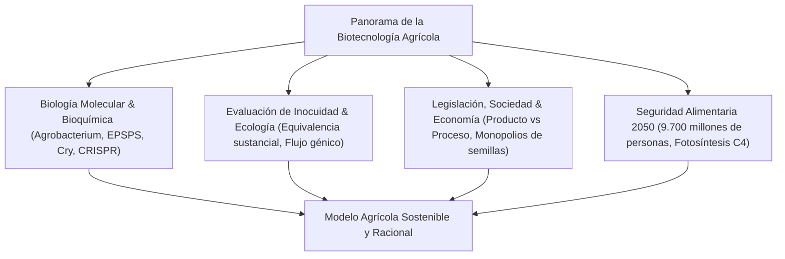

## Introducción: El horizonte de la biotecnología vegetal
Desde los albores de la agricultura, el ser humano ha transformado los genomas de las plantas. La tecnología del ADN recombinante y la moderna edición génica por CRISPR-Cas9 representan la cúspide de esta evolución aplicada a la producción sostenible de alimentos.

## Capítulo 1: Historia del fitomejoramiento y principios del ADN recombinante
Desde la domesticación del teocintle hasta la mutagénesis inducida y la inserción génica mediante *Agrobacterium tumefaciens* y biobalística (pistola de genes).

## Capítulo 2: Mecanismos bioquímicos de los rasgos transgénicos
- **Tolerancia a herbicidas**: La enzima bacteriana CP4-EPSPS elude la inhibición por glifosato en la ruta del shikimato.
- **Resistencia a plagas**: Proteínas Cry de *Bacillus thuringiensis*, activadas exclusivamente en el intestino alcalino de orugas y completamente inocuas para humanos.
- **Arroz Dorado**: Ingeniería metabólica para la síntesis de β-caroteno contra la deficiencia de vitamina A.

## Capítulo 3: Diferenciación: OGM convencionales frente a Edición Genómica
CRISPR-Cas9 permite ediciones directas en el ADN nativo. Las modificaciones SDN-1 no contienen ADN foráneo y equivalen biológicamente a mutaciones naturales espontáneas.

## Capítulo 4: Estadísticas globales y repercusiones socioeconómicas
Aproximadamente 190 millones de hectáreas en todo el mundo. Aumento de ingresos agrarios, reducción de insecticidas químicos y expansión de la siembra directa conservacionista (captura de carbono).

## Capítulo 5: Inocuidad para la salud humana y consenso científico
El principio de equivalencia sustancial (FAO, OMS, Codex). Pruebas de digestibilidad péptica y respaldo unánime de las academias de ciencias (NAS, EFSA) respecto a la seguridad de los OGM.

## Capítulo 6: Evaluación del impacto ambiental y bioseguridad
Protocolo de Cartagena, esclarecimiento del caso de la mariposa monarca, control del flujo de genes y manejo de resistencias mediante áreas de refugio no Bt.

## Capítulo 7: Regulación internacional comparada
El enfoque en el producto final (EE. UU.) frente al principio de precaución enfocado en el proceso (Unión Europea) y las recientes reformas regulatorias.

## Capítulo 8: Aceptación social, psicología del consumidor y mitos
Sesgos cognitivos, esencialismo intuitivo, el impacto de las campañas contra los "Frankenfoods" y la necesidad de una comunicación científica empática.

## Capítulo 9: Cambio climático, 9.700 millones de personas y seguridad alimentaria
Desarrollo del arroz C4 para optimizar la fotosíntesis, tolerancia a la sequía extrema y fijación biológica de nitrógeno en cereales.

## Capítulo 10: Biología sintética y domesticación de novo
Domesticación instantánea de parientes silvestres resistentes mediante CRISPR y agricultura molecular para la fabricación de vacunas vegetales.
