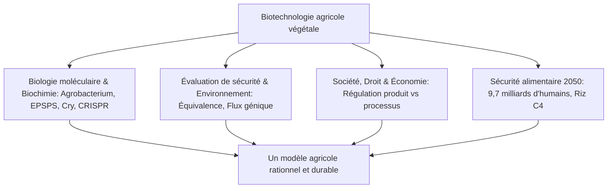
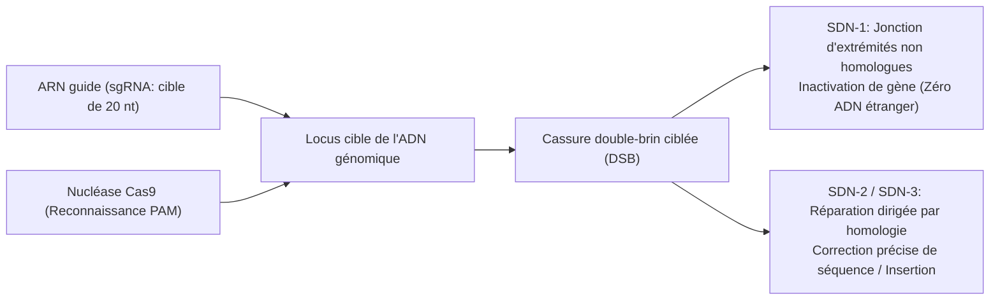

## Introduction : L'horizon scientifique des biotechnologies végétales

L'histoire de la civilisation humaine est intimement liée à la modification délibérée du génome des plantes. Depuis la révolution néolithique il y a 10 000 ans, l'homme a sélectionné des graminées sauvages pour éliminer l'égrenage spontané des graines, accroître la biomasse comestible et supprimer les toxines naturelles.

L'avènement de l'ADN recombinant (ADNr) dans les années 1970 a permis de franchir les barrières d'espèces pour insérer des gènes précis. Au XXIe siècle, l'essor des nucléases programmables – mené par CRISPR-Cas9, l'édition de bases et le prime editing – offre la capacité inédite de réécrire le code génétique endogène à l'échelle du nucléotide unique.

Pourtant, les biotechnologies agricoles demeurent au cœur de vifs débats sociétaux. Les angoisses liées aux « Frankenfoods », la contestation des monopoles semenciers et les craintes de dissémination génique ont créé un fossé profond entre consensus scientifique et perception publique du risque.

---

## Chapitre 1 : Histoire de l'amélioration des plantes et principes de l'ADN recombinant

### 1.1 De la domestication à la mutagenèse
La domestication transforma le téosinte en maïs moderne par sélection de mutations morphologiques majeures (*tb1*, *tga1*). Au XXe siècle, la sélection par hybridation exploita la vigueur hybride (hétérosis), mais resta limitée par les barrières sexuelles et le fardeau de liaison génétique (« linkage drag »). La mutagenèse par rayonnements ou agents chimiques (EMS) provoqua des millions de cassures aléatoires sans maîtrise des mutations secondaires.

### 1.2 La boîte à outils moléculaire de l'ADNr
L'ADNr repose sur trois piliers :
- **Enzymes de restriction** : Ciseaux moléculaires coupant des séquences palindromiques spécifiques.
- **ADN ligase** : Soudure des liaisons phosphodiester.
- **Vecteurs de clonage** : Plasmides bactériens permettant la réplication autonome de fragments d'ADN.

### 1.3 Méthodes de transformation : Agrobacterium et canon à particules
1. **Agrobacterium tumefaciens** : Utilisation du plasmide Ti désarmé. Les gènes de virulence (*vir*) transfèrent le T-DNA monocaténaire porteur du transgène à travers les parois cellulaires pour s'intégrer au génome végétal.
2. **Biolistique (Canon à gènes)** : Des microprojectiles d'or ou de tungstène enrobés d'ADN sont propulsés à haute pression d'hélium (jusqu'à 1 500 psi) directement dans les cellules, méthode indispensable pour les monocotylédones récalcitrantes et les chloroplastes.

### 1.4 Architecture des cassettes d'expression
Composants essentiels :
- **Promoteurs** : Constitutifs (CaMV 35S, Ubiquitine-1) ou tissu-spécifiques.
- **Gène d'intérêt** : Séquences à codons optimisés pour la plante.
- **Terminateurs** : Signaux de polyadénylation (*nos*, *rbcS*).
- **Marqueurs de sélection** : Résistance aux antibiotiques (*nptII*) ou herbicides (*bar*).

---

## Chapitre 2 : Biochimie des caractères transgéniques majeurs

### 2.1 Tolérance aux herbicides : Glyphosate et Glufosinate
- **Tolérance au glyphosate (Roundup Ready)** : Le glyphosate inhibe l'enzyme EPSPS de la voie du shikimate, bloquant la synthèse des acides aminés aromatiques (Phe, Tyr, Trp). L'enzyme bactérienne **CP4-EPSPS** d'*Agrobacterium* sp. CP4 est insensible au glyphosate et maintient la biosynthèse intacte.
- **Tolérance au glufosinate (LibertyLink)** : Le glufosinate inhibe la glutamine synthétase. L'enzyme phosphinothricine acétyltransférase (PAT, gènes *pat*/*bar*) acétyle le glufosinate en dérivé non toxique.

### 2.2 Résistance aux insectes : Toxines Cry de Bacillus thuringiensis
1. **Solubilisation** : Les cristaux de protoxine (130 kDa) se dissolvent uniquement dans le tube digestif alcalin (pH 9,0–11,0) des insectes cibles.
2. **Activation protéolytique** : Des protéases d'insectes clivent le protoxine en toxine active de 65 kDa.
3. **Liaison aux récepteurs & Pores lytiques** : La toxine se lie aux récepteurs cadhérines des microvillosités, formant des pores oligomériques de 1–2 nm provoquant la lyse osmotique et la mort de la larve.
4. **Innocuité humaine** : Absence totale de récepteurs cadhérines spécifiques chez les mammifères et dégradation complète par la pepsine gastrique en moins de deux minutes.

### 2.3 Résistance virale et biofortification
- **Papaye Rainbow** : Résistance au virus de la tache annulaire (PRSV) par interférence ARN (ARNi).
- **Riz Doré (Golden Rice)** : Synthèse de β-carotène dans l'amande du grain grâce aux gènes de phytoène synthase (*psy*) et phytoène désaturase bactérienne (*crtI*).

---

## Chapitre 3 : Différenciation fondamentale : OGM vs Édition génomique CRISPR

### 3.1 Précision chirurgicale vs insertion aléatoire
L'édition par CRISPR-Cas9 induit des cassures double-brin (DSB) ciblées par un ARN guide (sgRNA) au niveau d'un motif PAM (NGG), sans nécessiter d'ADN étranger permanent.

### 3.2 Classification SDN
- **SDN-1** : Réparation par NHEJ créant de courtes insertions/délétions. **Aucun ADN étranger résiduel**, mutations équivalentes aux variations naturelles spontanées.
- **SDN-2** : Remplacement précis de quelques nucléotides par matrice donneuse homologue.
- **SDN-3** : Insertion d'un transgène complet (réglementé comme un OGM classique).

### 3.3 Innovations de rupture
- **Tomate High-GABA (Sanatech Seed)** : Inactivation du domaine autoinhibiteur de la glutamate décarboxylase, multipliant par cinq la teneur en GABA antihypertenseur.
- **Champignons non brunissants et blé hypoallergénique** : Knockout des polyphénol oxydases et des gliadines réactives.

---

## Chapitre 4 : Tendances mondiales et impacts socio-économiques
- **Adoption internationale** : 190 millions d'hectares cultivés dans 29 pays (États-Unis 71,5 Mha, Brésil 52,8 Mha, Argentine 24 Mha, Inde 11,9 Mha).
- **Bénéfices quantifiés** : 261 milliards de dollars de revenus agricoles supplémentaires, réduction de 748 millions de kg d'insecticides et séquestration de 23 millions de tonnes de CO2 par an grâce à l'agriculture sans labour.
- **Monopoles semenciers** : Domination de quatre multinationales agrochimiques et controverses sur les brevets interdisant le réensemencement paysan.

---

## Chapitre 5 : Innocuité sanitaire et consensus scientifique
- **Principe d'équivalence en substance** : Comparaison rigoureuse avec les lignées conventionnelles ayant un historique de consommation sans danger.
- **Examens toxicologiques** : Toxicité orale aiguë, recherche d'homologies allergéniques et tests de digestion à la pepsine.
- **Consensus mondial** : Les académies de médecine et de sciences mondiales (NAS, EFSA, OMS) affirment l'absence de risque sanitaire propre aux OGM homologués. Discrédit des études frauduleuses (Pusztai, Séralini).

---

## Chapitre 6 : Biosécurité et risques écologiques
- **Protocole de Carthagène** : Règles internationales régissant les mouvements transfrontières d'organismes vivants modifiés (OVM).
- **Faune non-cible & Flux génique** : Démenti scientifique de la toxicité du pollen Bt sur le papillon Monarque en milieu naturel ; zones tampons contre l'hybridation sauvage.
- **Gestion des résistances** : Obligation légale de bandes de culture refuges non-Bt (5–20 %) maintenant les allèles de sensibilité chez les insectes ravageurs.

---

## Chapitre 7 : Régulations internationales comparées
- **États-Unis (Approche Produit)** : Cadre coordonné USDA, FDA, EPA ; exemption réglementaire des plantes éditées SDN-1.
- **Union Européenne (Approche Processus)** : Directive 2001/18/CE ; proposition législative historique de la Commission européenne en 2023 pour déréguler les plantes NGT-1.
- **Japon (Voie Hybride)** : Enregistrement transparent préalable des variétés SDN-1 sans le statut restrictif d'OGM.

---

## Chapitre 8 : Psychologie du consommateur et rejet sociétal
- **Biais cognitifs** : Essentialisme psychologique (rejet de l'artifice), heuristique d'affect et biais du risque zéro.
- **Marketing de la peur** : Exploitation commerciale des labels « Sans OGM » sur des denrées non concernées (sel, eau).
- **Évolution de la communication** : Abandon du modèle du déficit au profit d'un dialogue participatif fondé sur les valeurs éthiques et la transparence.

---

## Chapitre 9 : Climat, 9,7 milliards d'humains et sécurité alimentaire 2050
- **L'impératif de 2050** : Accroître la production vivrière de 50 à 70 % sans déforestation (intensification durable).
- **Projet Riz C4** : Intégration de la photosynthèse C4 du maïs dans le riz pour doper les rendements de 50 % et réduire de moitié la consommation d'eau.
- **Fixation biologique de l'azote** : Ingénierie de symbioses racinaires chez les céréales et bactéries éditées (Pivot Bio) pour éliminer les engrais azotés de synthèse.

---

## Chapitre 10 : Biologie synthétique et domestication de novo
- **Domestication de novo** : Édition CRISPR simultanée de 6 à 10 gènes chez des espèces sauvages (*Solanum pimpinellifolium*) pour obtenir en une seule génération des cultures hautement productives et ultra-résistantes.
- **Agriculture moléculaire** : Production végétale d'anticorps thérapeutiques, de vaccins et de protéines laitières sans élevage.

---

## Conclusion : Réconcilier raison scientifique et résilience planétaire
Les biotechnologies végétales représentent le prolongement direct et raffiné de l'amélioration génétique séculaire. Face au dérèglement climatique, elles constituent notre outil le plus précieux pour concilier sécurité alimentaire et préservation des écosystèmes.
