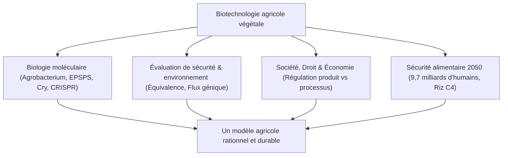

## Introduction : L'horizon scientifique des biotechnologies végétales
L'agriculture repose depuis ses origines sur la sélection génétique. L'apparition de l'ADN recombinant puis de l'édition du génome (CRISPR-Cas9) permet d'optimiser les cultures face aux défis climatiques, suscitant d'intenses débats éthiques et sociétaux.

## Chapitre 1 : Histoire de l'amélioration des plantes et principes de l'ADN recombinant
Sélection empirique, hybridation, mutagenèse par rayonnements et avènement du génie génétique. Vecteurs bactériens *Agrobacterium tumefaciens* (plasmide Ti) et canon à particules (biolistique).

## Chapitre 2 : Biochimie des caractères transgéniques majeurs
- **Tolérance aux herbicides** : Résistance au glyphosate par incorporation de l'enzyme CP4-EPSPS insensible à l'inhibition de la voie du shikimate.
- **Résistance aux insectes ravageurs** : Toxines Cry de *Bacillus thuringiensis*, perforant la membrane intestinale alcaline des lépidoptères, sans toxicité pour les mammifères.
- **Riz doré** : Reconstitution métabolique de la synthèse de β-carotène dans l'endosperme pour lutter contre les carences en vitamine A.

## Chapitre 3 : Différenciation fondamentale : OGM vs Édition génomique
L'édition par CRISPR-Cas9 (catégorie SDN-1) génère des micro-mutations ciblées sans intégration d'ADN étranger, indiscernables des mutations naturelles spontanées.

## Chapitre 4 : Tendances mondiales et impacts socio-économiques
190 millions d'hectares cultivés dans le monde (USA, Brésil, Argentine, Canada, Inde). Réduction de l'épandage d'insecticides, séquestration du carbone par agriculture sans labour et questions de propriété intellectuelle.

## Chapitre 5 : Innocuité sanitaire et consensus scientifique
Principe d'équivalence en substance (OMS, FAO, Codex). Tests de digestibilité à la pepsine et consensus des académies scientifiques mondiales (NAS, EFSA) confirmant l'absence de risques sanitaires accrus.

## Chapitre 6 : Évaluation des impacts écologiques et biosécurité
Protocole de Carthagène, étude du papillon Monarque, flux de gènes vers les espèces sauvages et gestion préventive des résistances par zones refuges.

## Chapitre 7 : Régulations comparées internationales
Modèle fondé sur le produit (États-Unis) versus principe de précaution fondé sur le processus (Union européenne, Directive 2001/18/CE et proposition NGT 2023).

## Chapitre 8 : Psychologie du consommateur et rejet sociétal
Biais cognitifs, perception du risque artificiel, rhétorique anti-OGM et nécessité d'un dialogue scientifique empathique.

## Chapitre 9 : Climat, explosion démographique et sécurité alimentaire 2050
Projet de riz C4 à photosynthese amplifiée, cultures résistantes à la sécheresse et fixation biologique de l'azote chez les céréales.

## Chapitre 10 : Horizons futurs : Biologie synthétique et domestication de novo
Domestication immédiate d'espèces sauvages par édition multiplexée et agriculture moléculaire (production végétale de vaccins).
