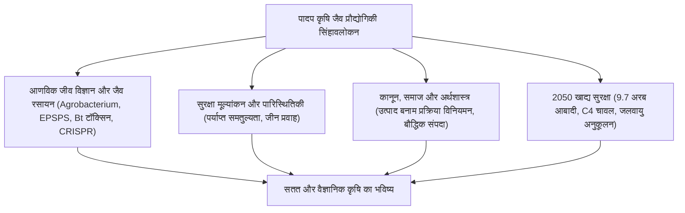

## प्रस्तावना: पादप जैव प्रौद्योगिकी का क्षितिज
मानव कृषि का इतिहास फसलों के जीनोम में निरंतर सुधार का इतिहास है। पुनः संयोजक डीएनए (rDNA) तकनीक और CRISPR-Cas9 जीनोम संपादन ने वैज्ञानिकों को जलवायु परिवर्तन और भुखमरी से निपटने के लिए उच्च उपज वाली फसलें विकसित करने में सक्षम बनाया है।

## अध्याय 1: पादप प्रजनन का इतिहास और rDNA तकनीक
पारंपरिक चयन से लेकर उत्परिवर्तन प्रजनन की सीमाएं। *Agrobacterium tumefaciens* द्वारा T-DNA स्थानांतरण और जीन गन विधि।

## अध्याय 2: प्रमुख जीएम लक्षणों का जैव रासायनिक तंत्र
- **शाकनाशी सहनशीलता**: ग्लाइफोसेट प्रतिरोधी जीवाणु एंजाइम CP4-EPSPS की कार्यप्रणाली।
- **कीट प्रतिरोधकता**: *Bacillus thuringiensis* (Bt) Cry क्रिस्टल प्रोटीन कीटों की क्षारीय आंत में छिद्र करते हैं, जबकि स्तनधारियों के लिए पूर्णतः सुरक्षित हैं।
- **गोल्डन राइस**: विटामिन ए की कमी को दूर करने के लिए चावल में बीटा-कैरोटीन जैवसंश्लेषण।

## अध्याय 3: जीएमओ बनाम CRISPR जीनोम संपादन
CRISPR-Cas9 विशिष्ट डीएनए अनुक्रम को लक्षित करता है। SDN-1 पद्धति में कोई बाहरी डीएनए नहीं होता और यह प्राकृतिक उत्परिवर्तन के समान है।

## अध्याय 4: वैश्विक कृषि परिदृश्य और आर्थिक प्रभाव
दुनिया भर में 19 करोड़ हेक्टेयर में खेती (अमेरिका, ब्राजील, भारत में बीटी कपास)। कीटनाशकों के प्रयोग में कमी, मिट्टी में कार्बन संचय और बीज एकाधिकार की चुनौतियां।

## अध्याय 5: मानव स्वास्थ्य सुरक्षा और वैज्ञानिक सहमति
पर्याप्त समतुल्यता (Substantial Equivalence) सिद्धांत (WHO, FAO)। विश्व की प्रमुख विज्ञान अकादमियों (NAS, EFSA) द्वारा स्वीकृत जीएम फसलों की सुरक्षा की पुष्टि।

## अध्याय 6: पर्यावरणीय प्रभाव और जैव सुरक्षा
कार्टाजेना प्रोटोकॉल, गैर-लक्षित जीवों (मोनार्क तितली) पर अध्ययन, जीन प्रवाह नियंत्रण और शरणस्थल (Refuge) रणनीति।

## अध्याय 7: अंतर्राष्ट्रीय कानूनी नियम
उत्पाद-आधारित नियम (अमेरिका) बनाम एहतियाती प्रक्रिया-आधारित नियम (यूरोपीय संघ) की तुलना।

## अध्याय 8: जन धारणा और विज्ञान संचार
भ्रांतियां, "फ्रेंकनफूड" का भय और विज्ञान संचार में संवाद की भूमिका।

## अध्याय 9: जलवायु परिवर्तन और 2050 में खाद्य सुरक्षा
प्रकाश संश्लेषण दक्षता बढ़ाने हेतु C4 चावल का विकास, सूखा रोधी फसलें और जैविक नाइट्रोजन स्थिरीकरण।

## अध्याय 10: सिंथेटिक बायोलॉजी और डे नोवो डोमेस्टिकेशन
CRISPR द्वारा जंगली पादप प्रजातियों का त्वरित फसल में रूपांतरण और पौधों द्वारा टीकों का उत्पादन।
