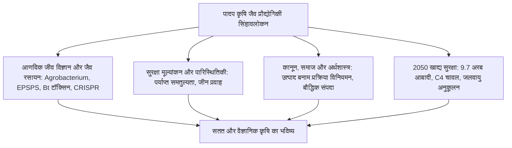
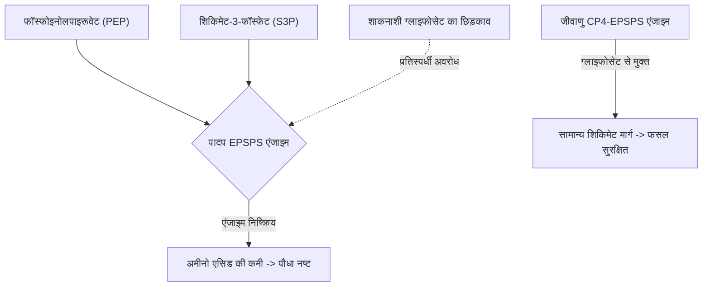
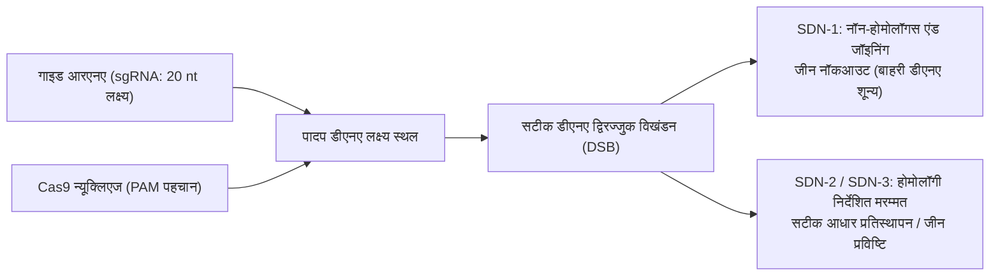

## प्रस्तावना: पादप जैव प्रौद्योगिकी का क्षितिज

मानव कृषि का इतिहास फसलों के जीनोम में निरंतर सुधार का इतिहास है। 10,000 वर्ष पूर्व नवपाषाण कृषि क्रांति के समय से ही मानव ने जंगली घासों में से प्राकृतिक रूप से बीज न बिखरने वाले, बड़े फल वाले और कम विषाक्तता वाले पौधों का चयन किया। आधुनिक मक्का का विकास इसके जंगली पूर्वज थियोसिंटे (*Teosinte*) से इसी निरंतर चयन प्रक्रिया के माध्यम से हुआ।

20वीं सदी के उत्तरार्ध में पुनः संयोजक डीएनए (rDNA) तकनीक ने प्रजातियों की सीमाओं को पार कर विशिष्ट उपयोगी जीनों को स्थानांतरित करने में सफलता प्राप्त की। 21वीं सदी में CRISPR-Cas9, बेस एडिटिंग और प्राइम एडिटिंग जैसी जीनोम संपादन तकनीकों ने पौधों के आंतरिक जीनोम को एकल न्यूक्लियोटाइड सटीकता के साथ फिर से लिखने की अभूतपूर्व क्षमता प्रदान की है।

तथापि, कृषि जैव प्रौद्योगिकी सदैव तीव्र सामाजिक बहसों के केंद्र में रही है। "फ्रेंकनफूड" का भय, बहुराष्ट्रीय कंपनियों के बीज पेटेंट एकाधिकार और जीन प्रवाह की चिंताओं ने वैज्ञानिक सहमति और जनधारणा के बीच एक गहरी खाई पैदा की है।

---

## अध्याय 1: पादप प्रजनन का इतिहास और rDNA तकनीक

### 1.1 पारंपरिक चयन से लेकर उत्परिवर्तन प्रजनन की सीमाएं
20वीं सदी के संकरण प्रजनन ने संकर ओज (F1 हाइब्रिड) के माध्यम से उत्पादन में भारी वृद्धि की। लेकिन इसमें केवल लैंगिक रूप से संगत प्रजातियों के बीच ही जीन स्थानांतरण संभव था और अवांछित जीनों का साथ आना (Linkage Drag) एक बड़ी बाधा थी। विकिरण और रसायनों (EMS) द्वारा प्रेरित उत्परिवर्तन प्रजनन ने जीनोम में अनियंत्रित और यादृच्छिक क्षति पहुंचाई।

### 1.2 पुनः संयोजक डीएनए तकनीक के आणविक उपकरण
- **प्रतिबंधन एंडोन्यूक्लिएज (Restriction Enzymes)**: विशिष्ट पैलिंड्रोमिक डीएनए अनुक्रमों को काटने वाली आणविक कैंची।
- **डीएनए लाइगेस (DNA Ligase)**: फॉस्फोडाइएस्टर बंधों को जोड़ने वाला आणविक गोंद।
- **क्लोनिंग वैक्टर (Plasmids)**: जीनों को ले जाने और प्रतिकृति बनाने वाले वाहक।

### 1.3 पादप रूपांतरण विधियां: एग्रोबैक्टीरियम और जीन गन
1. **एग्रोबैक्टीरियम विधि (*Agrobacterium tumefaciens*)**: जीवाणु के Ti-प्लाज्मिड से रोगजनक जीन हटाकर उपयोगी जीन T-DNA में जोड़े जाते हैं, जो पौधे के क्रोमोसोम में समाहित हो जाते हैं।
2. **जीन गन विधि (Biolistics)**: डीएनए से लेपित सोने या टंगस्टन के सूक्ष्म कणों को उच्च दबाव वाली हीलियम गैस द्वारा सीधे पादप कोशिकाओं में दागा जाता है।

### 1.4 पादप अभिव्यक्ति कैसेट की संरचना
- **प्रमोटर**: निरंतर अभिव्यक्ति हेतु CaMV 35S या ऊतक-विशिष्ट प्रमोटर।
- **कोडिंग अनुक्रम**: पौधों के लिए कोडन-अनुकूलित लक्ष्य जीन (*cp4-epsps*, *cry1Ac*)।
- **टर्मिनेटर**: पॉलीएडिनाइलेशन संकेत (*nos*, *rbcS*)।
- **चयन मार्कर**: एंटीबायोटिक (*nptII*) या शाकनाशी प्रतिरोध जीन (*bar*)।

---

## अध्याय 2: प्रमुख जीएम लक्षणों का जैव रासायनिक तंत्र

### 2.1 शाकनाशी सहनशीलता: ग्लाइफोसेट और ग्लूफोसिनेट
- **ग्लाइफोसेट सहनशीलता (Roundup Ready)**: ग्लाइफोसेट शिकिमेट मार्ग के **EPSPS एंजाइम** को बाधित करता है, जिससे सुगन्धित अमीनो एसिड (Phe, Tyr, Trp) का निर्माण रुक जाता है। *Agrobacterium* CP4 से प्राप्त जीवाणु **CP4-EPSPS** एंजाइम ग्लाइफोसेट से अप्रभावित रहता है, जिससे पौधा सुरक्षित रहता है।
- **ग्लूफोसिनेट सहनशीलता (LibertyLink)**: *pat*/*bar* जीन द्वारा व्यक्त फॉस्फिनोथ्रिसिन एसिटाइलट्रांसफेरेज एंजाइम ग्लूफोसिनेट का एसिटिलीकरण करके उसे हानिरहित बना देता है।

### 2.2 कीट प्रतिरोधकता: बैसिलस थुरिंगिएंसिस (Bt) Cry प्रोटीन
1. **क्षारीय आंत में घुलनशीलता**: निष्क्रिय प्रोटॉक्सिन केवल कीटों की क्षारीय आंत (pH 9.0–11.0) में घुलता है।
2. **सक्रियता**: कीट के प्रोटीएज इसे 65 kDa के सक्रिय विष में बदलते हैं।
3. **कैडेरिन बाइंडिंग व छिद्र निर्माण**: टॉक्सिन आंत की झिल्ली पर कैडेरिन रिसेप्टर्स से जुड़कर छिद्र बनाता है, जिससे आंत फट जाती है और कीट मर जाता है।
4. **मानव सुरक्षा**: स्तनधारियों के पेट में अम्लीय वातावरण (pH 1–2) होता है जहां पेप्सिन सेकंडों में इसका पाचन कर देता है, और उनके पास यह रिसेप्टर भी नहीं होता।

### 2.3 वायरल प्रतिरोध और गोल्डन राइस
- **रेनबो पपीता**: आरएनए इंटरफेरेंस (RNAi) के माध्यम से पीआरएसवी वायरस से बचाव।
- **गोल्डन राइस**: चावल के भ्रूणपोष में बीटा-कैरोटीन जैवसंश्लेषण मार्ग को पुनः सक्रिय करने हेतु मक्के का *psy* और जीवाणु का *crtI* जीन शामिल किया गया।

---

## अध्याय 3: जीएमओ बनाम CRISPR जीनोम संपादन

### 3.1 लक्षित संपादन बनाम यादृच्छिक प्रविष्टि
पारंपरिक जीएमओ में बाहरी डीएनए क्रोमोसोम में अनियमित रूप से जुड़ता है, जबकि CRISPR-Cas9 एक गाइड आरएनए (sgRNA) की सहायता से लक्ष्य स्थल पर सटीक कट लगाता है।

### 3.2 SDN वर्गीकरण
- **SDN-1**: NHEJ मरम्मत द्वारा कुछ क्षारों का विलोपन। **कोई बाहरी डीएनए नहीं रहता**, यह प्राकृतिक उत्परिवर्तन के समान है।
- **SDN-2**: छोटे टेम्पलेट द्वारा सटीक आधार संशोधन।
- **SDN-3**: पूर्ण जीन कैसेट की लक्षित प्रविष्टि (पारंपरिक जीएमओ की तरह विनियमित)।

### 3.3 व्यावसायिक उदाहरण
- **हाई-GABA टमाटर (जापान)**: रक्तचाप नियंत्रित करने वाले अमीनो एसिड GABA में 5 गुना वृद्धि।
- **गैर-भूरे मशरूम व हाइपोएलर्जेनिक गेहूं**: ऑक्सीडेज व एलर्जेन जीनों का नॉकआउट।

---

## अध्याय 4: वैश्विक कृषि परिदृश्य और आर्थिक प्रभाव
- **वैश्विक रकबा**: 29 देशों में 19 करोड़ हेक्टेयर से अधिक (अमेरिका, ब्राजील, अर्जेंटीना, भारत)। दुनिया के 78% सोयाबीन और 76% कपास जीएम हैं।
- **आर्थिक व पर्यावरणीय लाभ**: किसानों को $261 अरब की अतिरिक्त आय, कीटनाशकों में 7.48 करोड़ किग्रा की कमी और शून्य-जुताई खेती द्वारा प्रतिवर्ष 2.3 करोड़ टन CO2 का मृदा में स्थिरीकरण।
- **एकाधिकार की चुनौतियां**: चार बड़ी कंपनियों द्वारा बीज पेटेंट नियंत्रण और किसानों के बीज संप्रभुता के मुद्दे।

---

## अध्याय 5: मानव स्वास्थ्य सुरक्षा और वैज्ञानिक सहमति
- **पर्याप्त समतुल्यता (Substantial Equivalence)**: पारंपरिक सुरक्षित फसलों के साथ तुलनात्मक मूल्यांकन।
- **सुरक्षा परीक्षण**: तीव्र मौखिक विषाक्तता, पेप्सिन पाचन परीक्षण (<2 मिनट में विघटन)।
- **वैश्विक वैज्ञानिक सहमति**: यूएस नेशनल एकेडमी ऑफ साइंसेज (NAS), EFSA और WHO का एकमत निष्कर्ष कि अनुमोदित जीएम भोजन पारंपरिक भोजन जितना ही सुरक्षित है। पुष्टाई और सेरालिनी के भ्रामक अध्ययनों को औपचारिक रूप से वापस लिया गया।

---

## अध्याय 6: पर्यावरणीय प्रभाव और जैव सुरक्षा
- **कार्टाजेना प्रोटोकॉल**: जीवित संशोधित जीवों (LMO) के सीमा-पार आवागमन के नियम।
- **गैर-लक्षित जीव**: प्राकृतिक खेतों में मोनार्क तितली पर कोई दुष्प्रभाव न होने का प्रमाण।
- **शरणस्थल (Refuge) रणनीति**: 5-20% गैर-बीटी फसलों को अनिवार्य रूप से लगाना ताकि कीटों में प्रतिरोधक क्षमता विकसित होने से रोकी जा सके।

---

## अध्याय 7: अंतर्राष्ट्रीय कानूनी नियम
- **अमेरिका (उत्पाद-आधारित)**: अंतिम उत्पाद के गुणों का नियमन; SDN-1 को जीएमओ नियमों से छूट।
- **यूरोपीय संघ (प्रक्रिया-आधारित)**: सख्त एहतियाती नियम; 2023 में NGT-1 फसलों के लिए नियमों को सरल बनाने का प्रस्ताव।
- **जापान**: SDN-1 के लिए पारदर्शी पूर्व-अधिसूचना प्रणाली।

---

## अध्याय 8: जन धारणा और विज्ञान संचार
- **संज्ञानात्मक पूर्वाग्रह**: "अप्राकृतिक" के प्रति सहज भय और शून्य-जोखिम की मांग।
- **डर का बाजारीकरण**: नमक और पानी जैसे उत्पादों पर "Non-GMO" लेबल लगाकर मुनाफ़ा कमाना।
- **संवाद**: एकतरफा उपदेश के बजाय मूल्यों पर आधारित पारदर्शी संवाद की आवश्यकता।

---

## अध्याय 9: जलवायु परिवर्तन और 2050 में खाद्य सुरक्षा
- **2050 का लक्ष्य**: 9.7 अरब लोगों के लिए वनों की कटाई किए बिना खाद्यान्न उत्पादन में 50-70% की वृद्धि (सतत सघनीकरण)।
- **C4 चावल कंसोर्टियम**: मक्के के C4 प्रकाश संश्लेषण को चावल में स्थानांतरित कर 50% अधिक उपज और पानी की बचत।
- **जैविक नाइट्रोजन स्थिरीकरण**: मृदा जीवाणुओं (Pivot Bio) द्वारा फसलों की जड़ों को सीधे नाइट्रोजन आपूर्ति।

---

## अध्याय 10: सिंथेटिक बायोलॉजी और डे नोवो डोमेस्टिकेशन
- **डे नोवो डोमेस्टिकेशन**: जंगली टमाटर (*Solanum pimpinellifolium*) के 6-10 जीनों को CRISPR से एक ही पीढ़ी में संपादित कर अत्यधिक प्रतिरोधी और उच्च उपज वाली नई फसल बनाना।
- **आणविक खेती (Molecular Farming)**: पौधों के जरिए टीकों, एंटीबॉडी और कृत्रिम प्रोटीन का निर्माण।

---

## निष्कर्ष: वैज्ञानिक चेतना और पर्यावरण का संतुलन
पादप जैव प्रौद्योगिकी प्रकृति के विरुद्ध नहीं, बल्कि सहस्राब्दियों पुरानी मानव प्रजनन परंपरा का आणविक विस्तार है। जलवायु परिवर्तन के दौर में यह भूख मिटाने और प्रकृति की रक्षा करने का सबसे सशक्त साधन है।
