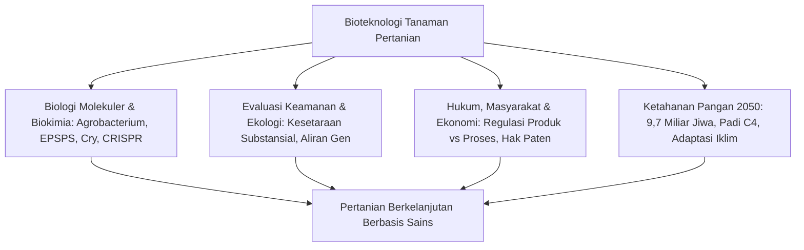
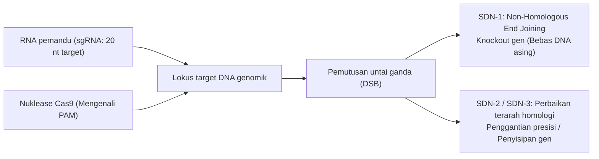

## Pendahuluan: Cakrawala Bioteknologi Pertanian

Peradaban manusia dibangun di atas modifikasi genetik tanaman. Sejak revolusi pertanian neolitikum 10.000 tahun lalu, manusia telah melakukan seleksi buatan terhadap rumput liar: menghilangkan sifat perontokan biji spontan, memperbesar biomassa yang dapat dimakan, dan menekan kadar racun alami. Jagung modern berevolusi dari teosinte liar yang hanya memiliki 5–12 biji keras melalui seleksi berkelanjutan pada gen pengatur morfologi (*tb1*, *tga1*).

Pada akhir abad ke-20, teknologi DNA rekombinan (rDNA) mendobrak batasan reproduksi antarspesies untuk mentransfer gen fungsional. Memasuki abad ke-21, kemunculan teknologi nuclease terarah—seperti CRISPR-Cas9, penyuntingan basa, dan prime editing—memberikan kemampuan presisi tingkat nukleotida tunggal untuk menulis ulang kode genetik tanaman secara langsung.

Namun, bioteknologi pertanian kerap menghadapi kontroversi publik. Isu "Frankenfood", monopoli paten benih korporasi multinasional, kekhawatiran aliran gen, dan evolusi gulma resisten telah menciptakan jurang pemisah antara konsensus ilmiah dan persepsi risiko masyarakat.

---

## Bab 1: Sejarah Pemuliaan dan Prinsip DNA Rekombinan

### 1.1 Dari Domestikasi hingga Keterbatasan Mutagenesis
Pemuliaan ilmiah abad ke-20 memanfaatkan hukum Mendel dan heterosis (hibrida F1). Namun, persilangan konvensional dibatasi oleh sawar seksual dan "linkage drag" (terikutnya gen yang tidak diinginkan). Pemuliaan mutasi melalui radiasi atau zat kimia (EMS) menghasilkan ribuan varietas, tetapi prosesnya bersifat acak dan merusak genom secara tidak terkendali.

### 1.2 Perangkat Molekuler Teknologi rDNA
Rekayasa genetika bertumpu pada:
- **Endonuklease Restriksi**: Enzim pemotong urutan palindromik spesifik.
- **DNA Ligase**: Enzim penyambung ikatan fosfodiester.
- **Vektor Kloning**: Plasmid untuk replikasi otonom dan transfer gen.

### 1.3 Sistem Transformasi Tanaman: Agrobacterium dan Penembakan Partikel
1. **Agrobacterium tumefaciens**: Memanfaatkan plasmid Ti yang dilumpuhkan; gen virulensi (*vir*) mentransfer T-DNA untai tunggal ke dalam inti sel tanaman untuk berintegrasi ke dalam kromosom.
2. **Biolistik (Gene Gun)**: Mikroproyektil emas atau tungsten berbalut DNA ditembakkan dengan gas helium bertekanan tinggi (1.500 psi) menembus dinding sel, sangat penting untuk serealia monokotil dan genom kloroplas.

### 1.4 Struktur Kaset Ekspresi Tanaman
- **Promotor**: Konstitutif (CaMV 35S, Ubiquitin-1) atau spesifik jaringan.
- **Gen Sasaran**: Urutan pengkode yang dioptimalkan kodonnya.
- **Terminator**: Sinyal poliadenilasi (*nos*, *rbcS*).
- **Penanda Seleksi**: Gen resistensi antibiotik (*nptII*) atau herbisida (*bar*).

---

## Bab 2: Biokimia Sifat Transgenik Utama

### 2.1 Toleransi Herbisida: Glifosat dan Glufosinat
- **Toleransi Glifosat (Roundup Ready)**: Glifosat menghambat enzim EPSPS pada jalur sikimat, menghentikan sintesis asam amino aromatik (Phe, Tyr, Trp). Enzim bakteri **CP4-EPSPS** dari *Agrobacterium* sp. CP4 tidak dihambat oleh glifosat, menjaga metabolisme tanaman tetap normal.
- **Toleransi Glufosinat (LibertyLink)**: Glufosinat menghambat glutamin sintetase, memicu penumpukan amonia yang mematikan. Gen *pat*/*bar* menghasilkan enzim fosfinotrisin asetiltransferase yang menetralkan herbisida.

### 2.2 Ketahanan Hama: Protein Cry dari Bacillus thuringiensis
1. **Pelarutan Basa**: Kristal protoksin (130 kDa) hanya larut dalam usus tengah larva lepidoptera yang bersifat basa kuat (pH 9,0–11,0).
2. **Aktivasi Proteolitik**: Protease serangga memotong protoksin menjadi toksin aktif 65 kDa.
3. **Pengikatan Reseptor & Pembentukan Pori**: Toksin berikatan dengan reseptor cadherin pada mikrovili, membentuk pori 1–2 nm yang menyebabkan lisis sel osmotik dan kematian ulat.
4. **Keamanan bagi Mamalia**: Saluran pencernaan mamalia tidak memiliki reseptor cadherin spesifik dan asam lambung (pH 1–2) mencerna protein Cry dengan pepsin dalam hitungan detik.

### 2.3 Ketahanan Virus dan Biofortifikasi
- **Pepaya Rainbow**: Ketahanan terhadap virus bintik cincin (PRSV) melalui pembungkaman RNA (RNAi).
- **Beras Emas (Golden Rice)**: Rekayasa jalur biosintesis β-karoten dalam endosperma beras menggunakan gen fitoen sintase (*psy*) dan desaturase (*crtI*) untuk mengatasi defisiensi vitamin A.

---

## Bab 3: Perbedaan Mendasar: GMO Tradisional vs CRISPR

### 3.1 Presisi Lokus Terarah vs Penyisipan Acak
CRISPR-Cas9 menggunakan RNA pemandu (sgRNA) untuk memotong DNA pada lokus spesifik di samping motif PAM (NGG), memungkinkan mutasi terarah tanpa menyisipkan DNA asing permanen.

### 3.2 Klasifikasi SDN
- **SDN-1**: Perbaikan NHEJ menghasilkan delesi kecil. **Tidak mengandung DNA asing**, setara secara biologis dengan mutasi alami spontan.
- **SDN-2**: Penggantian beberapa nukleotida terarah menggunakan templat donor pendek.
- **SDN-3**: Penyisipan kaset gen asing lengkap (diatur sebagai GMO konvensional).

### 3.3 Contoh Komersial
- **Tomat High-GABA (Sanatech Seed)**: Inaktivasi domain autoinhibisi enzim glutamat dekarboksilase meningkatkan kadar GABA hingga lima kali lipat.
- **Jamur Anti-Pencokelatan dan Gandum Hipoalergenik**: Penghilangan gen polifenol oksidase (*PPO*) dan protein gliadin penyebab alergi.

---

## Bab 4: Tren Budidaya Global dan Dampak Sosial-Ekonomi
- **Luas Lahan**: Lebih dari 190 juta hektar di 29 negara (AS 71,5 juta ha, Brasil 52,8 juta ha, Argentina 24 juta ha, India 11,9 juta ha). Sebanyak 78% kedelai dan 76% kapas dunia adalah tanaman bioteknologi.
- **Dampak Finansial & Lingkungan**: Pendapatan petani kumulatif mencapai $261 miliar, pengurangan penggunaan pestisida sebesar 748 juta kg, dan penyerapan 23 juta ton CO2 per tahun melalui pertanian tanpa olah tanah (no-till).
- **Monopoli Benih**: Konsentrasi hak paten oleh empat raksasa agrokimi memunculkan perdebatan kedaulatan pangan.

---

## Bab 5: Penilaian Keamanan Pangan dan Konsensus Ilmiah
- **Prinsip Kesetaraan Substansial**: Membandingkan varietas bioteknologi dengan galur konvensional yang memiliki rekam jejak aman (Codex, WHO, FAO).
- **Uji Toksisitas**: Uji toksisitas oral akut, penelusuran homologi alergen, dan uji pencernaan pepsin cairan lambung (<2 menit).
- **Konsensus Ilmiah Dunia**: Ditegaskan oleh National Academy of Sciences (NAS), EFSA, dan WHO bahwa pangan transgenik yang disetujui sama amannya dengan pangan konvensional. Penolakan atas publikasi cacat ilmiah (kasus Pusztai dan Séralini).

---

## Bab 6: Penilaian Risiko Ekologis dan Biosafety
- **Protokol Cartagena**: Peraturan internasional perpindahan lintas batas organisme hasil modifikasi hidup (LMO).
- **Fauna Non-Target**: Penelitian lapangan membantah bahaya serbuk sari Bt terhadap ulat kupu-kupu Monarch di alam bebas.
- **Strategi Refuge**: Kewajiban menanam blok tanaman non-Bt (5–20%) untuk mempertahankan alel rentan pada populasi serangga hama guna mencegah resistensi.

---

## Bab 7: Perbandingan Regulasi Internasional
- **Amerika Serikat (Berbasis Produk)**: Regulasi terkoordinasi USDA, FDA, EPA; tanaman SDN-1 dibebaskan dari aturan GMO di bawah aturan SECURE.
- **Uni Eropa (Berbasis Proses)**: Direktif 2001/18/EC dengan prinsip kehati-hatian; proposal 2023 untuk menderegulasi tanaman NGT-1.
- **Jepang**: Notifikasi transparan sebelum komersialisasi tanaman SDN-1 tanpa aturan kaku GMO.

---

## Bab 8: Persepsi Konsumen dan Komunikasi Risiko
- **Bias Kognitif**: Esensialisme intuitif (penolakan terhadap hal "tidak alami") dan bias risiko nol.
- **Komersialisasi Ketakutan**: Label "Non-GMO" pada komoditas yang tidak pernah memiliki varietas transgenik (garam, air).
- **Dialog Partisipatif**: Beralih dari model defisit pengetahuan menuju komunikasi empatik berbasis nilai bersama.

---

## Bab 9: Perubahan Iklim dan Ketahanan Pangan 2050
- **Tantangan 2050**: Memenuhi kebutuhan pangan 9,7 miliar jiwa dengan peningkatan produksi 50–70% tanpa deforestasi (intensifikasi berkelanjutan).
- **Konsorsium Padi C4**: Memindahkan jalur fotosintesis C4 jagung ke dalam padi untuk menaikkan hasil panen 50% dan menghemat air hingga separuh.
- **Fiksasi Nitrogen Mandiri**: Rekayasa bakteri tanah (Pivot Bio) untuk menyalurkan nitrogen langsung ke akar serealia.

---

## Bab 10: Biologi Sintetik dan Domestikasi De Novo
- **Domestikasi De Novo**: Penyuntingan CRISPR secara simultan pada 6–10 gen spesies liar (*Solanum pimpinellifolium*) menghasilkan tanaman komersial tangguh hanya dalam satu generasi.
- **Molecular Farming**: Pemanfaatan tanaman sebagai bioreaktor untuk memproduksi vaksin, antibodi, dan protein susu bebas ternak.

---

## Kesimpulan: Akal Sehat Ilmiah dan Keberlanjutan Bumi
Bioteknologi tanaman merupakan kelanjutan yang disempurnakan secara molekuler dari pemuliaan tanaman tradisional. Dalam menghadapi krisis iklim abad ke-21, ia adalah instrumen paling ampuh untuk menjamin ketahanan pangan global sekaligus melestarikan ekosistem bumi.
