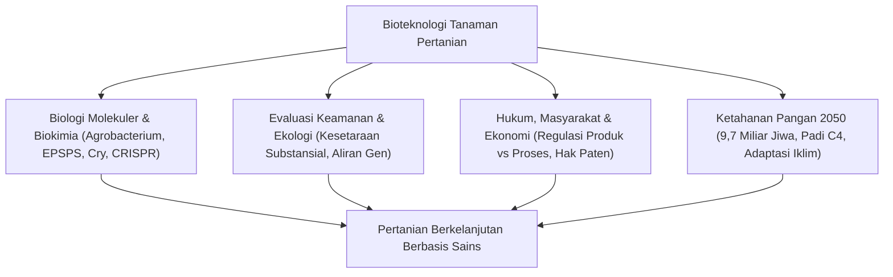

## Pendahuluan: Cakrawala Bioteknologi Pertanian
Peradaban manusia dibangun di atas modifikasi genetik tanaman. Teknologi DNA rekombinan dan penyuntingan genom CRISPR-Cas9 memberikan ketepatan molekuler untuk menghasilkan tanaman pangan berdaya hasil tinggi di tengah ancaman krisis iklim global.

## Bab 1: Sejarah Pemuliaan dan Prinsip DNA Rekombinan
Evolusi dari seleksi tanaman liar ke mutasi radiasi dan teknologi rDNA. Transfer T-DNA oleh *Agrobacterium tumefaciens* dan metode penembakan partikel (gene gun).

## Bab 2: Biokimia Sifat Transgenik Utama
- **Toleransi Herbisida**: Enzim CP4-EPSPS bakteri menghindari penghambatan jalur sikimat oleh glifosat.
- **Ketahanan Hama**: Toksin Cry dari *Bacillus thuringiensis* yang melubangi usus serangga ber-pH basa namun aman bagi manusia.
- **Golden Rice**: Rekayasa metabolisme jalur biosintesis provitamin A (β-karoten) pada endosperma beras.

## Bab 3: Perbedaan Mendasar: GMO Tradisional vs CRISPR
CRISPR-Cas9 menyunting lokus gen spesifik. Tipe SDN-1 tidak mengandung DNA asing dan secara biologis setara dengan mutasi alami spontan.

## Bab 4: Tren Budidaya Global dan Dampak Sosial-Ekonomi
190 juta hektar lahan di seluruh dunia (AS, Brasil, Argentina, India). Pengurangan pestisida kimia, penyerapan karbon melalui sistem olah tanah konservasi (no-till), dan isu monopoli benih.

## Bab 5: Penilaian Keamanan Pangan dan Konsensus Ilmiah
Prinsip kesetaraan substansial (Substantial Equivalence) oleh WHO/FAO. Uji cerna pepsin dan kesepakatan akademi ilmiah dunia (NAS, EFSA) tentang keamanan pangan GM, membantah studi Séralini yang dicabut.

## Bab 6: Penilaian Risiko Ekologis dan Biosafety
Protokol Cartagena, pembuktian keamanan terhadap kupu-kupu Monarch, mitigasi aliran gen, dan strategi refuge untuk mencegah resistensi hama.

## Bab 7: Perbandingan Regulasi Internasional
Pendekatan berbasis produk (AS) versus pendekatan berbasis proses dengan prinsip kehati-hatian (Uni Eropa).

## Bab 8: Persepsi Konsumen dan Komunikasi Risiko
Bias kognitif masyarakat, kampanye 'Frankenfood', dan pentingnya komunikasi ilmiah yang empatik.

## Bab 9: Perubahan Iklim dan Ketahanan Pangan 2050
Konsorsium Padi C4 untuk meningkatkan efisiensi fotosintesis sebesar 50%, tanaman tahan kekeringan, dan fiksasi nitrogen biologis pada serealia.

## Bab 10: Biologi Sintetik dan Domestikasi De Novo
Domestikasi kilat tanaman liar menggunakan CRISPR dan molekular farming untuk produksi vaksin nabati.
