## はじめに：作物の遺伝子技術をめぐる知の地平

人類の歴史は、植物のゲノムを自らの生存に適した形へと改変し続けてきた「育種の歴史」に他ならない。約1万年前に始まった農耕以来、人間は野生の草本植物から脱粒性を奪い、可食部を巨大化させ、毒素を抜くことで現代の主要穀物（トウモロコシ、イネ、コムギ、大豆）を創り出してきた。

20世紀後半、分子生物学の進展によって誕生した「組換えDNA技術（Recombinant DNA Technology: rDNA）」は、生物種の壁を越えた有用遺伝子の精密導入を可能にし、農業生産性に未曾有の革命をもたらした。さらに21世紀、部位特異的核酸分解酵素を用いた「ゲノム編集技術（CRISPR-Cas9、塩基編集、プライム編集）」の登場は、生物自身が内在的に持つ遺伝子を1塩基単位の精度で自在に書き換える新たな地平を切り拓いている。

しかし、この強力なテクノロジーは、常に社会的な激しい賛否両論の嵐に晒されてきた。「フランケンフーズ（Frankenfoods）」と称された感情的な恐怖と忌避、多国籍アグリビジネスによる種子特許の寡占化への批判、自然生態系への遺伝子流動や耐性生物進化への懸念――。科学的知見と大衆のリスク認知との間には、依然として深い断絶が横たわっている。

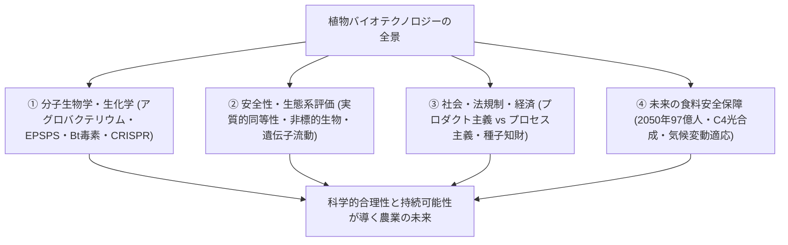

2050年に世界人口が97億人に達し、地球温暖化による極端気象と塩害が世界の農地を脅かす中、人類はどのようにして環境を破壊することなく食料供給を持続させることができるのか。

本稿は、表層的な賛否のプロパガンダを完全に排し、分子生物学・生化学の基礎から、安全性審査の国際プロトコル、カルタヘナ議定書に基づく環境影響評価、各国の法制度比較、消費者心理の認知科学、そして気候変動を克服する最先端の植物バイオエンジニアリングまでを網羅した、**「作物の遺伝子組み換えとゲノム編集に関する包括的学術・政策白書」**である。

## 第1章：植物育種史の系譜と遺伝子組換えの分子生物学的基本原理

### 1.1 人類1万年の品種改良史と交雑育種・突然変異育種の限界
人類文明の歴史は、植物の「遺伝子改変」の歴史そのものである。約1万年前の新石器革命（農耕の開始）以来、人類は野生植物の中から収量が多く、脱粒性が低く（種子が自然に飛び散らない）、毒性が少なく、可食部が大きい個体を経験的に選抜（Artificial Selection）し続けてきた。

現代の主食作物は、すべて原種野生植物のゲノムが徹底的に改変された産物である。例えば、現代のトウモロコシ（*Zea mays*）の祖先野生種である中米原産のテオシント（*Teosinte*）は、硬い殻に覆われたわずか5〜12個の硬小粒しか持たず、草型も大きく異なっていた。人類は数千年をかけて、形態形成に関わる転写因子遺伝子（*tb1*, *tga1*など）の変異を選抜・固定化することで、1穂に数百粒の実をつける現代トウモロコシへと変貌させたのである。

近代に入り、メンデルの遺伝の法則の再発見（1900年）を経て、品種改良は科学的育種（Scientific Breeding）へと進化した：
1. **交雑育種（Cross Breeding）とヘテロシス（雑種強勢）**
   異なる優良形質を持つ同種または近縁種同士を人工交配させ、後代の中から目的形質を持つ個体を選抜する手法。特に2つの近交系（Inbred lines）を交配させることで両親よりも優れた形質を発現させる「ヘテロシス（F1ハイブリッド）」は、20世紀の農業生産性を爆発的に向上させた。
   しかし、交雑育種には致命的な生物学的制約が存在する。第1に「生殖的隔離（Reproductive Isolation）」の壁であり、交配可能な近縁種間にしか目的遺伝子を導入できない。第2に「連鎖引きずり（Linkage Drag）」であり、目的遺伝子を導入しようとすると、染色体上でその近傍に位置する望ましくない遺伝子群まで同時に引き継がれてしまい、何世代にもわたる戻し交配（Backcrossing）と莫大な年月（10〜15年以上）を要する点である。
2. **突然変異育種（Mutation Breeding）**
   20世紀半ばから導入された放射線（ガンマ線、X線、中性子線、重イオンビーム）の照射や、化学変異原（EMS: メタンスルホン酸エチルなど）による人為的DNA損傷誘発。日本酒の酒造好適米や矮性イネ、果樹の耐病性品種など、世界で3,000種以上の実用作物が作出された。
   しかし、突然変異育種の本質は「ゲノム全体に対するランダムな無差別破壊」である。DNAのどこにどのような切断・塩基置換が起きるかを制御することは原理的に不可能であり、何万個もの変異体の中から極めて稀な有益変異をスクリーニングする過程は極めて非効率で、予期せぬ有害変異の同時蓄積リスクを常に孕んでいた。

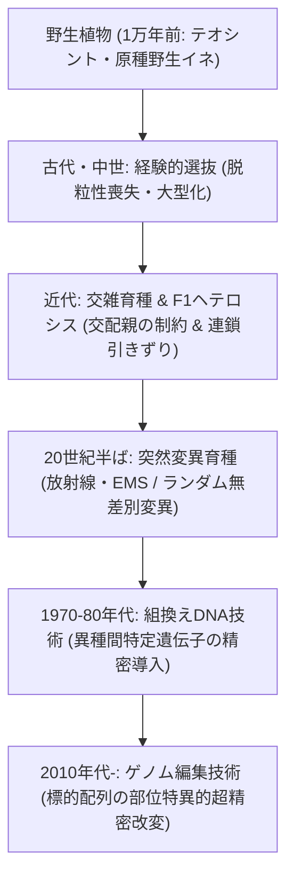

### 1.2 組換えDNA技術（rDNA）の黎明と分子生物学的ツール
こうした古典的育種の物理的・生物学的限界を突破したのが、1970年代に確立された「組換えDNA技術（Recombinant DNA Technology: rDNA）」である。

この技術的ブレイクスルーは、分子生物学における以下の三代酵素・ツールの発見と応用によって成立した：
- **制限酵素（Restriction Endonucleases）**: DNA二重鎖の特定の塩基配列（回文配列）を認識し、特異的に加水分解・切断する分子のハサミ（ハミルトン・スミス、ダニエル・ネイサンズらにより解明）。
- **DNAリガーゼ（DNA Ligase）**: 切断されたDNA断片の末端同士（ホスホジエステル結合）をATPのエネルギーを用いて再結合する分子の糊。
- **ベクター（Vectors）**: 目的のDNA断片を組み込み、宿主細胞内で自律複製・維持させる運搬体（大腸菌のプラスミド *pBR322* やバクテリオファージ）。

1973年、スタンリー・コーエンとハーバート・ボイヤーらは、異なる細菌由来の遺伝子断片をプラスミドに結合させ、それを大腸菌へ導入して発現させることに世界で初めて成功した。この瞬間、**「生物種の壁（Species Barrier）を越えて、特定の機能を持つ単一遺伝子を設計通りに細胞へ移植する」**というバイオテクノロジーの新たな地平が切り拓かれたのである。

### 1.3 植物細胞への遺伝子導入法：アグロバクテリウム法とパーティクル・ガン法
細菌への遺伝子導入と異なり、植物細胞には強固な「セルロース製細胞壁（Cell Wall）」が存在するため、外来遺伝子を核内ゲノムへ送り込むには高度な生物学的・物理的ベクターシステムが必要となる。その中核を担ったのが以下の2大手法である：

#### ① アグロバクテリウム法（*Agrobacterium tumefaciens* 媒介法）
自然界に存在する土壌細菌 *Agrobacterium tumefaciens*（現 *Rhizobium radiobacter*）は、双子葉植物に感染して植物細胞の増殖を促すコブ（クラウンゴール病）を形成させる天然の「遺伝子組み換え職人」である。

アグロバクテリウムは、巨大な「Tiプラスミド（Tumor-inducing Plasmid）」を保持している。このTiプラスミド上の「T-DNA領域（Transferred DNA）」は、感染時に細菌から植物細胞質を通り核内へと輸送され、宿主のゲノムDNAに組み込まれる特性を持つ。

分子生物学者たちはこの天然の輸送機構を改変した：
1. T-DNA領域内に存在するクラウンゴール誘導遺伝子（オーキシン・サイトカイニン生合成遺伝子やオパイン合成遺伝子）を完全に除去（無毒化: Disarmed Ti-plasmid）。
2. その位置に「農業上有用な目的遺伝子」および「選抜マーカー遺伝子」を挿入。
3. *vir*（病原性）遺伝子群の働きによって、目的遺伝子を含むT-DNAの一本鎖DNAが植物細胞の核膜孔を通過し、宿主染色体の二重鎖切断部に組み込まれる。

初期は双子葉植物（大豆、菜種、綿花、トマト等）に限定されていたが、アセトシリンゴン等のフェノール性誘導物質の添加や培養条件の最適化により、現在では主要な単子葉植物（イネ、トウモロコシ、コムギ）においてもアグロバクテリウム法による高効率・低コピー数の遺伝子導入が標準化されている。

#### ② パーティクル・ガン法（遺伝子銃/微粒子衝突法: Particle Bombardment）
単子葉植物などアグロバクテリウムの感染効率が低い植物のために、1980年代後半にコーネル大学のジョン・サンフォードらによって開発された物理的直接導入法である。

直径0.6〜1.0マイクロメートルの微細な金（Au）またはタングステン（W）の金属粒子表面に、目的遺伝子を含むプラスミドDNAを塩化カルシウムとスペルミジンを用いてコーティングする。これをヘリウムガスの高圧ガス圧（900〜1,500 psi）によってマッハの超音速まで加速し、真空チャンバー内に配置した植物組織（カルスや未熟胚）の細胞壁および細胞膜を物理的に貫通させて核内に撃ち込む。

物理的破壊を伴うため植物細胞のダメージが大きく、染色体への遺伝子挿入がランダムかつ複数コピーの断片化挿入（複雑な再編成）になりやすい欠点があるものの、葉緑体ゲノムへの遺伝子導入（プラスティド形質転換）などアグロバクテリウムでは不可能な導入系において不可欠な役割を果たしている。

### 1.4 発現カセットの構造設計：プロモーター、ターミネーター、選抜マーカー
外来遺伝子を植物体内で意図通りに安定発現させるためには、単に目的のコーディング領域（CDS）を導入するだけでは不十分であり、厳密に設計された「遺伝子発現カセット（Expression Cassette）」の構築が必須である。

| 構成要素 | 主な具体例 | 機能と役割 |
| :--- | :--- | :--- |
| **プロモーター（Promoter）** | カリフラワーモザイクウイルス35Sプロモーター（CaMV 35S）、イネ・ユビキチンプロモーター（*Ubiquitin-1*）、トウモロコシ・アクチンプロモーター | RNAポリメラーゼIIが結合し転写を開始させるスイッチ。構成的プロモーター（全身・恒常的発現）のほか、組織特異的プロモーター（種子胚乳特異的など）や環境誘導型プロモーターが使い分けられる。 |
| **目的遺伝子（Gene of Interest）** | *cp4-epsps*（除草剤耐性）、*cry1Ac*（Bt害虫抵抗性）、*psy*（カロテン合成） | 発現させたい農業形質・酵素タンパク質をコードするDNA配列。植物のコドン使用頻度（Codon Usage）に合わせてコドン最適化合成されることが多い。 |
| **ターミネーター（Terminator）** | *nos*ターミネーター（ノパリン合成酵素遺伝子由来）、*rbcS*ターミネーター | 転写終結シグナルおよびmRNAの3'末端ポリアデニル化（poly-A付加）を指令し、mRNAの細胞質内安定性と翻訳効率を担保する。 |
| **選抜マーカー（Selectable Marker）** | *nptII*（ネオマイシン・カナマイシン耐性）、*hpt*（ハイグロマイシン耐性）、*bar*（ビアラホス/グルホシネート耐性） | 遺伝子導入された極めて稀な細胞（1万〜数万細胞に1個）を組織培養段階でスクリーニングするために、抗生物質や除草剤存在下で生存能を付与する。 |

近代の高度な形質転換技術では、目的の組換え植物個体を得た後に、Cre/loxP部位特異的組換え酵素システムやトランスポゾンを利用して「選抜マーカー遺伝子をゲノムから完全に脱落・除去」し、最終製品には目的遺伝子のみを残すマーカーフリー技術も確立されている。

## 第2章：主要な組換え作物の形質と作用メカニズムの生化学

### 2.1 除草剤耐性作物：グリホサート耐性とグルホシネート耐性の生化学
世界の商業栽培GM作物の約8割に導入されている最も支配的な形質が「除草剤耐性（Herbicide Tolerance: HT）」である。農地全体に非選択性除草剤（あらゆる雑草を枯らす強力な除草剤）を一斉散布しても、作物だけが無傷で生き残り、競合する雑草のみが完全に枯死するため、除草作業の劇的な省力化をもたらした。

#### ① グリホサート耐性（ラウンドアップ・レディ作物）
グリホサート（Glyphosate: *N*-(phosphonomethyl)glycine）は、世界で最も広く使用されている非選択性移行型除草剤である。

植物および微生物は、芳香族アミノ酸（フェニルアラニン、チロシン、トリプトファン）を生合成するための特有の代謝経路である「シキミ酸経路（Shikimate Pathway）」を持っている（なお、動物はこの経路を持たず、必須アミノ酸として食事から摂取する）。

グリホサートは、この経路の第6段階を触媒する酵素である**「EPSPS（5-エノールピルビルシキミ酸-3-リン酸合成酵素: 5-enolpyruvylshikimate-3-phosphate synthase）」**の基質であるホスホエノールピルビン酸（PEP）の結合ポケットに強力に競合阻害剤として結合する。これによりEPSPSが失活し、芳香族アミノ酸の枯渇、タンパク質合成の停止、有毒中間体（シキミ酸）の細胞内異常蓄積によって植物は数日から1週間で枯死に至る。

バイエル（旧モンサント）の研究チームは、グリホサート製造工場の廃液処理場から単離された土壌細菌アグロバクテリウムの特殊株「*Agrobacterium* sp. strain CP4」が、グリホサート存在下でも正常に生育することを発見した。

CP4株が保有するEPSPS（**CP4-EPSPS**）は、植物本来のEPSPS（クラスI EPSPS）とアミノ酸配列が異なり、活性中心の立体構造において基質PEPとは正常に結合するものの、グリホサート分子に対する親和性が極端に低い（阻害定数 $K_i$ が極めて大きい）という特異な性質を持っていた。この *cp4-epsps* 遺伝子を作物（大豆、トウモロコシ、綿花、菜種、テンサイ）の核ゲノムに組み込み、葉緑体移行シグナルペプチド（CTP）を付加して葉緑体内で大量発現させることで、グリホサートを浴びてもシキミ酸経路が全く阻害されない「ラウンドアップ・レディ（Roundup Ready）作物」が完成した。

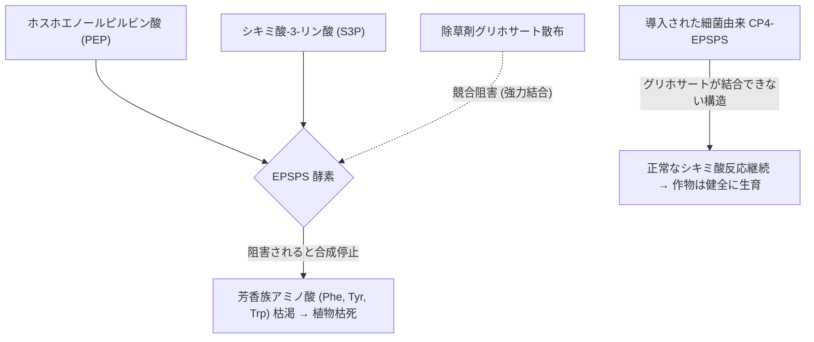

#### ② グルホシネート耐性（リバティ・リンク作物）
グルホシネート（Glufosinate）は、放線菌 *Streptomyces viridochromogenes* が産生する天然抗生物質ホスフィノスリシン（PPT）の化学合成体である。植物体内でアンモニア同化を担う「グルタミン合成酵素（GS）」を不可逆的に阻害し、細胞内に高濃度のアンモニアを蓄積させて光合成系を破壊する。

これに対し、同じ放線菌が自らの毒素から身を守るために持っている解毒酵素遺伝子 **`pat`** または **`bar`**（ホスフィノスリシン・アセチルトランスフェラーゼ: PAT）を作物に導入。PAT酵素はグルホシネートのアミノ基を特異的にアセチル化（*N*-アセチルグルホシネートに変換）して完全に無毒化するため、作物はグルホシネート散布に対して完全な耐性を発揮する。

### 2.2 害虫抵抗性作物：Bt毒素の結晶構造と殺虫メカニズム
世界の農薬使用量のうち、環境毒性が最も高い有機リン系やカーバメート系の化学殺虫剤散布を激減させたのが、「Bt作物（Bt Crops）」である。

土壌細菌バチルス・チューリンゲンシス（*Bacillus thuringiensis*: 通称Bt菌）は、胞子形成期に菌体内にタンパク質性の結晶性毒素（Crystal proteins: **Cry毒素**）を産生する。

Cry毒素（Cry1Ab, Cry1Ac, Cry1Fa, Cry2Abなど）の作用機序は、極めて高い分子特異性（宿主特異的毒性）を持つ：
1. **アルカリ性消化管での溶解・活性化**
   チョウ目害虫（アワノメイガ、オオタバコガなど）の幼虫消化管内は**「強アルカリ性（pH 9.0〜11.0）」**という極めて特殊な生理的環境にある。結晶態のプロトキシン（無毒な前駆体タンパク質、分子量約130 kDa）は、この強アルカリ性下でのみ溶解し、昆虫特有の消化管プロテアーゼによって消化・プロセシングを受け、分子量約60〜65 kDaの活性型コア毒素へと切断・活性化される。
2. **中腸上皮受容体への特異的結合と膜小孔（ポア）形成**
   活性化されたCry毒素は、標的昆虫の中腸微絨毛膜上に存在する特異的受容体（カドヘリン様タンパク質、アミノペプチダーゼN: APN、アルカリホスファターゼ: ALPなど）に極めて高い親和性で結合する。
   受容体に結合した毒素分子は四量体（オリゴマー）を形成し、上皮細胞のリン脂質二重層膜に突き刺さってカチオン透過性の小孔（ポア: 直径1〜2nmの微細な穴）を開ける。
3. **コロイド浸透圧崩壊と昆虫の死**
   小孔形成により、細胞内外の浸透圧バランスが崩壊。細胞外の水分とイオンが中腸細胞内に奔流となって流入し、中腸上皮細胞が膨張・破裂（浸透圧溶解）を起こす。消化管壁が破壊された昆虫は摂食を停止し、敗血症と飢餓によって数日以内に確実に死に至る。

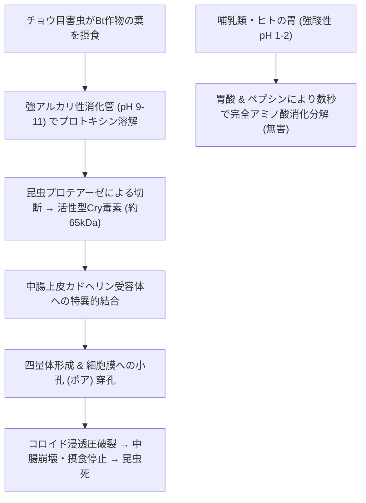

**【なぜヒトや哺乳類、鳥類、ミツバチには無害なのか】**
Cry毒素が標的害虫以外の生物に対して完全な安全性を誇る生化学的理由は極めて明快である：
- **強酸性胃液による瞬時分解**: ヒトや哺乳類の胃内は強酸性（pH 1.0〜2.0）であり、消化酵素ペプシンによってCry毒素は摂取後数十秒〜数分以内にアミノ酸やペプチドへと完全に消化分解される。
- **受容体の完全欠如**: 哺乳類、鳥類、魚類、さらには益虫であるミツバチの消化管細胞表面には、Cry毒素が結合するための特異的受容体（カドヘリン分子の特定ループ配列など）が遺伝学的に一切存在しない。受容体に結合できなければ、毒素は何の作用も及ぼさず、単なる栄養タンパク質として無毒に消化・排泄される。

### 2.3 病害抵抗性作物：コートタンパク質媒介耐性
作物ウイルス病は一度感染すると化学農薬による防除が不可能であり、しばしば全滅的打撃をもたらす。このウイルス病に対する画期的解決策となったのが、植物ウイルスに対する「ワクチン」とも呼ぶべきコートタンパク質媒介耐性（CPMR: Coat Protein-Mediated Resistance）である。

代表例が、1990年代に壊滅的危機に瀕していたハワイのパパイヤ産業を救済した**「耐ウイルス性パパイヤ（レインボー・パパイヤ）」**である。
ハワイ大学のデニス・ゴンサルベスらは、アブラムシによって媒介されパパイヤ果樹を枯死させるパパイヤリングスポットウイルス（PRSV）の「外被タンパク質（Coat Protein: CP）遺伝子」をクローニングし、パーティクル・ガン法によってパパイヤのゲノムへ導入した。

この耐性の分子的メカニズムは、当時未知であった**「RNAサイレンシング（RNA干渉: RNAi）」**によるものである。導入された外被タンパク質mRNAが植物細胞内で過剰発現されると、植物の生体防御システム（ダイサー様酵素 DCL）がこれを異常な外来RNAと認識して切断し、21〜24塩基の短い二重鎖RNA（siRNA）を生成する。このsiRNAがRNA誘導サイレンシング複合体（RISC）に取り込まれ、本物のPRSVウイルスが細胞内に侵入してきた瞬間に、そのウイルスゲノムRNAを特異的に捕捉・切断して増殖を完全に封殺するのである。

### 2.4 栄養強化作物：ゴールデンライスの代謝工学
遺伝子組換え技術の真価は、農作業の効率化（第1世代形質）にとどまらず、作物の栄養価を人工的に高めて途上国の飢餓・栄養失調を撲滅する「バイオフォーティフィケーション（生物学的栄養強化: 第2世代形質）」において発揮される。その最高峰が**「ゴールデンライス（Golden Rice）」**である。

発展途上国（東南アジア・アフリカ等）では、ビタミンA欠乏症（VAD）によって毎年数十万人の乳幼児が失明し、免疫不全によって命を落としている。米（精米）はこれら地域の主食であるが、米の胚乳（食用部）にはビタミンAの前駆体であるβ-カロテンが全く含まれていない。

植物の葉や緑色組織では、色素体内でゲラニルゲラニル二リン酸（GGPP）からβ-カロテンが合成されているが、イネの胚乳組織ではGGPPまでは存在するものの、それ以降の生合成酵素遺伝子がプロモーターレベルで完全にスイッチオフ（沈黙）していた。

スイス連邦工科大学（ETH）のインゴ・ポトリクスとフライブルク大学のペーター・バイヤーらは、この途絶した代謝経路を再接続するため、以下の2つの異種生物由来遺伝子をイネ胚乳特異的プロモーター（グルテリンプロモーター）の下流に組み込んだ：
1. **`psy`（フィトエン合成酵素遺伝子）**: ラッパズイセン（*Narcissus pseudonarcissus*）、後にトウモロコシ由来の遺伝子に変更。GGPP 2分子を縮合させて無色のフィトエンを合成する。
2. **`crtI`（植物型不飽和化酵素の多機能代替細菌遺伝子）**: 土壌細菌 *Pantoea ananatis*（旧 *Erwinia uredovora*）由来のフィトエン不飽和化酵素遺伝子。植物では通常2つの別々の酵素（PDSとZ-ISO/ZDS）を必要とするフィトエンからリコペンへの4段階の脱水素反応を、たった1つの酵素で触媒する。

胚乳内で合成されたリコペンは、イネが元々胚乳に微量に持っている内在性の環化酵素によって直ちにβ-カロテンへと変換され、米粒は鮮やかな黄金色に輝く。改良型の「ゴールデンライス2（GR2E）」では、1日1杯の茶碗の米を食べるだけで、小児に必要なビタミンA推奨摂取量の半分以上を満たすことが可能となった。

### 2.5 環境ストレス耐性作物：乾燥耐性と耐塩性の分子機構
地球温暖化に伴う干ばつと土壌塩類化に対抗するため、環境ストレス耐性作物の実用化が加速している。

代表的な商業化事例が、乾燥耐性トウモロコシ「DroughtGard」である。土壌細菌 *Bacillus subtilis* から単離された「**CSPB（Cold Shock Protein B）**」遺伝子が導入されている。
CSPBは、極度の乾燥や低温などのストレス下で植物細胞内の水ポテンシャルが低下した際、mRNAが異常な二次構造（ヘアピン構造等）を形成して翻訳が停止するのを防ぐ「RNAシャペロン（RNA Chaperone）」として機能する。乾燥ストレス下でも作物のタンパク質翻訳機構を正常に維持し、気孔開度と光合成活性を保つことで、干ばつ年におけるトウモロコシの減収を大幅に抑制する。

## 第3章：遺伝子組換え（GMO）とゲノム編集（Genome Editing）の科学的峻別

### 3.1 従来型GMO（ランダム挿入）とゲノム編集（部位特異的改変）の決定打
現在、生命科学と農業の現場で最大のパラダイムシフトを引き起こしているのが、「ゲノム編集技術（Genome Editing）」の台頭である。一般社会では従来の「遺伝子組換え（GMO）」としばしば混同されるが、分子生物学的メカニズム、変異の性質、そして安全性の次元において、両者は**根本的に異なる科学的技術体系**である。

| 比較項目 | 従来の遺伝子組換え（GMO） | ゲノム編集（Genome Editing: 主にSDN-1） |
| :--- | :--- | :--- |
| **DNAの供給源** | **外来生物種（異種生物）のDNA**（細菌、ウイルス、他種植物など）を導入。 | **作物自身が元から持っている内在性遺伝子**のみを標的とする。 |
| **挿入・改変の部位** | **ランダム挿入（非特異的）**。宿主ゲノムのどこに入るか制御不能。 | **部位特異的（ミリメートル精度の分子ピンポイント）**。指定した塩基配列のみを標的化。 |
| **外来DNAの残存** | 発現カセット（プロモーター、抗生物質耐性マーカー等）が**恒久的に残存**。 | カス9・sgRNAは一過性発現、または後代交配で脱落させ、**外来DNAは完全にゼロ**。 |
| **生成される変異の性質** | 自然界の通常の交配では起こり得ない異種間DNAの組み合わせ。 | 自然界の紫外線や複製ミスで日常的に生じている「自然突然変異」と**物理的に完全に同一**。 |
| **検出性（トレーサビリティ）**| PCR法で外来プロモーター（CaMV 35S等）を特異的に増幅・検出可能。 | 1〜数塩基の欠失・置換であるため、自然突然変異との鑑別・科学的検出が原理的に不可能。 |

従来型GMOの最大の弱点は、外来遺伝子が宿主染色体のどこに何コピー組み込まれるかを人為的に制御できない点にあった。もし遺伝子が内在性の重要遺伝子の内部に飛び込んで破壊した場合（挿入変異: Insertional Mutagenesis）、あるいはヘテロクロマチン（凝縮した不活性領域）に挿入されて発現が抑制された場合、何千もの形質転換体をスクリーニングして目的の健全個体を選び出す膨大な労力を要した。

これに対しゲノム編集は、**「ゲノム上のたった1箇所の塩基配列を指定し、そこだけを分子のメスで精密に切開・改変する」**技術である。

### 3.2 人工ヌクレアーゼの進化：ZFN、TALENからCRISPR-Cas9へ
標的DNA配列を特異的に認識して二重鎖切断（DSB: Double-Strand Break）を導入する人工ヌクレアーゼは、急速な世代交代を経て完成に至った：

1. **第1世代：ZFN（Zinc Finger Nuclease: 亜鉛フィンガーヌクレアーゼ）**
   DNAの特定塩基（3塩基）を認識する亜鉛フィンガードメインを複数連結し、非特異的DNA切断ドメイン（FokI）を結合させた人工酵素。設計が極めて困難でオフターゲット切断（標的箇所以外の誤切断）のリスクが高く、コストも膨大であった。
2. **第2世代：TALEN（Transcription Activator-Like Effector Nuclease）**
   植物病原細菌 *Xanthomonas* 由来のTALEタンパク質の反復モジュール（1モジュールが1塩基を認識）を利用した酵素。ZFNより標的特異性が飛躍的に向上したものの、巨大なタンパク質遺伝子の構築が煩雑であった。
3. **第3世代：CRISPR-Cas9（革命的ブレイクスルー）**
   2012年、エマニュエル・シャルパンティエとジェニファー・ダウドナ（2020年ノーベル化学賞受賞）らによって開発された、分子生物学史上最大の革命技術である。

CRISPR-Cas9システムは、化膿レンサ球菌（*Streptococcus pyogenes*）がバクテリオファージの再感染から身を守るために獲得した「適応免疫システム（CRISPR-Cas系）」を応用したものである：
- **Cas9（エンドヌクレアーゼ）**: DNA二重鎖を切断するハサミとなるタンパク質。
- **ガイドRNA（single guide RNA: sgRNA）**: 標的とするゲノム配列（約20塩基）と相補的に結合するRNA。
- **PAM配列（Protospacer Adjacent Motif）**: 切断の標的配列の直後に位置する特異的目印配列（*S. pyogenes* Cas9では `5'-NGG-3'`）。

研究者は、改変したい標的遺伝子の20塩基に対応するsgRNAを化学合成またはプラスミドクローニングするだけで、あらゆる生物の狙ったDNA配列を極めて安価、迅速、かつ超高精度に切断できるようになった。

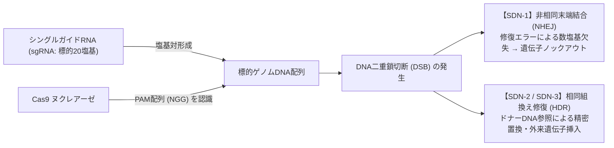

### 3.3 SDN分類（SDN-1、SDN-2、SDN-3）と修復機構
人工ヌクレアーゼによってDNA二重鎖が切断（DSB）された後、細胞が自らを修復しようとする天然のDNA修復経路によって、以下の3つのカテゴリーに明確に分類される（SDN: Site-Directed Nuclease）：

| 分類 | 修復機構 | ドナーDNAの有無 | 生じる変異 | 法的・科学的位置づけ |
| :--- | :--- | :--- | :--- | :--- |
| **SDN-1** | **非相同末端結合（NHEJ: Non-Homologous End Joining）** | なし | 切断端を急いで繋ぎ直す際の修復エラーにより、**1〜数塩基の欠失・挿入・置換**が生じ、目的遺伝子の機能が喪失（**ノックアウト**）。 | **外来遺伝子残存ゼロ**。自然界の突然変異と区別不能。多くの国で従来の品種改良と同等（非GMO）扱い。 |
| **SDN-2** | **相同組換え修復（HDR: Homology-Directed Repair）** | 短い修復用DNA断片（相同アーム付）を同時に導入 | 切断部位にドナーDNAを鋳型として参照させ、**数塩基から数十塩基の配列を意図した通りの塩基配列に精密置換**。 | 外来遺伝子は残存しない。アミノ酸1個の精密置換による酵素活性改変等。 |
| **SDN-3** | **相同組換え修復（HDR）** | 長い外来遺伝子を含むドナーDNA | 切断部位に**新しい機能遺伝子（発現カセット全体）を部位特異的に挿入**。 | **外来遺伝子が導入されるため、従来のGMOと同様の法規制対象**となる。 |

### 3.4 塩基編集（Base Editing）とプライム編集（Prime Editing）の超精密フロンティア
CRISPR-Cas9であっても、DNA二重鎖を完全に切断する（DSB）ため、低頻度ながら意図しない欠失や染色体再編成が生じるリスクが存在した。これを克服すべく、ハーバード大学のデビッド・リウらが開発したのが次世代ゲノム編集である：
- **塩基編集（Base Editing）**: 触媒活性を部分的に失活させたCas9ニッカーゼ（nCas9）に、シチジン脱アミノ化酵素（CBE: C to T変換）またはアデニン脱アミノ化酵素（ABE: A to G変換）を融合。DNA二重鎖を切断することなく、目的の1塩基だけを化学的に直接書き換える。
- **プライム編集（Prime Editing）**: nCas9に逆転写酵素（Reverse Transcriptase）を融合させ、改変情報を含むプライム編集ガイドRNA（pegRNA）を用いることで、二重鎖切断なしにあらゆる塩基置換、挿入、欠失を自由自在に書き込む「ゲノムのワープロソフト」。

### 3.5 実用化事例：高GABAトマト、肉厚マダイ、低アレルゲン食品
日本はゲノム編集作物の商用化において世界をリードしている：
1. **GABA高蓄積トマト（シチリアンルージュハイギャバ）**
   筑波大学発ベンチャー（サナテックシード）が開発。血圧降下作用やストレス緩和効果を持つアミノ酸「GABA（ガンマ-アミノ酪酸）」の生合成酵素（GAD）のC末端には、活性を抑制する自己阻害ドメインが存在する。CRISPR-Cas9（SDN-1）によってこの阻害ドメイン領域の数塩基を欠失させ、GAD酵素を常時高活性化させることで、通常のトマトの4〜5倍のGABAを蓄積するトマトを完成させた。
2. **肉厚マダイ・高成長トラフグ**
   京都大学・近畿大学発ベンチャー（リージョナルフィッシュ）が開発。筋肉の過剰な発達を抑制する遺伝子「ミオスタチン（*MSTN*）」をゲノム編集でノックアウトし、可食部筋肉量を1.2〜1.6倍に増大させた。
3. **低アレルゲン大豆・コムギ**
   重篤な食物アレルギーの原因となるグリアジンタンパク質（セリアック病原因物質）や大豆アレルゲン（Gly m Bd 30K等）のコード領域を特異的にノックアウトし、アレルギー患者でも安全に摂取できる穀物の開発が進められている。

## 第4章：世界の栽培動向と農業・経済的インパクト

### 4.1 ISAAAデータに見る世界GM作物栽培面積の劇的推移
国際アグリバイオ事業団（ISAAA: International Service for the Acquisition of Agri-biotech Applications）の年次報告書によれば、1996年に商業栽培が開始されて以来、遺伝子組換え作物は**「近代農業史において最も急速に普及した技術」**である。

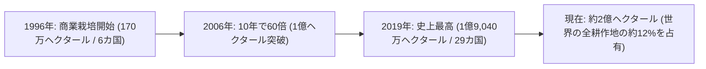

- **栽培面積の推移**: 1996年のわずか170万ヘクタール（日本の本州の半分程度）から、2019年には約1億9,040万ヘクタール（日本の国土面積の約5倍、全耕地面積の約40倍）へと**112倍以上に拡大**した。
- **作目別シェア**: 世界で栽培される大豆の**78%**、綿花の**76%**、トウモロコシの**30%**、菜種（キャノーラ）の**29%**がすでに遺伝子組換え品種である（主要生産輸出国に限れば大豆・綿花・トウモロコシの90%以上がGM）。

### 4.2 主要栽培国の実態と二極化の地政学
世界のGM作物栽培は、上位5カ国で全体の約91%を占める集中構造を持つ：

| 国名 | 栽培面積（万ha） | 主な栽培作物 | 導入率（普及率）の特徴 |
| :--- | :--- | :--- | :--- |
| **アメリカ合衆国** | 約 7,150 | トウモロコシ、大豆、綿花、菜種、テンサイ、アルファルファ | 大豆95%、トウモロコシ93%、綿花96%がGM。世界最大の生産・輸出国。 |
| **ブラジル** | 約 5,280 | 大豆、トウモロコシ、綿花、サトウキビ | 熱帯農業での二期作（サフリーニャ）にGM品種が不可欠。 |
| **アルゼンチン** | 約 2,400 | 大豆、トウモロコシ、綿花 | パンパ平原における不耕起直播農法と一体化してGM大豆100%普及。 |
| **カナダ** | 約 1,250 | キャノーラ、大豆、トウモロコシ、アルファルファ | 除草剤耐性キャノーラが全国農地の大部分を席巻。 |
| **インド** | 約 1,190 | Bt綿花（ワタ） | 害虫抵抗性Bt綿花の普及率が95%超。綿花生産世界一への躍進を牽引。 |
| **中国** | 約 320 | Bt綿花、パパイヤ、近年トウモロコシ・大豆を商用承認 | 食料自給率向上のため国産GM品種の産業化を国家戦略として急加速。 |

一方、西欧諸国（フランス、ドイツ等）は強い消費者拒絶感と厳格な予防原則規制により、スペインやポルトガルの一部で飼料用Btトウモロコシがわずかに栽培されるのみであり、世界は「南北アメリカ・アジア主導のGM大生産国」と「厳格規制の欧州」に二極化している。

### 4.3 農業生産性・経済性の定量的評価と不耕起栽培
PG Economics社（Graham Brookesら）による1996年から2020年までの長期メタアナリシスデータは、GM作物がもたらした巨大な農業経済・環境インパクトを実証している：

1. **経済的利益の創出**
   世界全体で農家に累計**2,613億ドル（約39兆円）**の追加所得をもたらした。内訳の55%は生産コスト削減（農薬代・燃料代・労働費）によるものであり、45%は害虫防除や雑草管理改善に伴う収量増大によるものである。
2. **化学農薬使用量の大幅削減**
   有効成分ベースで世界全体で**7億4,860万キログラム（約7.2%）**の農薬散布量が削減された。特にBt綿花およびBtトウモロコシによる殺虫剤削減効果が顕著であり、環境影響指数（EIQ: Environmental Impact Quotient）は17.3%改善された。
3. **不耕起栽培（No-Till Farming）と土壌炭素貯留（気候変動対策）**
   除草剤耐性作物の導入により、農家は雑草を根絶するためにトラクターで畑を耕起（Ploughing）する必要がなくなった。作物の残渣を残したまま直接種子を播種する「不耕起栽培」が可能となったことで：
   - 表土の風食・水食（土壌流出）が劇的に防止された。
   - トラクター走行回数の激減により、農業燃料消費が年間数十億リットル削減。
   - 土壌中の有機物分解が抑えられ、**年間約2,300万トンの二酸化炭素（乗用車約1,500万台分の年間排出量に相当）が土壌中に炭素隔離（Carbon Sequestration）**された。

### 4.4 アグリビジネスの構造的課題：種子特許の寡占化と食料主権
一方で、GM作物の経済的成功の裏で深刻な構造的摩擦と倫理的課題が浮き彫りとなっている：
- **巨大多国籍企業による種子市場の寡占（ビッグ・アグ）**
  バイエル（独、モンサントを買収）、コルテバ（米、ダウ・デュポンが統合再編）、シンジェンタ（中、中国化工集団傘下）、BASF（独）の主要4社が、世界の商業用種子特許および農薬市場の過半を支配している。
- **特許権と自家採種の禁止**
  従来の農家は、収穫した作物から翌年の種子を自ら採取（自家採種）して繋いできた。しかし特許法で保護されたGM種子は購入時に「自家採種禁止・単年度利用」のライセンス契約を結ばされる。種子価格は過去20年で数倍に高騰し、農家は毎年多国籍企業から種子と対応農薬をセットで購入し続けなければ農業を継続できないという「技術的囲い込み（Lock-in）」状態に陥っている。
- **発展途上国における食料主権（Food Sovereignty）の侵害懸念**
  小規模農民が伝統的な地域固有品種の多様性を失い、外部の大企業に種子供給を完全に握られることに対する懸念が、南米やアフリカの農民運動組織（ビア・カンペシーナ等）から強く提起されている。

## 第5章：ヒトの健康に対する安全性評価と科学的エビデンス

### 5.1 「実質的同等性」の概念と国際ガイドライン
一般市民が遺伝子組換え食品に対して最も強く抱く疑問は、「それを食べた人間の体に、アレルギーや発がん性、未知の健康被害が生じないのか」という点である。

現代の国際社会において、GM食品の安全性評価は感情論や政治的イデオロギーではなく、厳密な科学的基準に基づいて実施されている。その根幹を成す原則が、1993年にOECD（経済協力開発機構）が提唱し、WHO（世界保健機関）、FAO（国連食糧農業機関）、および国際食品規格委員会（CODEX Alimentarius Commission）が採択した**「実質的同等性（Substantial Equivalence）」**の概念である。

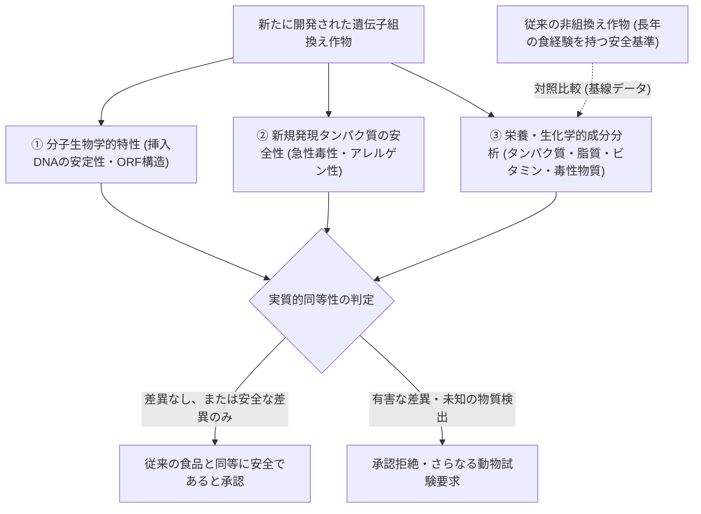

実質的同等性とは、「全く新しい架空の絶対的安全基準をゼロから構築するのではなく、**人類が何百年、何千年にわたり安全に摂取してきた食経験（History of Safe Use）を持つ従来の非組換え作物を比較対照（Baseline）とし、導入された新規形質や成分変化によって、従来の食品と比べて健康リスクが高まっていないか**を客観的に評価する」という実践的な科学哲学である。

### 5.2 具体的な評価プロトコル：毒性・アレルギー性の多重審査
一系統のGM作物が市場に流通するまでには、医薬品開発に匹敵する多重の安全性試験（通常5〜10年、数百億円のコスト）が課される：

| 評価項目 | 具体的な試験手法と評価基準 |
| :--- | :--- |
| **挿入遺伝子の分子的安定性** | サザンブロッティング法や次世代シーケンサー（NGS）による挿入箇所の完全解読。挿入部位周辺のゲノム再編成の有無、意図しない読み枠（オープンリーディングフレーム: ORF）が新規ペプチドを生成していないかの確認。複数世代にわたるメンデル遺伝の安定性。 |
| **新規発現タンパク質の毒性評価** | - **アミノ酸配列のバイオインフォマティクス検索**: 既知の生物毒素データベース（NCBI等）と照合し、相同性（類似度）が有意でないことを確認。 - **急性経口毒性試験**: マウス等の実験動物に、通常摂取量の数千倍〜数万倍に相当する高用量の精製新規タンパク質を単回強制投与し、14日間の行動観察・病理解剖で無毒性を立証。 |
| **アレルゲン性（食物アレルギー）の多重評価** | - **アレルゲン配列相同性検索**: 既知アレルゲンデータベースとの比較で、80アミノ酸のウィンドウ内で35%以上の配列一致、または連続する6〜8アミノ酸の完全一致が存在しないことを確認。 - **人工胃液（ペプシン）消化性試験**: pH 1.2の人工胃液中で、新規タンパク質が30秒から2分以内にアミノ酸断片へと完全に消化分解されるかを検証（アレルゲンの多くは胃液で消化されにくい耐性を持つ）。 - **耐熱性試験**: 加熱調理によってタンパク質が熱変性・失活するかを確認。 |
| **包括的栄養成分プロファイリング** | 収穫された可食部について、主要栄養素（粗タンパク質、粗脂肪、炭水化物、アミノ酸組成、脂肪酸組成）、微量栄養素（各種ビタミン、ミネラル）、および作物固有の天然有害物質・抗栄養素（大豆のトリプシンインヒビターやレクチン、ジャガイモのソラニン等）を数十項目にわたり網羅的に測定し、非GM対照群と統計的に有意な差異がないことを確認。 |

### 5.3 主要科学アカデミーの統一的見解
世界中の権威ある学術機関は、過去30年以上にわたる何千本もの独立した査読付き研究論文、および世界中の数十億頭の家畜によるGM飼料摂取データ（数世代にわたる疫学調査）を徹底的に検証してきた。

- **米国科学・工学・医学アカデミー（NAS, 2016年包括報告書）**
  「市販されている遺伝子組換え作物と従来の作物の間で、ヒトの健康に対するリスクの差異を示す科学的証拠は見出されなかった。GM作物の導入によって、がん、自閉症、肥満、消化器疾患、腎臓病、食物アレルギーの発生率が増加したという疫学的相関は存在しない。」
- **欧州連合・欧州委員会（EC, 25年間の研究レビュー）**
  欧州委員会が数億ユーロの公的資金を投じて実施した130以上の独立研究プロジェクト（500以上の独立研究グループが関与）の結論：「バイオテクノロジー、特に遺伝子組換え技術そのものが、従来の植物育種技術と比べて本質的に危険であるという科学的根拠はない。」
- **世界保健機関（WHO）および米国科学振興協会（AAAS）**
  「現在国際市場で入手可能な遺伝子組換え食品は、安全性評価を通過しており、ヒトの健康に悪影響を及ぼす可能性は極めて低い。認可されたGM食品を摂取したことによる直接的な健康被害は、世界で1件も確認されていない。」

### 5.4 科学的論争の検証と棄却：プシュタイ事件とセラリーニ事件
GM食品の危険性を主張する根拠として、反GMO運動によって頻繁に引用されてきた歴史的「事件」が存在する。しかしこれらは、科学界の厳密な査読と追試によって、実験プロトコルの重大な瑕疵やデータ捏造が暴かれ、**完全に棄却・撤回された偽りの科学（Junk Science）**である。

1. **プシュタイ事件（1998年、英国）**
   ロウェット研究所のアルパード・プシュタイが、マツユキソウ由来のレクチン（GNA）を導入した組換えジャガイモをラットに給餌したところ、腸粘膜の萎縮や免疫力低下が生じたとテレビ番組で告発。
   しかし英国王立協会（Royal Society）がデータを再検証した結果、対照群の栄養バランス設計の初歩的欠陥（ジャガイモ単一給餌によるタンパク質飢餓）、統計解析の不備、未査読データの公表であったことが判明し、公式に実験結果は否定された。
2. **セラリーニ論文の撤回事件（2012年、フランス）**
   カーン大学のジル＝エリック・セラリーニらが、除草剤耐性GMトウモロコシ（NK603）および除草剤ラウンドアップを生涯にわたり給餌したラットに巨大な乳腺腫瘍が発生し早期死亡したとする論文を学術誌『Food and Chemical Toxicology』に発表。
   世界中の科学界、EFSA（欧州食品安全機関）、BfR（ドイツ連邦リスク評価研究所）が一斉に反論声明を発表した。その理由は：
   - 使用された実験用ラット系統「Sprague-Dawley（SDラット）」は、老化に伴って無処置（通常食）であっても生涯で70〜80%の個体が自然発生的に巨大乳腺腫瘍を発症する性質を持つ系統であった。
   - 1群わずか10匹という発がん性試験として統計的に全く無意味な少数サンプル。
   - 投与量と腫瘍発生率に全く用量依存性（Dose-Response）が見られない（低用量群の方が高用量群より腫瘍が多い等）。
   最終的に学術誌側は「データから結論を導き出すことは不可能であり、科学的基準を満たしていない」として**論文を正式に強制撤回（Retraction）**した。

## 第6章：環境・生態系影響（バイオセーフティ）の総合的評価

### 6.1 カルタヘナ議定書と生物多様性保全の枠組み
組換え作物の評価において、ヒトへの安全性と並んで極めて重要なのが「地球の生物多様性と自然生態系に対するバイオセーフティ（生物学的安全性）」である。

2000年に採択された**「カルタヘナ議定書（Cartagena Protocol on Biosafety）」**は、現代のバイオテクノロジーによって改変された生物（LMO: Living Modified Organisms）が国境を越えて移動する際、受入国の生態系に悪影響を与えないよう事前に情報提供と合意形成（事前通報合意手続: AIA）を義務付ける国際条約である。日本も2004年に「カルタヘナ法」を施行し、野外での栽培や輸入に関する極めて厳格な環境影響審査を行っている。

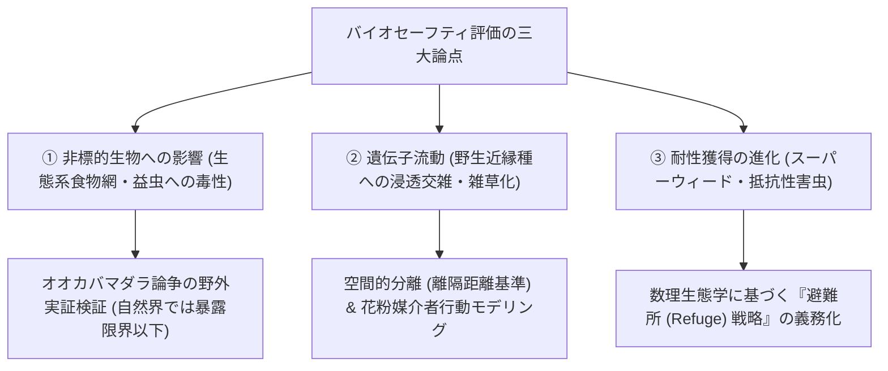

### 6.2 非標的昆虫への影響：オオカバマダラ論争の真相
1999年、コーネル大学のルーズらは、ネイチャー誌に「Btトウモロコシの花粉を人工的にふりかけたトウワタ（*Asclepias*）の葉を食べたオオカバマダラ（モナークバタフライ）の幼虫が死滅した」という実験室データを発表し、全米でセンセーションを巻き起こした。オオカバマダラは北米大陸を数千キロ縦断する美麗な渡り蝶であり、国民的象徴であったため激しい環境論争へと発展した。

しかしその後、米国環境保護庁（EPA）、カナダ政府、米農務省（USDA）、および多数の大学研究機関が2年間にわたる大規模な野外共同調査を実施した結果、実験室の人工的条件と野外の実態との間に決定的な乖離があることが判明した：
1. **花粉飛散距離の限界**: トウモロコシの花粉は重く、畑の縁から4〜5メートル離れると花粉密度は急激に激減（1/100以下）する。
2. **時期の不一致**: トウモロコシの花粉飛散期（わずか1〜2週間）と、オオカバマダラ幼虫がトウワタの葉を摂食するピーク時期が地理的・季節的にほとんど重ならない。
3. **系統による毒性の差**: 当時問題視された初期の「Event 176」系統（花粉中のBt毒素濃度が高かった）は商業栽培から完全に排除され、主力となった「MON810」や「Bt11」系統は花粉中の発現量が極めて低く、野外で幼虫が致死量に暴露されるリスクは無視できるレベル（1%未満）であることが立証された。

むしろ、Bt作物の普及によって広域的な化学殺虫剤の空中散布が激減した結果、農地周辺のテントウムシ、クサカゲロウ、クモなどの益虫や天敵昆虫の個体数が増加し、**総合的な農地生態系の生物多様性は改善した**とする長期フィールド調査結果が相次いで報告されている。

### 6.3 遺伝子流動（Gene Flow）と近縁野生種への浸透交雑
遺伝子流動（Gene Flow / Outcrossing）とは、栽培されているGM作物の花粉が風や昆虫によって運ばれ、近隣の非GM作物、有機栽培作物、あるいは自生する近縁野生種と交雑（Hybridization）する現象である。

リスクの度合いは、作物種とその地域に「交配可能な野生近縁種が存在するか否か」に決定的に依存する：
- **交配近縁種が存在しない作物（低リスク）**: トウモロコシや大豆は、日本や欧州の自然生態系内に自然交雑可能な野生近縁種が自生していない（大豆の祖先野生種ツルマメは日本に自生するが、花粉飛散距離は極めて短く自家受粉性が99%以上であるため、数メートルの離隔で交雑を防止可能）。
- **交配近縁種が自生する作物（高リスク）**: 菜種（キャノーラ: *Brassica napus*）は、アブラナ科の野生植物（カラシナやイヌガラシ）と交雑可能である。輸送中にこぼれ落ちたGM菜種が港湾や道路沿いで自生し、野生近縁種と交雑して除草剤耐性遺伝子が定着する事例が日本やカナダで確認されている。

このため、カルタヘナ法等に基づき、他家受粉作物の栽培においては厳格な「離隔距離基準（トウモロコシで数十〜数百メートル）」の設定や、花粉飛散防止ネットの設置が法的に義務付けられている。

### 6.4 スーパーウィードの出現と害虫の抵抗性獲得（避難所戦略の数理）
GM作物の普及に伴い、進化論（自然淘汰）がもたらした最も深刻な生態学的問題が「耐性生物の進化」である。

#### ① スーパーウィード（除草剤抵抗性雑草）の台頭
農家が何年間も同じ農地でグリホサート耐性作物ばかりを連作し、唯一の除草手段としてグリホサートを過剰連用し続けた結果、強い淘汰圧がかかり、グリホサートが効かない変異雑草「スーパーウィード（Superweeds）」が出現した。
代表例が、米国綿花・大豆地帯を席巻した**オオホナガアオゲイトウ（Palmer amaranth）**や**ヒメムカシヨモギ（Horseweed）**である。オオホナガアオゲイトウは内在性EPSPS遺伝子をゲノム内で何十倍にも重複増幅（Gene Amplification）させ、グリホサートを浴びても余剰の酵素で生き残る進化を遂げた。
この問題はGMOという技術そのものの欠陥というよりは、**「単一農薬への過度な依存という農業管理（アグロノミー）の誤り」**に起因する。現在では、異なる作用機構を持つ複数の除草剤（ジカンバや2,4-D、グルホシネート）に同時に耐性を持つ複合耐性作物の利用や、輪作、カバークロップの導入による統合的雑草管理（IWM: Integrated Weed Management）への転換が進められている。

#### ② 害虫のBt毒素抵抗性と「避難所（リフュージ）戦略」
害虫がBt毒素に対して抵抗性を獲得することを防ぐため、数理集団遺伝学に基づいて導入されたのが**「避難所（Refuge: リフュージ）戦略」**である。

害虫におけるBt毒素抵抗性対立遺伝子（$r$）は、通常は劣性（Recessive）である。すなわち、遺伝子型がホモ接合体（$rr$）の個体のみがBt作物を食べて生存でき、ヘテロ接合体（$Rr$）や野生型ホモ（$RR$）は死滅する。

農地の中に一定割合（通常5%〜20%）の「非Bt作物（リフュージ）」を意図的に混植または隣接栽培することが義務付けられている。
- リフュージからは、Bt毒素に淘汰されていない野生型の感受性害虫（$RR$）が大量に羽化する。
- もしBt農地から極めて稀に抵抗性ホモ害虫（$rr$）が生き残って羽化しても、圧倒的多数を占める野生型感受性個体（$RR$）とランダムに交尾する。
- 誕生する次世代の子供はすべてヘテロ接合体（$Rr$）となる。
- $Rr$ 個体はBt毒素に対して感受性であるため、Bt作物を食べた瞬間に全滅する。

このリフュージ戦略により、抵抗性遺伝子 $r$ の集団内頻度の増加を長期にわたり極めて低レベルに抑え込むことに成功している。

## 第7章：各国の規制・法制度と表示義務（国際比較と政策摩擦）

### 7.1 米国モデル：プロダクト主義と協調的規制枠組み（Coordinated Framework）
遺伝子組換え作物の規制哲学において、世界は大きく「米国型」と「欧州型」の2つの対極的なアプローチに分かれている。

米国のアプローチは、**「プロダクト主義（Product-based Regulation）」**である。
すなわち、「どのような技術（プロセス）で作られたか」ではなく、**「最終的にできた農作物（プロダクト）が何であるか、どのような特性やリスクを持つか」**に着目して規制する。新規な外来遺伝子が導入されていても、最終製品の安全性や栄養組成が従来の作物と同等であれば、過度な規制の障壁を設けないという合理主義に基づく。

米国では、1986年に策定された「バイオテクノロジー規制のための協調的枠組み（Coordinated Framework for Regulation of Biotechnology）」に基づき、既存の3大連邦機関がそれぞれの所管法に基づいて役割を分担・連携している：
1. **農務省動植物検疫局（USDA-APHIS）**: 植物保護法（PPA）に基づき、GM作物が農業生態系において「植物有害動植物（Plant Pest: 病害虫や雑草）」として機能するリスクがないかを環境影響評価する。
2. **食品医薬品局（FDA）**: 連邦食品・医薬品・化粧品法（FD&C Act）に基づき、食品および飼料としての安全性（毒性、アレルゲン性、栄養同等性）を事前協議・審査する。
3. **環境保護庁（EPA）**: 連邦殺虫剤・殺菌剤・殺鼠剤法（FIFRA）および毒物統制法（TSCA）に基づき、Bt作物のように作物自身が病害虫防除成分を産生する「植物内在性保護物質（PIP: Plant-Incorporated Protectant）」の環境・健康安全性を登録・規制する。

ゲノム編集（SDN-1等）に対する米国の態度は極めて明快であり、USDAは2018年、**「従来の伝統的交配育種でも作出可能な変異（外来DNAを含まないゲノム編集作物）は、従来の育種作物と何ら区別せず、特別な規制対象としない」**という方針（SECURE Rule）を公式に発表し、産業化の圧倒的なスピードを後押ししている。

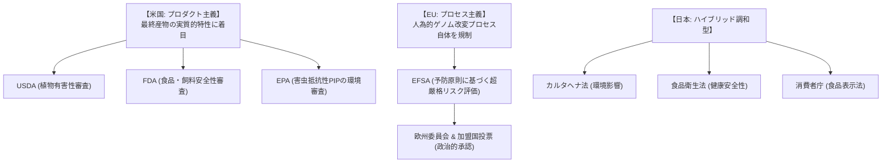

### 7.2 EUモデル：予防原則とプロセス主義（ECJ判決と法改正の激動）
これに対して欧州連合（EU）が厳格に堅持してきたのが、**「プロセス主義（Process-based Regulation）」**および**「予防原則（Precautionary Principle）」**である。

EUの「GMO指令（Directive 2001/18/EC）」は、「自然の交配や自然の組換えでは起こらない方法で遺伝物質が改変された生物」をすべてGMOと定義し、たとえ最終製品が従来の作物と化学的に全く同一であっても、**「遺伝子操作というプロセスを用いたこと自体」を理由に一律の超厳格な規制対象**としてきた。

EFSA（欧州食品安全機関）による科学的リスク評価が行われるものの、最終的な輸入・栽培承認は欧州委員会および加盟国閣僚理事会の政治的投票に委ねられる。各国の農業保護や世論の強い反発を背景に、承認プロセスは極端に長期化し、商業栽培はスペイン等でのごく一部のBtトウモロコシを除き事実上封殺されてきた。

このプロセス主義の硬直性が極限に達したのが、**2018年欧州司法裁判所（ECJ）判決**である。ECJは「ゲノム編集（CRISPR等）もGMO指令の適用対象である」と判示し、外来遺伝子を含まないSDN-1作物に対しても数千万ユーロの審査費用と数年におよぶGMO規制を課す決定を下した。
この判決は欧州の生命科学界から「欧州のバイオテクノロジー産業を中世に逆行させる暴挙」と猛烈な批判を浴びた。

しかし、地球温暖化による熱波・干ばつの深刻化とウクライナ危機に伴う食料安全保障の逼迫を受け、2023年7月、欧州委員会は歴史的な大転換となる**「新規ゲノム技術（NGT: New Genomic Techniques）に関する新規則案」**を発表した。外来遺伝子を含まず自然突然変異と区別がつかないNGT-1作物（SDN-1等）について、従来のGMO規制から完全に除外する規制緩和案が現在審議されており、EUもついに科学的合理性への舵を切り始めている。

### 7.3 日本モデル：カルタヘナ法とゲノム編集届出制度の運用
日本は、科学的合理性と生物多様性保全の調和を図る独自のハイブリッド規制体系を構築している。

1. **カルタヘナ法に基づく二段構えの規制**
   - **第一種使用（環境放出）**: 野外の畑で栽培する場合。野生近縁種への影響、他種への有害性、土壌微生物への影響を環境省・農林水産省が厳格審査。
   - **第二種使用（封じ込め使用）**: 温室や閉鎖的実験施設内で拡散防止措置を講じて取り扱う場合。
2. **食品衛生法および食品表示法**
   厚生労働省（現・消費者庁・内閣府食品安全委員会）による食品健康影響評価を受け、認可された品目のみが輸入・流通を許可される。認可されていない未承認GM作物の混入は許されない（ゼロトレランス）。
3. **ゲノム編集生物に対する日本の画期的ルール（2019年施行）**
   日本政府は、ゲノム編集作物の取り扱いについて世界に先駆けて明確な科学的基準を策定した：
   - **SDN-1（外来遺伝子の残存がないもの）**: カルタヘナ法の「遺伝子組換え生物等」には**非該当**と判断。
   - **届出・情報提供制度**: ただし、秘密裏の流通を防ぎ透明性を確保するため、開発者に対して農林水産省・厚生労働省への事前相談および技術的情報（改変部位、オフターゲット評価、外来ベクターの完全除去証明等）の**事前届出**を義務付け、国民向けにウェブサイトで情報公開する制度を運用している。

### 7.4 新興国・途上国のジレンマと国際貿易摩擦
世界的な穀物サプライチェーンにおいて、規制の不一致（Asynchronous Approvals）は深刻な国際摩擦を引き起こしている：
- **未承認GM作物の微量混入（LLRice601事件など）**
  2006年、米国で未承認のバイエル社製除草剤耐性組換え米「LLRice601」の微量混入（0.1%未満）が輸出用長粒種米から検出され、EUおよび日本が米国産米の輸入を即座に停止。米国のコメ農家と流通業者は数億ドルの破滅的損害を被った。
- **アフリカ諸国のジレンマ**
  アフリカ大陸の多くの国は、干ばつや害虫被害に苦しみながらも、収穫物をEUへ輸出できなくなる（EUの厳しいGMOゼロトレランス規制）ことを恐れるあまり、救命的なGM作物の導入を長年にわたり躊躇し続けてきた。近年、ケニア、ナイジェリア、ガーナなどが相次いで商業栽培を承認し、自国の食料自給を最優先する政策へと転換しつつある。

## 第8章：社会的受容性、消費者心理、倫理・情報リテラシー

### 8.1 なぜ消費者はGMOを恐れるのか：認知バイアスの心理学
客観的な科学データや主要科学アカデミーの合意（「市販のGM食品は従来の食品と同等に安全である」）がいくら提示されても、一般社会におけるGM作物への不安や嫌悪感は依然として根強い。この「科学的コンセンサス」と「大衆のリスク認知」の巨大な乖離は、認知心理学および行動経済学によって説明される。

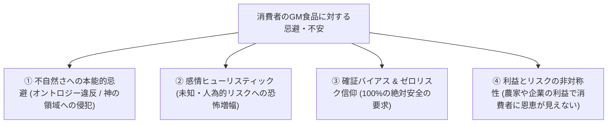

1. **「不自然さ（Unnaturalness）」への本能的嫌悪感**
   認知科学において、人間は生物種を固有の「本質（エッセンス）」を持つカテゴリーとして分類する生得的傾向（素朴生物学: Folkbiology）を持つ。細菌の遺伝子を植物に導入する行為は、生物の境界を侵犯する「不気味なもの（オントロジー違反）」として直感的な嫌悪感を誘発する。
2. **感情ヒューリスティック（Affect Heuristic）と恐怖の増幅**
   心理学者ポール・スロビックの研究が示すように、人間は「自発的に選んだリスク（スキーや喫煙など）」には寛容であるが、「外部から強制され、自ら制御できず、目に見えない人為的リスク（放射能、食品添加物、遺伝子組換え）」に対しては、実際の統計的リスクの数千倍の恐怖を感じる。
3. **確証バイアスとゼロリスク信仰**
   一度「危険かもしれない」という先入観を抱いた消費者は、安全性を示す何百本の学術論文を無視し、インターネット上の不確かな有害説やセンセーショナルな言説ばかりを選択的に信じ込む。科学が「100%のリスクゼロはあり得ない」と誠実に答える姿勢が、かえって「危険が隠されている」という誤解を生む。
4. **ベネフィットの非対称性**
   第1世代のGM作物（除草剤耐性・Bt害虫抵抗性）の恩恵は、農作業の省力化や種子企業の利益という「生産者側」に集中しており、一般消費者は「価格が劇的に安くなるわけでも、味が美味しくなるわけでもないのに、未知のリスクだけを背負わされている」と感じたことが、社会的不信の根本原因となった。

### 8.2 「フランケンフーズ」言説と不安ビジネスのマーケティング
1990年代末、英国のタブロイド紙や一部の急進的環境NGO（グリーンピース、地球の友など）は、メアリー・シェリーの小説に登場する怪物の名を冠した**「フランケンフーズ（Frankenfoods）」**という強烈なプロパガンダ用語を生み出した。

巨大な注射器がトマトに突き刺さるイラスト、遺伝子組換えを食べると奇形児が生まれるという科学的根拠のないビラ、実験圃場を夜間に襲撃して作物を実力破壊するエコ・テロリズムが欧州を中心に展開された。

これに目をつけたのが食品産業の「不安ビジネス（Fear-based Marketing）」である：
- **「遺伝子組換えでない（Non-GMO）」プレミアム価格の創出**
  食品メーカーや流通大手は、安全性の優劣ではなく「消費者の不安をマーケティングに利用する」戦略をとった。非GM表示を付けた製品を高価格帯の「安心・安全ブランド」として位置付けることで、消費者の科学的不安を固定化・再生産し続ける共犯関係が形成された。
- **遺伝子組換えが存在すらしない作物への「非GM」表示**
  商業栽培用の組換え品種が世界に一切存在しない塩、水、オレンジジュース、小麦などにまで「Non-GMO Project」の認証マークを貼り付け、「マークがない製品は遺伝子組換えかもしれない」という根拠なき消費者の猜疑心を煽る商業主義が横行した。

### 8.3 「遺伝子組換えでない」表示制度の功罪と日本の新基準
日本における食品表示基準は、2023年4月に厳格化された：
- **旧基準**: 分別生産流通管理（IPハンドリング）が行われていれば、意図せぬ混入が5%以下であれば「遺伝子組換えでない」と任意表示が可能であった。
- **新基準**: 「遺伝子組換えでない」という文言を表示するためには、**「遺伝子組換え作物の混入がゼロ（不検出）」**であることが厳格に求められるようになった（5%以下の場合は「適切に分別管理された」等の表示に変更）。

消費者の「知る権利」や「選択の自由」を保障する観点からは重要である一方、「遺伝子組換え食品には問題があるから表示が義務付けられているのだ」という逆説的な偏見（スティグマ効果）を消費者に植え付け続ける副作用も併せ持っている。

### 8.4 科学コミュニケーションの構造的失敗と共感型対話への道
従来の科学者や行政のアプローチは、典型的な**「欠如モデル（Deficit Model）」**に陥っていた。
すなわち、「市民が反対するのは科学的知識が欠如しているからであり、正しいデータを一方的に教育・啓蒙すれば理解するはずだ」という上から目線の傲慢さである。

しかし認知心理学が証明したように、信念やアイデンティティに根差した感情的反発は、データの押し付けによってかえって反発を強める（バックファイア効果）。

今後のバイオテクノロジー社会に必要な科学コミュニケーション：
- **リスクとベネフィットの透明な共有**: 「絶対安全」という虚構ではなく、どのようなリスクが存在し、それをどのような管理システムで許容範囲内に抑えているのかを誠実に開示する。
- **共感と価値観の対話**: 消費者の不安や倫理的懸念を「非科学的だ」と切り捨てるのではなく、生命観や食のあり方に対する価値観の対立として受け止め、双方向の熟議（Deliberative Dialogue）を重ねること。

## 第9章：気候変動・世界人口爆発と食料安全保障の最前線

### 9.1 2050年世界人口97億人問題と食料生産50%増大の要請
国連経済社会局（UNDESA）の推計によれば、世界人口は現在の約80億人から、2050年には約**97億人**、21世紀末には100億人を超えると予測されている。

これに伴い、国連食糧農業機関（FAO）は、世界が飢餓と栄養失調の破局的拡大を回避するためには、世界の食料生産を現状比で**最低50%〜70%増大**させなければならないと警告している。

しかし、地球上の農地拡大のフロンティアはすでに限界に達している：
- これ以上の農地開拓は、アマゾンの熱帯雨林やアフリカのサバンナの破壊（森林伐採による地球温暖化の劇的加速と野生生物の絶滅）を意味する。
- 世界の淡水使用量の約70%がすでに農業用水に消費されており、水資源の枯渇が深刻化している。
- 化学肥料（窒素・リン・カリウム）の過剰投与は、河川や海洋の富栄養化（デッドゾーンの拡大）をもたらし、土壌劣化を加速させている。

したがって、人類に残された唯一の解は、**「農地面積や投入水資源を一切拡大することなく、既存の農地における単位面積あたりの収量と資源利用効率（水・窒素・光）を科学の力で飛躍的に高める（持続可能な集約化: Sustainable Intensification）」**こと以外にない。

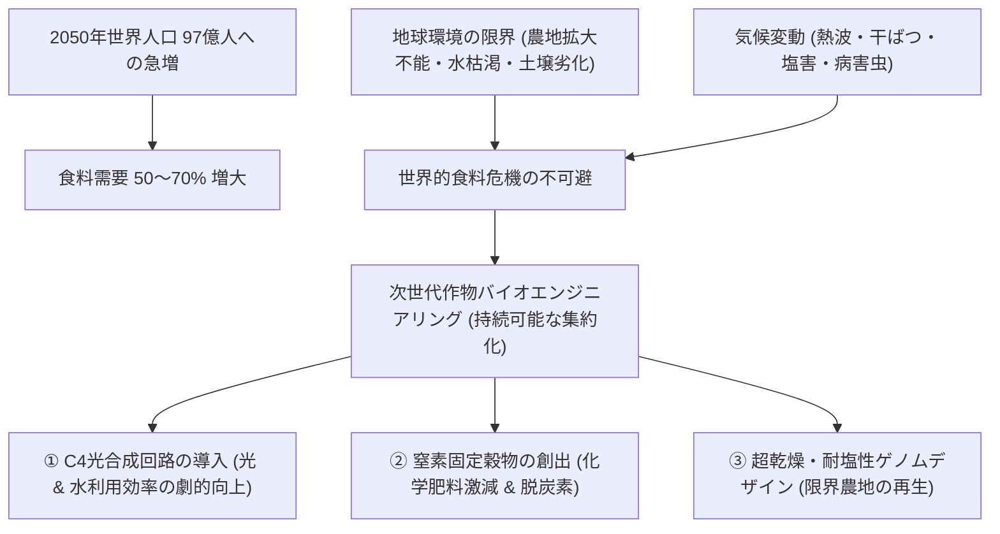

### 9.2 地球温暖化に伴う農業破局シナリオ
気候変動に関する政府間パネル（IPCC）第6次評価報告書は、平均気温の上昇が世界の穀物生産に壊滅的な減収をもたらすシナリオを提示している：
1. **気温上昇による不稔と受粉障害**
   イネやトウモロコシは、開花期の気温が35℃を超えると花粉の稔性が失われ、受粉障害（不稔）を起こして収量が激減する。夜間の高温は呼吸消費を増大させ、登熟不良（白未熟粒の多発）を招く。
2. **極端な干ばつと土壌塩類集積**
   地球規模の水循環の変動により、熱帯・亜熱帯地域だけでなく温帯の主要穀倉地帯（米中西部、豪州、地中海沿岸）で記録的な干ばつが頻発。地下水の過剰汲み上げに伴い、世界全灌漑農地の約20%以上が塩害（塩類集積）により耕作不能の危機に瀕している。
3. **熱帯病害虫の高緯度侵入**
   冬期の温暖化により越冬害虫（ツマジロクサヨトウ、ウンカ、バッタ類）や植物病原菌（いもち病菌、サビ病菌）の生息域が高緯度帯へ北上し、従来の寒冷地農業を脅かしている。

### 9.3 次世代バイオエンジニアリング：C4イネの開発
植物の光合成には、主に「C3型（イネ、コムギ、大豆など多くの作物）」と「C4型（トウモロコシ、サトウキビ、ソルガムなど熱帯原産のイネ科植物）」の2種類が存在する。

C3植物が持つ炭酸固定酵素「Rubisco（ルビスコ）」は、進化的に極めて非効率な酵素であり、二酸化炭素（CO2）だけでなく酸素（O2）とも結合してしまう。高温・乾燥条件下で気孔を閉じると、二酸化炭素の代わりに酸素と反応してエネルギーと有機炭素を無駄に浪費する「光呼吸（Photorespiration）」が発生し、光合成効率が最大40%も低下する。

これに対しC4植物は、葉の維管束鞘細胞と葉肉細胞という2種類の細胞で分業体制（クランツ解剖学的構造）を構築している。葉肉細胞でPEPC（ホスホエノールピルビン酸カルボキシラーゼ）がCO2を効率よく取り込み、C4ジカルボン酸に変換して維管束鞘細胞へ送り込み、Rubisco周辺のCO2濃度を人工的に高めることで、**光呼吸をほぼゼロに抑え込んでいる**。

国際イネ研究所（IRRI）を中心とする国際共同研究コンソーシアム（C4 Rice Consortium）は、ゲノム編集と合成生物学を駆使して、**「イネ（C3植物）の体内にトウモロコシのC4光合成酵素群とクランツ型細胞構造を丸ごと再構築するC4イネ」**の作出に挑んでいる。
C4イネが完成すれば：
- 単位面積あたりの光合成収量は**最大50%向上**。
- 水利用効率（水消費量）は**約50%改善**。
- 窒素利用効率（肥料要求量）は**約30%削減**。
世界の食料供給における最大の科学的ブレイクスルーとなる。

### 9.4 窒素固定能を持つ穀物の創出（化学肥料ゼロ農業）
近代農業の収量を支えるハーバー・ボッシュ法による化学窒素肥料の合成は、世界の全エネルギー消費の約1〜2%を消費し、大量の温室効果ガスを排出している。さらに農地に施用された窒素肥料の一部は、CO2の約300倍の温室効果を持つ一酸化二窒素（N2O）となって大気へ放出されている。

マメ科植物は、根に共生する根粒菌（*Rhizobium*）によって空気中の不活性な窒素ガス（N2）を直接アンモニアに変換して利用できるが、イネ、トウモロコシ、コムギなどの主要穀物は根粒を形成できない。

現在、以下の先駆的バイオテクノロジーが進展している：
1. **穀物への根粒共生シグナル伝達経路の移植**
   マメ科植物が根粒菌と対話するために持つ受容体キナーゼ（NFR1/NFR5）や下流の共生シグナル遺伝子ネットワークを、ゲノム編集によって穀物ゲノム内に再配線する研究。
2. **合成生物学による窒素固定細菌のエンジニアリング**
   米国のPivot Bio社などは、トウモロコシの根圏に定着する非共生土壌細菌のゲノムを編集し、周囲に窒素が存在しても窒素固定酵素（ニトロゲナーゼ）の遺伝子発現を停止させないようフィードバック阻害を解除。作物の根に直接窒素栄養を供給し、化学窒素肥料の使用量を20〜40%削減する生物資材をすでに実用化している。

### 9.5 気孔開閉制御と超乾燥耐性・海水灌漑農業
乾燥ストレスへの適応として、理化学研究所や名古屋大学などの研究チームは、気孔の開閉を司る植物ホルモン「アブシシン酸（ABA）」の受容体（PYL/RCARファミリー）の機能強化や、気孔密度を適切に減少させるゲノム編集作物を開発している。

さらに、海水と同等の塩分濃度でも生育できる好塩性マングローブ植物や耐塩性植物から、過剰なナトリウムイオンを細胞外や液胞内へ汲み出すトランスポーター遺伝子（*SOS1*, *NHX1*, *HKT1*）を単離し、イネや大麦に導入することで、**「海水を混合した汽水で灌漑できる耐塩性作物」**の研究が中東や北アフリカの砂漠地帯で着実に前進している。

## 第10章：未来のバイオテクノロジー農業と持続可能な地球社会

### 10.1 合成生物学の地平：完全合成ゲノムと「デノボ家畜化」
遺伝子改変技術のフロンティアは、単一遺伝子の改変から、染色体やゲノム全体をゼロから設計・合成する「合成生物学（Synthetic Biology）」へと突入している。

1. **完全合成植物ゲノムと人工染色体**
   酵母の全染色体を化学合成した「Sc2.0」プロジェクトの成功に続き、植物の葉緑体ゲノムを完全に人工合成して機能させる研究が進んでいる。人工的にデザインした植物人工染色体（Plant Artificial Chromosome: PAC）を導入することで、何十種類もの耐病性・栄養強化・代謝経路カセットを一度に作物体内で安定稼働させることが可能となる。
2. **デノボ（de novo）家畜化（野生植物の即時作物化）**
   人類が1万年かけて野生種を栽培化（家畜化）した過程で、近代作物は収量と引き換えに、野生種が持っていた強靭な耐病性、耐乾性、栄養価を数多く失ってしまった。
   中国科学院やセインズベリー研究所の研究チームは、過酷な環境に耐える野生のトマト祖先種（*Solanum pimpinellifolium*）に対し、果実サイズ、着花数、草型、脱粒性に関わる6〜10個の栽培化重要遺伝子をCRISPR-Cas9で**「同時にゲノム編集」**した。
   これにより、**わずか1世代（数ヶ月）で、強靭な野生植物を現代の商業トマトに匹敵する大玉・多収の作物へと「即時再家畜化（de novo domestication）」**することに成功した。気候変動に極めて強い未知の新作物を野生植物から無数に生み出す道筋が確立されたのである。

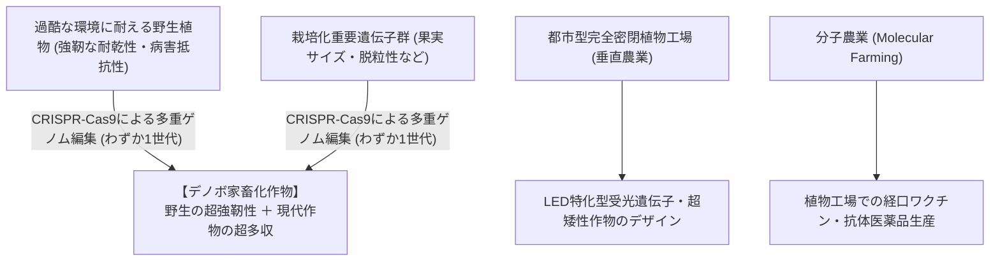

### 10.2 垂直農業・都市型植物工場特化型ゲノムデザイン
天候に左右されず都市近郊で周年無農薬生産を行う「完全人工光型植物工場（Vertical Farming）」の普及に伴い、野外圃場ではなく「植物工場の環境に特化した作物のゲノム編集」が進展している：
- **超矮性化と超短生長期**: 狭い多段シェルフの間隔（数十cm）に合わせて草丈をコンパクトに制御し、播種から収穫までの期間を通常の半分以下（例：1ヶ月で収穫できるミニトマトや大豆）に短縮。
- **光受容体の最適化**: 特定波長のLED照明（赤色・青色・遠赤色光）に対する光受容体（フィトクロム、クリプトクロム）の感度を改変し、最低限の電力消費でバイオマス生産を最大化する。

### 10.3 分子農業（Molecular Farming）：植物製医薬品のフロンティア
作物の役割は、食料の枠組みを超えて「生きたバイオリアクター」へと拡大している。これを**「分子農業（Molecular Farming）」**と呼ぶ。

動物細胞や微生物の巨大培養タンク（高コスト・汚染リスク）を用いる代わりに、成長の早いベンサミアナタバコ（*Nicotiana benthamiana*）やレタス、トウモロコシの葉組織にアグロバクテリウム等を感染させ、有用医薬品タンパク質を大量生産させる：
- **植物製ワクチン・モノクローナル抗体**: エボラ出血熱治療薬「ZMapp」や、植物由来の季節性インフルエンザワクチン、新型コロナウイルス様粒子（VLP）ワクチン（カナダMedicago社開発）など、極めて低コストかつ数週間という超短期間でパンデミックに対応できる供給体制を実現。
- **アニマルフリー乳タンパク質・人工肉タンパク質**: 大豆やエンドウ豆の種子中に、ウシのミルクタンパク質（カゼイン）や筋肉タンパク質（ミオグロビン）を発現させ、本物の牛肉やチーズと同一の風味・食感を持つ植物性代替食品を環境負荷ゼロで生産する。

---

## 結語：科学的知性と地球環境の調和が生み出す未来

植物の遺伝子改変技術を巡る過去半世紀の議論は、しばしば「神の領域を侵す危険なテクノロジー」対「効率至上主義のアグリビジネス」という極端なイデオロギーの二項対立に囚われてきた。

しかし、分子生物学の精緻な解明とゲノム編集技術の成熟が我々に示した真実は、より豊かで調和的な地平である。

遺伝子組み換えやゲノム編集は、自然を征服・破壊するための武器ではない。それは、人類が1万年かけて野生植物のゲノムと対話しながら行ってきた「品種改良」の歴史の正統な延長線上にあり、ただその精度と速度が原子・分子のスケールへと洗練されたものに他ならない。

2050年、世界人口が97億人に達し、激甚化する地球温暖化によって既存の農地が干上がり、飢餓の足音が迫る未来において、「テクノロジーを拒絶して昔の農業に戻る」という選択肢は、何億人もの人命と地球最後の原生林を見捨てることと同義である。

科学的エビデンスに基づいて正しく安全性を検証し、生態系と共生するルールを堅持し、そして大企業の寡占を防ぐ公正な国際ガバナンスを構築すること。

この冷静な知性と倫理的責任を持ってテクノロジーを受け入れるとき、植物バイオテクノロジーは、人類を飢餓から救い、地球環境を再生し、生命の多様性と共存するための「最も強力で持続可能な希望の羅針盤」となるのである。
