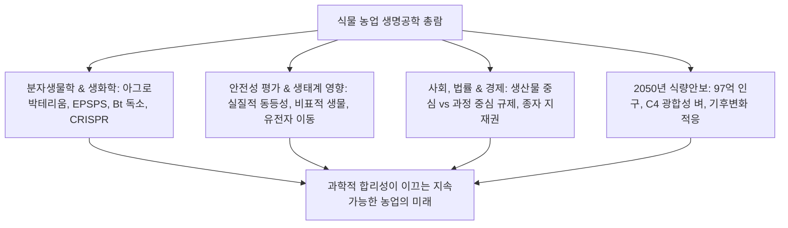
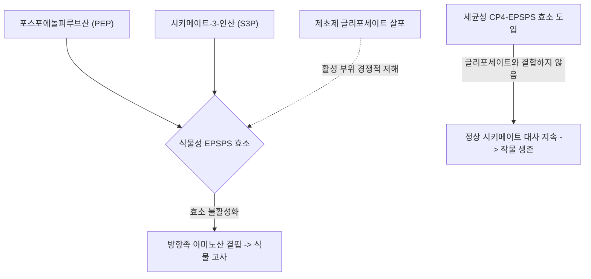
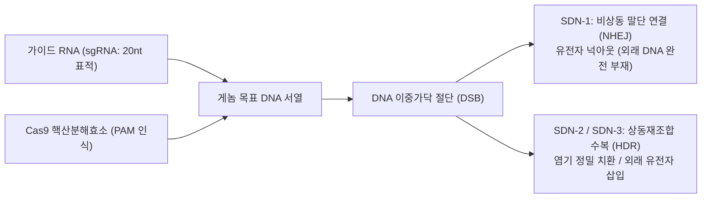

## 서론: 작물 유전공학을 둘러싼 지적 지평

인류 문명의 역사는 식물 게놈을 인류의 생존에 적합하게 개량해 온 작물 육종의 역사입니다. 약 1만 년 전 신석기 농업혁명 이래, 인류는 야생 식물에서 종자 탈립성을 제거하고 가식 부위를 대형화하며 천연 독소를 줄이는 방향으로 끊임없이 인위선택을 거듭해 왔습니다. 현대 옥수수의 조상 야생종인 테오신테(*Teosinte*)는 5~12개의 단단한 낟알에 불과했으나, 형태 전사인자 유전자(*tb1*, *tga1* 등)의 지속적 선발을 통해 수백 개의 알곡이 달린 현대 옥수수로 진화하였습니다.

20세기 후반, 분자생물학의 발전으로 탄생한 '재조합 DNA 기술(rDNA)'은 생물종의 생식적 장벽을 넘어 유용한 유전자를 정밀 도입하는 혁신을 이룩했습니다. 나아가 21세기에는 CRISPR-Cas9, 염기교정, 프라임 에디팅으로 대표되는 부위특이적 유전자가위 기술이 등장하여 식물 고유의 내인성 유전자를 단일 염기 수준의 초정밀도로 재작성할 수 있는 새로운 지평이 열렸습니다.

그러나 농업 생명공학은 대중적 논쟁의 중심에 서 있었습니다. '프랑켄푸드'로 대변되는 정서적 거부감, 다국적 농약·종자 기업의 특허 독과점, 생태계 유전자 유출과 슈퍼잡초의 출현 등 과학적 사실과 사회적 위험 인식 사이에는 깊은 괴리가 존재합니다.

---

## 제1장: 육종의 역사와 재조합 DNA 기술의 원리

### 1.1 야생종 선발부터 교배·돌연변이 육종의 한계
멘델 유전법칙과 잡종강세(F1 하이브리드)를 활용한 20세기 과학적 육종은 농업 생산성을 획기적으로 향상시켰습니다. 그러나 교배 육종은 성적으로 교배 가능한 근연종 간에만 유전자를 도입할 수 있고, 불필요한 유전자가 함께 딸려오는 '연관 끌림(Linkage Drag)'을 해소하기 위해 수많은 세대의 여교배가 필요했습니다. 방사선이나 화학물질(EMS)을 이용한 돌연변이 육종 역시 유전체 전반에 걸친 무작위 손상을 유발한다는 근본적 한계를 지녔습니다.

### 1.2 재조합 DNA 기술의 분자생물학적 도구
1970년대 코언과 보이어 등이 확립한 재조합 기술은 세 가지 핵심 도구에 기초합니다:
- **제한효소(Restriction Endonuclease)**: 특정 회문 염기서열을 인식하여 절단하는 분자 가위.
- **DNA 연결효소(DNA Ligase)**: 포스포디에스테르 결합을 복원하는 분자 풀.
- **클로닝 벡터(Vector)**: 유전자를 운반하고 자율 복제하는 플라스미드.

### 1.3 식물 세포 형질전환: 아그로박테리움법과 유전자총법
1. **아그로박테리움법 (*Agrobacterium tumefaciens*)**: 토양 세균의 Ti 플라스미드 내 T-DNA 전이 기전을 활용. 종양 유전자를 제거한 후 농업적 유용 유전자를 삽입하여 *vir* 유전자 복합체를 통해 식물 염색체에 안정적으로 삽입합니다.
2. **유전자총법 (Biolistics)**: DNA를 코팅한 금 또는 텅스텐 미립자를 고압 헬륨가스(1,500 psi)로 세포벽을 통과시켜 직접 발사하는 물리적 기법으로, 벼·옥수수 등 단자엽식물과 엽록체 형질전환에 필수적입니다.

### 1.4 발현 카세트의 구조 설계
- **프로모터**: 전신 발현용 CaMV 35S, Ubiquitin-1 또는 조직 특이적 프로모터.
- **목적 유전자**: 코돈 최적화된 유전자 서열 (*cp4-epsps*, *cry1Ac*).
- **터미네이터**: 전사 종결 및 폴리아데닐화 신호 (*nos*, *rbcS*).
- **선발 마커**: 항생제(*nptII*) 또는 제초제 저항성 유전자(*bar*).

---

## 제2장: 주요 GM 형질의 생화학적 작용 기전

### 2.1 제초제 내성: 글리포세이트 및 글루포시네이트
- **글리포세이트 내성 (Roundup Ready)**: 글리포세이트는 시키메이트 경로의 **EPSPS 효소**를 경쟁적으로 저해하여 필수 방향족 아미노산(Phe, Tyr, Trp) 합성을 차단합니다(동물에는 없는 대사 경로). 아그로박테리움 CP4 균주에서 유래한 **CP4-EPSPS**는 글리포세이트에 결합하지 않아 제초제 살포에도 작물이 정상 성장합니다.
- **글루포시네이트 내성 (LibertyLink)**: 글루타민 합성효소를 저해하여 세포 내 암모니아 축적을 유도하는 글루포시네이트를, *pat*/*bar* 유래 포스피노트리신 아세틸전이효소(PAT)가 아세틸화하여 무독화합니다.

### 2.2 해충 저항성: 바실러스 튜링겐시스(Bt) Cry 단백질
1. **알칼리 장내 용해**: 불활성 프로톡신(130 kDa)이 나비목 유충의 강알칼리성 중장(pH 9.0~11.0)에서 용해됩니다.
2. **단백질 분해 활성화**: 유충 장내 단백질 분해효소가 활성형 65 kDa 코어 독소로 절단합니다.
3. **수용체 결합 및 천공 형성**: 독소가 중장 상피세포의 카드헤린 수용체에 결합하여 올리고머를 형성, 직경 1~2 nm의 양이온 통로(천공)를 뚫어 세포를 삼투압으로 파괴합니다.
4. **포유류 무해성**: 포유류와 사람의 위는 강산성(pH 1~2)이어서 펩신에 의해 수십 초 만에 완전 소화되며, 장관 상피에 카드헤린 결합 수용체가 유전적으로 존재하지 않습니다.

### 2.3 바이러스 저항성 및 영양 강화
- **레인보우 파파야**: 외피 단백질 매개 RNA 간섭(RNAi) 기술로 PRSV 바이러스를 사멸시켜 하와이 파파야 산업을 구제.
- **골든라이스 (Golden Rice)**: 옥수수 유래 피토엔 합성효소(*psy*)와 세균성 탈수소효소(*crtI*)를 배유에 발현시켜 쌀알 내 프로비타민 A(베타카로틴) 생합성 경로를 재구축.

---

## 제3장: 전통적 GMO와 CRISPR 게놈편집의 결정적 차이

### 3.1 무작위 삽입 대 정밀 표적 절단
전통적 GMO는 외래 유전자가 염색체 내에 무작위로 삽입되지만, CRISPR-Cas9은 20nt 단일 가이드 RNA(sgRNA)를 통해 표적 서열만을 정확히 인식하여 이중나선 절단(DSB)을 유도합니다.

### 3.2 SDN 분류 체계
- **SDN-1**: 비상동 말단 연결(NHEJ) 수복 오류로 몇 개 염기가 결실되어 유전자가 넉아웃됩니다. **외래 DNA가 전혀 남지 않아** 자연적 돌연변이와 완전히 동일하며, 미국·일본·인도 등에서 비-GMO로 규제 면제됩니다.
- **SDN-2**: 짧은 주형을 이용한 정밀 염기 치환.
- **SDN-3**: 대형 유전자 카세트 삽입(전통적 GMO 규제 적용).

### 3.3 상용화 사례
- **일본 사나텍시드 고GABA 토마토**: 글루탐산 탈탄산효소(*GAD*)의 자가억제 도메인을 절단하여 혈압 강하 물질인 GABA 함량을 5배 증대.
- **갈변 방지 양송이버섯 및 저아크릴아마이드 감자**: 폴리페놀 옥시다아제 유전자 넉아웃.

---

## 제4장: 전 세계 재배 동향과 농업 경제적 영향
- **재배 규모**: 1996년 170만 ha에서 현재 약 1억 9천만 ha(세계 경작지의 12%)로 확대.
- **주요 재배국**: 미국(7,150만 ha), 브라질(5,280만 ha), 아르헨티나(2,400만 ha), 인도(1,190만 ha).
- **경제·환경적 성과**: 25년간 2,613억 달러의 농가 소득 증대, 살충제 살포 7억 4,800만 kg 감축, 무경운 농법 확대로 연간 2,300만 톤의 토양 탄소 격리.
- **종자 독과점 이슈**: 4대 글로벌 농화학 기업의 종자 특허 장악과 농가의 자가채종 제한에 따른 식량 주권 논쟁.

---

## 제5장: 인체 안전성 평가와 과학적 합의
- **실질적 동등성 원칙**: 안전 섭취 이력을 지닌 전통 작물과의 성분·영양 프로파일 대조 평가.
- **독성 및 알레르기 평가**: 고용량 급성 경구 독성 시험, 알레르겐 데이터베이스 상동성 검색, 인공위액(펩신) 소화 시험(2분 이내 완전 분해).
- **글로벌 과학계 합의**: 미국 국립과학원(NAS), 유럽식품안전청(EFSA), WHO의 공통 결론: 승인된 GM 식품은 일반 식품과 동일하게 안전함. 세랄리니 논문 등은 치명적 실험 결함으로 정식 철회됨.

---

## 제6장: 생태계 생물안전성(Biosafety) 평가
- **카르타헤나 의정서**: 유전자변형생물체(LMO)의 국가 간 이동 규제.
- **비표적 생물**: 야외 포장 조사를 통해 Bt 옥수수 꽃가루의 제왕나비 유충 유해설 반증.
- **피난처(Refuge) 전략**: 5~20%의 비-Bt 구역 혼식을 법제화하여, 열성 저항성 유전자(r)를 지닌 해충이 야생형 감수성 개체(R)와 교배하도록 유도함으로써 저항성 출현을 집단유전학적으로 영구 차단.

---

## 제7장: 국제 규제 제도 및 표시제 비교
- **미국 (산물 중심)**: USDA, FDA, EPA 협력 체계; SDN-1 게놈편집 작물 규제 면제(SECURE 규정).
- **EU (과정 중심)**: 2001/18/EC 지침과 사전예방원칙; 2023년 NGT-1 완화 법안 추진.
- **일본**: 카르타헤나법 엄격 심사 및 SDN-1 사전 신고 정보공개 제도 운용.

---

## 제8장: 소비자 심리와 과학 커뮤니케이션
- **인지 편향**: 본질주의적 거부감, 무위험 편향(Zero-risk bias).
- **공포 마케팅**: 유전자재조합이 존재하지 않는 소금, 생수 등에 'Non-GMO' 라벨을 부착하여 불안을 상업화.
- **소통의 혁신**: 결핍 모델(일방적 지식 주입)을 탈피하여 공감과 가치관을 공유하는 양방향 소통 구축.

---

## 제9장: 기후변화와 2050년 97억 인구 식량안보
- **2050년 식량 증산 요구**: 97억 인구를 부양하기 위해 산림 파괴 없이 수확량 50~70% 증산 필요(지속가능한 집약화).
- **C4 벼 국제 컨소시엄**: 옥수수의 고효율 C4 광합성 회로를 벼에 도입하여 수확량 50% 향상, 수분 이용 효율 2배 증대.
- **질소고정 곡물 개발**: 뿌리혹 공생 경로 개척 및 엔지니어링 미생물(Pivot Bio) 도입으로 화학 비료 사용 감축.

---

## 제10장: 합성생물학과 드 노보 가축화(De Novo Domestication)
- **드 노보 가축화**: 야생 토마토(*Solanum pimpinellifolium*)의 6~10개 가축화 유전자를 다중 CRISPR 편집하여, 단 1세대 만에 야생의 강인성과 상업적 다수확성을 결합한 신작물 창출.
- **분자농업 (Molecular Farming)**: 식물체를 바이오리액터로 활용하여 식물성 백신, 항체 의약품 및 배양 단백질 생산.

---

## 결론: 과학적 이성과 지구 생태계의 조화
농업 생명공학은 인류의 1만 년 육종 역사가 원자·분자 수준으로 정밀화된 과학적 진보입니다. 기후위기 시대에 과학적 안전성을 바탕으로 기술을 수용할 때, 생명공학은 인류를 기아에서 구하고 지구 환경을 보전하는 가장 강력한 희망이 될 것입니다.
