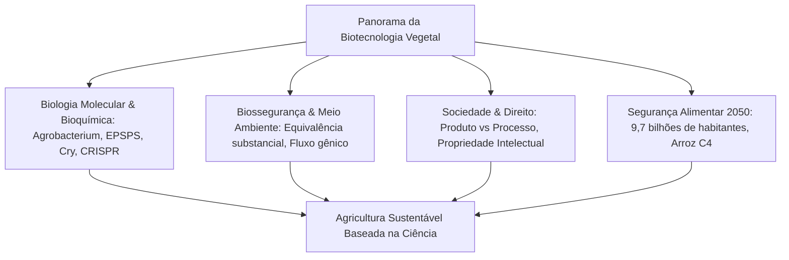
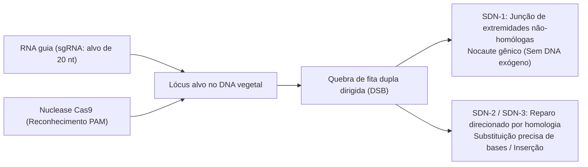

## Introdução: O horizonte da biotecnologia agrícola

A civilização humana depende da evolução genética das plantas. Há 10.000 anos, os primeiros agricultores iniciaram a seleção artificial de gramíneas silvestres, suprimindo a dispersão espontânea de sementes, aumentando o tamanho das partes comestíveis e eliminando compostos amargos tóxicos.

Na década de 1970, a tecnologia do DNA recombinante (rDNA) permitiu a transferência de genes específicos além das barreiras biológicas de espécies. No século XXI, as ferramentas de edição de genoma com nucleases sítio-dirigidas (CRISPR-Cas9, edição de bases e prime editing) inauguraram a capacidade de reescrever o código genético nativo com precisão cirúrgica de nucleotídeo único.

Contudo, a biotecnologia agrícola tem sido alvo de intensas controvérsias sociais. O receio popular em relação a "Frankenfoods", debates sobre a concentração de patentes de sementes e preocupações sobre o fluxo gênico criaram um abismo entre o consenso científico e a percepção de risco pelo público.

---

## Capítulo 1: Histórico do melhoramento e princípios do DNA recombinante

### 1.1 Da domesticação tradicional à mutagênese induzida
A transição do teosinto silvestre para o milho moderno (*Zea mays*) envolveu a seleção contínua de mutações genéticas estruturais (*tb1*, *tga1*). No século XX, o melhoramento científico explorou o vigor híbrido (heterose), porém permaneceu restrito à compatibilidade sexual e ao arrasto por ligação gênica (*linkage drag*). A mutagênese física e química (radiação e EMS) gerou milhares de linhagens, mas tratava-se de um processo destrutivo aleatório no genoma.

### 1.2 O conjunto de ferramentas moleculares do rDNA
A engenharia genética clássica apoia-se em:
- **Endonucleases de restrição**: Enzimas bacterianas que clivam sequências palindrômicas específicas.
- **DNA ligase**: Restauração enzimática das ligações fosfodiéster.
- **Vetores de clonagem**: Plasmídeos para replicação autônoma e transferência de genes.

### 1.3 Sistemas de transformação: Agrobacterium e biobalística
1. **Agrobacterium tumefaciens**: Utiliza o plasmídeo Ti desarmado; genes de virulência (*vir*) transferem o T-DNA de fita simples para integração no núcleo da célula vegetal.
2. **Biobalística (Arma de genes)**: Microprojéteis de ouro ou tungstênio acelerados por gás hélio em alta pressão penetram a parede celular, técnica indispensável para cereais monocotiledôneos e cloroplastos.

### 1.4 Arquitetura dos cassetes de expressão
- **Promotores**: Constitutivos (CaMV 35S, Ubiquitina-1) ou tecido-específicos.
- **Gene de interesse**: Sequência codificadora otimizada para códons vegetais.
- **Terminadores**: Sinais de poliadenilação (*nos*, *rbcS*).
- **Marcadores de seleção**: Resistência a antibióticos (*nptII*) ou herbicidas (*bar*).

---

## Capítulo 2: Bioquímica das características transgênicas

### 2.1 Tolerância a herbicidas: Glifosato e Glufosinato
- **Glifosato (Roundup Ready)**: O herbicida inibe competitivamente a enzima EPSPS na rota do chiquimato, paralisando a síntese de aminoácidos aromáticos (Phe, Tyr, Trp). A enzima bacteriana **CP4-EPSPS** de *Agrobacterium* sp. CP4 não é inibida pelo glifosato, mantendo o metabolismo vegetal normal.
- **Glufosinato (LibertyLink)**: O composto inibe a glutamina sintetase, provocando o acúmulo letal de amônia. O gene *pat*/*bar* expressa a enzima fosfinotricina acetiltransferase, que acetila e neutraliza o herbicida.

### 2.2 Resistência a insetos: Proteínas Cry de Bacillus thuringiensis
1. **Solubilização alcalina**: Cristais de protoxina dissolvem-se unicamente no intestino alcalino (pH 9,0–11,0) de lagartas-alvo.
2. **Ativação proteolítica**: Proteases intestinais clivam a protoxina liberando a toxina ativa de 65 kDa.
3. **Ligação a receptores e poros**: A toxina liga-se a receptores de caderina nas microvilosidades, formando poros oligoméricos de 1–2 nm que causam lise celular coloidosmótica e morte larval.
4. **Segurança para mamíferos**: Ausência absoluta de receptores de caderina específicos em mamíferos e degradação ultrarrápida pela pepsina ácida gástrica em menos de 30 segundos.

### 2.3 Resistência viral e biofortificação
- **Mamão Rainbow**: Resistência ao vírus da mancha anelar (PRSV) via interferência de RNA (RNAi).
- **Arroz Dourado (Golden Rice)**: Introdução dos genes de fitoeno sintase (*psy*) e fitoeno dessaturase bacteriana (*crtI*) no endosperma para biossíntese de β-caroteno contra a hipovitaminose A.

---

## Capítulo 3: Diferenciação: Transgênicos vs Edição Genômica CRISPR

### 3.1 Precisão cirúrgica versus inserção aleatória
A tecnologia CRISPR-Cas9 introduz quebras de fita dupla (DSBs) direcionadas por um RNA guia (sgRNA) em sítios PAM específicos, permitindo mutações sítio-dirigidas sem a presença obrigatória de DNA exógeno.

### 3.2 A classificação SDN
- **SDN-1**: Reparo por NHEJ que gera pequenas inserções ou deleções (*indels*). **Não contém DNA exógeno**, sendo equivalente às mutações naturais.
- **SDN-2**: Edição precisa de nucleotídeos guiada por molde homólogo de reparo.
- **SDN-3**: Inserção de cassetes gênicos completos (regulamentada como transgênico tradicional).

### 3.3 Aplicações comerciais
- **Tomate High-GABA (Sanatech Seed)**: Nocaute do domínio autoinibidor da enzima GAD, aumentando em cinco vezes o teor do aminoácido calmante e hipotensor GABA.
- **Cogumelos sem escurecimento enzimático e trigo hipoalergênico**: Supressão de polifenol oxidases (*PPO*) e gliadinas alergênicas.

---

## Capítulo 4: Panorama global e impactos socioeconômicos
- **Adoção global**: 190 milhões de hectares cultivados (EUA 71,5 Mha, Brasil 52,8 Mha, Argentina 24 Mha, Índia 11,9 Mha). 78% da soja e 76% do algodão mundiais são transgênicos.
- **Dividendos ambientais**: 261 bilhões de dólares em renda agrícola adicional, redução de 748 milhões de kg de pesticidas e fixação de 23 milhões de toneladas de carbono por ano via plantio direto.
- **Desafios monopolistas**: Quatro grandes corporações controlam as patentes de sementes e insumos, restringindo o direito tradicional dos agricultores de guardar sementes para o plantio subsequente.

---

## Capítulo 5: Avaliação de segurança alimentar e consenso científico
- **Equivalência substancial**: Comparação analítica da variedade biotecnológica com a linhagem convencional segura (Codex, OMS, FAO).
- **Protocolos de ensaio**: Toxicidade oral aguda, alinhamentos de bioinformática com bancos de alérgenos e cinética de digestão gástrica em pepsina (<2 minutos).
- **Consenso científico internacional**: Respaldado pela Academia Nacional de Ciências dos EUA (NAS), EFSA e OMS. Retratação formal de publicações falhas (estudos de Pusztai e Séralini).

---

## Capítulo 6: Avaliação de riscos ecológicos e biossegurança
- **Protocolo de Cartagena**: Regras vinculantes sobre a movimentação transfronteiriça de organismos vivos modificados (OVM).
- **Fauna não-alvo**: Pesquisas de campo refutaram a toxicidade a campo do pólen Bt sobre a borboleta-monarca.
- **Áreas de refúgio**: Obrigação agronômica de manter parcelas não-Bt (5–20%) para preservar alelos de suscetibilidade em populações de insetos-praga.

---

## Capítulo 7: Regulação internacional comparada
- **EUA e Brasil (Foco no Produto)**: Análise baseada nas características biológicas do produto final; isenção desregulamentada para cultivares SDN-1.
- **União Europeia (Foco no Processo)**: Diretiva 2001/18/CE orientada pelo princípio da precaução; projeto de lei de 2023 propondo a flexibilização das plantas NGT-1.
- **Japão**: Notificação prévia de linhagens SDN-1 com garantia de transparência pública.

---

## Capítulo 8: Percepção pública e comunicação de riscos
- **Vieses cognitivos**: Essencialismo psicológico intuitivo e aversão aos riscos considerados artificiais.
- **Monetização do medo**: Uso de rótulos "Livre de Transgênicos" em produtos que nunca tiveram equivalente GM (sal, água mineral).
- **Diálogo empático**: Superação do modelo do déficit de informação através de debates abertos e éticos sobre sustentabilidade.

---

## Capítulo 9: Mudanças climáticas e segurança alimentar em 2050
- **Desafio de 2050**: Aumentar a oferta alimentar em 50–70% sem expandir desmatamentos (intensificação sustentável).
- **Arroz C4**: Consórcio internacional para transferir a fotossíntese C4 do milho para o arroz, elevando a produtividade em 50% e duplicando o aproveitamento de água.
- **Fixação biológica de nitrogênio**: Modificação de microrganismos de solo (Pivot Bio) para fornecer nitrogênio diretamente às raízes de cereais, eliminando fertilizantes poluentes.

---

## Capítulo 10: Biologia sintética e domesticação de novo
- **Domesticação de novo**: Edição CRISPR simultânea de 6 a 10 genes em parentes silvestres (*Solanum pimpinellifolium*), criando plantas produtivas e ultrarresistentes em uma única geração.
- **Agricultura molecular**: Síntese de vacinas, anticorpos terapêuticos e proteínas animais a partir de biofábricas vegetais.

---

## Conclusão: Razão científica e sustentabilidade planetária
A biotecnologia agrícola é o aprimoramento refinado da domesticação histórica de plantas. Perante o desafio climático do século XXI, ela constitui o instrumento mais seguro e decisivo para erradicar a fome e regenerar os ecossistemas globais.
