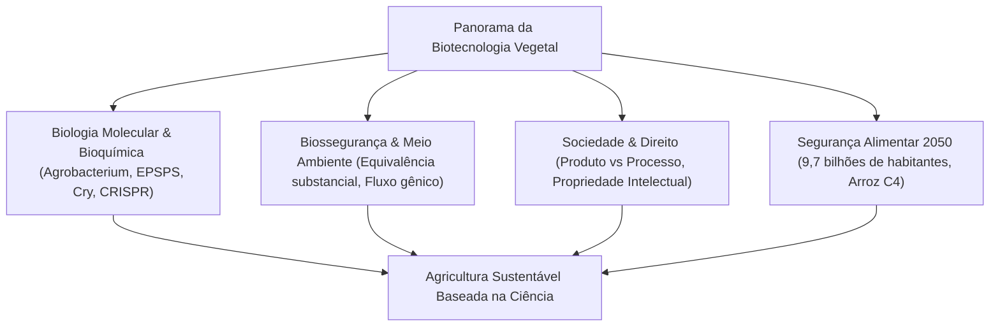

## Introdução: O horizonte da biotecnologia agrícola
A civilização humana depende da evolução genética das plantas. Do melhoramento tradicional à tecnologia do DNA recombinante e à edição de genomas via CRISPR-Cas9, a ciência agrícola busca alimentar a humanidade de forma sustentável.

## Capítulo 1: Histórico do melhoramento e princípios do DNA recombinante
Evolução da seleção artificial à mutagênese e transferência genética mediada por *Agrobacterium tumefaciens* e biobalística.

## Capítulo 2: Bioquímica das características transgênicas
Tolerância ao glifosato através da enzima CP4-EPSPS, toxinas inseticidas Cry de *Bacillus thuringiensis* ativas apenas em pH alcalino de lagartas, e biofortificação com o Arroz Dourado.

## Capítulo 3: Diferenciação: Transgênicos vs Edição Genômica (CRISPR)
A edição genômica SDN-1 promove mutações pontuais no genoma nativo da planta sem incorporar DNA exógeno, equivalendo biologicamente a mutações naturais.

## Capítulo 4: Panorama global e impactos econômicos
Mais de 190 milhões de hectares cultivados (EUA, Brasil, Argentina, Índia). Aumento da produtividade, redução no uso de inseticidas e conservação do solo por plantio direto.

## Capítulo 5: Avaliação de segurança alimentar e consenso científico
Princípio da equivalência substancial (OMS, FAO), ensaios toxicológicos e consenso das principais academias científicas sobre a segurança dos transgênicos aprovados.

## Capítulo 6: Avaliação de riscos ecológicos e biossegurança
Protocolo de Cartagena, elucidação sobre insetos não-alvo, contenção do fluxo gênico e áreas de refúgio para mitigar a resistência de pragas.

## Capítulo 7: Regulação internacional comparada
Abordagem orientada ao produto (EUA, Brasil) versus foco no processo baseado no princípio da precaução (União Europeia).

## Capítulo 8: Percepção pública e comunicação científica
Causas psicológicas da aversão aos OGM, marketing de alimentos "não-transgênicos" e diálogo empático.

## Capítulo 9: Mudanças climáticas e segurança alimentar em 2050
Pesquisa do consórcio internacional para o Arroz C4, cultivares resistentes à seca e fixação biológica de nitrogênio em cereais.

## Capítulo 10: Biologia sintética e domesticação de novo
Aceleração da domesticação de espécies silvestres e agricultura molecular para produção de vacinas em plantas.
