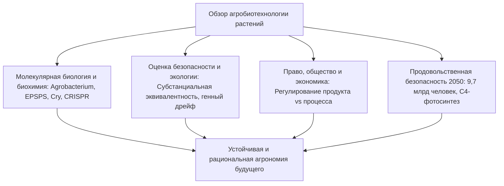
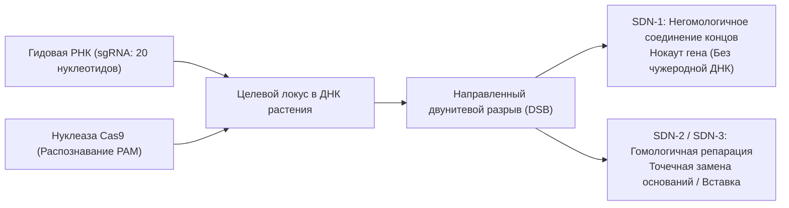

## Введение: Научный горизонт биотехнологии растений

История человеческой цивилизации неразрывно связана с направленной модификацией геномов растений. Около 10 000 лет назад, в эпоху неолитической революции, человек начал отбор дикорастущих трав, закрепляя устойчивость к осыпанию семян, увеличивая съедобную биомассу и удаляя природные токсины.

Появление технологии рекомбинантной ДНК (рДНК) в 1970-х годах преодолело межвидовые барьеры, позволив внедрять строго определенные функциональные гены. В XXI веке развитие сайт-специфических нуклеаз (CRISPR-Cas9, редактирование оснований и праймированное редактирование) открыло возможность прецизионного переписывания собственного генетического кода растений с точностью до одного нуклеотида.

В то же время сельскохозяйственная биотехнология неизменно оказывалась в эпицентре общественных споров. Опасения перед "Франкенфудом", критика монополий семенных корпораций и вопросы генного дрейфа сформировали глубокий разрыв между консенсусом ученых и восприятием рисков обществом.

---

## Глава 1: Селекция растений и молекулярные основы рекомбинантной ДНК

### 1.1 От одомашнивания теосинте к мутагенезу
Дикий теосинте превратился в современную кукурузу благодаря отбору мутаций в регуляторных генах (*tb1*, *tga1*). В XX веке научная гибридизация использовала гетерозис, но ограничивалась половой совместимостью и сцепленным наследованием нежелательных генов (*linkage drag*). Мутагенез под действием радиации и химических мутагенов (ЭМС) вызывал миллионы случайных разрывов ДНК без возможности контроля побочных повреждений генома.

### 1.2 Молекулярный инструментарий технологии рДНК
Генная инженерия опирается на три ключевых инструмента:
- **Эндонуклеазы рестрикции**: Бактериальные ферменты, расщепляющие специфические палиндромные последовательности.
- **ДНК-лигаза**: Фермент, восстанавливающий фосфодиэфирные связи.
- **Векторы клонирования**: Плазмиды для автономной репликации и экспрессии генов.

### 1.3 Методы трансформации: Agrobacterium и генная пушка
1. **Agrobacterium tumefaciens**: Перенос Т-ДНК из обезоруженных Ti-плазмид. Белки вирулентности (*vir*) транспортируют одноцепочечную Т-ДНК в растительное ядро для интеграции в хромосомы.
2. **Биобаллистика (Генная пушка)**: Микрочастицы золота или вольфрама с нанесенной ДНК под высоким давлением гелия проникают через клеточную стенку, что незаменимо для злаковых культур и генома хлоропластов.

### 1.4 Структура экспрессионных кассет
- **Промоторы**: Конститутивные (CaMV 35S, Ubiquitin-1) или тканеспецифичные.
- **Целевой ген**: Кодон-оптимизированные кодирующие последовательности (*cp4-epsps*, *cry1Ac*).
- **Терминаторы**: Сигналы полиаденилирования (*nos*, *rbcS*).
- **Селективные маркеры**: Гены устойчивости к антибиотикам (*nptII*) или гербицидам (*bar*).

---

## Глава 2: Биохимия ключевых трансгенных признаков

### 2.1 Устойчивость к гербицидам: Глифосат и Глюфосинат
- **Глифосат (Roundup Ready)**: Конкурентно ингибирует фермент EPSPS в шикиматном пути, останавливая биосинтез ароматических аминокислот (Phe, Tyr, Trp). Бактериальный фермент **CP4-EPSPS** из *Agrobacterium* sp. CP4 не связывается с глифосатом, сохраняя метаболизм растения незатронутым.
- **Глюфосинат (LibertyLink)**: Ингибирует глутаминсинтетазу, вызывая летальное накопление аммиака. Ген *pat*/*bar* кодирует фосфинотрицин-ацетилтрансферазу, нейтрализующую гербицид.

### 2.2 Устойчивость к вредителям: Кристаллические токсины Bacillus thuringiensis
1. **Щелочное растворение**: Кристаллы протоксина (130 кДа) растворяются только в щелочной среде (pH 9,0–11,0) кишечника гусениц.
2. **Активация протеазами**: Протеазы насекомого отщепляют фрагменты, высвобождая активный токсин 65 кДа.
3. **Связывание с кадгеринами и поры**: Токсин связывается с рецепторами кадгерина на мембранах эпителия, формируя олигомерные поры диаметром 1–2 нм, вызывающие осмотический лизис клеток и гибель личинки.
4. **Безопасность для теплокровных**: У человека и млекопитающих полностью отсутствуют специфические кадгериновые рецепторы для Cry-белков, а желудочный сок (pH 1–2) расщепляет их пепсином за считанные секунды.

### 2.3 Вирусная устойчивость и биофортификация
- **Папайя Rainbow**: Устойчивость к вирусу кольцевой пятнистости (PRSV) через механизм РНК-интерференции (РНКи).
- **Золотой рис (Golden Rice)**: Введение генов фитоинсинтазы (*psy*) и фитоиндесатуразы (*crtI*) восстанавливает синтез β-каротина в эндосперме риса для борьбы с дефицитом витамина А.

---

## Глава 3: Различия между классическими ГМО и CRISPR

### 3.1 Точечное редактирование против случайной интеграции
В отличие от классических ГМО, где чужеродная ДНК встраивается в случайные участки хромосом, система CRISPR-Cas9 с помощью гидовой РНК (sgRNA) вносит двунитевой разрыв в строго заданном локусе, позволяя выключать гены без внедрения чужеродного генетического материала.

### 3.2 Классификация SDN
- **SDN-1**: Репарация путем негомологичного соединения концов (NHEJ) с образованием микроделеций. **Чужеродная ДНК полностью отсутствует**, результат неотличим от естественных мутаций.
- **SDN-2**: Точная замена нескольких нуклеотидов по матрице гомологичного репарационного фрагмента.
- **SDN-3**: Встраивание полноразмерных генных кассет (регулируется как классический трансген).

### 3.3 Практические примеры
- **Томаты High-GABA (Sanatech Seed)**: Нокаут автоингибиторного домена фермента глутаматдекарбоксилазы повысил уровень гипотензивной аминокислоты ГАМК в 5 раз.
- **Шампиньоны без побурения и гипоаллергенная пшеница**: Подавление генов полифенолоксидаз и белков глиадинов.

---

## Глава 4: Мировые масштабы выращивания и экономический эффект
- **Площади посевов**: Более 190 млн га в 29 странах (США 71,5 млн га, Бразилия 52,8 млн га, Аргентина 24 млн га, Индия 11,9 млн га). Генетически модифицированы 78% сои и 76% хлопка в мире.
- **Экономическая выгода**: 261 млрд долларов суммарного дохода фермеров, сокращение применения инсектицидов на 748 млн кг и депонирование 23 млн тонн CO2 ежегодно за счет технологии нулевой обработки почвы (No-Till).
- **Патентные монополии**: Концентрация семенного рынка в руках четырех транснациональных корпораций вызывает вопросы доступности семян для фермеров.

---

## Глава 5: Безопасность для здоровья и научный консенсус
- **Субстанциальная эквивалентность**: Принцип ВОЗ/ФАО, сравнивающий биотехнологическую культуру с безопасным традиционным аналогом.
- **Токсикологические исследования**: Тесты на острую токсичность, сравнение с базами данных аллергенов и расщепление пепсином (<2 минут).
- **Научный консенсус**: Национальная академия наук США (NAS), EFSA и ВОЗ подтверждают безопасность коммерческих ГМО. Официальный отзыв сфальсифицированных анти-ГМО публикаций (исследования Пуштаи и Сералини).

---

## Глава 6: Экологическая оценка и биобезопасность
- **Картахенский протокол**: Международные стандарты перемещения живых измененных организмов (ЖИО).
- **Нецелевые организмы**: Полевые исследования опровергли гипотезу о вреде Bt-пыльцы для бабочки-монарха в природных условиях.
- **Стратегия убежищ (Refuge)**: Обязательный посев 5–20% площадей обычными культурами без Bt-токсина сохраняет чувствительные аллели у насекомых и предотвращает развитие устойчивости.

---

## Глава 7: Международное правовое регулирование
- **США (Продуктовый подход)**: Концепция Coordinated Framework; выведение культур SDN-1 из-под жестких правил для ГМО.
- **ЕС (Процессный подход)**: Директива 2001/18/EC; законопроект Европейской комиссии 2023 года по либерализации правил для растений NGT-1.
- **Япония**: Уведомительный порядок для линий SDN-1 с открытой публикацией информации в госреестре.

---

## Глава 8: Психология восприятия и дезинформация
- **Когнитивные искажения**: Интуитивный эссенциализм (страх перед "противоестественным") и иррациональное требование абсолютной нулевой погрешности.
- **Коммерциализация страха**: Использование маркировки "Без ГМО" на товарах, где ГМО не может быть в принципе (поваренная соль, вода).
- **Преодоление дефицитной модели**: Переход от технократических лекций к равноправному диалогу о ценностях и продовольственной устойчивости.

---

## Глава 9: Изменение климата, 9,7 млрд человек и продовольствие в 2050 году
- **Задача 2050 года**: Увеличение мирового производства продовольствия на 50–70% без вырубки лесов (устойчивая интенсификация).
- **С4-рис**: Перенос фотосинтетического механизма кукурузы в рис для повышения урожайности на 50% и двукратной экономии воды.
- **Биологическая фиксация азота**: Генетически улучшенные бактерии (Pivot Bio) для непосредственного снабжения корней злаков азотом.

---

## Глава 10: Синтетическая биология и одомашнивание de novo
- **Одомашнивание de novo**: Мультиплексное редактирование 6–10 генов дикорастущих предков (*Solanum pimpinellifolium*) с помощью CRISPR превращает их в урожайные культуры всего за одно поколение.
- **Молекулярное фермерство**: Использование растений как биореакторов для производства вакцин, терапевтических антител и культивируемых белков.

---

## Заключение: Научный разум и экологическая устойчивость
Агробиотехнология — это закономерное, молекулярно выверенное продолжение многовековой селекции растений. Перед лицом климатических вызовов XXI века она является незаменимым инструментом для победы над голодом и сохранения биосферы Земли.
