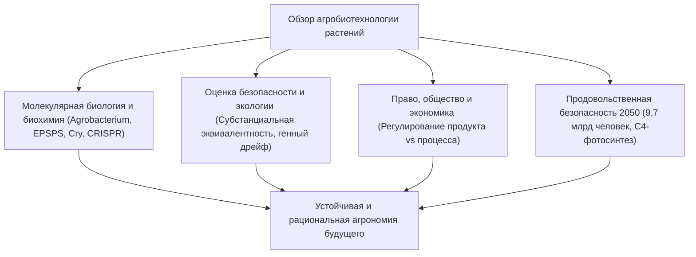

## Введение: Научный горизонт биотехнологии растений
История сельского хозяйства — это история селекции геномов растений. Открытие технологии рекомбинантной ДНК и геномного редактирования (CRISPR-Cas9) вывело агрономию на качественно новый уровень точности, вызывая при этом широкие общественные дискуссии.

## Глава 1: Селекция растений и молекулярные основы рекомбинантной ДНК
Путь от искусственного отбора теосинте до мутагенеза и генной инженерии. Механизмы переноса Т-ДНК посредством *Agrobacterium tumefaciens* и баллистическая трансформация (генная пушка).

## Глава 2: Биохимия ключевых трансгенных признаков
- **Устойчивость к гербицидам**: Введение бактериального фермента CP4-EPSPS, защищающего шикиматный путь от глифосата.
- **Устойчивость к вредителям**: Кристаллические Bt-токсины (Cry) из *Bacillus thuringiensis*, образующие поры в щелочном кишечнике насекомых и абсолютно безопасные для человека.
- **Золотой рис**: Метаболическая инженерия пути биосинтеза провитамина А (β-каротина) в эндосперме риса.

## Глава 3: Различия между классическими ГМО и CRISPR
Геномное редактирование (SDN-1) производит точечные мутации в собственных генах растения без внесения чужеродной ДНК, что делает их неотличимыми от природных мутаций.

## Глава 4: Мировые масштабы выращивания и экономический эффект
190 млн га посевных площадей (США, Бразилия, Аргентина, Канада, Индия). Рост урожайности, резкое сокращение инсектицидов и защита почв при беспахотной обработке (No-Till).

## Глава 5: Безопасность для здоровья и научный консенсус
Концепция субстанциальной эквивалентности (ВОЗ, ФАО). Тесты на перевариваемость пепсином и заключение мировых академий наук (NAS, EFSA) о безопасности коммерческих ГМО. Опровержение ненаучных публикаций (дело Сералини).

## Глава 6: Экологическая оценка и биобезопасность
Картахенский протокол, исследования влияния на бабочек-монархов, предотвращение генного дрейфа и стратегия убежищ (Refuge) против резистентности вредителей.

## Глава 7: Международное правовое регулирование
Регулирование конечного продукта (США) против регулирования процесса по принципу предосторожности (ЕС) и современные реформы в области новых геномных технологий (NGT).

## Глава 8: Психология восприятия и дезинформация
Когнитивные искажения, страх "Франкенфуда" и переход от модели дефицита знаний к равноправному диалогу с обществом.

## Глава 9: Изменение климата, 9,7 млрд человек и продовольствие в 2050 году
Проект создания С4-риса для кардинального повышения эффективности фотосинтеза, засухоустойчивые культуры и фиксация атмосферного азота злаками.

## Глава 10: Синтетическая биология и одомашнивание de novo
Мгновенное введение дикорастущих видов в культуру с помощью CRISPR и молекулярное фермерство (производство вакцин в растениях).
