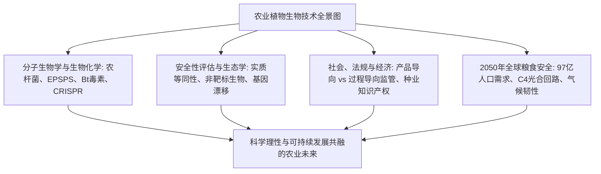
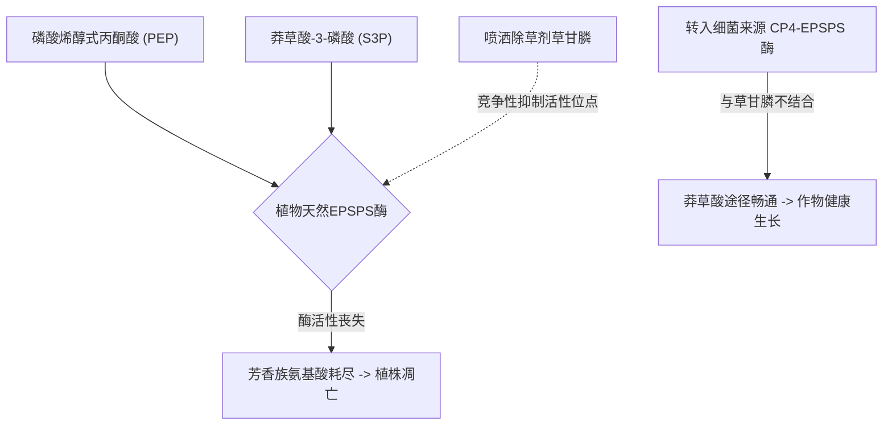
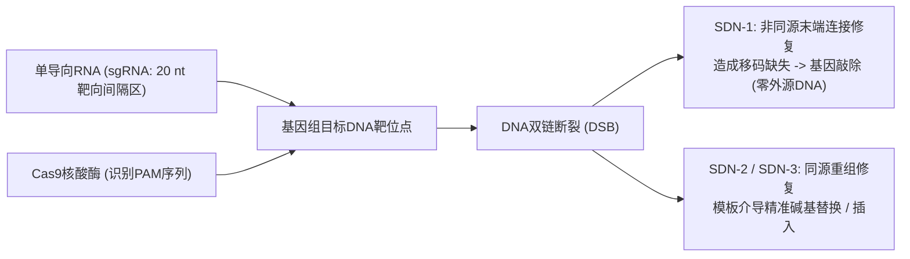

## 引言：作物遗传技术的科学前沿

人类文明的演进史本质上是一部作物基因组的人工改造史。约一万年前的新石器时代农业革命伊始，人类便开始对野生草本植物进行经验性的人工选择：消除种子的落粒性、增大可食用器官的体积、降低天然苦味与抗营养毒素。现代玉米的祖先大刍草（Teosinte）仅有5至12粒坚硬的小籽粒，正是通过对关键形态转录因子（如 *tb1*, *tga1*）的持续选择，才演化出如今结出数百粒籽粒的现代高产玉米。

20世纪后半叶，分子生物学的突破催生了重组DNA技术（rDNA），首次打破物种间的生殖隔离壁垒，实现有益功能基因的跨物种精准引入。步入21世纪，以CRISPR-Cas9、碱基编辑和先导编辑为代表的定点核酸酶技术，更赋予了科学家以单核苷酸精度直接重写作物内源基因组的划时代能力。

然而，农业生物技术自诞生起便深陷激烈的社会争议风暴中。「法兰肯食品（Frankenfoods）」的恐慌情绪、跨国种业巨头的专利垄断质疑、转基因向野生物种的漂移以及抗性杂草演化等议题，在科学界共识与公众风险感知之间构筑了巨大的认知断层。

---

## 第1章：植物育种演进与重组DNA技术原理

### 1.1 从原始驯化、杂交育种到诱变育种的局限
近现代科学育种借助孟德尔遗传定律与杂种优势（F1代杂交），极大推动了绿色革命。然而常规杂交育种面临难以克服的生物学瓶颈：仅能在性兼容物种间杂交，且伴随严重的「连锁累赘（Linkage Drag）」，即引入目标基因时不可避免地带入相邻的不良染色体片段，需历经多年回交才能剔除。20世纪中叶的放射线诱变和化学诱变（EMS）虽培育出数千个品种，但其本质是对全基因组的无差别随机轰击，无法预测和控制伴随产生的背景有害突变。

### 1.2 重组DNA技术的分子生物学工具箱
20世纪70年代，伯格、博耶和科恩开创的rDNA技术立足于三大核心酶学工具：
- **限制性核酸内切酶**：精准识别特定回文序列并切断双链DNA。
- **DNA连接酶**：修复磷酸二酯键分子骨架。
- **克隆与表达载体**：具备自主复制能力的质粒与噬菌体。

### 1.3 植物细胞的基因转化体系：农杆菌法与基因枪法
1. **农杆菌介导法（*Agrobacterium tumefaciens*）**：土壤农杆菌天然具备向双子叶植物转染Ti质粒T-DNA的能力。科学家剔除其致瘤基因，将目标农业基因与筛选标记置于T-DNA左右边界序列之间，借助毒性蛋白（*vir*系统）将单链T-DNA复合体转运穿过核孔复合体，整合入宿主染色体。
2. **基因枪微粒轰击法（Biolistics）**：将包被有质粒DNA的金或钨微粒在高压氦气（最高1,500 psi）加速下射入植物细胞壁，是禾本科单子叶植物及叶绿体基因转化的关键物理手段。

### 1.4 植物基因表达盒的精细架构设计
表达盒必须包含：
- **启动子**：组成型启动子（CaMV 35S、水稻泛素 *Ubiquitin-1*）或组织特异性启动子。
- **编码区**：根据植物密码子偏好性优化的目标基因（如 *cp4-epsps*, *cry1Ac*）。
- **终止子**：多聚腺苷酸化信号序列（如 *nos* 或 *rbcS* 终止子）。
- **筛选标记基因**：抗生素抗性（*nptII*）或除草剂抗性（*bar*），后期可通过Cre/*loxP*系统实现无标记剔除。

---

## 第2章：主要转基因性状的生物化学作用机理

### 2.1 耐除草剂性状：草甘膦与草铵膦抗性
- **草甘膦抗性（Roundup Ready）**：草甘膦通过竞争性抑制莽草酸途径中的第6步催化酶 **EPSPS（5-烯醇丙酮酰莽草酸-3-磷酸合成酶）**，阻断芳香族氨基酸（苯丙氨酸、酪氨酸、色氨酸）合成，导致植物枯死（动物体内缺乏该途径）。从 *Agrobacterium* sp. CP4 筛选出的细菌 **CP4-EPSPS** 酶对底物PEP亲和力正常，但对草甘膦亲和力极低，使作物在草甘膦喷洒下完全免疫。
- **草铵膦抗性（LibertyLink）**：草铵膦抑制植物谷氨酰胺合成酶，导致致命性氨积累。导入放线菌来源的 *pat* 或 *bar* 基因表达乙酰转移酶，将草铵膦特异性乙酰化为无毒代谢物。

### 2.2 抗虫性状：苏云金芽孢杆菌（Bt）Cry晶体蛋白
1. **碱性肠道溶解**：无活性的晶体原毒素（约130 kDa）仅在鳞翅目昆虫特有的强碱性中肠（pH 9.0–11.0）中溶解。
2. **蛋白酶切激活**：昆虫肠道蛋白酶将其特异性剪切为约65 kDa的活性核心毒素。
3. **特异结合与穿孔**：核心毒素特异结合中肠微绒毛膜上的钙粘蛋白受体，寡聚化形成直径1–2 nm的阳离子孔道，破坏细胞渗透压，导致中肠穿孔、败血症与昆虫死亡。
4. **对哺乳动物完全安全**：哺乳动物胃酸呈强酸性（pH 1–2），胃蛋白酶在数十秒内将Cry蛋白彻底降解为普通氨基酸，且哺乳动物肠道细胞表面完全不存在与Cry结合的特异性钙粘蛋白受体。

### 2.3 抗病毒病与生物强化工程
- **抗环斑病毒番木瓜（Rainbow Papaya）**：基于外壳蛋白介导的RNA干扰（RNAi）机制，使植物识别并沉默入侵的PRSV病毒RNA，成功挽救夏威夷番木瓜产业。
- **黄金大米（Golden Rice）**：利用胚乳特异性启动子驱动玉米八氢番茄红素合成酶（*psy*）和欧文氏菌脱氢酶（*crtI*），在原本不含维生素A的稻米胚乳中成功重建β-胡萝卜素生物合成途径。

---

## 第3章：传统转基因（GMO）与CRISPR基因编辑的本质区别

### 3.1 定点精准手术 vs 随机整合
传统转基因存在外源DNA随机插入染色体导致的插入突变风险；而CRISPR-Cas9通过一条单导向RNA（sgRNA）精确定位到靶标基因组位置，在PAM基序（NGG）引导下引入双链断裂（DSB），实现单碱基级别的局部精准改造。

### 3.2 国际通用SDN分类系统
- **SDN-1**：非同源末端连接（NHEJ）修复引入微小插入/缺失，使目标基因功能敲除。**完全不含任何外源DNA片段**，在物理和分子特征上与自然突变完全无法区分。美、日、拉美、印等多国均将其视为传统品种豁免GMO监管。
- **SDN-2**：利用短同源寡核苷酸模板精准修正少量碱基。
- **SDN-3**：定点整合完整外源功能表达盒（属于传统GMO监管范围）。

### 3.3 商业化前沿突破
- **日本Sanatech Seed高GABA番茄**：敲除谷氨酸脱羧酶（*GAD*）的自抑制结构域，使降血压氨基酸GABA含量跃升4至5倍。
- **褐变抑制蘑菇与低丙烯酰胺马铃薯**：敲除多酚氧化酶（*PPO*）与天冬酰胺合成酶，减少采后损耗与高温加工致癌风险。

---

## 第4章：全球种植格局与农业经济影响
- **规模飞跃**：从1996年的170万公顷飙升至近2亿公顷，占全球耕地面积的12%。
- **核心生产国**：美国（71.5 Mha）、巴西（52.8 Mha）、阿根廷（24.0 Mha）、加拿大（12.5 Mha）、印度（11.9 Mha）。全球大豆78%、棉花76%已为生物技术品种。
- **经济与环境效益**：25年间为全球农户创造2,613亿美元额外收入，减少化学杀虫剂使用量7.48亿公斤；依托抗除草剂作物的免耕农法使土壤每年固定2,300万吨二氧化碳。
- **种业垄断争议**：四大农化集团掌控大部分专利种子，限制农户留种权利引发了关于农业主权与小农权益的全球讨论。

---

## 第5章：人体健康安全性评估与科学共识
- **实质等同性原则**：OECD/WHO/Codex确立的评估基石，将转基因品种与具有悠久安全食用历史的常规近等基因系进行全方位成分对比。
- **多维度毒理试验**：高剂量急性经口毒性、过敏原数据库同源性检索、人工胃液胃蛋白酶消化试验（2分钟内完全水解）。
- **全球科学界高度共识**：美国国家科学院（NAS）、英国皇家学会、欧洲食品安全局（EFSA）及WHO发表统一结论：目前市场上批准的转基因食品与传统食品具有相同的安全性。塞拉利尼大鼠肿瘤实验等反GMO论文已被学术期刊正式撤稿。

---

## 第6章：生态环境与生物安全综合评估
- **卡塔赫纳生物安全议定书**：确立改性活生物体（LMO）越境转移的国际事先知情同意（AIA）机制。
- **非靶标生物**：大规模田间试验彻底澄清了Bt花粉危害野外帝王蝶幼虫的误传。
- **抗性治理的庇护所（Refuge）策略**：强制农户在种植Bt作物时划出5%至20%的常规非Bt作物区域。隐性抗性纯合害虫（rr）与庇护所繁育的野生显性敏感害虫（RR）随机交配产生杂合后代（Rr），而Rr个体在Bt农田中完全被杀灭，从而在群体遗传学上长期阻断抗性害虫的泛滥。

---

## 第7章：各国法律法规与标识制度比较
- **美国（产品导向监管）**：USDA、FDA、EPA协同监管最终产物的属性，SDN-1基因编辑作物在SECURE法规下获得普遍豁免。
- **欧盟（过程导向监管）**：坚守2001/18/EC指令与预防原则；面对气候压力，欧盟委员会于2023年正式提交放松NGT-1植物监管的立法草案。
- **日本（透明申报制）**：转基因作物依据卡塔赫纳法严审，SDN-1基因编辑品种经科学信息核验后直接登录信息公开名录，高效衔接市场。

---

## 第8章：公众认知心理与科学传播挑战
- **认知偏差机制**：直觉本质主义导致对「跨物种改动」产生不自然违和感；零风险偏见要求绝对无害。
- **非转基因标签的商业焦虑营销**：在原本根本没有转基因品种的食盐、矿泉水上贴「Non-GMO」认证，利用信息不对称赚取溢价。
- **科学传播革新**：摒弃单向说教的「知识缺失模型」，开展基于价值观和共情理解的双向风险沟通。

---

## 第9章：气候变化与2050年97亿人口的粮食安全
- **2050粮食严峻大考**：全球人口将达97亿，现有耕地面积无法扩张的前提下必须实现产量增长50%至70%（可持续集约化）。
- **C4水稻国际联盟**：将玉米的高效C4光合酶系与维管束鞘细胞结构移植到水稻中，有望彻底抑制光呼吸，使水稻单产跃升50%、水肥利用率翻倍。
- **农作物自主固氮**：利用合成生物学工程化根际固氮菌（Pivot Bio）或重塑谷物根系共生通路，减少高污染合成氮肥的依赖。

---

## 第10章：合成生物学前沿与从头驯化（De Novo Domestication）
- **从头驯化突破**：利用多重CRISPR技术在野生醋栗番茄（*Solanum pimpinellifolium*）中同时编辑6至10个驯化关键基因，仅耗时一代即可获得兼具野生超强抗旱抗病性与商业大果高产的全新作物。
- **植物分子农业**：以烟草、生菜为生物反应器，快速大规模低成本生产口服疫苗、抗体药物与人造无动物肉蛋白。

---

## 结语：以科学理性护航人类与地球共生
植物生物技术绝非破坏自然的异端，而是人类万年育种智慧在原子分子层面的精细化升华。面对21世纪气候与粮食的双重危机，拥抱科学、规范治理，植物生物技术将成为守护人类免于饥饿并复兴地球生态的最有力希望。
