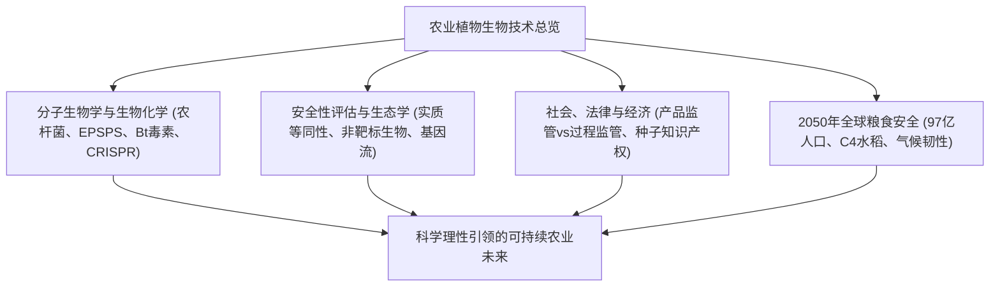

## 引言：作物遗传技术的科学前沿
人类一万年的农业文明史本质上就是作物基因组的改良史。重组DNA技术与CRISPR-Cas9基因编辑技术的诞生，使人类得以超越传统育种的界限，以前所未有的分子级精度培育高抗、高产作物，以应对全球人口增长与气候变暖带来的严峻挑战。

## 第1章：植物育种演进与重组DNA技术原理
从人工驯化、杂交育种到诱变育种的局限。农杆菌（*Agrobacterium tumefaciens*）Ti质粒T-DNA区段的分子转移机制，以及基因枪法（微粒轰击法）的物理导入机制与表达盒构建。

## 第2章：主要转基因性状的生物化学作用机理
- **耐除草剂性状**：草甘膦通过竞争性抑制莽草酸途径中的EPSPS酶导致植物死亡；转入抗性细菌CP4-EPSPS酶使作物免受抑制。
- **抗虫性状**：苏云金芽孢杆菌（Bt）Cry晶体蛋白在靶标害虫碱性肠道中被激活并特异性打孔，对缺乏受体且胃液呈酸性的哺乳动物完全无毒。
- **黄金大米**：在稻米胚乳中重构β-胡萝卜素生物合成途径以解决维生素A缺乏症。

## 第3章：传统转基因（GMO）与CRISPR基因编辑的本质区别
CRISPR-Cas9通过人工核酸酶在特定位点引入双链断裂。SDN-1类型完全不含外源DNA，属于敲除突变，其变异特征与自然突变在分子生物学上完全一致。

## 第4章：全球种植格局与农业经济影响
全球GM作物种植面积突破1.9亿公顷（美、巴、阿、加、印）。农药使用量大幅降低，免耕农业增加土壤碳封存，同时大型农化巨头的种子专利垄断引发关注。

## 第5章：人体健康安全性评估与科学共识
以“实质等同性”为基石（WHO、FAO、Codex）。经过胃液胃蛋白酶消化试验与全组分营养毒理测试，全球权威科学界一致证实已上市GM食品与传统食品具有相同安全性，彻底推翻塞拉利尼等伪科学论文。

## 第6章：生态环境与生物安全综合评估
卡塔赫纳生物安全议定书框架、帝王蝶非靶标实验真相、基因漂移防控距离，以及利用“避难所战略”防止害虫进化出抗性的群体遗传学生态模型。

## 第7章：各国法律法规与标识制度比较
美国重视最终产物的“产品导向”监管；欧盟坚持预防原则的“过程导向”监管（现正推进NGT新法案改革）；日本采取兼顾科学与透明的预先申报制。

## 第8章：公众认知心理与科学传播挑战
认知偏差、对“非自然”属性的本能抵触，以及反对运动与非转基因营销催生的恐惧经济学。

## 第9章：气候变化与2050年97亿人口的粮食安全
C4水稻国际研发项目将光合效率提升50%，抗干旱与耐盐碱作物培育，以及能够自主固氮的谷物开发。

## 第10章：合成生物学与从头驯化（De Novo Domestication）
利用基因编辑直接将高抗性野生植物在单代内快速驯化为多产作物，植物分子农业生产疫苗与药用蛋白。
