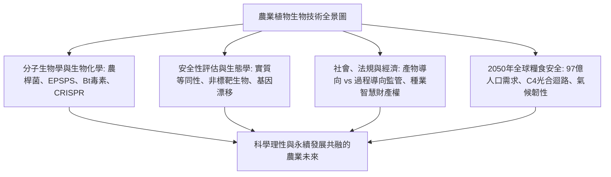
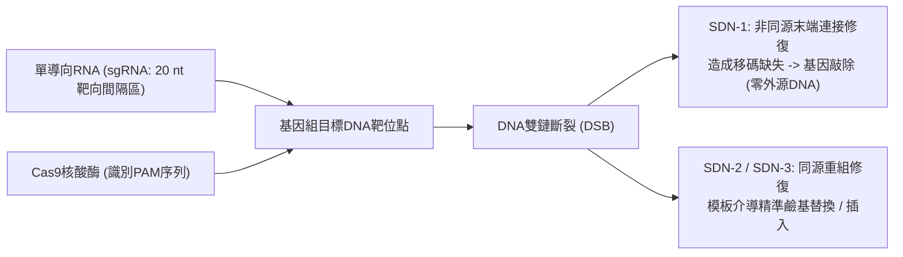

## 引言：作物基因技術的知識前沿

人類文明的演進史本質上是一部作物基因組的人工改良史。約一萬年前的新石器時代農業革命伊始，人類便開始對野生草本植物進行經驗性的人工選擇：消除種子的落粒性、增大可食用器官的體積、降低天然苦味與抗營養毒素。現代玉米的祖先大芻草（Teosinte）僅有5至12粒堅硬的小籽粒，正是透過對關鍵形態轉錄因子（如 *tb1*, *tga1*）的持續選擇，才演化出如今結出數百粒籽粒的現代高產玉米。

20世紀後半葉，分子生物學的突破催生了重組DNA技術（rDNA），首次打破物種間的生殖隔離壁壘，實現有益功能基因的跨物種精準引入。步入21世紀，以CRISPR-Cas9、鹼基編輯和先導編輯為代表的定點核酸酶技術，更賦予了科學家以單核苷酸精度直接重寫作物內源基因組的劃時代能力。

然而，農業生物技術自誕生起便深陷激烈的社會爭議風暴中。「法蘭肯食品（Frankenfoods）」的恐慌情緒、跨國種業巨頭的專利壟斷質疑、轉基因向野生物種的漂移以及抗性雜草演化等議題，在科學界共識與公眾風險感知之間構築了巨大的認知斷層。



---

## 第1章：植物育種演進與重組DNA技術原理

### 1.1 從原始馴化、雜交育種到誘變育種的局限
近現代科學育種借助孟德爾遺傳定律與雜種優勢（F1代雜交），極大推動了綠色革命。然而常規雜交育種面臨難以克服的生物學瓶頸：僅能在性相容物種間雜交，且伴隨嚴重的「連鎖累贅（Linkage Drag）」，即引入目標基因時不可避免地帶入相鄰的不良染色體片段，需歷經多年回交才能剔除。20世紀中葉的放射線誘變和化學誘變（EMS）雖培育出數千個品種，但其本質是對全基因組的無差別隨機轟擊，無法預測和控制伴隨產生的背景有害突變。

### 1.2 重組DNA技術的分子生物學工具箱
20世紀70年代，伯格、博耶和科恩開創的rDNA技術立足於三大核心酵素學工具：
- **限制性核酸內切酶**：精準識別特定回文序列並切斷雙鏈DNA。
- **DNA連接酶**：修復磷酸二酯鍵分子骨架。
- **選殖與表現載體**：具備自主複製能力的質體與噬菌體。

### 1.3 植物細胞的基因轉殖體系：農桿菌法與基因槍法
1. **農桿菌介導法（*Agrobacterium tumefaciens*）**：土壤農桿菌天然具備向雙子葉植物轉染Ti質體T-DNA的能力。科學家剔除其致瘤基因，將目標農業基因與篩選標記置於T-DNA左右邊界序列之間，借助毒性蛋白（*vir*系統）將單鏈T-DNA複合體轉運穿過核孔複合體，整合入宿主染色體。
2. **基因槍微粒轟擊法（Biolistics）**：將包被有質體DNA的金或鎢微粒在高壓氦氣（最高1,500 psi）加速下射入植物細胞壁，是禾本科單子葉植物及葉綠體基因轉化的關鍵物理手段。

### 1.4 植物基因表現盒的精細架構設計
表現盒必須包含：
- **啟動子**：組成型啟動子（CaMV 35S、水稻泛素 *Ubiquitin-1*）或組織特異性啟動子。
- **編碼區**：根據植物密碼子偏好性優化的目標基因（如 *cp4-epsps*, *cry1Ac*）。
- **終止子**：多聚腺苷酸化信號序列（如 *nos* 或 *rbcS* 終止子）。
- **篩選標記基因**：抗生素抗性（*nptII*）或除草劑抗性（*bar*），後期可透過Cre/*loxP*系統實現無標記剔除。

---

## 第2章：主要基改性狀的生物化學作用機轉

### 2.1 抗除草劑性狀：草甘膦與草銨膦抗性
- **草甘膦抗性（Roundup Ready）**：草甘膦透過競爭性抑制莽草酸途徑中的第6步催化酵素 **EPSPS（5-烯醇丙酮酰莽草酸-3-磷酸合成酶）**，阻斷芳香族胺基酸（苯丙胺酸、酪胺酸、色胺酸）合成，導致植物枯死（動物體內缺乏該途徑）。從 *Agrobacterium* sp. CP4 篩選出的細菌 **CP4-EPSPS** 酵素對受質PEP親和力正常，但對草甘膦親和力極低，使作物在草甘膦噴灑下完全免疫。
- **草銨膦抗性（LibertyLink）**：草銨膦抑制植物麩醯胺酸合成酶，導致致命性氨積累。導入放線菌來源的 *pat* 或 *bar* 基因表現乙醯轉移酶，將草銨膦特異性乙醯化為無毒代謝物。

```mermaid
flowchart TD
    PEP["磷酸烯醇式丙酮酸 (PEP)"] + S3P["莽草酸-3-磷酸 (S3P)"] --> ENZ{"植物天然EPSPS酵素"}
    GLY["噴灑除草劑草甘膦"] -. "競爭性抑制活性位點" .-> ENZ
    ENZ -- "酵素活性喪失" --> ARO["芳香族胺基酸耗盡 -> 植株凋亡"]
    
    CP4["轉入細菌來源 CP4-EPSPS 酵素"] -- "與草甘膦不結合" --> BYPASS["莽草酸途徑暢通 -> 作物健康生長"]
```

### 2.2 抗蟲性狀：蘇雲金芽孢桿菌（Bt）Cry晶體蛋白
1. **鹼性腸道溶解**：無活性的晶體原毒素（約130 kDa）僅在鱗翅目昆蟲特有的強鹼性中腸（pH 9.0–11.0）中溶解。
2. **蛋白酶切激活**：昆蟲腸道蛋白酶將其特異性剪切為約65 kDa的活性核心毒素。
3. **特異結合與穿孔**：核心毒素特異結合中腸微絨毛膜上的鈣粘蛋白受體，寡聚化形成直徑1–2 nm的陽離子孔道，破壞細胞滲透壓，導致中腸穿孔、敗血症與昆蟲死亡。
4. **對哺乳動物完全安全**：哺乳動物胃酸呈強酸性（pH 1–2），胃蛋白酶在數十秒內將Cry蛋白徹底降解為普通胺基酸，且哺乳動物腸道細胞表面完全不存在與Cry結合的特異性鈣粘蛋白受體。

### 2.3 抗病毒病與生物強化工程
- **抗環斑病毒木瓜（Rainbow Papaya）**：基於外殼蛋白介導的RNA干擾（RNAi）機制，使植物識別並沉默入侵的PRSV病毒RNA，成功挽救夏威夷木瓜產業。
- **黃金大米（Golden Rice）**：利用胚乳特異性啟動子驅動玉米八氫番茄紅素合成酶（*psy*）和歐文氏菌脫氫酶（*crtI*），在原本不含維生素A的稻米胚乳中成功重建β-胡蘿蔔素生物合成途徑。

---

## 第3章：傳統基改（GMO）與CRISPR基因編輯的本質差異

### 3.1 定點精準手術 vs 隨機整合
傳統轉基因存在外源DNA隨機插入染色體導致的插入突變風險；而CRISPR-Cas9透過一條單導向RNA（sgRNA）精確定位到靶標基因組位置，在PAM基序（NGG）引導下引入雙鏈斷裂（DSB），實現單鹼基級別的局部精準改造。



### 3.2 國際通用SDN分類系統
- **SDN-1**：非同源末端連接（NHEJ）修復引入微小插入/缺失，使目標基因功能敲除。**完全不含任何外源DNA片段**，在物理和分子特徵上與自然突變完全無法區分。美、日、拉美、印等多國均將其視為傳統品種豁免GMO監管。
- **SDN-2**：利用短同源寡核苷酸模板精準修正少量鹼基。
- **SDN-3**：定點整合完整外源功能表現盒（屬於傳統GMO監管範圍）。

### 3.3 商業化前沿突破
- **日本Sanatech Seed高GABA番茄**：敲除麩胺酸脫羧酶（*GAD*）的自抑制結構域，使降血壓胺基酸GABA含量躍升4至5倍。
- **褐變抑制蘑菇與低丙烯醯胺馬鈴薯**：敲除多酚氧化酶（*PPO*）與天門冬醯胺合成酶，減少採後損耗與高溫加工致癌風險。

---

## 第4章：全球種植現況與農業經濟效益
- **規模飛躍**：從1996年的170萬公頃飆升至近2億公頃，占全球耕地面積的12%。
- **核心生產國**：美國（71.5 Mha）、巴西（52.8 Mha）、阿根廷（24.0 Mha）、加拿大（12.5 Mha）、印度（11.9 Mha）。全球大豆78%、棉花76%已為生物技術品種。
- **經濟與環境效益**：25年間為全球農戶創造2,613億美元額外收入，減少化學殺蟲劑使用量7.48億公斤；依託抗除草劑作物的免耕農法使土壤每年固定2,300萬噸二氧化碳。
- **種業壟斷爭議**：四大農化集團掌控大部分專利種子，限制農戶留種權利引發了關於農業主權與小農權益的全球討論。

---

## 第5章：人體健康安全性評估與科學共識
- **實質等同性原則**：OECD/WHO/Codex確立的評估基石，將基改品種與具有悠久安全食用歷史的常規近等基因系進行全方位成分對比。
- **多維度毒理試驗**：高劑量急性經口毒性、過敏原資料庫同源性檢索、人工胃液胃蛋白酶消化試驗（2分鐘內完全水解）。
- **全球科學界高度共識**：美國國家科學院（NAS）、英國皇家學會、歐洲食品安全局（EFSA）及WHO發表統一結論：目前市場上批准的基改食品與傳統食品具有相同的安全性。塞拉利尼大鼠腫瘤實驗等反GMO論文已被學術期刊正式撤稿。

---

## 第6章：生態環境與生物安全綜合評估
- **卡塔赫納生物安全議定書**：確立改性活生物體（LMO）越境轉移的國際事先知情同意（AIA）機制。
- **非標靶生物**：大規模田間試驗徹底澄清了Bt花粉危害野外帝王蝶幼蟲的誤傳。
- **抗性治理的庇護所（Refuge）策略**：強制農戶在種植Bt作物時劃出5%至20%的常規非Bt作物區域。隱性抗性純合害蟲（rr）與庇護所繁育的野生顯性敏感害蟲（RR）隨機交配產生雜合後代（Rr），而Rr個體在Bt農田中完全被殺滅，從而在群體遺傳學上長期阻斷抗性害蟲的氾濫。

---

## 第7章：各國監管法規與標示制度比較
- **美國（產物導向監管）**：USDA、FDA、EPA協同監管最終產物的屬性，SDN-1基因編輯作物在SECURE法規下獲得普遍豁免。
- **歐盟（過程導向監管）**：堅守2001/18/EC指令與預防原則；面對氣候壓力，歐盟委員會於2023年正式提交放寬NGT-1植物監管的立法草案。
- **日本（透明申報制）**：基改作物依據卡塔赫納法嚴審，SDN-1基因編輯品種經科學資訊核驗後直接登錄資訊公開名錄，高效銜接市場。

---

## 第8章：公眾認知心理與科學傳播挑戰
- **認知偏差機制**：直覺本質主義導致對「跨物種改動」產生不自然違和感；零風險偏見要求絕對無害。
- **非基改標籤的商業焦慮行銷**：在原本根本沒有基改品種的食鹽、礦泉水上貼「Non-GMO」認證，利用資訊不對稱賺取溢價。
- **科學傳播革新**：摒棄單向說教的「知識缺失模型」，開展基於價值觀和同理心理解的雙向風險溝通。

---

## 第9章：氣候變遷與2050年97億人口糧食安全
- **2050糧食嚴峻大考**：全球人口將達97億，現有耕地面積無法擴張的前提下必須實現產量增長50%至70%（永續集約化）。
- **C4水稻國際聯盟**：將玉米的高效C4光合酵素系與維管束鞘細胞結構移植到水稻中，有望徹底抑制光呼吸，使水稻單產躍升50%、水肥利用率翻倍。
- **農作物自主固氮**：利用合成生物學工程化根際固氮菌（Pivot Bio）或重塑穀物根系共生通路，減少高污染合成氮肥的依賴。

---

## 第10章：合成生物學前沿與從頭馴化（De Novo Domestication）
- **從頭馴化突破**：利用多重CRISPR技術在野生醋栗番茄（*Solanum pimpinellifolium*）中同時編輯6至10個馴化關鍵基因，僅耗時一代即可獲得兼具野生超強抗旱抗病性與商業大果高產的全新作物。
- **植物分子農業**：以菸草、生菜為生物反應器，快速大規模低成本生產口服疫苗、抗體藥物與人造無動物肉蛋白。

---

## 結語：以科學理性護航人類與地球共生
植物生物技術絕非破壞自然的異端，而是人類萬年育種智慧在原子分子層面的精細化昇華。面對21世紀氣候與糧食的雙重危機，擁抱科學、規範治理，植物生物技術將成為守護人類免於飢餓並復興地球生態的最有力希望。
