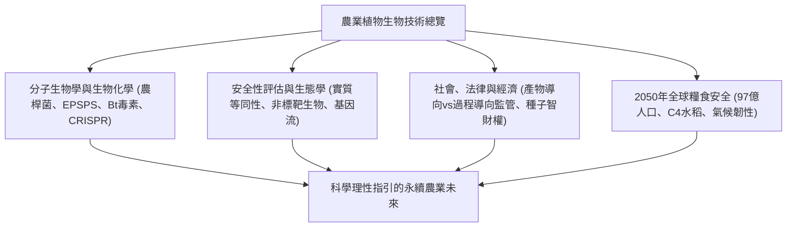

## 引言：作物基因技術的知識前沿
人類一萬年的農業文明史就是植物基因組的改良歷程。重組DNA技術與CRISPR-Cas9基因編輯工具的發展，使人類得以超越傳統育種的障礙，以分子級精度培育高抗、高產作物，因應未來人口增長與氣候變遷的嚴峻考驗。

## 第1章：植物育種演進與重組DNA技術原理
人工選拔、雜交育種至誘變育種的瓶頸。農桿菌（*Agrobacterium tumefaciens*）Ti質體T-DNA區段的分子轉移機制與基因槍法物理導入技術。

## 第2章：主要基改性狀的生物化學作用機轉
- **抗除草劑性狀**：草甘膦抑制莽草酸途徑中的EPSPS酵素；導入細菌CP4-EPSPS抗性酵素使作物正常代謝。
- **抗蟲性狀**：蘇雲金芽孢桿菌（Bt）Cry晶體蛋白在害蟲鹼性腸道特異性穿孔，對哺乳動物無害。
- **黃金大米**：在稻米胚乳中重組β-胡蘿蔔素合成路徑以預防維生素A缺乏症。

## 第3章：傳統基改（GMO）與CRISPR基因編輯的本質差異
CRISPR-Cas9在特定DNA位點引入雙鏈斷裂。SDN-1完全不含外源DNA，屬於基因剔除，與自然突變在物理與生物學上完全一致。

## 第4章：全球種植現況與農業經濟效益
全球GM作物耕種面積逾1.9億公頃（美、巴、阿、加、印）。農藥用量減少，免耕農法促進土壤碳封存，同時種子專利寡占問題引發討論。

## 第5章：人體健康安全性評估與科學共識
依循「實質等同性」準則（WHO、FAO、Codex）。胃蛋白酶消化試驗與多體學營養成分分析證實安全性，科學界駁斥塞拉利尼等撤稿偽科學論述。

## 第6章：生態環境與生物安全綜合評估
卡塔赫納生物安全議定書、帝王蝶田間實驗真相、花粉基因漂移防範，以及利用「庇護所策略」防範害蟲抗性演化的族群遺傳模型。

## 第7章：各國監管法規與標示制度比較
美國重視最終產物的「產物導向」；歐盟基於預防原則的「過程導向」（現正審議NGT法案放寬）；日本推行透明的SDN-1事前登錄制。

## 第8章：公眾認知心理與科學溝通挑戰
認知偏誤、對人工介入的直覺排斥，以及反基改運動與非基改行銷帶來的恐懼行銷問題。

## 第9章：氣候變遷與2050年97億人口糧食安全
C4水稻跨國研究計畫以提升50%光合效率，超耐旱及耐鹽鹼作物育種，以及自主固氮穀物研究。

## 第10章：合成生物學與從頭馴化（De Novo Domestication）
利用多重基因編輯將抗逆性強的野生近緣種在單代內快速馴化，植物分子農業生產疫苗與藥用蛋白。
