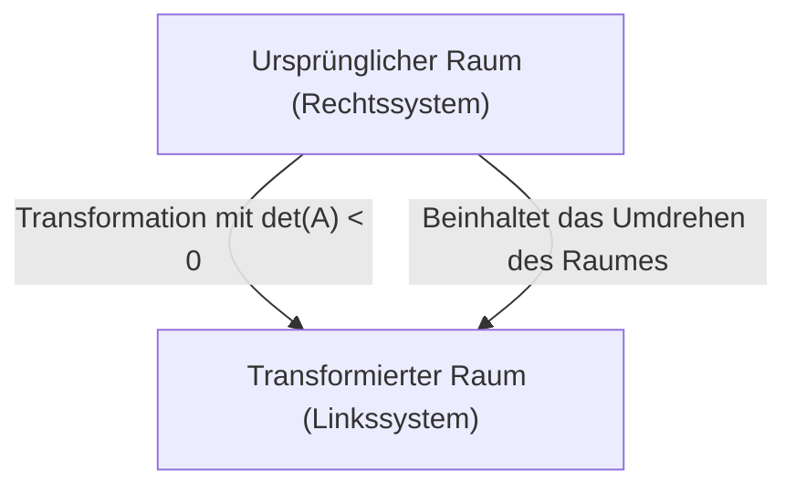
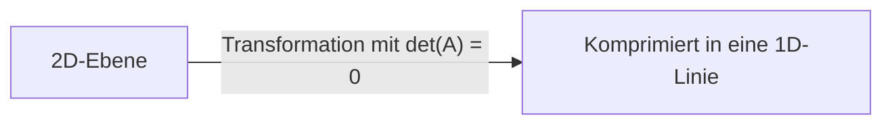

Beim Erlernen der linearen Algebra ist einer der ersten Stolpersteine für viele Menschen die **Determinante** . Lehrbücher sind voll von komplexen Formeln und Entwicklungsregeln, aber ihre **wahre Natur** ist sehr visuell und intuitiv. Viele Studenten wissen "wie man sie berechnet", verpassen aber die Gelegenheit zu verstehen, "was sie eigentlich bedeutet".

In diesem Artikel werden wir die Determinante nicht einfach als "Formel zur Ermittlung eines numerischen Wertes" betrachten, sondern aus einer geometrischen Perspektive als zwei entscheidende Konzepte neu untersuchen: den **Volumen-Skalierungsfaktor** des Raumes und die **Orientierungsumkehr** . Wenn Sie dies verstehen, wird sich Ihre Sicht auf die gesamte lineare Algebra völlig verändern.

## 1. Was ist eine Determinante? (Ein kurzer Rückblick)

Die Determinante (üblicherweise als $\det(A)$ oder $|A|$ bezeichnet) ist eine spezielle Zahl, die für quadratische Matrizen definiert ist. Betrachten wir als einfaches Beispiel eine 2x2-Matrix $A$, die wie folgt gegeben ist:

$$
A = \begin{pmatrix} a & b \\ c & d \end{pmatrix}
$$

In diesem Fall wird die Determinante wie folgt berechnet:

$$
\det(A) = ad - bc
$$

Für 3x3-Matrizen wird sie mit der Regel von Sarrus oder dem Laplaceschen Entwicklungssatz berechnet, was die Formel viel komplexer macht. Sie können sich diese Formeln vielleicht selbst merken, aber sie beantworten keine Fragen wie "Warum $ad - bc$?" oder "Warum eine so komplexe Summe und Differenz von Produkten?". Um diese Frage grundlegend zu klären, müssen wir Matrizen als **lineare Transformationen** (die Verzerrung und Dehnung des Raumes) visualisieren.

## 2. Geometrische Bedeutung in 2D: Flächen-Skalierungsfaktor

Im zweidimensionalen Raum (einer Ebene) fungiert eine Matrix als "Transformation", die Punkte auf der Ebene zu anderen Punkten bewegt. Sehen wir uns an, wie ein Referenz-Einheitsquadrat (ein Quadrat mit einer Fläche von $1$, das von den Basisvektoren $\mathbf{i} = (1, 0)$ und $\mathbf{j} = (0, 1)$ gebildet wird) durch die Matrix $A$ transformiert wird.

Wenn die Matrix $A$ angewendet wird, werden die Standard-Basisvektoren in $\mathbf{v}_1 = (a, c)$ bzw. $\mathbf{v}_2 = (b, d)$ transformiert. Die **Fläche** des Parallelogramms, das von diesen beiden neu transformierten Vektoren gebildet wird, ist genau gleich dem Betrag der Determinante, $|\det(A)|$.

Mit anderen Worten, der absolute Wert der Determinante bedeutet den "Flächen-Skalierungsfaktor", der angibt, **wie viele Male** jede Figur im Raum durch diese lineare Transformation gedehnt (oder geschrumpft) wurde. Wenn beispielsweise die Determinante einer Matrix $3$ ist, wird die Fläche jeder auf der ursprünglichen Ebene gezeichneten Figur nach der Transformation genau dreimal so groß.

### Bestätigung mit konkreten Beispielen

$$
M = \begin{pmatrix} 2 & 0 \\ 0 & 3 \end{pmatrix}
$$
Diese Matrix stellt eine Transformation dar, welche die $x$-Richtung um 2 und die $y$-Richtung um 3 streckt. Die Determinante ist $2 \times 3 - 0 = 6$, was perfekt mit unserer Intuition übereinstimmt, dass die Fläche 6-mal größer wird.

$$
S = \begin{pmatrix} 1 & 1 \\ 0 & 1 \end{pmatrix}
$$
Dies ist eine sogenannte Scherungstransformation (Scherung). Ein Quadrat wird zu einem Parallelogramm verzerrt, aber da Grundseite und Höhe unverändert bleiben, bleibt auch die Fläche unverändert. Die Berechnung der Determinante ergibt $1 \times 1 - 1 \times 0 = 1$, was mathematisch bestätigt, dass die Fläche erhalten bleibt.

## 3. Geometrische Bedeutung in 3D: Volumen-Skalierungsfaktor

Dieses mächtige geometrische Konzept lässt sich natürlich auf den dreidimensionalen Raum erweitern. Die Determinante einer 3x3-Matrix stellt das **Volumen des Spats (Parallelepipeds)** dar, das von den drei transformierten Basisvektoren gebildet wird.

Als Formel ausgedrückt sieht das so aus:

$$
\det(A) = \text{Volumen des transformierten Spats (mit Vorzeichen)}
$$

Wenn die Determinante $0.5$ ist, bedeutet das, dass das Volumen des gesamten Raumes um die Hälfte komprimiert wird. Auch wenn die Dimensionen auf den $n$-dimensionalen Raum ansteigen, bleibt die Essenz, dass "die Determinante der Skalierungsfaktor des $n$-dimensionalen Volumens ist", völlig unverändert.

## 4. Negative Determinanten und "Orientierungsumkehr"

Bisher haben wir uns nur auf den "absoluten Wert" der Determinante konzentriert, aber in tatsächlichen Berechnungen nehmen Determinanten häufig negative Werte an. Was um alles in der Welt bedeutet es also, wenn eine Fläche oder ein Volumen "negativ" wird?

Dies bedeutet eine **Orientierungsumkehr** (Orientation Reversal) des Raumes.
In 2D entspricht dies einer Operation wie dem "Umdrehen" einer auf einer transparenten Folie gezeichneten Figur. Wenn das relative Positionsverhältnis der Basisvektoren (ob sie im oder gegen den Uhrzeigersinn verlaufen) umgekehrt wird, nimmt die Determinante einen negativen Wert an.

Im 3D-Raum bedeutet es eine Umwandlung von einem "Rechtssystem" in ein "Linkssystem". Stellen Sie sich die Welt in einem Spiegel vor. In der Spiegelwelt wird Ihre rechte Hand zu Ihrer linken Hand. Wenn eine Transformation stattfindet, die eine solche Spiegelung beinhaltet, wird die Determinante negativ.

Zum Beispiel ist die folgende Matrix eine 2D-Matrix, die eine Spiegelung (Umdrehen) an der $x$-Achse darstellt.

$$
A = \begin{pmatrix} 1 & 0 \\ 0 & -1 \end{pmatrix}
$$

Die Determinante dieser Matrix ist $1 \times (-1) - 0 \times 0 = -1$. Die absolute Größe der Fläche ändert sich nicht (der Skalierungsfaktor ist $1$), aber da der Raum umgedreht wurde, ist das Vorzeichen negativ geworden.

## 5. Wenn die Determinante 0 ist: Räumlicher Kollaps und die Nichtexistenz einer inversen Matrix

Betrachten wir abschließend den extremen Fall, dass die Determinante genau $0$ ist. Ein Skalierungsfaktor von $0$ bedeutet, dass die transformierte Fläche oder das transformierte Volumen $0$ wird. Was passiert in diesem Fall mit dem Raum?

In 2D bedeutet dies, dass sich die beiden transformierten Basisvektoren auf derselben geraden Linie überlappen und die Ebene, die ursprünglich 2-dimensional sein sollte, zu einer eindimensionalen "Linie" kollabiert. In 3D kollabiert ein Festkörper vollständig zu einer "Ebene", einer "Linie" oder im schlimmsten Fall zu einem "Punkt".

Eine Matrix, deren Determinante $0$ ist, hat eine sehr wichtige algebraische Eigenschaft: Sie **hat keine inverse Matrix** (sie ist eine singuläre Matrix). Geometrisch ist der Grund offensichtlich. Sobald ein Raum in eine niedrigere Dimension kollabiert ist, ist es unmöglich, die verlorenen Informationen zu ergänzen und den ursprünglichen höherdimensionalen Raum wiederherzustellen (d. h. eine inverse Transformation durchzuführen).

## 6. Geometrische Interpretation der Determinanteneigenschaften

Determinanten haben einige bekannte algebraische Eigenschaften, aber wenn Sie ihre geometrische Bedeutung kennen, können Sie sie intuitiv verstehen.

*   **Determinante eines Produkts** : $\det(AB) = \det(A)\det(B)$
    Das Matrixprodukt $AB$ bedeutet eine zusammengesetzte Transformation von "Ausführen von Transformation $B$ und anschließendes Ausführen von Transformation $A$". Der Raum wird zuerst um das $\det(B)$-fache und dann weiter um das $\det(A)$-fache gedehnt, sodass es natürlich völlig logisch ist, dass der Gesamtskalierungsfaktor ihr Produkt ist.
*   **Determinante einer inversen Matrix** : $\det(A^{-1}) = \frac{1}{\det(A)}$
    Wenn eine bestimmte Transformation den Raum um das $2$-fache dehnt, muss ihre inverse Transformation den Raum auf $\frac{1}{2}$ schrumpfen lassen, um ihn in seinen ursprünglichen Zustand zurückzuversetzen.

## 7. Fazit: Verbindung zur [Jacobi](https://kenji.blog/de/p/jacobi/)-Matrix

Die Determinante ist nicht nur eine mühsame Berechnungsformel, sondern ein äußerst leistungsfähiges geometrisches Werkzeug zur Beschreibung der Verformung des Raumes.

*   **Absolutwert** : Der "Skalierungsfaktor", der angibt, um wie viel die Fläche oder das Volumen des Raumes multipliziert wird.
*   **Vorzeichen** : Ob die "Orientierung" des Raumes erhalten bleibt (positiv) oder umgekehrt wird (negativ).
*   **Null** : Der Raum "kollabiert" in eine niedrigere Dimension (Verlust der Dimensionalität und Irreversibilität).

Dieses intuitive Bild wird als wichtige Grundlage für das Verständnis der **[Jacobi](https://kenji.blog/de/p/jacobi/)-Determinante** (der lokale Volumen-Skalierungsfaktor bei nichtlinearen Transformationen) dienen, die Sie später in der Analysis lernen werden. In der Welt der linearen Algebra ist die ständige Verknüpfung von Formeln mit geometrischen Bildern der kürzeste Weg zu einem tiefen Verständnis.
