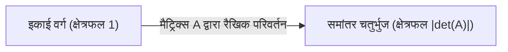
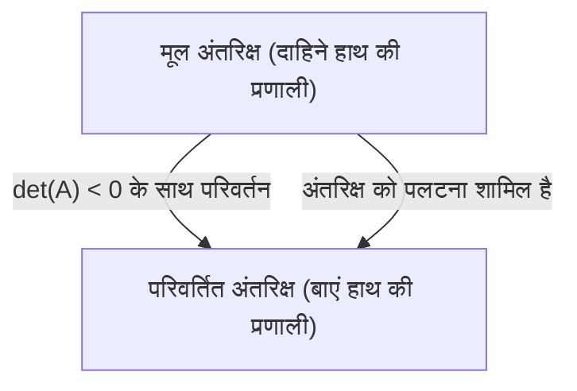
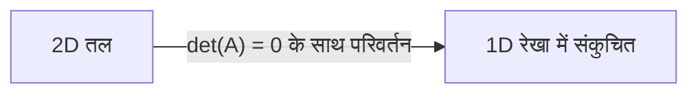

जब रैखिक बीजगणित (linear algebra) सीखने की बात आती है, तो कई लोगों के लिए पहली बाधा **सारणिक** (Determinant) होती है। पाठ्यपुस्तकें जटिल सूत्रों और विस्तार के नियमों से भरी होती हैं, लेकिन इसकी **असली प्रकृति** अत्यधिक दृश्य और सहज है। कई छात्र यह तो जानते हैं कि "इसे कैसे खोजना है" लेकिन यह समझने का अवसर चूक जाते हैं कि "इसका वास्तव में क्या अर्थ है।"

इस लेख में, हम सारणिक को केवल "संख्यात्मक मान ज्ञात करने के सूत्र" के रूप में नहीं, बल्कि ज्यामितीय दृष्टिकोण से दो महत्वपूर्ण अवधारणाओं के रूप में फिर से देखेंगे: अंतरिक्ष (space) का **वॉल्यूम स्केल फैक्टर** और **दिशा का उलटना** (orientation reversal)। इसे समझने से संपूर्ण रैखिक बीजगणित के परिदृश्य के बारे में आपका दृष्टिकोण पूरी तरह से बदल जाएगा।

## 1. सारणिक क्या है? (एक संक्षिप्त समीक्षा)

सारणिक (आमतौर पर $\det(A)$ या $|A|$ के रूप में दर्शाया जाता है) वर्ग आव्यूहों (square matrices) के लिए परिभाषित एक विशेष संख्या है। एक बुनियादी उदाहरण के रूप में, निम्नलिखित के रूप में दी गई 2x2 मैट्रिक्स $A$ पर विचार करें:

$$
A = \begin{pmatrix} a & b \\ c & d \end{pmatrix}
$$

इस मामले में, सारणिक की गणना इस प्रकार की जाती है:

$$
\det(A) = ad - bc
$$

3x3 आव्यूहों के लिए, इसकी गणना सारस के नियम (Sarrus' rule) या सहखंडज विस्तार (cofactor expansion) का उपयोग करके की जाती है, जिससे सूत्र बहुत अधिक जटिल हो जाता है। आप शायद इन सूत्रों को याद कर सकते हैं, लेकिन वे "क्यों $ad - bc$?" या "उत्पादों का इतना जटिल जोड़ और घटाव क्यों?" जैसे सवालों का जवाब नहीं देते हैं। इस प्रश्न को मौलिक रूप से हल करने के लिए, हमें मैट्रिक्स को **रैखिक परिवर्तन** (स्थान की विकृति और खिंचाव) के रूप में विज़ुअलाइज़ करने की आवश्यकता है।

## 2. 2D में ज्यामितीय अर्थ: क्षेत्र का स्केल फैक्टर

2-आयामी अंतरिक्ष (एक तल) में, एक मैट्रिक्स एक "परिवर्तन" के रूप में कार्य करता है जो तल पर बिंदुओं को अन्य बिंदुओं पर ले जाता है। आइए देखें कि आधार वैक्टर $\mathbf{i} = (1, 0)$ और $\mathbf{j} = (0, 1)$ द्वारा निर्मित $1$ क्षेत्रफल का एक संदर्भ इकाई वर्ग (unit square) मैट्रिक्स $A$ द्वारा कैसे परिवर्तित होता है।

जब मैट्रिक्स $A$ लागू किया जाता है, तो मानक आधार वैक्टर क्रमशः $\mathbf{v}_1 = (a, c)$ और $\mathbf{v}_2 = (b, d)$ में परिवर्तित हो जाते हैं। इन दो नए रूपांतरित सदिशों द्वारा निर्मित समांतर चतुर्भुज (parallelogram) का **क्षेत्रफल** सारणिक के निरपेक्ष मान $|\det(A)|$ के ठीक बराबर है।

दूसरे शब्दों में, सारणिक के निरपेक्ष मान का अर्थ है "क्षेत्र स्केल फैक्टर" जो इंगित करता है कि अंतरिक्ष में प्रत्येक आकृति उस रैखिक परिवर्तन द्वारा **कितनी बार** खींची गई (या सिकुड़ गई) है। उदाहरण के लिए, यदि किसी मैट्रिक्स का सारणिक $3$ है, तो मूल तल पर खींची गई प्रत्येक आकृति का क्षेत्रफल परिवर्तन के बाद ठीक तीन गुना बड़ा हो जाएगा।

### ठोस उदाहरणों के साथ पुष्टि करना

$$
M = \begin{pmatrix} 2 & 0 \\ 0 & 3 \end{pmatrix}
$$
यह मैट्रिक्स एक परिवर्तन का प्रतिनिधित्व करता है जो $x$-दिशा को 2 और $y$-दिशा को 3 तक खींचता है। सारणिक $2 \times 3 - 0 = 6$ है, जो पूरी तरह से हमारे अंतर्ज्ञान के साथ संरेखित है कि क्षेत्र 6 गुना बड़ा हो जाता है।

$$
S = \begin{pmatrix} 1 & 1 \\ 0 & 1 \end{pmatrix}
$$
इसे शीयर ट्रांसफ़ॉर्मेशन (shear transformation) कहा जाता है। एक वर्ग एक समांतर चतुर्भुज में विकृत हो जाता है, लेकिन चूंकि आधार और ऊंचाई अपरिवर्तित रहती है, इसलिए क्षेत्रफल भी अपरिवर्तित रहता है। सारणिक की गणना करने पर $1 \times 1 - 1 \times 0 = 1$ प्राप्त होता है, जो गणितीय रूप से पुष्टि करता है कि क्षेत्रफल संरक्षित है।

## 3. 3D में ज्यामितीय अर्थ: वॉल्यूम स्केल फैक्टर

यह शक्तिशाली ज्यामितीय अवधारणा स्वाभाविक रूप से 3-आयामी अंतरिक्ष तक फैली हुई है। 3x3 मैट्रिक्स का सारणिक तीन परिवर्तित आधार वैक्टर द्वारा गठित **समांतर चतुष्फलक के आयतन** (volume of the parallelepiped) का प्रतिनिधित्व करता है।

एक सूत्र के रूप में व्यक्त किया गया, यह ऐसा दिखता है:

$$
\det(A) = \text{परिवर्तित समांतर चतुष्फलक का आयतन (चिह्नित)}
$$

यदि सारणिक $0.5$ है, तो इसका मतलब है कि पूरे अंतरिक्ष की मात्रा आधी हो गई है। भले ही आयाम $n$-आयामी अंतरिक्ष तक बढ़ जाएं, यह सार कि "सारणिक $n$-आयामी आयतन का स्केल फैक्टर है" पूरी तरह से अपरिवर्तित रहता है।

## 4. नकारात्मक सारणिक और "दिशा का उलटना"

अब तक, हमने केवल सारणिक के "निरपेक्ष मान" पर ध्यान केंद्रित किया है, लेकिन वास्तविक गणनाओं में, सारणिक अक्सर नकारात्मक मान लेते हैं। तो, क्षेत्रफल या आयतन के "नकारात्मक" होने का पृथ्वी पर क्या अर्थ है?

यह अंतरिक्ष के **दिशा के उलटने** (Orientation Reversal) का प्रतीक है।
2D में, यह एक पारदर्शी शीट पर खींची गई आकृति को "फ्लिप" करने जैसे ऑपरेशन से मेल खाता है। जब आधार वैक्टर के सापेक्ष स्थितिगत संबंध (चाहे वे दक्षिणावर्त हों या वामावर्त) को उलट दिया जाता है, तो सारणिक एक नकारात्मक मान लेता है।

3D अंतरिक्ष में, इसका अर्थ "दाहिने हाथ की प्रणाली" (right-handed system) से "बाएं हाथ की प्रणाली" (left-handed system) में रूपांतरण है। दर्पण में परिलक्षित दुनिया की कल्पना करें। दर्पण की दुनिया में, आपका दाहिना हाथ आपका बायां हाथ बन जाता है। जब इस तरह के प्रतिबिंब को शामिल करने वाला कोई परिवर्तन होता है, तो सारणिक नकारात्मक हो जाता है।

उदाहरण के लिए, निम्नलिखित मैट्रिक्स एक 2D मैट्रिक्स है जो $x$-अक्ष के पार एक प्रतिबिंब (फ्लिप) का प्रतिनिधित्व करता है।

$$
A = \begin{pmatrix} 1 & 0 \\ 0 & -1 \end{pmatrix}
$$

इस मैट्रिक्स का सारणिक $1 \times (-1) - 0 \times 0 = -1$ है। क्षेत्रफल का निरपेक्ष आकार नहीं बदलता है (स्केल फैक्टर $1$ है), लेकिन क्योंकि अंतरिक्ष को पलट दिया गया है, इसलिए चिह्न नकारात्मक हो गया है।

## 5. जब सारणिक 0 हो: स्थानिक पतन और उलटा मैट्रिक्स का गैर-अस्तित्व

अंत में, आइए उस चरम मामले पर विचार करें जहां सारणिक बिल्कुल $0$ है। $0$ के स्केल फैक्टर का मतलब है कि परिवर्तित क्षेत्रफल या आयतन $0$ हो जाता है। इस मामले में अंतरिक्ष का क्या हो रहा है?

2D में, इसका मतलब है कि दो परिवर्तित आधार वैक्टर एक ही सीधी रेखा पर ओवरलैप करते हैं, और तल, जो मूल रूप से 2-आयामी होना चाहिए, 1-आयामी "रेखा" में ढह जाता है। 3D में, एक ठोस पूरी तरह से एक "तल", एक "रेखा", या सबसे खराब स्थिति में, एक "बिंदु" में ढह जाता है।

एक मैट्रिक्स जिसका सारणिक $0$ है, में एक बहुत महत्वपूर्ण बीजगणितीय गुण है: इसका **कोई उलटा मैट्रिक्स नहीं है** (यह एक विलक्षण मैट्रिक्स है)। ज्यामितीय रूप से, कारण स्पष्ट है। एक बार जब कोई अंतरिक्ष निम्न आयाम में ढह जाता है, तो खोई हुई जानकारी को पूरक करना और मूल उच्च-आयामी अंतरिक्ष को पुनर्स्थापित करना असंभव है (अर्थात, व्युत्क्रम परिवर्तन करना)।

## 6. सारणिक गुणों की ज्यामितीय व्याख्या

सारणिक में कई प्रसिद्ध बीजगणितीय गुण होते हैं, लेकिन यदि आप उनका ज्यामितीय अर्थ जानते हैं, तो आप उन्हें सहज रूप से समझ सकते हैं।

*   **उत्पाद का सारणिक** : $\det(AB) = \det(A)\det(B)$
    मैट्रिक्स उत्पाद $AB$ का अर्थ है "परिवर्तन $B$ करना और फिर परिवर्तन $A$ करना" का एक समग्र परिवर्तन। अंतरिक्ष का विस्तार पहले $\det(B)$ गुना होता है, और फिर आगे $\det(A)$ गुना तक विस्तारित होता है, इसलिए यह स्वाभाविक रूप से पूरी तरह से तार्किक है कि समग्र स्केल फैक्टर उनका उत्पाद है।
*   **उलटा मैट्रिक्स का सारणिक** : $\det(A^{-1}) = \frac{1}{\det(A)}$
    यदि एक निश्चित परिवर्तन अंतरिक्ष का $2$ गुना विस्तार करता है, तो उसके व्युत्क्रम परिवर्तन को अंतरिक्ष को $\frac{1}{2}$ तक सिकोड़ना चाहिए ताकि इसे अपने मूल स्वरूप में वापस लाया जा सके।

## 7. निष्कर्ष: जैकोबियन से जुड़ना

सारणिक गणना का केवल एक बोझिल सूत्र नहीं है, बल्कि अंतरिक्ष की विकृति का वर्णन करने के लिए एक अत्यंत शक्तिशाली ज्यामितीय उपकरण है।

*   **निरपेक्ष मान** : "स्केल फैक्टर" यह दर्शाता है कि अंतरिक्ष का क्षेत्रफल या आयतन कितनी बार गुणा किया गया है।
*   **चिह्न** : क्या अंतरिक्ष की "दिशा" संरक्षित है (सकारात्मक) या उलट है (नकारात्मक)।
*   **शून्य** : अंतरिक्ष का निचले आयाम में "पतन" (आयाम और अपरिवर्तनीयता का नुकसान)।

यह सहज छवि **जैकोबियन** ([Jacobi](https://kenji.blog/hi/p/jacobi/)an) (गैर-रैखिक परिवर्तनों में स्थानीय आयतन स्केल फैक्टर) को समझने के लिए एक महत्वपूर्ण आधार के रूप में काम करेगी जिसे आप बाद में कलन (calculus) में सीखेंगे। रैखिक बीजगणित की दुनिया में, सूत्रों को ज्यामितीय छवियों के साथ लगातार जोड़ना गहरी समझ का सबसे छोटा रास्ता है।
