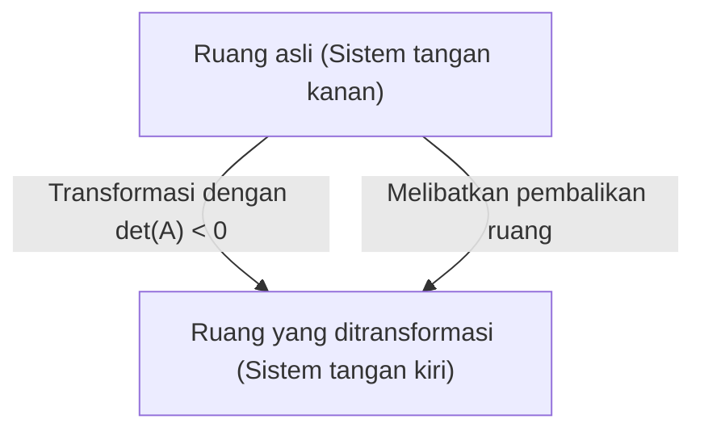

Saat mempelajari aljabar linear, salah satu rintangan pertama bagi banyak orang adalah **determinan** . Buku teks dipenuhi dengan rumus yang kompleks dan aturan ekspansi, tetapi **sifat aslinya** sangat visual dan intuitif. Banyak siswa tahu "bagaimana menghitungnya" tetapi kehilangan kesempatan untuk memahami "apa sebenarnya artinya".

Dalam artikel ini, kita akan menguji kembali determinan bukan sekadar "rumus untuk mencari nilai numerik", melainkan dari perspektif geometris sebagai dua konsep penting: **faktor skala volume** ruang dan **pembalikan orientasi** . Memahami hal ini akan benar-benar mengubah pandangan Anda tentang keseluruhan aljabar linear.

## 1. Apa itu Determinan? (Sebuah Tinjauan Singkat)

Determinan (umumnya dilambangkan sebagai $\det(A)$ atau $|A|$) adalah angka khusus yang didefinisikan untuk matriks persegi. Sebagai contoh dasar, pertimbangkan matriks $A$ 2x2 yang diberikan sebagai berikut:

$$
A = \begin{pmatrix} a & b \\ c & d \end{pmatrix}
$$

Dalam kasus ini, determinan dihitung sebagai berikut:

$$
\det(A) = ad - bc
$$

Untuk matriks 3x3, ia dihitung menggunakan aturan Sarrus atau ekspansi kofaktor, membuat rumusnya jauh lebih kompleks. Anda mungkin dapat menghafal rumus-rumus ini sendiri, tetapi mereka tidak menjawab pertanyaan seperti "Mengapa $ad - bc$?" atau "Mengapa penjumlahan dan pengurangan hasil kali begitu kompleks?". Untuk menyelesaikan pertanyaan ini secara fundamental, kita perlu memvisualisasikan matriks sebagai **transformasi linear** (distorsi dan peregangan ruang).

## 2. Makna Geometris dalam 2D: Faktor Skala Luas

Dalam ruang 2 dimensi (bidang), matriks berfungsi sebagai "transformasi" yang memindahkan titik-titik pada bidang ke titik-titik lain. Mari kita lihat bagaimana persegi satuan acuan (sebuah persegi dengan luas $1$ yang dibuat oleh vektor basis $\mathbf{i} = (1, 0)$ dan $\mathbf{j} = (0, 1)$) ditransformasikan oleh matriks $A$.

Ketika matriks $A$ diterapkan, vektor basis standar masing-masing ditransformasikan menjadi $\mathbf{v}_1 = (a, c)$ dan $\mathbf{v}_2 = (b, d)$. **Luas** jajaran genjang yang dibentuk oleh dua vektor yang baru ditransformasikan ini sama persis dengan nilai absolut determinan, $|\det(A)|$.

Dengan kata lain, nilai absolut determinan berarti "faktor skala luas" yang menunjukkan **berapa kali** setiap bangun dalam ruang telah diregangkan (atau disusutkan) oleh transformasi linear tersebut. Misalnya, jika determinan suatu matriks adalah $3$, luas setiap bangun yang digambar pada bidang aslinya akan menjadi tepat tiga kali lebih besar setelah transformasi.

### Konfirmasi dengan Contoh Konkret

$$
M = \begin{pmatrix} 2 & 0 \\ 0 & 3 \end{pmatrix}
$$
Matriks ini mewakili transformasi yang meregangkan arah $x$ sebesar 2 dan arah $y$ sebesar 3. Determinannya adalah $2 \times 3 - 0 = 6$, yang sangat selaras dengan intuisi kita bahwa luasnya menjadi 6 kali lebih besar.

$$
S = \begin{pmatrix} 1 & 1 \\ 0 & 1 \end{pmatrix}
$$
Ini adalah apa yang disebut transformasi geseran (shear). Sebuah persegi terdistorsi menjadi jajaran genjang, tetapi karena alas dan tingginya tetap tidak berubah, luasnya juga tetap tidak berubah. Menghitung determinan menghasilkan $1 \times 1 - 1 \times 0 = 1$, yang secara matematis membenarkan bahwa luasnya dipertahankan.

## 3. Makna Geometris dalam 3D: Faktor Skala Volume

Konsep geometris yang kuat ini secara alami meluas ke ruang 3 dimensi. Determinan dari matriks 3x3 mewakili **volume paralelepipedum** yang dibentuk oleh tiga vektor basis yang ditransformasikan.

Dinyatakan sebagai rumus, terlihat seperti ini:

$$
\det(A) = \text{Volume paralelepipedum yang ditransformasi (dengan tanda)}
$$

Jika determinan adalah $0.5$, itu berarti volume seluruh ruang dikompresi menjadi setengahnya. Bahkan jika dimensinya meningkat menjadi ruang $n$-dimensi, esensi bahwa "determinan adalah faktor skala dari volume $n$-dimensi" tetap sama sekali tidak berubah.

## 4. Determinan Negatif dan "Pembalikan Orientasi"

Hingga saat ini, kita hanya berfokus pada "nilai absolut" determinan, tetapi dalam perhitungan aktual, determinan sering kali mengambil nilai negatif. Jadi, apa sebenarnya artinya bagi suatu luas atau volume untuk menjadi "negatif"?

Ini menandakan **pembalikan orientasi** (Orientation Reversal) ruang.
Dalam 2D, ini sesuai dengan operasi seperti "membalikkan" bangun yang digambar di atas lembaran transparan. Ketika hubungan posisi relatif vektor basis (apakah searah atau berlawanan arah jarum jam) dibalik, determinan mengambil nilai negatif.

Dalam ruang 3D, itu berarti konversi dari "sistem tangan kanan" ke "sistem tangan kiri". Bayangkan dunia terpantul di cermin. Di dunia cermin, tangan kanan Anda menjadi tangan kiri Anda. Ketika transformasi yang melibatkan refleksi semacam itu terjadi, determinannya menjadi negatif.

Sebagai contoh, matriks berikut adalah matriks 2D yang mewakili refleksi (pembalikan) melintasi sumbu $x$.

$$
A = \begin{pmatrix} 1 & 0 \\ 0 & -1 \end{pmatrix}
$$

Determinan matriks ini adalah $1 \times (-1) - 0 \times 0 = -1$. Ukuran mutlak luasnya tidak berubah (faktor skalanya adalah $1$), tetapi karena ruangnya telah dibalik, tandanya menjadi negatif.

## 5. Saat Determinan 0: Keruntuhan Spasial dan Ketidakberadaan Matriks Invers

Terakhir, mari kita pertimbangkan kasus ekstrem di mana determinan tepat $0$. Faktor skala $0$ berarti luas atau volume yang ditransformasikan menjadi $0$. Apa yang terjadi pada ruang dalam kasus ini?

Dalam 2D, ini berarti bahwa kedua vektor basis yang ditransformasikan tumpang tindih pada garis lurus yang sama, dan bidang, yang aslinya seharusnya 2 dimensi, runtuh menjadi "garis" 1 dimensi. Dalam 3D, sebuah benda padat runtuh sepenuhnya menjadi "bidang", "garis", atau dalam kasus terburuk, "titik".

Matriks yang determinannya $0$ memiliki sifat aljabar yang sangat penting: ia **tidak memiliki matriks invers** (ini adalah matriks singular). Secara geometris, alasannya jelas. Setelah ruang runtuh menjadi dimensi yang lebih rendah, tidak mungkin melengkapi informasi yang hilang dan mengembalikan ruang berdimensi lebih tinggi yang asli (yaitu, melakukan transformasi invers).

## 6. Interpretasi Geometris dari Sifat-sifat Determinan

Determinan memiliki beberapa sifat aljabar yang terkenal, tetapi jika Anda mengetahui makna geometrisnya, Anda dapat memahaminya secara intuitif.

*   **Determinan hasil kali** : $\det(AB) = \det(A)\det(B)$
    Hasil kali matriks $AB$ berarti transformasi gabungan dari "melakukan transformasi $B$ dan kemudian melakukan transformasi $A$". Ruang pertama-tama diperluas $\det(B)$ kali, dan kemudian diperluas lagi $\det(A)$ kali, sehingga wajar saja jika faktor skala keseluruhannya adalah hasil kalinya.
*   **Determinan matriks invers** : $\det(A^{-1}) = \frac{1}{\det(A)}$
    Jika transformasi tertentu memperluas ruang $2$ kali, transformasi inversnya harus menyusutkan ruang menjadi $\frac{1}{2}$ untuk mengembalikannya ke keadaan semula.

## 7. Kesimpulan: Menghubungkan dengan Jacobian

Determinan bukan sekadar rumus perhitungan yang rumit, melainkan alat geometris yang sangat kuat untuk menggambarkan deformasi ruang.

*   **Nilai absolut** : "Faktor skala" yang menunjukkan berapa kali luas atau volume ruang dikalikan.
*   **Tanda** : Apakah "orientasi" ruang dipertahankan (positif) atau dibalik (negatif).
*   **Nol** : Ruang "runtuh" menjadi dimensi yang lebih rendah (hilangnya dimensi dan ireversibilitas).

Memiliki gambar intuitif ini akan berfungsi sebagai dasar penting untuk memahami **Jacobian** (faktor skala volume lokal dalam transformasi non-linear) yang akan Anda pelajari nanti di kalkulus. Di dunia aljabar linear, secara konstan menghubungkan rumus dengan gambar geometris adalah jalan terpendek menuju pemahaman yang mendalam.
