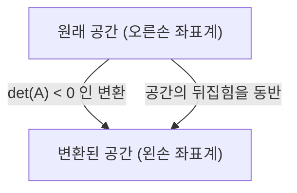

선형대수학을 배울 때 많은 사람들이 처음 걸려 넘어지는 부분 중 하나가 **행렬식** (Determinant) 입니다. 교과서에는 복잡한 계산식과 전개 규칙이 나열되어 있지만, 그 **진정한 모습** 은 매우 시각적이고 직관적입니다. 많은 학생들은 "어떻게 계산하는가"는 알고 있어도 "그것이 무엇을 의미하는가"를 이해할 기회를 놓치고 있습니다.

본 기사에서는 행렬식을 단순히 "수치를 구하기 위한 공식"으로 보지 않고, 기하학적인 관점에서 **공간 부피의 확대율** 과 **방향의 반전** 이라는 두 가지 중요한 개념으로 다시 조명해 보겠습니다. 이를 이해하면 선형대수학 전체의 풍경이 완전히 다르게 보일 것입니다.

## 1. 행렬식이란 무엇인가? (기초 복습)

행렬식(일반적으로 $\det(A)$ 또는 $|A|$로 표기)은 정방행렬에 대해 정의되는 특별한 수치입니다. 기본적으로 다음과 같이 주어진 2행 2열 행렬 $A$를 생각해 봅시다.

$$
A = \begin{pmatrix} a & b \\ c & d \end{pmatrix}
$$

이때 행렬식은 다음과 같이 계산됩니다.

$$
\det(A) = ad - bc
$$

3행 3열의 경우 사루스 법칙이나 여인수 전개를 사용하여 계산되므로 식이 훨씬 더 복잡해집니다. 이러한 식 자체는 암기할 수 있을지 몰라도, "왜 $ad - bc$인가?" 또는 "왜 저런 복잡한 곱의 합과 차가 되는가?"라는 질문에는 답해주지 않습니다. 이 의문을 근본적으로 해결하려면 행렬을 **선형 변환** (공간의 왜곡이나 늘어남)으로 시각화해야 합니다.

## 2. 2차원에서의 기하학적 의미: 넓이의 확대율

2차원 공간(평면)에서 행렬은 평면 위의 점을 다른 점으로 이동시키는 "변환"으로 작용합니다. 기준이 되는 단위 정사각형(기저 벡터 $\mathbf{i} = (1, 0)$과 $\mathbf{j} = (0, 1)$로 만들어지는 넓이 $1$의 정사각형)이 행렬 $A$에 의해 어떻게 변환되는지 살펴봅시다.

행렬 $A$를 적용하면 표준 기저 벡터는 각각 $\mathbf{v}_1 = (a, c)$와 $\mathbf{v}_2 = (b, d)$로 변환됩니다. 이렇게 새롭게 변환된 두 벡터가 만드는 평행사변형의 **넓이** 가 바로 행렬식의 절댓값 $|\det(A)|$와 정확히 같습니다.

즉, 행렬식의 절댓값은 그 선형 변환에 의해 공간의 모든 도형이 **몇 배로 늘어났는지** (또는 축소되었는지)를 나타내는 "넓이의 확대율"을 의미합니다. 예를 들어 어떤 행렬의 행렬식이 $3$이라면, 원래 평면에 그려진 모든 도형의 넓이는 변환 후 정확히 3배가 됩니다.

### 구체적인 예로 확인하기

$$
M = \begin{pmatrix} 2 & 0 \\ 0 & 3 \end{pmatrix}
$$
이 행렬은 $x$ 방향을 2배, $y$ 방향을 3배로 늘리는 변환을 나타냅니다. 행렬식은 $2 \times 3 - 0 = 6$이 되며, 넓이가 6배가 된다는 직관과 완벽하게 일치합니다.

$$
S = \begin{pmatrix} 1 & 1 \\ 0 & 1 \end{pmatrix}
$$
이것은 전단(shear) 변환이라고 불리는 것입니다. 정사각형이 평행사변형으로 왜곡되지만 밑변과 높이는 변하지 않으므로 넓이도 변하지 않습니다. 행렬식을 계산해 보면 $1 \times 1 - 1 \times 0 = 1$이 되어, 수식으로도 넓이가 보존됨을 알 수 있습니다.

## 3. 3차원에서의 기하학적 의미: 부피의 확대율

이 강력한 기하학적 개념은 3차원 공간으로도 자연스럽게 확장됩니다. 3행 3열 행렬의 행렬식은 변환된 3개의 기저 벡터가 형성하는 **평행육면체의 부피** 를 나타냅니다.

수식으로 표현하면 다음과 같습니다.

$$
\det(A) = \text{변환된 평행육면체의 부피 (부호 있음)}
$$

행렬식이 $0.5$라면 공간 전체의 부피가 절반으로 압축됨을 의미합니다. 차원이 늘어나 $n$차원 공간이 되더라도 "행렬식은 $n$차원 부피의 스케일 팩터(확대율)이다"라는 본질은 전혀 변하지 않습니다.

## 4. 음의 행렬식과 '방향의 반전'

지금까지는 행렬식의 "절댓값"에만 초점을 맞추어 설명했지만, 실제 계산에서 행렬식은 음수 값을 가지는 경우도 빈번합니다. 그렇다면 넓이나 부피가 "마이너스가 된다"는 것은 도대체 무슨 의미일까요?

이것은 공간의 **방향 반전** (Orientation Reversal)을 의미합니다.
2차원의 경우, 투명한 시트에 그려진 도형을 "뒤집는" 것과 같은 조작에 해당합니다. 기저 벡터의 상대적인 위치 관계(시계 방향인지 반시계 방향인지)가 역전되었을 때, 행렬식은 음수 값을 가집니다.

3차원 공간에서는 "오른손 좌표계"에서 "왼손 좌표계"로의 변환을 의미합니다. 거울에 비친 세계를 상상해 보세요. 거울 속 세계에서는 오른손이 왼손이 됩니다. 이러한 거울 반사를 포함하는 변환이 발생하면 행렬식은 음수가 됩니다.

예를 들어, 다음 행렬은 $x$축에 대한 반사(뒤집기)를 나타내는 2차원 행렬입니다.

$$
A = \begin{pmatrix} 1 & 0 \\ 0 & -1 \end{pmatrix}
$$

이 행렬의 행렬식은 $1 \times (-1) - 0 \times 0 = -1$입니다. 넓이의 절대적인 크기는 변하지 않지만(확대율은 $1$), 공간이 뒤집혔기 때문에 부호가 마이너스가 된 것입니다.

## 5. 행렬식이 0이 되는 경우: 공간의 붕괴와 역행렬의 부재

마지막으로 행렬식이 정확히 $0$이 되는 극단적인 경우를 생각해 봅시다. 확대율이 $0$이라는 것은 변환 후의 넓이나 부피가 $0$이 되어버린다는 것을 의미합니다. 공간에 어떤 일이 일어나고 있는 것일까요?

2차원의 경우 변환된 두 기저 벡터가 같은 직선 위에 겹쳐져, 본래 2차원이어야 할 평면이 1차원 "선"으로 무너져 버렸음을 의미합니다. 3차원의 경우 입체가 "평면"이나 "선", 또는 최악의 경우 "점"으로 완전히 무너져 버립니다.

행렬식이 $0$이 되는 행렬은 **역행렬을 갖지 않는다** (특이행렬이다)라는 매우 중요한 대수적 성질을 가지고 있습니다. 기하학적으로 생각하면 이유는 명백합니다. 한 번 낮은 차원으로 무너져버린 공간에서, 잃어버린 정보를 보완하여 원래 차원의 공간을 복원하는(역변환을 수행하는) 것은 불가능하기 때문입니다.

## 6. 행렬식 성질의 기하학적 해석

행렬식에는 몇 가지 유명한 대수적 성질이 있지만, 기하학적 의미를 알고 있다면 이들도 직관적으로 이해할 수 있습니다.

*   **곱의 행렬식** : $\det(AB) = \det(A)\det(B)$
    행렬의 곱 $AB$는 "변환 $B$를 수행한 후 변환 $A$를 수행한다"는 합성 변환을 의미합니다. 먼저 공간이 $\det(B)$배로 확대되고, 그 후 다시 $\det(A)$배가 되므로, 전체 확대율이 그 곱이 되는 것은 당연한 이치입니다.
*   **역행렬의 행렬식** : $\det(A^{-1}) = \frac{1}{\det(A)}$
    어떤 변환이 공간을 $2$배로 확대한다면, 그 역변환은 공간을 $\frac{1}{2}$로 축소해야 원래 상태로 돌아옵니다.

## 7. 결론: 야코비안으로의 연결

행렬식은 단순하고 번거로운 계산식이 아니라, 공간의 변형을 설명하는 매우 강력한 기하학적 도구입니다.

*   **절댓값** : 공간의 넓이나 부피가 몇 배가 되는지를 나타내는 "스케일 팩터(확대율)".
*   **부호** : 공간의 "방향"이 보존되는지(양수) 또는 뒤집히는지(음수).
*   **0** : 공간이 더 낮은 차원으로 "무너지는" 것 (차원의 상실과 비가역성).

이러한 직관적인 이미지를 갖는 것은 나중에 미적분학에서 배우게 될 **야코비안** (비선형 변환에서의 국소적인 부피 확대율)을 이해하기 위한 중요한 기초가 됩니다. 선형대수학의 세계에서는 수식과 기하학적 이미지를 항상 연결지어 생각하는 것이 깊은 이해로 가는 가장 빠른 길입니다.
