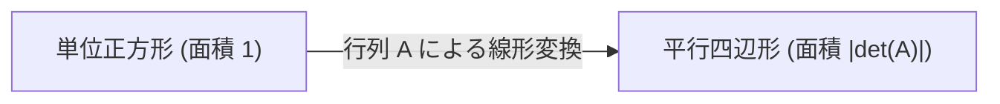
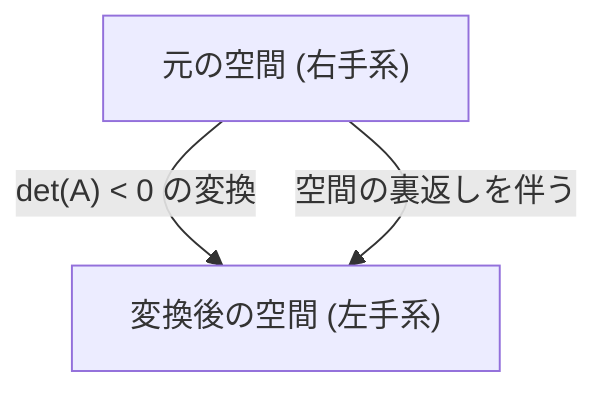
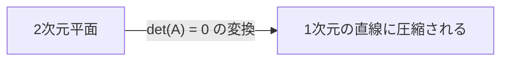

線形代数を学ぶ際、多くの人が最初につまずくポイントの一つが **行列式** (Determinant) です。教科書には複雑な計算式や展開のルールが並んでいますが、その **真の姿** は非常に視覚的で直感的なものです。多くの学生は「どう計算するか」は知っていても、「それが何を意味しているのか」を理解する機会を逃しています。

本記事では、行列式を単なる「数値を求めるための公式」としてではなく、幾何学的な視点から **空間の体積の拡大率** と **向きの反転** という2つの重要な概念として捉え直します。これを理解することで、線形代数全体の景色が全く違って見えるはずです。

## 1. 行列式とは何か？（基本の復習）

行列式（一般に $\det(A)$ や $|A|$ と表記されます）は、正方行列に対して定義される特別な数値です。基本として、2行2列の行列 $A$ が以下のように与えられた場合を考えます。

$$
A = \begin{pmatrix} a & b \\ c & d \end{pmatrix}
$$

このとき、行列式は次のように計算されます。

$$
\det(A) = ad - bc
$$

3行3列の場合はサラスの公式や余因子展開を用いて計算されますが、式はより複雑になります。これらの式自体は暗記できるかもしれませんが、「なぜ $ad - bc$ なのか？」「なぜあのような複雑な積の和と差になるのか？」という疑問には答えてくれません。この疑問を根本から解決するには、行列を **線形変換** （空間の歪みや引き伸ばし）として視覚化する必要があります。

## 2. 2次元における幾何学的意味：面積の拡大率

2次元空間（平面）において、行列は平面上の点を別の点に移動させる「変換」として機能します。基準となる単位正方形（基底ベクトル $\mathbf{i} = (1, 0)$ と $\mathbf{j} = (0, 1)$ で作られる面積 $1$ の正方形）が、行列 $A$ によってどのように変換されるかを見てみましょう。

行列 $A$ を適用すると、標準基底ベクトルはそれぞれ $\mathbf{v}_1 = (a, c)$ と $\mathbf{v}_2 = (b, d)$ に変換されます。この新しく変換された2つのベクトルが形作る平行四辺形の **面積** こそが、行列式の絶対値 $|\det(A)|$ に正確に等しいのです。

つまり、行列式の絶対値は、その線形変換によって空間のあらゆる図形が **何倍に引き伸ばされたか** （あるいは縮小されたか）を示す「面積の拡大率」を意味します。たとえば、ある行列の行列式が $3$ であれば、元の平面に描かれたすべての図形の面積は、変換後にちょうど3倍になります。

### 具体例で確認する

$$
M = \begin{pmatrix} 2 & 0 \\ 0 & 3 \end{pmatrix}
$$
この行列は、 $x$ 方向を2倍、 $y$ 方向を3倍に引き伸ばす変換です。行列式は $2 \times 3 - 0 = 6$ となり、面積が6倍になるという直感と完全に一致します。

$$
S = \begin{pmatrix} 1 & 1 \\ 0 & 1 \end{pmatrix}
$$
これは剪断（シアー）変換と呼ばれるものです。正方形は平行四辺形に歪みますが、底辺と高さは変わらないため面積も変わりません。行列式を計算すると $1 \times 1 - 1 \times 0 = 1$ となり、面積が保存されることが数式からも分かります。

## 3. 3次元における幾何学的意味：体積の拡大率

この強力な幾何学的概念は、3次元空間にも自然に拡張されます。3行3列の行列の行列式は、変換後の3つの基底ベクトルが形成する **平行六面体の体積** を表します。

数式で表すと、以下のようになります。

$$
\det(A) = \text{変換後の平行六面体の体積（符号付き）}
$$

行列式が $0.5$ であれば、空間全体の体積が半分に圧縮されることを意味します。次元が増え、$n$ 次元空間になったとしても、「行列式は n次元体積のスケールファクター（拡大率）である」という本質は全く変わりません。

## 4. 負の行列式と「向きの反転」

ここまでは行列式の「絶対値」についてのみ焦点を当てて説明しましたが、実際の計算では行列式は負の値をとることも頻繁にあります。では、面積や体積が「マイナスになる」とは一体どういうことなのでしょうか？

これは空間の **向きの反転** (Orientation Reversal) を意味しています。
2次元の場合、透明なシートに描かれた図形を「裏返す」ような操作に相当します。基底ベクトルの相対的な位置関係（右回りから左回りか）が逆転したとき、行列式は負の値を持ちます。

3次元空間においては、「右手系」から「左手系」への変換を意味します。鏡に映った世界を想像してください。鏡像の世界では、右手が左手になります。このような鏡映変換を含む変換が行われると、行列式は負になります。

例えば、以下の行列は $x$ 軸に関する鏡映（折り返し）を表す2次元の行列です。

$$
A = \begin{pmatrix} 1 & 0 \\ 0 & -1 \end{pmatrix}
$$

この行列の行列式は $1 \times (-1) - 0 \times 0 = -1$ です。面積の絶対的な大きさは変わりませんが（拡大率は $1$ ）、空間が裏返されたために、符号がマイナスになっています。

## 5. 行列式が0になる場合：空間の潰れと逆行列の非存在

最後に、行列式がちょうど $0$ になる極端なケースについて考えてみましょう。拡大率が $0$ ということは、変換後の面積や体積が $0$ になってしまうことを意味します。これは空間に何が起きているのでしょうか？

2次元の場合、変換後の2つの基底ベクトルが同一直線上に重なってしまい、本来2次元であるべき平面が、1次元の「線」に潰れてしまうことを意味します。3次元の場合は、立体が「平面」や「線」、あるいは最悪の場合は「点」にまで完全に潰れてしまいます。

行列式が $0$ になる行列は **逆行列を持たない** （特異行列である）という非常に重要な代数的な性質を持っています。幾何学的に考えれば理由は明白です。一度低い次元に潰れてしまった空間から、失われた情報を補完して元の次元の空間を復元する（逆変換を行う）ことは不可能だからです。

## 6. 行列式の性質の幾何学的解釈

行列式にはいくつかの有名な代数的性質がありますが、幾何学的な意味を知っていれば、これらも直感的に理解できます。

*   **積の行列式** ： $\det(AB) = \det(A)\det(B)$
    行列の積 $AB$ は、「変換 $B$ を行った後に変換 $A$ を行う」という合成変換を意味します。まず空間が $\det(B)$ 倍に拡大され、その後さらに $\det(A)$ 倍されるのですから、全体の拡大率がその積になるのは当然のことです。
*   **逆行列の行列式** ： $\det(A^{-1}) = \frac{1}{\det(A)}$
    ある変換が空間を $2$ 倍に拡大するなら、その逆変換は空間を $\frac{1}{2}$ に縮小しなければ元に戻りません。

## 7. まとめ：[ヤコビ](https://kenji.blog/p/jacobi/)アンへの繋がり

行列式は単なる煩雑な計算式ではなく、空間の変形を記述する非常に強力な幾何学的ツールです。

*   **絶対値** ：空間の面積や体積が何倍になるかという「スケールファクター（拡大率）」。
*   **符号** ：空間の「向き」が保たれるか（正）、裏返るか（負）。
*   **ゼロ** ：空間がより低い次元に「潰れる」こと（次元の喪失と非可逆性）。

この直感的なイメージを持つことは、後に微積分学で学ぶ **[ヤコビ](https://kenji.blog/p/jacobi/)アン** （非線形変換における局所的な体積の拡大率）を理解するための重要な基礎となります。線形代数の世界では、数式と幾何学的なイメージを常に結びつけて考えることが、深い理解への最短の道なのです。
