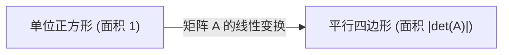

在学习线性代数时，许多人最先遇到的绊脚石之一就是 **行列式** (Determinant)。教科书上列满了复杂的计算公式和展开规则，但其 **真实的本质** 却是高度视觉化和直观的。许多学生知道“如何计算”，却错失了理解“它到底意味着什么”的机会。

在本文中，我们将不再把行列式仅仅看作“求值的公式”，而是从几何的角度，将其重新理解为 **空间体积的缩放率** 和 **方向的反转** 这两个重要的概念。理解了这一点，整个线性代数的图景将会焕然一新。

## 1. 什么是行列式？（基础回顾）

行列式（通常记作 $\det(A)$ 或 $|A|$）是针对方阵定义的一个特殊数值。作为基础，我们考虑如下给定的 2 行 2 列矩阵 $A$：

$$
A = \begin{pmatrix} a & b \\ c & d \end{pmatrix}
$$

此时，行列式的计算公式如下：

$$
\det(A) = ad - bc
$$

对于 3 行 3 列的矩阵，通常使用萨吕法则或代数余子式展开进行计算，公式会变得更加复杂。你也许能死记硬背下这些公式本身，但它们并不能回答诸如“为什么是 $ad - bc$？”或“为什么会是那样复杂的乘积加减组合？”这样的问题。要从根本上解决这个疑问，我们必须将矩阵可视化为 **线性变换** （空间的扭曲或拉伸）。

## 2. 二维空间中的几何意义：面积的缩放率

在二维空间（平面）中，矩阵起着将平面上的点移动到另一点的“变换”作用。让我们来看看，基准的单位正方形（由基向量 $\mathbf{i} = (1, 0)$ 和 $\mathbf{j} = (0, 1)$ 构成的面积为 $1$ 的正方形）在矩阵 $A$ 的作用下是如何变换的。

应用矩阵 $A$ 后，标准基向量分别被变换为 $\mathbf{v}_1 = (a, c)$ 和 $\mathbf{v}_2 = (b, d)$。由这两个新变换出的向量所构成的平行四边形的 **面积** ，恰好等于行列式的绝对值 $|\det(A)|$。



也就是说，行列式的绝对值代表了“面积的缩放率”，它表明通过该线性变换，空间中的所有图形被 **拉伸了多少倍** （或缩小了多少倍）。例如，如果某个矩阵的行列式为 $3$，那么在变换之后，原来平面上绘制的所有图形的面积都会精确地变成原来的三倍。

### 通过具体例子确认

$$
M = \begin{pmatrix} 2 & 0 \\ 0 & 3 \end{pmatrix}
$$
这个矩阵代表将 $x$ 方向拉伸 2 倍、$y$ 方向拉伸 3 倍的变换。其行列式为 $2 \times 3 - 0 = 6$，这与我们直观上认为面积变为 6 倍完全一致。

$$
S = \begin{pmatrix} 1 & 1 \\ 0 & 1 \end{pmatrix}
$$
这被称为剪切变换。正方形被扭曲成了平行四边形，但由于底边和高没有改变，所以面积也不变。计算其行列式得到 $1 \times 1 - 1 \times 0 = 1$，从数学公式上也验证了面积是守恒的。

## 3. 三维空间中的几何意义：体积的缩放率

这个强大的几何概念也自然地扩展到了三维空间。3 行 3 列矩阵的行列式代表了变换后 3 个基向量所构成的 **平行六面体的体积** 。

用公式表示如下：

$$
\det(A) = \text{变换后平行六面体的体积（带符号）}
$$

如果行列式为 $0.5$，则意味着整个空间的体积被压缩了一半。即使维度增加，扩展到了 $n$ 维空间，“行列式是 $n$ 维体积的缩放因子”这一本质也丝毫没有改变。

## 4. 负行列式与“方向的反转”

到目前为止，我们仅仅关注并解释了行列式的“绝对值”，但在实际计算中，行列式经常出现负值。那么，面积或体积“变成负数”到底意味着什么呢？

这象征着空间的 **方向反转** (Orientation Reversal)。
在二维情况中，它相当于把画在透明塑料薄膜上的图形“翻个面”这样的操作。当基向量的相对位置关系（从顺时针变为逆时针，反之亦然）发生逆转时，行列式就会呈现负值。

```mermaid
flowchart TD
    Original["原始空间 (右手系)"]
    Reflected["变换后的空间 (左手系)"]
    Original -->|"det("A") < 0 的变换"| Reflected
    Original -->|"伴随着空间的翻转"| Reflected
```

在三维空间中，它意味着从“右手系”到“左手系”的转换。想象一下镜子里的世界。在镜像世界里，你的右手变成了左手。当发生包含此类镜像翻转的变换时，行列式就会变为负数。

例如，下面的矩阵是表示沿 $x$ 轴进行镜像反射（翻转）的二维矩阵。

$$
A = \begin{pmatrix} 1 & 0 \\ 0 & -1 \end{pmatrix}
$$

该矩阵的行列式为 $1 \times (-1) - 0 \times 0 = -1$。面积的绝对大小并没有改变（缩放率为 $1$），但由于空间被翻转了，所以符号变成了负号。

## 5. 当行列式为 0 时：空间的坍塌与逆矩阵的不存在

最后，让我们考虑一下行列式恰好为 $0$ 的极端情况。缩放率为 $0$ 意味着变换后的面积或体积变成了 $0$。此时空间里到底发生了什么？

在二维情况中，这意味着变换后的两个基向量重叠在了同一条直线上，原本应该是二维的平面，坍塌成了一维的“线”。而在三维情况中，立体会完全坍塌成“平面”或“线”，在最糟糕的情况下甚至会缩成一个“点”。

```mermaid
flowchart LR
    Space["二维平面"] -->|"det("A") = 0 的变换"| Line["被压缩成一维的直线"]
```

行列式为 $0$ 的矩阵具有一个非常重要的代数性质：它 **没有逆矩阵** （奇异矩阵）。从几何学角度思考，原因显而易见。一旦空间坍塌到了更低的维度，就再也不可能补充丢失的信息来还原原始的高维空间（即执行逆变换）了。

## 6. 行列式性质的几何解释

行列式有一些著名的代数性质，但如果你知道了它们的几何意义，就能直观地理解它们。

*   **乘积的行列式** ： $\det(AB) = \det(A)\det(B)$
    矩阵乘积 $AB$ 意味着“先进行变换 $B$ 再进行变换 $A$”的复合变换。空间首先被放大了 $\det(B)$ 倍，之后又被放大了 $\det(A)$ 倍，因此总缩放率自然就是它们的乘积。
*   **逆矩阵的行列式** ： $\det(A^{-1}) = \frac{1}{\det(A)}$
    如果某个变换将空间放大了 $2$ 倍，那么它的逆变换必须将空间缩小为 $\frac{1}{2}$ 才能恢复原状。

## 7. 总结：与雅可比行列式的联系

行列式不仅是一个繁琐的计算公式，更是描述空间变形的极其强大的几何工具。

*   **绝对值** ：表示空间的面积或体积被放大了多少倍的“缩放因子”。
*   **符号** ：表示空间的“方向”是保持（正）还是翻转（负）。
*   **零** ：空间向更低维度的“坍塌”（维度的丧失与不可逆性）。

拥有这种直观的图像，将为你日后理解微积分中学到的 **雅可比行列式** （非线性变换中的局部体积缩放率）奠定重要基础。在线性代数的世界里，始终将数学公式与几何图像结合起来思考，是通往深刻理解的最短路径。
