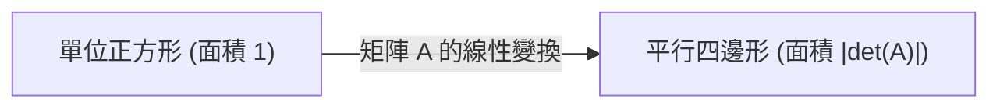

在學習線性代數時，許多人最先遇到的絆腳石之一就是 **行列式** (Determinant)。教科書上列滿了複雜的計算公式和展開規則，但其 **真實的本質** 卻是高度視覺化和直觀的。許多學生知道「如何計算」，卻錯失了理解「它到底意味著什麼」的機會。

在本文中，我們將不再把行列式僅僅看作「求值的公式」，而是從幾何的角度，將其重新理解為 **空間體積的縮放率** 和 **方向的反轉** 這兩個重要的概念。理解了這一點，整個線性代數的圖景將會煥然一新。

## 1. 什麼是行列式？（基礎回顧）

行列式（通常記作 $\det(A)$ 或 $|A|$）是針對方陣定義的一個特殊數值。作為基礎，我們考慮如下給定的 2 行 2 列矩陣 $A$：

$$
A = \begin{pmatrix} a & b \\ c & d \end{pmatrix}
$$

此時，行列式的計算公式如下：

$$
\det(A) = ad - bc
$$

對於 3 行 3 列的矩陣，通常使用薩呂法則或代數餘子式展開進行計算，公式會變得更加複雜。你也許能死記硬背下這些公式本身，但它們並不能回答諸如「為什麼是 $ad - bc$？」或「為什麼會是那樣複雜的乘積加減組合？」這樣的問題。要從根本上解決這個疑問，我們必須將矩陣視覺化為 **線性變換** （空間的扭曲或拉伸）。

## 2. 二維空間中的幾何意義：面積的縮放率

在二維空間（平面）中，矩陣起著將平面上的點移動到另一點的「變換」作用。讓我們來看看，基準的單位正方形（由基向量 $\mathbf{i} = (1, 0)$ 和 $\mathbf{j} = (0, 1)$ 構成的面積為 $1$ 的正方形）在矩陣 $A$ 的作用下是如何變換的。

應用矩陣 $A$ 後，標準基向量分別被變換為 $\mathbf{v}_1 = (a, c)$ 和 $\mathbf{v}_2 = (b, d)$。由這兩個新變換出的向量所構成的平行四邊形的 **面積** ，恰好等於行列式的絕對值 $|\det(A)|$。



也就是說，行列式的絕對值代表了「面積的縮放率」，它表明透過該線性變換，空間中的所有圖形被 **拉伸了多少倍** （或縮小了多少倍）。例如，如果某個矩陣的行列式為 $3$，那麼在變換之後，原來平面上繪製的所有圖形的面積都會精確地變成原來的三倍。

### 透過具體例子確認

$$
M = \begin{pmatrix} 2 & 0 \\ 0 & 3 \end{pmatrix}
$$
這個矩陣代表將 $x$ 方向拉伸 2 倍、$y$ 方向拉伸 3 倍的變換。其行列式為 $2 \times 3 - 0 = 6$，這與我們直觀上認為面積變為 6 倍完全一致。

$$
S = \begin{pmatrix} 1 & 1 \\ 0 & 1 \end{pmatrix}
$$
這被稱為剪切變換。正方形被扭曲成了平行四邊形，但由於底邊和高沒有改變，所以面積也不變。計算其行列式得到 $1 \times 1 - 1 \times 0 = 1$，從數學公式上也驗證了面積是守恆的。

## 3. 三維空間中的幾何意義：體積的縮放率

這個強大的幾何概念也自然地擴展到了三維空間。3 行 3 列矩陣的行列式代表了變換後 3 個基向量所構成的 **平行六面體的體積** 。

用公式表示如下：

$$
\det(A) = \text{變換後平行六面體的體積（帶正負號）}
$$

如果行列式為 $0.5$，則意味著整個空間的體積被壓縮了一半。即使維度增加，擴展到了 $n$ 維空間，「行列式是 $n$ 維體積的縮放因子」這一本質也絲毫沒有改變。

## 4. 負行列式與「方向的反轉」

到目前為止，我們僅僅關注並解釋了行列式的「絕對值」，但在實際計算中，行列式經常出現負值。那麼，面積或體積「變成負數」到底意味著什麼呢？

這象徵著空間的 **方向反轉** (Orientation Reversal)。
在二維情況中，它相當於把畫在透明塑膠薄膜上的圖形「翻個面」這樣的操作。當基向量的相對位置關係（從順時針變為逆時針，反之亦然）發生逆轉時，行列式就會呈現負值。

```mermaid
flowchart TD
    Original["原始空間 (右手系)"]
    Reflected["變換後的空間 (左手系)"]
    Original -->|"det("A") < 0 的變換"| Reflected
    Original -->|"伴隨著空間的翻轉"| Reflected
```

在三維空間中，它意味著從「右手系」到「左手系」的轉換。想像一下鏡子裡的世界。在鏡像世界裡，你的右手變成了左手。當發生包含此類鏡像翻轉的變換時，行列式就會變為負數。

例如，下面的矩陣是表示沿 $x$ 軸進行鏡像反射（翻轉）的二維矩陣。

$$
A = \begin{pmatrix} 1 & 0 \\ 0 & -1 \end{pmatrix}
$$

該矩陣的行列式為 $1 \times (-1) - 0 \times 0 = -1$。面積的絕對大小並沒有改變（縮放率為 $1$），但由於空間被翻轉了，所以正負號變成了負號。

## 5. 當行列式為 0 時：空間的坍塌與反矩陣的不存在

最後，讓我們考慮一下行列式恰好為 $0$ 的極端情況。縮放率為 $0$ 意味著變換後的面積或體積變成了 $0$。此時空間裡到底發生了什麼？

在二維情況中，這意味著變換後的兩個基向量重疊在了同一條直線上，原本應該是二維的平面，坍塌成了一維的「線」。而在三維情況中，立體會完全坍塌成「平面」或「線」，在最糟糕的情況下甚至會縮成一個「點」。

```mermaid
flowchart LR
    Space["二維平面"] -->|"det("A") = 0 的變換"| Line["被壓縮成一維的直線"]
```

行列式為 $0$ 的矩陣具有一個非常重要的代數性質：它 **沒有反矩陣** （奇異矩陣）。從幾何學角度思考，原因顯而易見。一旦空間坍塌到了更低的維度，就再也不可能補充丟失的資訊來還原原始的高維空間（即執行逆變換）了。

## 6. 行列式性質的幾何解釋

行列式有一些著名的代數性質，但如果你知道了它們的幾何意義，就能直觀地理解它們。

*   **乘積的行列式** ： $\det(AB) = \det(A)\det(B)$
    矩陣乘積 $AB$ 意味著「先進行變換 $B$ 再進行變換 $A$」的複合變換。空間首先被放大了 $\det(B)$ 倍，之後又被放大了 $\det(A)$ 倍，因此總縮放率自然就是它們的乘積。
*   **反矩陣的行列式** ： $\det(A^{-1}) = \frac{1}{\det(A)}$
    如果某個變換將空間放大了 $2$ 倍，那麼它的逆變換必須將空間縮小為 $\frac{1}{2}$ 才能恢復原狀。

## 7. 總結：與雅可比行列式的聯繫

行列式不僅是一個繁瑣的計算公式，更是描述空間變形的極其強大的幾何工具。

*   **絕對值** ：表示空間的面積或體積被放大了多少倍的「縮放因子」。
*   **正負號** ：表示空間的「方向」是保持（正）還是翻轉（負）。
*   **零** ：空間向更低維度的「坍塌」（維度的喪失與不可逆性）。

擁有這種直觀的圖像，將為你日後理解微積分中學到的 **雅可比行列式** （非線性變換中的局部體積縮放率）奠定重要基礎。在線性代數的世界裡，始終將數學公式與幾何圖像結合起來思考，是通往深刻理解的最短路徑。
