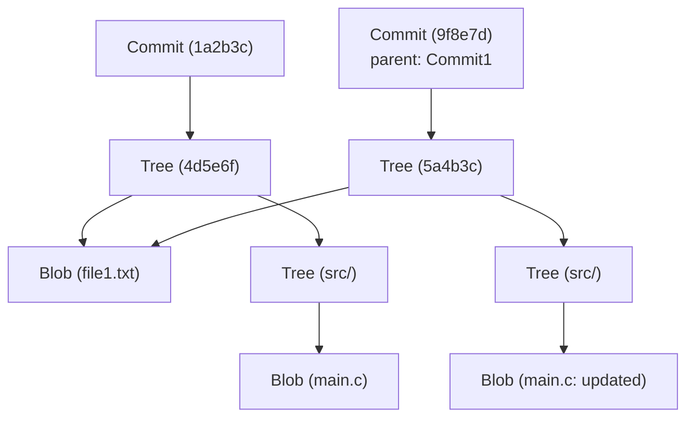

# البنية الداخلية لـ Git: فهم التحكم الموزع في الإصدارات من خلال commit، tree، و blob

بالنسبة للعديد من مهندسي البرمجيات، يعد Git أداة لا غنى عنها تُستخدم يوميًا. في حين أن أوامر مثل `git add` و `git commit` و `git push` قد تبدو بديهية، إلا أنه من المثير للدهشة أن قلة قليلة من الناس تفهم بعمق "ما نوع هياكل البيانات التي تعمل داخل Git". في هذا المقال، سنكشف عن البنية الداخلية لـ Git من خلال التركيز على فلسفته الأساسية وهياكل البيانات الثلاثة الأساسية: `blob` و `tree` و `commit`.

## الفلسفة الأساسية لـ Git: التاريخ كلقطات (Snapshots)

اتخذت العديد من أنظمة التحكم في الإصدارات (مثل Subversion) نهجًا يعتمد على تسجيل "الاختلافات" (deltas) للملفات. أي أنها تحتفظ بسجل يوضح متى تم إنشاء الملف وما هي التغييرات التي أُجريت عليه لاحقًا.

في المقابل، يختلف نهج Git اختلافًا جذريًا. يتعامل Git مع البيانات على أنها "سلسلة من لقطات نظام الملفات". في كل مرة تقوم فيها بعملية إيداع (commit)، يسجل Git حالة جميع الملفات في تلك اللحظة بالضبط، تمامًا مثل التقاط صورة. إذا لم يتغير الملف، لا يقوم Git بتخزين الملف مرة أخرى؛ بل يكتفي بتخزين رابط (مؤشر) للملف المطابق الذي تم حفظه مسبقًا. هذا ما يتيح إنشاء الفروع وعمليات الدمج بسرعة فائقة.

يدعم مفهوم "اللقطة" هذا نموذج كائنات Git، والذي سنشرحه تاليًا.

## نظرة عامة على نموذج كائنات Git

في جوهره، يعتبر Git مجرد مخزن مفتاح-قيمة (Key-Value Store). يتم تخزين جميع البيانات ضمن المجلد `.git/objects`، مفهرسة بواسطة تجزئة SHA-1 (سلسلة سداسية عشرية مكونة من 40 حرفًا).

هناك ثلاثة أنواع رئيسية من كائنات البيانات التي يتعامل معها Git بشكل أساسي:

1. **Blob**: محتوى الملف (البيانات) نفسه.
2. **Tree**: بنية الدليل. يحتفظ بمؤشرات إلى الملفات (Blobs) والأدلة الأخرى (Trees)، بالإضافة إلى أسماء الملفات والأذونات.
3. **Commit**: يحتفظ بالبيانات الوصفية (المؤلف، التاريخ، الرسالة)، ومؤشر إلى كائن Tree واحد يمثل الدليل الجذري للمشروع، ومؤشرات إلى الإيداعات الأصلية (parents).

دعونا نتصور كيف تعمل هذه الكائنات معًا باستخدام مخطط Mermaid.



يوضح المخطط أعلاه العلاقة بين إيداعين (commits). `Commit2` لديه `Commit1` كأصل (parent)، وبما أن `file1.txt` لم يتغير، فإن كلا من الشجرتين (trees) تشيران إلى نفس كائن `Blob`. هذه هي الآلية التي من خلالها يخزن Git البيانات بكفاءة.

## كائن Blob: تخزين محتوى الملف

كلمة Blob هي اختصار لـ "Binary Large Object" (كائن ثنائي كبير)، وهو يمثل وحدة تخزين محتوى الملف نفسه في Git. النقطة الحاسمة هنا هي أن **كائنات Blob لا تمتلك أسماء ملفات**. تتم إدارة أسماء الملفات وهياكل الأدلة بواسطة كائنات Tree، والتي سنناقشها لاحقًا.

يتم حساب مفتاح كائن Blob (تجزئة SHA-1) بناءً على محتوى الملف نفسه ومعلومات الرأس مثل حجمه. هذا يعني أنه حتى لو كان هناك ملفان في دليلين مختلفين تمامًا، طالما أن محتواهما متطابق تمامًا، سيتم تخزينهما داخليًا في Git ككائن Blob واحد، مما يوفر مساحة التخزين.

في الواقع، باستخدام أوامر Git منخفضة المستوى (أوامر Plumbing)، يمكنك حساب تجزئة Blob من ملف.

```bash
$ echo 'Hello Git' > hello.txt
$ git hash-object -w hello.txt
980a0d5f19a64b4b30a87d4206aade58726b60e3
```

قيمة التجزئة الناتجة عن هذا الأمر هي معرّف محتوى هذا الملف. يتم تخزين محتوى الملف في حالة مضغوطة على المسار `.git/objects/98/0a0d5...`.

## كائن Tree: تمثيل بنية الدليل

حتى لو أمكن تخزين محتوى الملفات، فلن يكون لذلك معنى إذا لم تكن تعرف اسم الملف والدليل الذي يوجد فيه. يحل **كائن Tree** هذه المشكلة.

يلعب كائن Tree دورًا مشابهًا لدليل UNIX. تحتوي الشجرة (Tree) الواحدة على إدخالات متعددة. يتضمن كل إدخال المعلومات التالية:

- وضع الملف (ما إذا كان ملفًا قابلاً للتنفيذ، أو ملفًا عاديًا، أو رابطًا رمزيًا، وما إلى ذلك)
- نوع الكائن (blob أو tree)
- قيمة تجزئة الكائن (SHA-1)
- اسم الملف أو الدليل

على سبيل المثال، قد يبدو محتوى الشجرة الجذرية لمشروع ما هكذا:

```bash
$ git ls-tree HEAD
100644 blob 980a0d5f19a64b4b30a87d4206aade58726b60e3    hello.txt
040000 tree 8b137891791fe96927ad78e64b0aad7bded08bdc    src
```

بهذه الطريقة، من خلال تجميع كائنات Blobs و Trees معًا، تمثل كائنات Tree شجرة الدليل المعقدة بأكملها.

## كائن Commit: إعطاء معنى للقطات

باستخدام كائنات Tree، أصبح من الممكن الآن تمثيل بنية ملفات المشروع بأكمله في نقطة زمنية معينة. ومع ذلك، هذا وحده لا يروي قصة السجل: "من"، "متى"، و "لماذا" تم إنشاء تلك الحالة، أو "ما هي الحالة السابقة". هذا هو ما يسجله **كائن Commit**.

يحتوي كائن Commit على المعلومات التالية:

1. **تجزئة الشجرة (Tree Hash)**: تجزئة الشجرة الجذرية للمشروع التي يشير إليها هذا الإيداع.
2. **تجزئة الإيداع الأصل (Parent Commit Hash)**: تجزئة الإيداع (الأصل) الذي يسبق هذا الإيداع مباشرة. الإيداع الأول جدًا لا أصل له. تحتوي إيداعات الدمج (Merge commits) على أصول متعددة.
3. **المؤلف (Author) والمودِع (Committer)**: الأسماء وعناوين البريد الإلكتروني والطوابع الزمنية.
4. **رسالة الإيداع (Commit Message)**: سبب التغييرات وتفسيرات مفصلة.

دعونا نلقي نظرة فعلية على محتويات الإيداع باستخدام الأمر `git cat-file -p`.

```bash
$ git cat-file -p HEAD
tree 4b825dc642cb6eb9a060e54bf8d69288fbee4904
parent a3c2f1e809b4d5a92c30b2c14078970e28f307f9
author John Doe <john@example.com> 1695628790 +0900
committer John Doe <john@example.com> 1695628790 +0900

Add hello.txt to the project
```

كما ترى، فإن كائن Commit هو مجرد بيانات نصية. يتم حساب تجزئة SHA-1 لهذه البيانات النصية نفسها، وتصبح هي "تجزئة الإيداع" (commit hash) المألوفة.

ولأن تجزئة الإيداع تُحسب من جميع المعلومات — ليس فقط التغييرات بل أيضًا تجزئة الأصل ووقت الإنشاء والرسالة إلخ — فإن محاولة تغيير محتوى الإيداع لاحقًا ستؤدي إلى تغيير قيمة التجزئة. هذه هي الآلية التي تضمن سلامة البيانات (Integrity) القوية في Git.

## الفروع و HEAD: مجرد مؤشرات

بمجرد فهم البنية الداخلية لـ Git، يتضح على الفور سبب كون "الفروع" (branches)، وهي الميزة الأقوى في Git، خفيفة الوزن للغاية.

الفرع في Git ليس سوى **مؤشر (ملف نصي) يشير إلى كائن Commit معين**. إذا نظرت داخل الملف `.git/refs/heads/main`، فستجد أنه يحتوي ببساطة على أحدث تجزئة إيداع (سلسلة مكونة من 40 حرفًا).

```bash
$ cat .git/refs/heads/main
a3c2f1e809b4d5a92c30b2c14078970e28f307f9
```

عملية إنشاء فرع جديد (`git branch feature`) تتضمن ببساطة إنشاء ملف جديد في `.git/refs/heads/feature` يحتوي على هذه السلسلة المكونة من 40 حرفًا. نظرًا لعدم الحاجة مطلقًا إلى نسخ نظام الملفات بالكامل، تكتمل العملية في لحظة.

و `HEAD` هو الذي يسجل الفرع الذي تعمل عليه حاليًا. يحتوي الملف `.git/HEAD` على مرجع للفرع الذي تم عمل checkout له حاليًا.

```bash
$ cat .git/HEAD
ref: refs/heads/main
```

عندما تقوم بإنشاء إيداع، يتصرف Git على النحو التالي:
1. ينشئ Blob جديدًا (للملفات التي تم تغييرها)
2. ينشئ Tree جديدًا (لهياكل الأدلة التي تم تغييرها)
3. ينشئ Commit جديدًا (يشير إلى الشجرة الجديدة، ويكون الإيداع الذي يشير إليه HEAD الحالي هو الأصل)
4. يعيد كتابة مؤشر الفرع الذي يشير إليه HEAD (هنا، `main`) ليشير إلى الإيداع المُنشأ حديثًا

عملية التحديث البسيطة والمبسطة للغاية هذه هي مصدر سرعة Git.

## تجميع المهملات في Git و Packfiles

مع استمرارك في استخدام Git، يتم إنشاء كائنات Blob مع كل تغيير، ويتضخم الدليل `.git/objects`. ونظرًا لأن كل Blob هو لقطة للملف بأكمله، فإن حتى تغيير سطر واحد يؤدي إلى حفظ نسخة من الملف بأكمله (رغم أنها مضغوطة) ككائن Blob جديد.

بما أن هذا غير فعال، يوفر Git آلية تُسمى **Packfiles**. بشكل دوري (أو عند تشغيل الأمر `git gc` يدويًا)، يقوم Git بتجميع المهملات (garbage collection) وتجميع الكائنات السائبة المتعددة (Loose Objects) في ملف Packfile واحد (ملف `.pack`).

في هذا الوقت، يطبق Git تحسينًا ذكيًا للغاية. فهو يبحث عن كائنات Blob ذات المحتوى المتشابه ويخزن أحدها كبيانات كاملة، بينما يخزن الآخر على شكل "فرق" (delta). هذا يقلل من حجم الملفات بشكل كبير. لذلك، في حين أن نموذج تخزين السجل هو "اللقطات" (snapshots)، فإن تقنية "delta" تُستخدم خلف الكواليس كتحسين لتوفير مساحة التخزين.

## الخلاصة

قد تكون واجهة سطر الأوامر (CLI) الخاصة بـ Git معقدة وقد تبدو أحيانًا غير بديهية، إلا أن هياكل البيانات التي تعمل خلفها بسيطة وأنيقة بشكل مدهش.

- **Blob**: محتويات الملف
- **Tree**: هياكل الأدلة وأسماء الملفات
- **Commit**: البيانات الوصفية للقطة وروابط السجل
- **Branch/Tag**: مؤشرات خفيفة الوزن للإيداعات

من خلال الجمع بين هذه العناصر، يتحقق نظام قوي وسريع للتحكم الموزع في الإصدارات. من خلال فهم البنية الداخلية لـ Git، ستتمكن من تخيل ما يفعله Git داخليًا بوضوح عند إجراء عمليات متقدمة مثل حل التعارضات (conflicts)، أو إعادة كتابة السجل (مثل rebase)، أو استعادة الإيداعات المفقودة.

يعد Git أكثر من مجرد أداة؛ بل يمكن تسميته عملاً فنيًا من هياكل البيانات الجميلة. عندما تستخدم Git في تطويرك اليومي، حاول أن تفكر قليلاً في هذا التعاون بين "الأشجار" (Trees) و"الكائنات الثنائية" (Blobs) غير المرئية.
